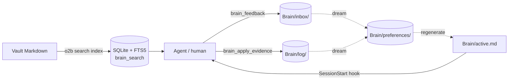

# Open Second Brain

A filesystem-first, agent-owned second brain for Obsidian-compatible
Markdown vaults. Plugs into the agent runtime you already use — Hermes
Agent, Claude Code, OpenAI Codex, OpenClaw, or any MCP-aware client —
and gives it deterministic CLI / MCP / hook surfaces for observing
memory (preference accretion via the `Brain/` layer), wiki indexing,
paid-action audit, and health checks. The model never has to guess at
any of that.

Open Second Brain is **not** a daemon, **not** a vault replacement,
and **not** an LLM-driven knowledge store — the `dream` consolidation
pass is pure deterministic counters. The plugin never writes hidden
state outside the configured vault and config directory.

## How it works

Three loops cooperate over plain Markdown:

- **Capture.** Agents call `brain_feedback` to drop taste signals into
  `Brain/inbox/`.
- **Accretion.** A deterministic `dream` pass clusters repeat signals
  into rules — counters and atomic file moves, no LLM.
- **Application.** Agents log whether each rule was `applied` /
  `violated` / `outdated`. `Brain/active.md` is auto-regenerated and
  injected at session start; `brain_search` exposes full-text search
  across the whole vault.



Mechanics, dream pipeline, state diagram, snapshot model, hygiene
lints, MCP resources, the v0.10.0 search layer, and the full set of
safety invariants are in [`docs/how-it-works.md`](docs/how-it-works.md).

## Supported runtimes

| Runtime         | Integration                                              | Notes                                                                                            |
| --------------- | -------------------------------------------------------- | ------------------------------------------------------------------------------------------------ |
| Hermes Agent    | Hermes plugin (`plugin.yaml`) + MCP server               | Adds a per-turn identity reminder via the `pre_llm_call` hook.                                   |
| Claude Code     | Marketplace plugin + bundled `.mcp.json` + lifecycle hooks | `hooks/hooks.json` registers a `PostToolUse` reminder that points the agent at `brain_feedback` / `brain_apply_evidence` after every Write/Edit. See [`hooks/`](hooks/). |
| OpenAI Codex    | Marketplace plugin + MCP server + lifecycle hooks         | Same hook bundle as Claude Code.                                                                 |
| OpenClaw        | Native JS plugin (`openclaw.extensions`) — no MCP needed | Core query/status/health tools are registered directly inside OpenClaw's Node.js process. Native parity with the `brain_*` tools is tracked separately in the post-v0.9 roadmap. |
| Other MCP hosts | Generic adapter (stdio MCP server, persisted plugin config) | See `install.md` branch E for the contract.                                                      |

## What it does

- Bootstraps `Brain/` — the observing-memory layer where the agent
  records taste signals, accreted preferences, evidence, and
  pre-run snapshots.
- Runs a deterministic `dream` pass that turns repeat signals into
  confirmed rules, retires stale ones, and surfaces contradictions
  — no LLM inside the algorithm, only counters, thresholds, and
  atomic file operations. See [Brain section](#brain-observing-memory).
- Regenerates a Markdown page index from frontmatter and wikilinks
  (`o2b index`).
- Exports config snapshots with secret-like values redacted
  (`o2b export-config`).
- Runs vault + adapter health checks (`o2b doctor`, plus
  `o2b brain doctor` for Brain-specific invariants).
- (Optional) Records paid agent actions through **Pay Memory**:
  receipts, generated assets, spending policy decisions, human
  approval state, and per-day reports — all as plain Markdown
  inside the vault.

## Install

`install.md` is the canonical install guide. It is written so an
agent can read it directly and pick the right branch by runtime
name. The recommended way to install is to send your agent the
prompt below — replace `[runtime]` with `Hermes`, `Claude Code`,
`Codex`, or `OpenClaw`:

```text
Install the open-second-brain plugin for [runtime] following the
instructions at
https://raw.githubusercontent.com/itechmeat/open-second-brain/main/install.md
```

For manual installs, follow the matching branch in
[`install.md`](install.md) directly:

- Branch A — Hermes
- Branch B — OpenClaw
- Branch C — Codex
- Branch D — Claude Code
- Branch E — generic adapter (other runtimes)

Each branch covers the same six steps: collect vault path, install
plugin, publish CLI to PATH (`o2b install-cli`), initialise the
vault (`o2b init`), register the MCP server (where needed), and
verify with `o2b doctor` + a daily-identity check.

## CLI

After `o2b install-cli` the following commands are on PATH:

```text
o2b status                    Show config / vault status
o2b init                      Bootstrap the vault profile (idempotent)
o2b install-cli               Symlink o2b and o2b-hook into ~/.local/bin
o2b doctor                    Run vault + adapter checks
o2b index                     Rebuild the Markdown page index
o2b export-config             Write a redacted config snapshot
o2b mcp                       Run the MCP tool server (stdio)
o2b tool-call                 Invoke an MCP tool handler from the CLI
o2b uninstall                 Print uninstall plan; --apply-local cleans config; --remove-cli removes symlinks

# Brain (observing memory — 16 verbs)
o2b brain init                Bootstrap Brain/{inbox,preferences,retired,log,.snapshots}/ + _brain.yaml + _BRAIN.md; --starter drops the bundled example set
o2b brain feedback            Record one taste signal (--topic, --signal, --principle, ...)
o2b brain dream               Run the deterministic consolidation pass (idempotent; usually cron'd)
o2b brain apply-evidence      Record applied / violated against a preference for a durable artifact
o2b brain digest              Render a Markdown or JSON summary of recent Brain transitions
o2b brain query               Read helper: by preference, by topic, or by log timestamp
o2b brain reject              (CLI-only) Retire a preference; requires --reason "<text>". Subsequent signals on the same topic are suppressed.
o2b brain pin / unpin         (CLI-only) Toggle pinned: true on a preference (exempt from auto-retire)
o2b brain set-primary         (CLI-only) Declare or clear primary_agent in Brain/_brain.yaml (--clear)
o2b brain protect             (CLI-only) Emit / apply native deny rules for Brain/ (--target {claudecode|codex} [--apply])
o2b brain unprotect           (CLI-only) Remove the OSB-managed deny rules for the chosen target
o2b brain snapshot diff       (CLI-only) Read-only diff between two snapshots, or snapshot vs live Brain/
o2b brain rollback            (CLI-only) Restore Brain/ from a pre-dream snapshot (--dry-run previews)
o2b brain doctor              Check Brain-specific invariants (status-vs-folder, broken wikilinks, …)
o2b brain backlinks           List inbound references to a Brain artifact id
o2b brain scan-inline         Capture `@osb` markers from vault markdown files (Daily/, project notes, …)
o2b brain import-session      Replay signals from a Claude/Codex/Hermes session .jsonl (or directory)
o2b brain migrate-frontmatter (CLI-only) Rewrite legacy `status:` keys to `_status:`

# Pay Memory
o2b init-pay-memory           Bootstrap AI Wiki/{policies,payments,assets,drafts,reports}/
o2b append-payment-receipt    Save a Markdown receipt for a paid API call
o2b capture-asset             Save a Markdown note for a generated asset
o2b payment-report            Aggregate a date's receipts into a Markdown report
o2b check-payment-policy      Evaluate a paid call against policies/spending.json
o2b request-payment-approval  Create a pending payment request (human must approve)
o2b approve-payment-request   Mark a pending request as approved
o2b reject-payment-request    Mark a pending request as rejected
o2b consume-payment-request   Link an approved request to its resulting receipt
o2b list-pending-payments     List pending / approved / etc. requests
o2b payment-digest            Render a 4-line digest for a date

# Helpers
o2b-hook                      Internal launcher invoked by hooks/hooks.json (Claude Code & Codex)
```

The local checkout can also be used without installing the symlinks
— run commands through `scripts/o2b` and `scripts/vault-log`.

## MCP tool server

The plugin ships an optional stdio MCP server (`o2b mcp`) that
exposes the same deterministic operations as MCP tools:

- **Core (3):** `second_brain_status`, `second_brain_query`,
  `vault_health`.
- **Brain (7):** `brain_feedback`, `brain_dream`,
  `brain_apply_evidence`, `brain_digest`, `brain_query`,
  `brain_doctor`, `brain_backlinks`. See the [Brain section](#brain-observing-memory)
  below.
- **Pay Memory (8):** `payment_memory_init`,
  `payment_receipt_append`, `asset_capture`,
  `payment_report_generate`, `payment_policy_check`,
  `payment_request_approval`, `payment_request_status`,
  `payment_request_consume`.

Each runtime registers the server differently — Hermes via
`mcp_servers:` in `~/.hermes/config.yaml`, Codex via `codex mcp add`
(written to `~/.codex/config.toml`), Claude Code automatically through
the plugin-bundled `.mcp.json`, OpenClaw not at all (tools registered
natively). The exact wiring is in `install.md`; the protocol,
schemas, and lifecycle details are in [`docs/mcp.md`](docs/mcp.md).

## Lifecycle hooks (Claude Code & Codex)

The plugin bundles a `hooks/hooks.json` that both runtimes auto-load.
One hook fires per turn:

- **PostToolUse** (matcher `Write|Edit|MultiEdit|apply_patch`) —
  after a file-mutating tool succeeds, injects a short reminder
  pointing the agent at `brain_feedback` (when the turn contained a
  user preference or correction) and `brain_apply_evidence` (when an
  active preference in `Brain/preferences/` scopes to the artifact
  just produced).

Hermes and OpenClaw don't load these hooks — they have their own
per-turn channels. Full design notes:
[`hooks/README.md`](hooks/README.md).

## Brain (observing memory)

Brain is the agent-writable observing-memory layer. Agents record
user preferences as raw taste signals; a deterministic `dream` pass
accretes repeat signals into rules with confidence that grows from
real applications and decays when nothing applies the rule any more.
There is no LLM inside the algorithm — only counters, thresholds,
and `mv` operations.

```bash
o2b brain init --vault /path/to/vault
# → Brain/{inbox,preferences,retired,log,.snapshots}/ plus _brain.yaml and _BRAIN.md

# Record a taste signal (agent or human, mid-conversation):
o2b brain feedback \
  --vault /path/to/vault \
  --topic no-internal-abbrev --signal negative \
  --principle "Do not use internal abbreviations in user-facing copy unless explained first" \
  --agent claude

# After producing a durable artifact, record evidence:
o2b brain apply-evidence \
  --vault /path/to/vault \
  --pref pref-no-internal-abbrev \
  --artifact "[[Daily/2026.05.14#section-blog-post]]" \
  --result applied --agent claude

# Run a dream pass (cron or manual): promotes candidates, retires stale rules:
o2b brain dream --vault /path/to/vault

# Short daily summary (markdown or JSON), suitable for Hermes cron → Telegram:
o2b brain digest --vault /path/to/vault --silent-if-empty
```

The Brain verbs in full: `init`, `feedback`, `dream`,
`apply-evidence`, `digest`, `query`, `reject`, `pin`, `unpin`,
`set-primary`, `snapshot diff`, `rollback`, `doctor`, `backlinks`,
`scan-inline`, `import-session`, `migrate-frontmatter`. Seven are
mirrored as MCP tools (`brain_*`); the rest are intentionally
CLI-only because they change the protected set, overwrite vault
state, or are operator-only maintenance commands.

### Cross-project setup

When your coding work happens in a project directory that is not the
vault itself, add a pointer snippet to your project's `CLAUDE.md` or
`AGENTS.md` so the agent knows where to read preferences from. The
canonical snippet, the rules for multi-device Syncthing setups, and
the `o2b brain set-primary` invocation are in
[`docs/cross-project-pointer.md`](docs/cross-project-pointer.md).

A vault shared across hosts should declare a single
`primary_agent` in `Brain/_brain.yaml` — the runtime that owns the
dream cron. Dream runs from a different agent emit a non-fatal
warning (stderr for CLI, `warnings` array for MCP) and tag the dream
summary log with `non_primary_agent: <caller>`.

### Capture surfaces

Three independent paths land a signal in `Brain/inbox/`:

- **Live** — the agent calls `brain_feedback` (MCP) or `o2b brain
  feedback` (CLI) the moment the rule is formulated.
- **Inline** — the user (or agent) writes an `@osb` marker into any
  vault markdown file. `o2b brain scan-inline` finds every marker,
  creates the corresponding signal, and annotates the source file
  with `@osb✓ [[sig-...]]` so a re-run is a no-op. Two marker
  shapes: a single line `@osb feedback negative topic=... principle="..."`
  or a fenced ` ```osb` block with YAML inside.
- **Session import** — `o2b brain import-session <path>` reads a
  Claude Code / Codex CLI / Hermes session JSONL and extracts both
  `@osb` markers from message text and replays of `brain_feedback`
  tool-use calls. Useful when MCP wasn't available at recording time
  or the agent didn't make the call live.

All three paths share a normalised payload hash so the same rule
captured twice from different surfaces dedups automatically. Pre-run snapshots of `Brain/` go to `Brain/.snapshots/` and
support `o2b brain rollback <run_id>`. Pinned preferences are exempt
from automatic retire (`stale-no-evidence`, `expired-unconfirmed`,
`rebutted`); only `o2b brain reject` can retire them.

Full design and implementation plan:
[`docs/plans/2026-05-15-brain-observing-memory.md`](docs/plans/2026-05-15-brain-observing-memory.md).
Post-v0.9 trigger-based roadmap:
[`docs/plans/2026-05-15-brain-roadmap.md`](docs/plans/2026-05-15-brain-roadmap.md).
The `brain-memory` skill (loaded automatically) instructs agents when
to call `brain_feedback` and `brain_apply_evidence`.

## Pay Memory

Pay Memory is an audit layer for paid agent actions. The agent makes
the paid API call itself (typically through `pay` from
[solana-foundation/pay](https://github.com/solana-foundation/pay));
Open Second Brain records the reason, the policy check, the receipt,
and any generated asset as plain Markdown inside the vault. It never
executes payments and never holds wallet keys.

```bash
o2b init-pay-memory --vault /path/to/vault
# → AI Wiki/{policies,payments,assets,drafts,reports}/ and policies/spending.md

# After running `pay --sandbox curl …` and capturing the output:
o2b append-payment-receipt \
  --vault /path/to/vault \
  --service paysponge/fal \
  --status success \
  --reason "Generate one original blog header image" \
  --actual-amount 0.05 --currency USDC \
  --result-ref https://fal-cdn.example/img.png \
  --result-note "AI Wiki/assets/blog-header.md" \
  --raw-output-file /tmp/pay-output.txt

o2b capture-asset \
  --vault /path/to/vault \
  --title "Blog Header: Pay Memory" \
  --service paysponge/fal \
  --result-url https://fal-cdn.example/img.png \
  --source-receipt "AI Wiki/payments/2026-05-10/<receipt-slug>.md"

o2b payment-report --vault /path/to/vault --date 2026-05-10
```

The spending policy at `AI Wiki/policies/spending.md` is read by the
agent before each paid call; this MVP does not enforce policy at
runtime. The `--raw-output-file` of a receipt is run through a
redactor that masks values for `api_key` / `token` / `secret` /
`bearer` / `authorization` / `private_key` / `password` / `passwd` /
`pwd` / `credential` / `session_token` in env, YAML, JSON, and
HTTP-header shapes. Best-effort only — verify the saved receipt
before sharing it externally.

### Optional: machine-readable spending policy

To enable runtime enforcement, drop a JSON companion at
`AI Wiki/policies/spending.json`:

```json
{
  "schema_version": 1,
  "currency": "USDC",
  "max_total_per_day": 0.10,
  "max_single_call": 0.07,
  "allowed_services": ["paysponge/fal"],
  "max_per_category": { "media_generation": 1 },
  "require_approval_above": 0.05
}
```

Then have the agent (or the user) run:

```bash
o2b check-payment-policy --service paysponge/fal --expected-amount 0.05
```

Exit codes are `0` (allowed), `1` (denied), `3` (approval required)
so a shell script can branch. The MCP tool `payment_policy_check`
returns the same structured decision. If `spending.json` is absent,
the check fails open (`has_policy: false`) — existing flows that
rely on the Markdown-only policy keep working.

### Optional: approval workflow

For paid calls that should not happen until a human signs off, Pay
Memory ships a pending-payment-request artifact under
`AI Wiki/payments/_pending/` with a
`pending → approved/rejected → consumed` state machine.

Agent side:

```bash
o2b request-payment-approval \
  --service paysponge/fal \
  --reason "Generate one blog header image" \
  --expected-amount 0.05 --currency USDC
# → AI Wiki/payments/_pending/req-2026-05-10-1000-fal-...md
```

Human side, after reviewing the request file in Obsidian:

```bash
o2b approve-payment-request --id <id> --approved-by <name>
# or
o2b reject-payment-request  --id <id> --rejected-by <name> --reason "..."
```

Agent side, after the approved paid call succeeded and the receipt
was saved:

```bash
o2b consume-payment-request --id <id> \
  --receipt "AI Wiki/payments/2026-05-10/<receipt-slug>.md"
```

The MCP-server side mirrors `payment_request_approval`,
`payment_request_status` (poll for approval), and
`payment_request_consume`.

### Optional: daily Telegram digest via Hermes cron

`o2b payment-digest --vault <vault> --date <YYYY-MM-DD>` renders a
4-line Russian summary suitable for delivery via Hermes cron
`--script --no-agent` jobs. See
[`docs/hermes-cron.md`](docs/hermes-cron.md) for the ready-to-paste
`hermes cron create` command. The same command can be wrapped by
any other scheduler that can pipe its stdout to a chat
destination — the digest itself is runtime-neutral.

### Installing the `pay` CLI on a Linux VPS

`pay` is the Solana-Foundation payment wrapper that turns a regular
HTTP client into one that handles HTTP 402 payment challenges. It is
published as a prebuilt static binary on GitHub Releases — no Rust
toolchain or Node.js is needed on the host:

```bash
TAG=pay-v0.16.0  # pin a specific release
gh release download "$TAG" -R solana-foundation/pay \
  -p 'pay-x86_64-unknown-linux-gnu.tar.gz' -p 'sha256sums.txt' -D /tmp
cd /tmp && sha256sum -c --ignore-missing sha256sums.txt
tar -xzf pay-x86_64-unknown-linux-gnu.tar.gz
sudo install -m 0755 pay /usr/local/bin/pay
pay --version
```

Sandbox mode (`pay --sandbox curl <url>`) does **not** require
running `pay setup` first — it generates an ephemeral Solana keypair
and funds it locally via the Surfpool sandbox RPC. That makes it
safe to wire into a CI / e2e test that exercises the full Pay Memory
pipeline without spending real funds. See
`tests/e2e/pay-memory-sandbox.sh` for a reference run.

For non-sandbox use the local secure storage helper (macOS Keychain,
GNOME Keyring, Windows Hello, 1Password) is configured by
`pay setup`. Open Second Brain itself never holds wallet keys.

## Updating

Each runtime's CLI is authoritative for refreshing the plugin —
follow the matching `## 7. Update` section in `install.md`:

- Hermes: `hermes plugins update open-second-brain && hermes gateway restart`
- Claude Code: `claude plugin marketplace update open-second-brain && claude plugin update open-second-brain@open-second-brain`
- Codex (Git source): `codex plugin marketplace upgrade open-second-brain`
- Codex (local source): re-add the marketplace; there is no
  `upgrade` for local sources.
- OpenClaw: `openclaw plugins update open-second-brain && openclaw gateway restart`

The CLI symlinks created by `o2b install-cli` point into the cached
plugin checkout and survive in-place updates — no need to re-run
`install-cli`. After an update, run
`o2b doctor --vault /path/to/vault --repo .` to confirm the new
manifest still validates.

The `version` field in each runtime manifest is informational; the
canonical version lives in `package.json` and is mirrored by
`bun run sync-version`.

## Uninstalling

Open Second Brain treats your vault as the source of truth and never
removes Markdown notes, `Daily/`, or `AI Wiki/`. Uninstalling has
three independent layers; do them in this order:

1. Print a plan and review the leftovers (read-only):

   ```bash
   o2b uninstall
   ```

2. Run your runtime's plugin-remove command (see the matching
   `## 8. Uninstall` section in `install.md`), then clean local
   state:

   ```bash
   o2b uninstall --apply-local --remove-cli
   ```

3. Optionally delete the machine-local config directory (typically
   `~/.config/open-second-brain` or `$OPEN_SECOND_BRAIN_CONFIG`'s
   parent) — `--apply-local` handles this and refuses to touch
   anything outside that directory.

The vault is never deleted by the uninstall flow, even with
`--apply-local`. Delete it yourself with normal filesystem tools if
you want to.

## Safety model

- Your notes stay as plain Markdown.
- Secrets are not meant to be stored in the vault. Daily logs and
  config exports go through a best-effort redactor that masks
  common secret-name patterns.
- Daily logs are append-only below `## Raw events`.
- The plugin never starts background processes or daemons. The
  optional MCP server is a stdio subprocess that exits when its
  parent runtime exits.
- Hooks (Claude Code, Codex) only inject text into the agent's
  context. They never write to the vault directly — every Brain
  entry goes through `brain_feedback` / `brain_apply_evidence`
  (MCP) or the equivalent CLI (`o2b brain *`).
- Brain mutations (`o2b brain dream`) take an automatic pre-run
  snapshot (`Brain/.snapshots/<run_id>.tar.zst`) before any state
  change. `o2b brain rollback <run_id>` restores from a snapshot;
  retention is configurable in `_brain.yaml`.

## Repository

GitHub: <https://github.com/itechmeat/open-second-brain>

License: MIT.
