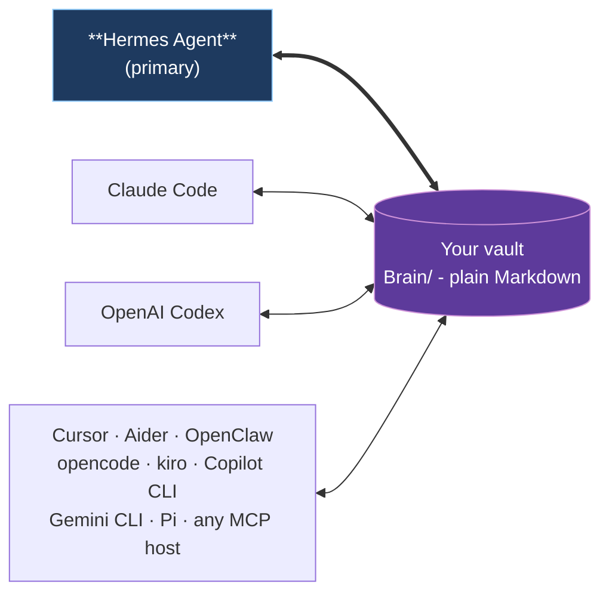
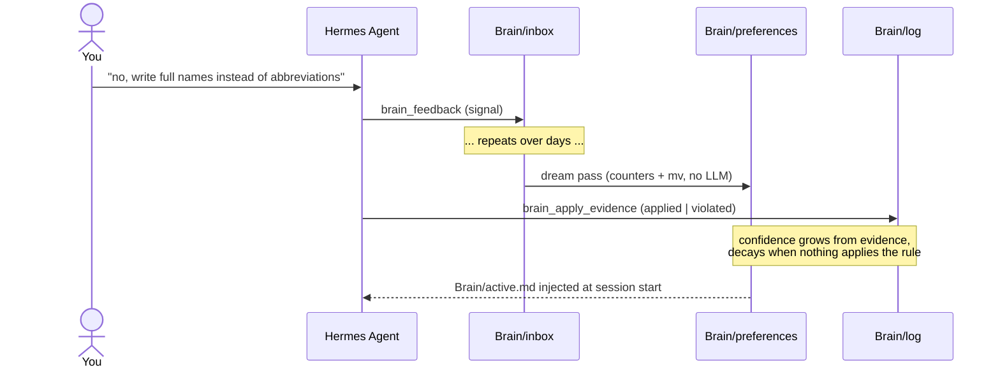

# Open Second Brain


> An [Obsidian](https://obsidian.md)-native memory layer for your AI agent. Plain Markdown you own, in the same vault you already use.

Open Second Brain plugs into [Hermes Agent](https://github.com/NousResearch/hermes-agent) and turns your Obsidian vault into a memory layer the agent reads and writes through deterministic CLI / MCP tools. Preferences, signals, evidence, and audit trails are real `.md` files under `Brain/` in the vault you already open in Obsidian every day. You can grep them, version them with git, search them in Obsidian, edit them by hand. No daemon, no vector black box, no hidden state outside the vault.

## Why

- **Lives in your Obsidian vault.** Open `Brain/preferences/pref-no-internal-abbrev.md` in Obsidian and you literally see what your agent learned about you - title, status, evidence count, confidence band, body text. Wikilinks, backlinks, graph view all work.
- **You own the data.** Plain Markdown on your filesystem. No service to cancel, no cloud account, no schema migration when a vendor pivots. Syncthing to your other machines if you want.
- **Memory that learns deterministically.** A `dream` pass turns repeat signals into rules and retires the ones nothing applies any more. Counters and atomic file moves - no LLM inside the algorithm, no surprise hallucinations in your memory.
- **One vault, every agent.** Hermes Agent is the primary integration. Claude Code, OpenAI Codex, Cursor, Aider, OpenClaw, opencode, kiro, Copilot CLI, Gemini CLI, and Pi all plug into the same Brain through MCP.

## One vault, many runtimes



Hermes Agent owns the schedule (dream cron, daily digests, Telegram delivery). Other runtimes participate as readers and writers of the same Brain through MCP - no per-runtime fork of the memory.

## Quick start with Hermes Agent

**The simplest path - let your agent set it up.** Paste this into Hermes (or whichever AI agent already has shell access on the target machine):

> Install Open Second Brain for me by following the steps at <https://github.com/itechmeat/open-second-brain/blob/main/install/hermes.md>. My vault is at `/path/to/your-vault`.

The agent reads the install doc, runs every command, and verifies the result. That's it.

If you prefer running the steps yourself:

```bash
# 1. Install the plugin
hermes plugins install itechmeat/open-second-brain --enable
hermes gateway restart

# 2. Put `o2b` on PATH
~/.hermes/plugins/open-second-brain/scripts/o2b install-cli

# 3. Bootstrap the vault
o2b init       --vault /path/to/your-vault --name "My Second Brain"
o2b brain init --vault /path/to/your-vault --primary-agent <agent-name>

# 4. Verify
o2b doctor --vault /path/to/your-vault
```

Register the MCP server in `~/.hermes/config.yaml` and restart the gateway one more time - the agent now reads `Brain/active.md` on every session start and writes signals through `brain_feedback`. Full step-by-step including MCP wiring: [`install/hermes.md`](install/hermes.md).

## Other runtimes

| Runtime | Install |
| --- | --- |
| Claude Code | Marketplace plugin (bundled `.mcp.json` + hooks) - [`install/claudecode.md`](install/claudecode.md) |
| OpenAI Codex | `codex plugin marketplace add ...` - [`install/codex.md`](install/codex.md) |
| OpenClaw | Native JS plugin, no MCP needed - [`install/openclaw.md`](install/openclaw.md) |
| Cursor · Aider · opencode · kiro · Copilot CLI · Gemini CLI · Pi | `o2b install --target <name> --apply` - see [`install/`](install/) |
| Any other MCP host | `o2b install --target generic --apply` - [`install/generic.md`](install/generic.md) |

Each non-Hermes target writes a sidecar manifest under `<vault>/.open-second-brain/install.lock.json` so `o2b uninstall --target <name> --apply` removes exactly what it added.

## How rules accrete



Three repeat signals on the same topic graduate to a confirmed rule. Evidence shifts confidence up or down. Rules with zero recent evidence retire automatically. You can pin, merge, retire, or roll back with `o2b brain {pin,merge,reject,rollback}` - see [`docs/cli-reference.md`](docs/cli-reference.md).

## Top features

The capabilities you actually feel day to day:

| # | Feature | What it means for you |
|---|---|---|
| 1 | Your memory, in your Obsidian vault | Every rule the agent learns about you is a Markdown file you can open, read, and edit. Wikilinks, backlinks, and the graph view in Obsidian all work — no separate UI to learn. |
| 2 | `dream` - the agent learns what you actually want | The nightly `dream` pass turns repeat corrections into rules: three signals on the same topic graduate to a confirmed preference. Its confidence rises every time the agent applies the rule and drops when it slips. No LLM inside the algorithm - counters and atomic file moves, nothing else. |
| 3 | One brain, every agent | Hermes Agent, Claude Code, Codex, Cursor, Aider, opencode, kiro, Copilot CLI, Gemini CLI, Pi - they all read the same memory. Teach one of them a rule and the next one already knows. |
| 4 | Teach a rule in one line | Drop `@osb feedback negative topic=... principle="..."` into any note. Next time `o2b brain scan-inline` runs (or you call it manually) the marker becomes a real taste signal in `Brain/inbox/` and the note gets a `@osb✓` checkmark so re-runs skip it. |
| 5 | Look back at how your AI grew | The time axis surfaces how the agent's view of you evolved. `o2b brain evolution` walks a single preference's life from first signal to confirmed to retired; `o2b brain daily` / `weekly` summarise what changed; `o2b brain stale` flags rules nothing has applied in months. |
| 6 | Browse your memory as a graph | `o2b brain explorer` opens a force-directed HTML graph of every rule, every link, every retirement. Double-click a node — Obsidian opens the underlying note. |
| 7 | Undo the agent if it gets it wrong | Every Brain mutation lands a verified snapshot before touching anything. One command (`o2b brain rollback <id>`) restores yesterday's state, and drift detection refuses to clobber unintended local edits. |
| 8 | Pin, merge, retire by hand | When a rule is wrong, you fix it. `o2b brain pin` keeps a good one safe from auto-retire, `merge` folds duplicates, `reject` puts a bad rule in the bin with a reason. The CLI is the operator's seat. |
| 9 | Hybrid search that explains itself | `o2b search "<query>" --property type=decision --property status=open` — SQLite + FTS5 and an optional semantic layer, fused and then sharpened by a recall-quality suite: MMR diversity so near-duplicates do not crowd the top, link-graph traversal that surfaces notes one hop from a hit, entity-boosting for proper-noun precision, and header-anchored chunking so a mid-document chunk keeps its section context. Every result carries a `why_retrieved` breakdown of the layers that ranked it. |
| 10 | Pay Memory — audit every paid action | When the agent spends money (Solana-Foundation `pay`, third-party APIs) every receipt lands in `Brain/payments/<date>/`. Spending policy, approval gate, daily Telegram report. The agent never holds wallet keys. |

These are the headline capabilities. The full surface also includes: importing Claude Code memory directories, daily logging-discipline cron, cross-project pointers for shared vaults, the codegraph partner skill, vault hygiene lints, per-MOC coverage audit, concept synthesis, an operator dashboard, the v0.12.0 Brain Integrity Suite (content-hash drift detection, durable workrun checkpoints, destructive-from-confirmed retire gate, and the `brain_review_candidates` MCP tool that previews what the next dream pass would do without writing anything), and the v0.13.0 Hybrid Search and Recall Quality suite (explainable recall, MMR diversity, link-graph traversal, entity-boosted retrieval, header-anchored chunking). Browse [`docs/cli-reference.md`](docs/cli-reference.md) for every verb and [`docs/how-it-works.md`](docs/how-it-works.md) for the mental model.

## CLI

```bash
o2b status                    # Show config / vault status
o2b init                      # Bootstrap the vault profile
o2b doctor                    # Run vault + adapter checks
o2b brain dream               # Deterministic consolidation pass (idempotent)
o2b brain digest              # Recent transitions, markdown or JSON
o2b search "<query>"          # FTS5 over the vault
o2b update                    # Update across detected runtimes
```

Full list (~50 verbs across `o2b`, `o2b brain`, `o2b vault`, `o2b discipline`, Pay Memory) in [`docs/cli-reference.md`](docs/cli-reference.md).

## Safety

- Plain Markdown on your filesystem. No daemon, no background writes.
- The MCP server is a stdio subprocess that exits with the parent runtime.
- Secrets are not supposed to live in the vault. Daily logs and config exports go through a best-effort redactor for common secret-name patterns.
- Brain mutations (`dream`, `merge`, `upgrade`) take a pre-run snapshot with a SHA-256 sidecar; `o2b brain rollback` aborts on drift unless `--force-rollback`.
- Hooks (Claude Code, Codex) only inject text into the agent's context; they never write to the vault directly.

## Updating

```bash
o2b update                    # detect runtimes, skip unchanged, apply, verify
o2b doctor                    # confirm the new manifest validates
```

Per-runtime upgrade paths and the canonical version source live in [`install.md`](install.md).

## Documentation

| Topic | Doc |
| --- | --- |
| Mental model, vault layout, dream mechanics | [`docs/how-it-works.md`](docs/how-it-works.md) |
| MCP protocol, tools, lifecycle, writer split | [`docs/mcp.md`](docs/mcp.md) |
| Full CLI reference (every verb, every flag) | [`docs/cli-reference.md`](docs/cli-reference.md) |
| Pay Memory - audit for paid agent actions | [`docs/pay-memory.md`](docs/pay-memory.md) |
| Hermes cron jobs (daily digest, discipline report) | [`docs/hermes-cron.md`](docs/hermes-cron.md) |
| Cross-project pointer (multi-host vaults) | [`docs/cross-project-pointer.md`](docs/cross-project-pointer.md) |
| Architecture | [`docs/architecture.md`](docs/architecture.md) |
| Origin idea | [`docs/idea.md`](docs/idea.md) |

## Uninstalling

```bash
o2b uninstall                       # print plan (read-only)
o2b uninstall --apply-local --remove-cli   # remove local state and symlinks
```

Your vault is never touched by the uninstall flow. Delete it yourself with normal filesystem tools if you want to.

## License

MIT. Source: <https://github.com/itechmeat/open-second-brain>.
