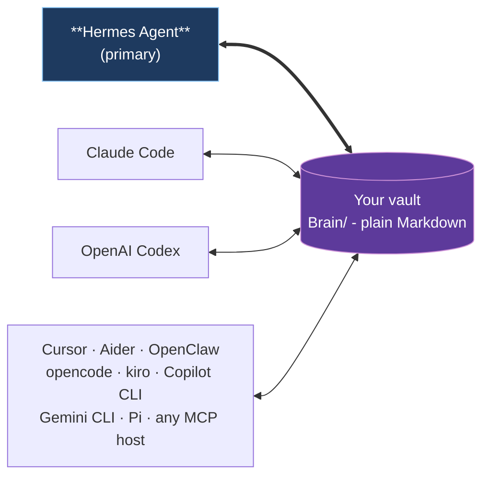

# Open Second Brain


> An [Obsidian](https://obsidian.md)-native memory layer for your AI agent. Plain Markdown you own, in the same vault you already use.

Open Second Brain plugs into [Hermes Agent](https://github.com/NousResearch/hermes-agent) and turns your Obsidian vault into a memory layer the agent reads and writes through deterministic CLI / MCP tools. Preferences, signals, evidence, and audit trails are real `.md` files under `Brain/` in the vault you already open in Obsidian every day. You can grep them, version them with git, search them in Obsidian, edit them by hand. No daemon, no vector black box, no hidden state outside the vault.

## Why

- **Lives in your Obsidian vault.** Open `Brain/preferences/pref-no-internal-abbrev.md` in Obsidian and you literally see what your agent learned about you - title, status, evidence count, confidence band, body text. Wikilinks, backlinks, graph view all work.
- **You own the data.** Plain Markdown on your filesystem. No service to cancel, no cloud account, no schema migration when a vendor pivots. Syncthing to your other machines if you want.
- **Memory that learns deterministically.** A `dream` pass turns repeat signals into rules and retires the ones nothing applies any more. Counters and atomic file moves - no LLM inside the algorithm, no surprise hallucinations in your memory.
- **One vault, every agent.** Hermes Agent is the primary integration. Claude Code, OpenAI Codex, Cursor, Aider, OpenClaw, opencode, kiro, Copilot CLI, Gemini CLI, and Pi all plug into the same Brain through MCP.

## One vault, many runtimes



Hermes Agent owns the schedule (dream cron, daily digests, Telegram delivery). Other runtimes participate as readers and writers of the same Brain through MCP - no per-runtime fork of the memory.

## Quick start with Hermes Agent

**The simplest path - let your agent set it up.** Paste this into Hermes (or whichever AI agent already has shell access on the target machine):

> Install Open Second Brain for me by following the steps at <https://github.com/itechmeat/open-second-brain/blob/main/install/hermes.md>. My vault is at `/path/to/your-vault`.

The agent reads the install doc, runs every command, and verifies the result. That's it.

If you prefer running the steps yourself:

```bash
# 1. Install the plugin
hermes plugins install itechmeat/open-second-brain --enable
hermes gateway restart

# 2. Put `o2b` on PATH
~/.hermes/plugins/open-second-brain/scripts/o2b install-cli

# 3. Bootstrap the vault
o2b init       --vault /path/to/your-vault --name "My Second Brain"
o2b brain init --vault /path/to/your-vault --primary-agent <agent-name>

# 4. Verify
o2b doctor --vault /path/to/your-vault
```

Enable Open Second Brain as the memory provider in `~/.hermes/config.yaml` (`memory.provider: open-second-brain`) and restart the gateway one more time - the agent now injects `Brain/active.md` into its system prompt, recalls context before each turn, and writes signals through `brain_feedback`, all through the one native provider. Full step-by-step: [`install/hermes.md`](install/hermes.md).

## Other runtimes

| Runtime                                                          | Install                                                                                             |
| ---------------------------------------------------------------- | --------------------------------------------------------------------------------------------------- |
| Claude Code                                                      | Marketplace plugin (bundled `.mcp.json` + hooks) - [`install/claudecode.md`](install/claudecode.md) |
| OpenAI Codex                                                     | `codex plugin marketplace add ...` - [`install/codex.md`](install/codex.md)                         |
| OpenClaw                                                         | Native JS plugin, no MCP needed - [`install/openclaw.md`](install/openclaw.md)                      |
| opencode                                                         | `o2b install --target opencode --apply` (MCP servers + native plugin) - [`install/opencode.md`](install/opencode.md) |
| Cursor · Aider · kiro · Copilot CLI · Gemini CLI · Pi            | `o2b install --target <name> --apply` - see [`install/`](install/)                                  |
| Any other MCP host                                               | `o2b install --target generic --apply` - [`install/generic.md`](install/generic.md)                 |

Each non-Hermes target writes a sidecar manifest under `<vault>/.open-second-brain/install.lock.json` so `o2b uninstall --target <name> --apply` removes exactly what it added.

## What you get

- **Your memory as Markdown.** Every rule the agent learns about you is a file under `Brain/` you can open, edit, grep, and version. Obsidian wikilinks, backlinks, and the graph view just work - there is no separate UI to learn.
- **Memory that learns, and forgets, on its own.** A nightly `dream` pass turns repeated corrections into rules and retires the ones nothing uses any more. Deterministic by design: counters and atomic file moves, no LLM guessing inside your memory.
- **One brain, every agent.** Teach a rule in one agent and the next one already knows it - Hermes, Claude Code, Codex, Cursor, and the rest read and write the same vault.
- **You stay in control.** Pin, merge, retire, or roll back any rule from the `o2b` CLI. Every Brain mutation takes a verified snapshot first, so a bad change is one `o2b brain rollback` away.
- **Search that explains itself.** Keyword plus an optional semantic layer over your vault, with results that show why they surfaced and what was missing - not a black box.
- **Conversations survive compaction.** When the host compresses context and rotates the session id, capture and recall stitch the segments back into one conversation - any segment id returns the whole lineage.
- **Memory that cleans itself, on your terms.** `o2b brain hygiene scan` surfaces contested facts, near-duplicate rules, stale derived pages, and never-recalled memories; `apply` executes only the findings you select, and stale pages recompile from their recorded sources with a dry-run preview.

That is the day-to-day picture. The full capability surface, every CLI verb, and the mental model live in the [documentation](#documentation) below.

## Safety

- Plain Markdown on your filesystem. No daemon, no background writes. The MCP server is a stdio subprocess that exits with the parent runtime.
- Your vault is the only source of truth - no hidden state, no cloud copy.
- Brain mutations (`dream`, `merge`, `upgrade`) take a pre-run snapshot with a SHA-256 sidecar; `o2b brain rollback` aborts on drift unless `--force-rollback`.
- Secrets are not supposed to live in the vault. Daily logs and config exports run through a best-effort redactor, `$secret:NAME` references resolve from the local environment and are never stored, and Brain redaction strips `<private>...</private>` regions before storage.
- Automatically surfaced Brain context passes through a deterministic prompt-injection guard; filtered output returns a placeholder with a reason code and the source Markdown is never rewritten.
- Context receipts and recall telemetry are opt-in and store redacted metadata, hashes, and counters rather than raw prompt text.

## Updating

```bash
o2b update                    # detect runtimes, skip unchanged, apply, verify
o2b doctor                    # confirm the new manifest validates
```

Updates need no manual symlink surgery: hooks resolve the active plugin version
on their own and the `~/.local/bin` CLI symlinks self-heal on the next session
start. Per-runtime upgrade paths and the canonical version source live in
[`install.md`](install.md); the update-safety contract (and the invariants any
change to hooks/launcher/install must keep) lives in
[`docs/updating.md`](docs/updating.md).

## Documentation

| Topic                                              | Doc                                                              |
| -------------------------------------------------- | ---------------------------------------------------------------- |
| Mental model, vault layout, dream mechanics        | [`docs/how-it-works.md`](docs/how-it-works.md)                   |
| MCP protocol, tools, lifecycle, writer split       | [`docs/mcp.md`](docs/mcp.md)                                     |
| Full CLI reference (every verb, every flag)        | [`docs/cli-reference.md`](docs/cli-reference.md)                 |
| Update safety contract + hook/launcher invariants  | [`docs/updating.md`](docs/updating.md)                           |
| Hermes cron jobs (daily digest, discipline report) | [`docs/hermes-cron.md`](docs/hermes-cron.md)                     |
| Cross-project pointer (multi-host vaults)          | [`docs/cross-project-pointer.md`](docs/cross-project-pointer.md) |
| Architecture                                       | [`docs/architecture.md`](docs/architecture.md)                   |
| Origin idea                                        | [`docs/idea.md`](docs/idea.md)                                   |

## Uninstalling

```bash
o2b uninstall                       # print plan (read-only)
o2b uninstall --apply-local --remove-cli   # remove local state and symlinks
```

Your vault is never touched by the uninstall flow. Delete it yourself with normal filesystem tools if you want to.

## License

MIT. Source: <https://github.com/itechmeat/open-second-brain>.
