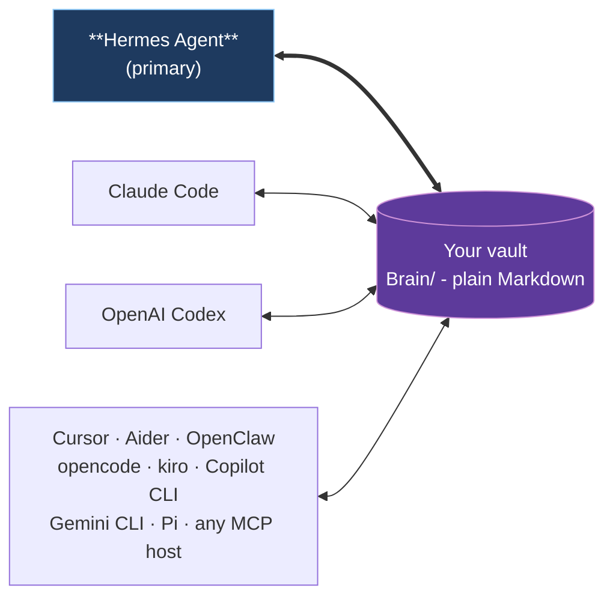
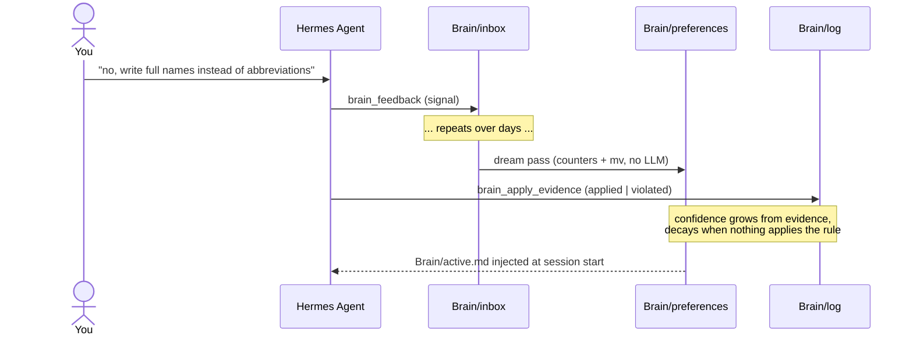

# Open Second Brain


> An [Obsidian](https://obsidian.md)-native memory layer for your AI agent. Plain Markdown you own, in the same vault you already use.

Open Second Brain plugs into [Hermes Agent](https://github.com/NousResearch/hermes-agent) and turns your Obsidian vault into a memory layer the agent reads and writes through deterministic CLI / MCP tools. Preferences, signals, evidence, and audit trails are real `.md` files under `Brain/` in the vault you already open in Obsidian every day. You can grep them, version them with git, search them in Obsidian, edit them by hand. No daemon, no vector black box, no hidden state outside the vault.

## Why

- **Lives in your Obsidian vault.** Open `Brain/preferences/pref-no-internal-abbrev.md` in Obsidian and you literally see what your agent learned about you - title, status, evidence count, confidence band, body text. Wikilinks, backlinks, graph view all work.
- **You own the data.** Plain Markdown on your filesystem. No service to cancel, no cloud account, no schema migration when a vendor pivots. Syncthing to your other machines if you want.
- **Memory that learns deterministically.** A `dream` pass turns repeat signals into rules and retires the ones nothing applies any more. Counters and atomic file moves - no LLM inside the algorithm, no surprise hallucinations in your memory.
- **One vault, every agent.** Hermes Agent is the primary integration. Claude Code, OpenAI Codex, Cursor, Aider, OpenClaw, opencode, kiro, Copilot CLI, Gemini CLI, and Pi all plug into the same Brain through MCP.

## One vault, many runtimes



Hermes Agent owns the schedule (dream cron, daily digests, Telegram delivery). Other runtimes participate as readers and writers of the same Brain through MCP - no per-runtime fork of the memory.

## Quick start with Hermes Agent

**The simplest path - let your agent set it up.** Paste this into Hermes (or whichever AI agent already has shell access on the target machine):

> Install Open Second Brain for me by following the steps at <https://github.com/itechmeat/open-second-brain/blob/main/install/hermes.md>. My vault is at `/path/to/your-vault`.

The agent reads the install doc, runs every command, and verifies the result. That's it.

If you prefer running the steps yourself:

```bash
# 1. Install the plugin
hermes plugins install itechmeat/open-second-brain --enable
hermes gateway restart

# 2. Put `o2b` on PATH
~/.hermes/plugins/open-second-brain/scripts/o2b install-cli

# 3. Bootstrap the vault
o2b init       --vault /path/to/your-vault --name "My Second Brain"
o2b brain init --vault /path/to/your-vault --primary-agent <agent-name>

# 4. Verify
o2b doctor --vault /path/to/your-vault
```

Enable Open Second Brain as the memory provider in `~/.hermes/config.yaml` (`memory.provider: open-second-brain`) and restart the gateway one more time - the agent now injects `Brain/active.md` into its system prompt, recalls context before each turn, and writes signals through `brain_feedback`, all through the one native provider. Full step-by-step: [`install/hermes.md`](install/hermes.md).

## Other runtimes

| Runtime                                                          | Install                                                                                             |
| ---------------------------------------------------------------- | --------------------------------------------------------------------------------------------------- |
| Claude Code                                                      | Marketplace plugin (bundled `.mcp.json` + hooks) - [`install/claudecode.md`](install/claudecode.md) |
| OpenAI Codex                                                     | `codex plugin marketplace add ...` - [`install/codex.md`](install/codex.md)                         |
| OpenClaw                                                         | Native JS plugin, no MCP needed - [`install/openclaw.md`](install/openclaw.md)                      |
| Cursor · Aider · opencode · kiro · Copilot CLI · Gemini CLI · Pi | `o2b install --target <name> --apply` - see [`install/`](install/)                                  |
| Any other MCP host                                               | `o2b install --target generic --apply` - [`install/generic.md`](install/generic.md)                 |

Each non-Hermes target writes a sidecar manifest under `<vault>/.open-second-brain/install.lock.json` so `o2b uninstall --target <name> --apply` removes exactly what it added.

## How rules accrete



Three repeat signals on the same topic graduate to a confirmed rule. Evidence shifts confidence up or down. Rules with zero recent evidence retire automatically. You can pin, merge, retire, or roll back with `o2b brain {pin,merge,reject,rollback}` - see [`docs/cli-reference.md`](docs/cli-reference.md).

## Top features

The capabilities you actually feel day to day:

| #   | Feature                                           | What it means for you                                                                                                                                                                                                                                                                                                                                                                                                                                                                        |
| --- | ------------------------------------------------- | -------------------------------------------------------------------------------------------------------------------------------------------------------------------------------------------------------------------------------------------------------------------------------------------------------------------------------------------------------------------------------------------------------------------------------------------------------------------------------------------- |
| 1   | Your memory, in your Obsidian vault               | Every rule the agent learns about you is a Markdown file you can open, read, and edit. Wikilinks, backlinks, and the graph view in Obsidian all work — no separate UI to learn.                                                                                                                                                                                                                                                                                                              |
| 2   | `dream` - the agent learns what you actually want | The nightly `dream` pass turns repeat corrections into rules: three signals on the same topic graduate to a confirmed preference. Its confidence rises every time the agent applies the rule and drops when it slips. No LLM inside the algorithm - counters and atomic file moves, nothing else.                                                                                                                                                                                            |
| 3   | One brain, every agent                            | Hermes Agent, Claude Code, Codex, Cursor, Aider, opencode, kiro, Copilot CLI, Gemini CLI, Pi - they all read the same memory. Teach one of them a rule and the next one already knows; `brain_agent_query` and `brain_agent_diff` let you inspect which agent contributed what.                                                                                                                                                                                                              |
| 4   | Teach a rule in one line                          | Drop `@osb feedback negative topic=... principle="..."` into any note. Next time `o2b brain scan-inline` runs (or you call it manually) the marker becomes a real taste signal in `Brain/inbox/` and the note gets a `@osb✓` checkmark so re-runs skip it.                                                                                                                                                                                                                                   |
| 5   | Look back at how your AI grew                     | The time axis surfaces how the agent's view of you evolved. `o2b brain evolution` walks a single preference's life from first signal to confirmed to retired; `o2b brain daily` / `weekly` / `monthly` summarise what changed; `o2b brain intent-review` previews whether signal clusters are ready before the next `dream`; `o2b brain retention` recommends keep/improve/park/prune actions without deleting anything.                                                                     |
| 6   | Browse and govern your memory schema              | `o2b brain explorer` opens a force-directed HTML graph of every rule, every link, every retirement. Preference files can declare typed relationships such as `depends_on:` and `refines:`, plus `memory_layer` / `memory_branch` labels and optional `schema_type:` taxonomy metadata; `o2b brain schema` stats, lint, graph, explain, orphans, and apply audit and mutate those tokens through locked, audited writes. Double-click a node — Obsidian opens the underlying note.            |
| 7   | Undo the agent if it gets it wrong                | Every Brain mutation lands a verified snapshot before touching anything. One command (`o2b brain rollback <id>`) restores yesterday's state, and drift detection refuses to clobber unintended local edits.                                                                                                                                                                                                                                                                                  |
| 8   | Pin, merge, retire by hand                        | When a rule is wrong, you fix it. `o2b brain pin` keeps a good one safe from auto-retire, `merge` folds duplicates, `reject` puts a bad rule in the bin with a reason. The CLI is the operator's seat.                                                                                                                                                                                                                                                                                       |
| 9   | Hybrid search that explains itself                | `o2b search "<query>" --property type=decision --property status=open --evidence-pack --since 7d` — SQLite + FTS5 and an optional semantic layer, with CJK-aware token expansion for unspaced Chinese/Japanese/Korean text. Recall is sharpened by MMR diversity, link-graph traversal, entity boosting, structured query lanes, session focus, and header-anchored chunking; typed relations carry recall polarity (a `superseded_by` predecessor is demoted below its successor, `contradicts` warns without endorsing); `--since` / `--until` scope recall by time; `o2b search feedback` trains bounded, auditable learned weights; opt-in evidence packs show matched/missing terms, IDF-weighted coverage, per-token union records, a completeness verdict with a false-absence guard, abstention text, terminal-state downranks, and `why_retrieved` reasons. |
| 10  | Pay Memory — audit every paid action              | When the agent spends money (Solana-Foundation `pay`, third-party APIs) every receipt lands in `Brain/payments/<date>/`. Spending policy, approval gate, daily Telegram report. The agent never holds wallet keys.                                                                                                                                                                                                                                                                           |

These are the headline capabilities. The full surface also includes: importing Claude Code memory directories, daily logging-discipline cron with a complexity-to-thinking warning, cross-project pointers for shared vaults, transient pinned session context through `brain_pinned_context` / `Brain/pinned.md`, source-agent query and comparison (`brain_agent_query`, `brain_agent_diff`, `o2b brain agent-query`, `o2b brain agent-diff`), the codegraph partner skill, vault hygiene lints, per-MOC coverage audit, concept synthesis, an operator dashboard, configurable Markdown-link presentation output, MCP output-contract checks for core agent-facing tools, private-region stripping with `<private>...</private>`, the v0.12.0 Brain Integrity Suite (content-hash drift detection, durable workrun checkpoints, destructive-from-confirmed retire gate, and the `brain_review_candidates` MCP tool that previews what the next dream pass would do without writing anything), the v0.13.0 Hybrid Search and Recall Quality suite (explainable recall, MMR diversity, link-graph traversal, entity-boosted retrieval, header-anchored chunking), the v0.14.0 Semantic Brain Health and Self-Maintenance suite (cross-preference contradiction detection, concept-gap and stale-claim surfacing, per-preference edit-history, a clean/watch/investigate reconciliation verdict via `brain_health`, and dependency-ordered `doctor --remediate`), the v0.17.0 Brain Lifecycle Review Suite (`intent-review`, `retention`, `monthly`, lifecycle schemas, and discipline complexity ratio), and the v0.18.0 MCP context economy (a per-tool preview budget that returns a bounded inline preview and parks the full payload in a vault-local artifact the agent fetches on demand with `brain_artifact_get`, plus a `recall_hint` one-liner on search results), and the v0.19.0 typed graph semantics (typed frontmatter relationships - `related` / `extends` / `contradicts` / `superseded_by` - that surface inline on search results, a `visibility:` scoping axis for `brain_search`, and a `brain_mcp_landscape` view of the Model Context Protocol servers configured across the vault), and the v0.20.0 Recall and Ranking Quality suite (a configurable Weibull recency-decay curve, structural query-intent classification that re-weights ranking by query shape, language-agnostic synonym expansion via local co-occurrence, per-memory and total recall character budgets for `brain_context_pack`, a persistent query cache that self-invalidates on a corpus-generation change, and a `brain_pre_compress_pack` tool that returns a budgeted top-preferences addendum for a host runtime to inject before context compression), and the v0.21.0 Brain Lifecycle Suite (a per-preference mutation audit trail keyed by preference id - create / promote / update / retire / merge with revision + content-hash before/after, via `o2b brain audit` and `brain_audit`; a multi-phase `dream` pipeline that names its close / reconcile / synthesize / heal / log seams and reports a structured per-phase summary without rewriting the proven internals; deterministic reconcile-phase domain classification that buckets contradictions into claims / entity / decisions / source-freshness, auto-resolves only the decisive source-freshness case, and surfaces the rest as open questions instead of forcing a merge; a budgeted `o2b brain morning-brief` / `brain_morning_brief` session-start summary of top preferences, recent open questions, and recent notes; language-agnostic ISO-8601 temporal extraction that fills preference validity windows from signal text; and opt-in heal-phase vault enrichment that links exact title mentions across user pages), and the v0.22.0 Vault portability + session economy suite (a deterministic lossless session codec - `expand(compress(x)) === x` for all input, opt-in on the signal store and exposed as `o2b brain codec`; an `o2b brain sources` / `brain_sources` read-only dashboard of signals by agent and source type; vault-map `{{role}}` tokens resolved via an optional `Brain/_vault-map.yaml` and wired into scan-inline read paths and graph import; named multi-vault profiles with `o2b vault profile` + a `brain_switch_vault` tool, activated by a pointer in config; and `o2b brain graph-export` / `graph-import` for moving a vault's knowledge graph between layouts with skip/overwrite/merge conflict modes). Browse [`docs/cli-reference.md`](docs/cli-reference.md) for every verb and [`docs/how-it-works.md`](docs/how-it-works.md) for the mental model.

The v0.26.0 surface adds audited schema mutation/admin tools, real-time lifecycle capture hooks for prompt markers and `brain_feedback` tool calls, CJK-aware FTS recall, and `brain_watchdog` / `o2b brain watchdog` recovery probes. The v0.27.0 surface adds recall-control and trust tools: structured search query documents, session focus, MCP `brain_recall_gate`, polarity-aware context lanes, and opt-in evidence packs for CLI/MCP search. The v0.28.0 surface adds a deterministic prompt-injection guard for automatically surfaced Brain context, agent-blind `$secret:NAME` references, and preview foundations for source-scoped forget, privacy-scanned knowledge packs, and oversized payload externalization. The v0.29.0 surface adds opt-in context receipts and recall telemetry, read-only context budget presets, pre-compaction extraction, and a continuity-backed session recall DAG. The v0.33.0 surface adds the Recall Trust Suite: relation-aware recall polarity for typed memory edges, an explicit retrieval feedback loop with bounded learned weights (`o2b search feedback` / `weights`, MCP `brain_recall_feedback`), time-aware recall (`--since` / `--until` with natural-language ranges), verified multi-record recall (per-token union records, IDF-weighted coverage, rare-term abstention), and a search-completeness verdict with a false-absence guard. The v0.34.0 surface adds the Token Diet: a budgeted SessionStart injection of `Brain/active.md` (default 8,000 chars, `active.inject_budget_chars`) with the post-compaction path moved to the supported SessionStart `compact` matcher, a once-per-session post-write reminder cadence, frontmatter escape-amplification fixed at the parser with a one-shot `o2b brain upgrade --apply` repair for already-corrupted preference files, three consolidated read tools (`brain_brief`, `brain_analytics`, `schema_inspect`) with 18 hidden deprecated aliases, registry description caps with a contract guard, preview budgets by default, and a `scripts/measure-token-surface.ts` report. The v0.35.0 surface adds the Memory Integrity Suite: a canonical entity registry under `Brain/entities/` (one Markdown entity per `(category, name)` with alias resolution, archive/restore, typed relations, `o2b brain entity` CLI verbs, a read-only `brain_entity` MCP tool, doctor duplicate/relation lints, and alias-aware search boost with `entity_canonical` explanations), per-device Brain log shards (`Brain/log/<date>.<deviceId>.jsonl` + `.md` keyed by a device-local id, merged reads through `readLogDay`/`listLogDates`, no more Syncthing write conflicts, legacy days untouched), capture boundaries (a `sessions:` block with ignored/stateless session globs and message suppression regexes, applied before any extraction at both live-hook and import seams, counted but never stored raw; keep suppression regexes simple - they run on every message, and a catastrophic-backtracking pattern slows capture), and deterministic regex fact extraction (seven precision-first families over user turns, `source_type: extracted` signals with family-scoped dedup and canonical entity anchors). The v0.36.0 surface adds the Embedding Provider Suite: an offline `local` embedding provider (deterministic feature hashing, no cloud, no key, no model download - set `embedding_provider: local` for a privacy-first recall path), a CLI provider registry (`o2b search provider add | list | show | remove`, persisted to `Brain/search/embedding-providers.json` storing only environment-variable names, resolved after the built-ins so a configured key is never shadowed), an embedding cost gate (`embedding_cost_gate_usd`, default 0 = off; refuses an over-budget run unless `o2b search index --force-cost`) with the active `<provider>:<model>:<dimension>` signature and a refresh-cost estimate in `o2b search status`, and an opt-in Reciprocal Rank Fusion mode (`search_fusion_mode: rrf`, `search_rrf_k` default 60) that fuses the keyword and semantic lanes by rank position instead of weighted magnitude while the default `linear` mode stays bit-identical and storage remains SQLite + sqlite-vec + FTS5. The v0.37.0 surface adds the Agent Surface Suite: skills as callable MCP tools (`list_skills` / `get_skill` over the shipped `skills/` plus vault-local `Brain/skills/`), two-pass tool catalog hydration (a compact `catalog` scope where `tool_hydrate` returns the sorted catalog and per-name full schemas while every tool stays callable), five named tool-surface profiles with fail-open fallback (`mcp_tool_profile` / `o2b mcp --tool-profile`), deterministic BM25-style skill auto-attach (`skills_attach`, gated by `skill_auto_attach`), config-level capture role filtering (`session_capture_roles`), session-scoped search focus with SessionEnd auto-clear and gated context-pack promotion (`--session`, `focus_session`, `search_focus_context_pack`), operator-readable handoff notes (`o2b brain handoff`, gated SessionEnd generation via `session_handoff`), and scoped current-intention chains with a move-to-history lifecycle (`o2b brain intention`, MCP `brain_intention`). The v0.38.0 surface adds the Workspace Insight Suite: project vault pointers (`o2b brain project link | list | remove | status` writes a `.o2b-vault.json` into any project directory and `resolveVault` honours it from anywhere under that tree), read-only recall sources (`o2b brain source add | list | remove` with self/duplicate/circular validation and BROKEN flagging), cross-vault union search (`o2b search <query> --global`, `brain_search { global: true }` - origin-labelled results, external vaults never written to), a configurable wikilink path format (`wiki_link_format`: preserve/full/short plus `o2b brain links normalize`), a shell-native surface (`o2b brain profile` materializes `Brain/profile.md` + a `.o2bfs` root marker; `o2b brain sgrep` is grep-shaped semantic search), a grounded trigger queue with an anti-nag lifecycle (`o2b brain trigger scan | list | ack | dismiss | act | history`, MCP `brain_trigger`, cooldown-key dedup, morning-brief delivery once per `trigger_cooldown_days`), deep vault synthesis (`o2b brain deep-synthesis <topic>`, MCP `brain_deep_synthesis` - a deterministic dossier of agreements, contradictions, stale claims, and knowledge gaps), idea discovery (`o2b brain ideas`, MCP `brain_idea_discovery`), and opt-in recall-gate telemetry (`recall_gate_telemetry`, hashed prompts only, gate_list / gate_summary operations). The v0.39.0 surface adds the Memory Observability Suite: a contract-wide continuity schema version (`o2b.continuity.v1`, legacy records read as v1, dedup ids unchanged), a lazy gated telemetry emit kernel with structural no-consumer and fail-open guarantees across every gated surface, a continuity read-model with private-record masking shared by all read-side consumers, ATOF/ATIF trajectory export (`o2b brain continuity export --format atof|atif` - read-only, redaction honoured), a deterministic memory quality benchmark (`o2b brain bench memory` with checkpoint/resume and separate quality/latency/context-cost reporting), and the `docs/observability.md` contract enumerating every event kind, gate, and safety rule. The v0.40.0 surface adds the Project History Suite: git history as project memory (`o2b brain git ingest | status | find | mine` - a sanitized read-only reader lands commits, tags, and release ranges in a per-repo record store under `Brain/projects/git/<repo-key>/` with watermarked duplicate-free incremental runs, a deterministic FTS-discoverable digest note, store-only history queries that survive checkout deletion, and decision-shaped commits mined into draft ADR candidates under `Brain/decisions/candidates/` with sha-stable skip-existing identity), regeneration-safe architecture notes (`o2b brain architect <project-path>` - a stdlib-only deterministic scanner renders overview and per-module notes through paired `o2b:begin`/`o2b:end` sentinel regions, so operator prose survives every re-scan byte-for-byte and corrupted markers fail closed), and `brain_query` recall telemetry (per-call opt-in mirroring `brain_search`, kind-only payload - the supplied preference id, topic, or timestamp never lands in a continuity record). The v0.41.0 surface adds the Agent Write Contract Suite: provider-agnostic write sessions (`o2b brain session`, MCP `brain_write_session` - a file-backed JSON-envelope lifecycle where the calling agent generates, the Brain validates fail-closed with machine-readable correction errors and a retry cap, collisions never overwrite without explicit intent, operator review gates are opt-in, and every terminal transition is audited), a multi-persona decision panel riding the same kernel (`o2b brain panel` with operator-curated personas under `Brain/personas/` and committed decision notes under `Brain/decisions/panels/`), a pluggable memory backend boundary (`memory_backend` config key, Claude Code adapter byte-identical by default), and an opt-in cross-agent shared namespace (`shared_namespace` mirrors feedback signals and notes into a second vault fail-soft, with agent and origin attribution). The v0.42.0 surface adds the Time-Aware Recall & Activation Suite: access-reinforced activation (CLI/MCP searches record surfaced documents as hashed one-file-per-access events; a bounded `activation` ranking boost decays stored strength by a content-type half-life table where preferences and decisions never fade; `o2b brain activation status | sweep` inspects and compacts the store), co-access reinforcement edges (habitual companions in the same candidate pool boost each other with a bounded `co_access` reason), dream-stamped `freshness_trend` on preferences (`new | strengthening | stable | weakening | stale` from the evidence time distribution, multiplying the relevance portion of recall), event-time recall discipline (`since`/`until` filters obey declared `valid_from`/`valid_until` validity windows by overlap, with mtime only as the fallback), temporal-bridge traversal (time-scoped queries pull in linked causes and consequences from a padded event-time neighbourhood instead of leaking arbitrary old neighbours), and self-correcting two-pass recall (a zero-candidate evidence-pack query runs exactly one broadened OR retry, reported as `secondPass`). The v0.43.0 surface adds the Entity Truth & Self-Improving Dream Suite: an append-only entity claim ledger under `Brain/truth/` (device-sharded JSONL claim events folded into per-`(entity, aspect)` slots with current value, superseded history, temporal-structural `value_conflict` detection that is always `ask_user`, exact-match quantity aggregation, and `o2b brain truth` / MCP `brain_truth` surfaces), deterministic atomic-fact decomposition (`o2b brain facts decompose`, markdown-structure splitting with an abbreviation guard and optional `--ingest` into the ledger), an actor-framed `quantity` fact family, a name-aware merge guard (`entity-guard` refusal with `--force` bypass) plus an `entity_contamination` deep-synthesis dimension, push-mode cross-agent collision triggers (`agent_collision` kind with cooldown dedup), outcome-tied apply-evidence (`outcome: success|failure|unknown` staging `outcome_regressions` with a deterministic confidence penalty), a markdown-first dead-end registry (`o2b brain dead-end`, MCP `brain_dead_ends` - negative knowledge FTS-recallable beside positive rules), surprisal novelty ranking on `brain_review_candidates` over the existing sqlite-vec index, a weekly `topSource` nomination in the weekly synthesis, and the Brain's first forward-looking fold (`o2b brain foresight`, MCP `brain_foresight` - recurrence cadences project next-due routines, open commitments and questions surface with sources).

## CLI

```bash
o2b status                    # Show config / vault status
o2b init                      # Bootstrap the vault profile
o2b doctor                    # Run vault + adapter checks
o2b brain dream               # Deterministic consolidation pass (idempotent)
o2b brain digest              # Recent transitions, markdown or JSON
o2b brain intent-review --json # Pre-dream signal readiness audit
o2b brain retention --json    # Recommendation-only lifecycle review
o2b brain monthly --month 2026-05 --json # Month-level Brain synthesis
o2b brain audit pref-foo --json       # Full mutation trail for one preference
o2b brain morning-brief --json        # Session-start summary (prefs, open questions, notes)
o2b brain sources --json              # Per-source signal dashboard
o2b brain entity set people "Ada Lovelace" --alias "the operator" # Canonical entity registry
o2b brain entity get "the operator" --json    # Alias resolves to the canonical record
o2b brain schema lint --json          # Runtime schema vocabulary + usage/admin findings
o2b brain watchdog --json             # Brain probes + safe recovery recommendations
o2b brain graph-export --out graph.json   # Export the vault knowledge graph
o2b brain semantics-backfill --json       # Dry-run typed preference-edge repair proposals
o2b brain context-receipts list --json    # Inspect opt-in prompt context receipts
o2b brain recall-telemetry summary --json # Aggregate opt-in recall/context telemetry
o2b brain context-presets suggest --model claude-sonnet-4 --context-window 200000 --json
o2b brain import-session session.jsonl --recall --json # Populate the session recall DAG
o2b brain session-grep --query "decision" --json       # Search raw/session summary recall nodes
o2b vault profile switch work         # Activate a named multi-vault profile
o2b brain agent-query --agent claude --json   # Source-agent provenance query
o2b brain agent-diff --mode diff --agent claude --agent codex
o2b search "<query>" --evidence-pack # FTS5/hybrid search with matched/missing evidence
o2b search "<query>" --since 7d --until today # Time-scoped recall (event-time validity window, mtime fallback)
o2b search feedback --query "<q>" --result note.md --verdict up # Train learned recall weights
o2b search weights --json     # Inspect base + learned ranking weights
o2b search focus set --query "current task" --path Notes/Project
o2b secrets list --json       # Inspect $secret:NAME references without printing values
o2b help --json               # Machine-readable command/flag manifest
o2b completions --shell zsh   # Completion script for bash/zsh/fish/elvish/nushell/powershell
o2b mcp --probe --json --disable-tool second_brain_query # Capability-aware MCP probe
o2b update                    # Update across detected runtimes
```

Full list (~50 verbs across `o2b`, `o2b brain`, `o2b vault`, `o2b discipline`, Pay Memory) in [`docs/cli-reference.md`](docs/cli-reference.md).

## Safety

- Plain Markdown on your filesystem. No daemon, no background writes.
- The MCP server is a stdio subprocess that exits with the parent runtime.
- MCP runtime capability flags (`--allow-tool`, `--disable-tool`, `--max-tools`) can narrow the advertised tool surface per process without widening the writer-only scope.
- Secrets are not supposed to live in the vault. Daily logs and config exports go through a best-effort redactor for common secret-name patterns.
- `$secret:NAME` config references store only the reference and resolve from the local process environment; `o2b secrets list|status` reports availability without printing values.
- Automatically surfaced Brain snippets from `brain_context_pack` and `brain_pre_compress_pack` pass through a deterministic prompt-injection guard. Filtered outputs return a placeholder plus machine-readable reason codes; source Markdown is not rewritten.
- Context receipts and recall telemetry are opt-in and store redacted metadata, hashes, source refs, counters, and gap diagnostics rather than raw private prompt text.
- Brain mutations (`dream`, `merge`, `upgrade`) take a pre-run snapshot with a SHA-256 sidecar; `o2b brain rollback` aborts on drift unless `--force-rollback`.
- Lifecycle review commands (`intent-review`, `retention`, `monthly`) are read-only. Retention emits recommendations only; it never deletes, moves, or edits Brain artifacts.
- Hooks (Claude Code, Codex) inject active context and capture explicit prompt markers / `brain_feedback` tool calls through the same signal dedup boundary; lifecycle observations are audited/logged and never block the runtime.
- `o2b brain watchdog` and `brain_watchdog` are probe-first. They recommend search-index repair and can create missing Brain directories only when remediation is explicit; snapshot restore is refused unless restore intent and force are both explicit.
- Text written through Brain/Pay Memory redaction strips `<private>...</private>` regions before storage and masks secret-shaped assignments such as `api_key=...`.

## Updating

```bash
o2b update                    # detect runtimes, skip unchanged, apply, verify
o2b doctor                    # confirm the new manifest validates
```

Updates need no manual symlink surgery: hooks resolve the active plugin version
on their own and the `~/.local/bin` CLI symlinks self-heal on the next session
start. Per-runtime upgrade paths and the canonical version source live in
[`install.md`](install.md); the update-safety contract (and the invariants any
change to hooks/launcher/install must keep) lives in
[`docs/updating.md`](docs/updating.md).

## Documentation

| Topic                                              | Doc                                                              |
| -------------------------------------------------- | ---------------------------------------------------------------- |
| Mental model, vault layout, dream mechanics        | [`docs/how-it-works.md`](docs/how-it-works.md)                   |
| MCP protocol, tools, lifecycle, writer split       | [`docs/mcp.md`](docs/mcp.md)                                     |
| Full CLI reference (every verb, every flag)        | [`docs/cli-reference.md`](docs/cli-reference.md)                 |
| Update safety contract + hook/launcher invariants  | [`docs/updating.md`](docs/updating.md)                           |
| Pay Memory - audit for paid agent actions          | [`docs/pay-memory.md`](docs/pay-memory.md)                       |
| Hermes cron jobs (daily digest, discipline report) | [`docs/hermes-cron.md`](docs/hermes-cron.md)                     |
| Cross-project pointer (multi-host vaults)          | [`docs/cross-project-pointer.md`](docs/cross-project-pointer.md) |
| Architecture                                       | [`docs/architecture.md`](docs/architecture.md)                   |
| Origin idea                                        | [`docs/idea.md`](docs/idea.md)                                   |

## Uninstalling

```bash
o2b uninstall                       # print plan (read-only)
o2b uninstall --apply-local --remove-cli   # remove local state and symlinks
```

Your vault is never touched by the uninstall flow. Delete it yourself with normal filesystem tools if you want to.

## License

MIT. Source: <https://github.com/itechmeat/open-second-brain>.
