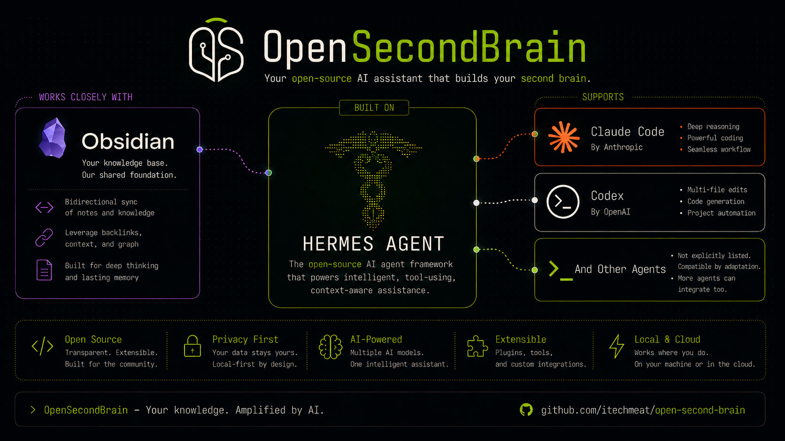
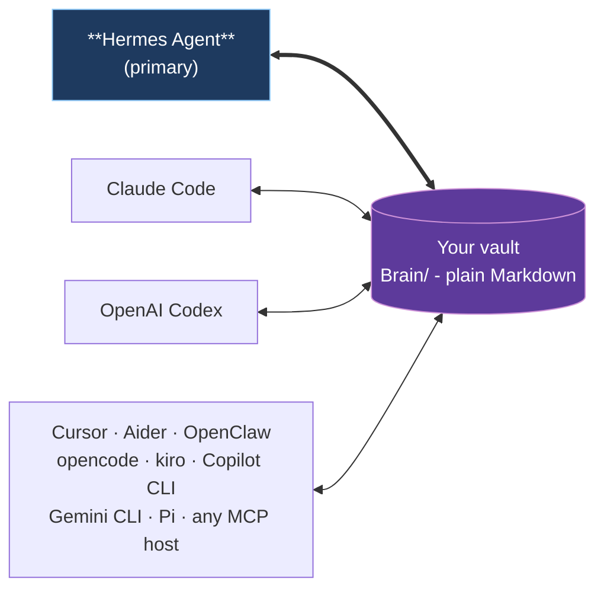
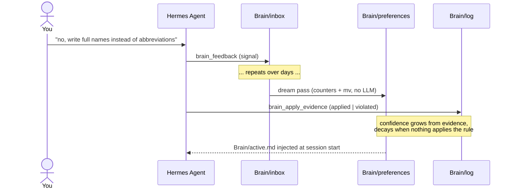

# Open Second Brain



> An [Obsidian](https://obsidian.md)-native memory layer for your AI agent. Plain Markdown you own, in the same vault you already use.

Open Second Brain plugs into [Hermes Agent](https://github.com/NousResearch/hermes-agent) and turns your Obsidian vault into a memory layer the agent reads and writes through deterministic CLI / MCP tools. Preferences, signals, evidence, and audit trails are real `.md` files under `Brain/` in the vault you already open in Obsidian every day. You can grep them, version them with git, search them in Obsidian, edit them by hand. No daemon, no vector black box, no hidden state outside the vault.

## Why

- **Lives in your Obsidian vault.** Open `Brain/preferences/pref-no-internal-abbrev.md` in Obsidian and you literally see what your agent learned about you - title, status, evidence count, confidence band, body text. Wikilinks, backlinks, graph view all work.
- **You own the data.** Plain Markdown on your filesystem. No service to cancel, no cloud account, no schema migration when a vendor pivots. Syncthing to your other machines if you want.
- **Memory that learns deterministically.** A `dream` pass turns repeat signals into rules and retires the ones nothing applies any more. Counters and atomic file moves - no LLM inside the algorithm, no surprise hallucinations in your memory.
- **One vault, every agent.** Hermes Agent is the primary integration. Claude Code, OpenAI Codex, Cursor, Aider, OpenClaw, opencode, kiro, Copilot CLI, Gemini CLI, and Pi all plug into the same Brain through MCP.

## One vault, many runtimes



Hermes Agent owns the schedule (dream cron, daily digests, Telegram delivery). Other runtimes participate as readers and writers of the same Brain through MCP - no per-runtime fork of the memory.

## Quick start with Hermes Agent

```bash
# 1. Install the plugin
hermes plugins install itechmeat/open-second-brain --enable
hermes gateway restart

# 2. Put `o2b` on PATH
~/.hermes/plugins/open-second-brain/scripts/o2b install-cli

# 3. Bootstrap the vault
o2b init       --vault /path/to/your-vault --name "My Second Brain"
o2b brain init --vault /path/to/your-vault --primary-agent <agent-name>

# 4. Verify
o2b doctor --vault /path/to/your-vault
```

Register the MCP server in `~/.hermes/config.yaml` and restart the gateway one more time - the agent now reads `Brain/active.md` on every session start and writes signals through `brain_feedback`. Full step-by-step including MCP wiring: [`install/hermes.md`](install/hermes.md).

A first-time setup wizard is also available:

```bash
o2b init --interactive
```

## Other runtimes

| Runtime | Install |
| --- | --- |
| Claude Code | Marketplace plugin (bundled `.mcp.json` + hooks) - [`install/claudecode.md`](install/claudecode.md) |
| OpenAI Codex | `codex plugin marketplace add ...` - [`install/codex.md`](install/codex.md) |
| OpenClaw | Native JS plugin, no MCP needed - [`install/openclaw.md`](install/openclaw.md) |
| Cursor · Aider · opencode · kiro · Copilot CLI · Gemini CLI · Pi | `o2b install --target <name> --apply` - see [`install/`](install/) |
| Any other MCP host | `o2b install --target generic --apply` - [`install/generic.md`](install/generic.md) |

Each non-Hermes target writes a sidecar manifest under `<vault>/.open-second-brain/install.lock.json` so `o2b uninstall --target <name> --apply` removes exactly what it added.

## How rules accrete



Three repeat signals on the same topic graduate to a confirmed rule. Evidence shifts confidence up or down. Rules with zero recent evidence retire automatically. You can pin, merge, retire, or roll back with `o2b brain {pin,merge,reject,rollback}` - see [`docs/cli-reference.md`](docs/cli-reference.md).

## Top features

The capabilities that pull the most weight day-to-day:

| # | Feature | What it does |
|---|---|---|
| 1 | Plain Markdown in your Obsidian vault | `Brain/preferences/pref-*.md`, `Brain/log/<date>.md`, `Brain/payments/<date>/<slug>.md` - real files you open in Obsidian. Wikilinks, backlinks, and the graph view work out of the box. |
| 2 | `dream` - deterministic learning pass | Clusters repeat signals into rules, retires rules with no evidence, recomputes confidence. Counters + atomic `mv` only - no LLM inside the algorithm. Idempotent and cron-friendly. |
| 3 | `Brain/active.md` auto-injection | The agent's per-session view of confirmed + quarantine + recently retired rules, regenerated by `dream` and injected through a SessionStart hook (or `brain_context` for runtimes without one). |
| 4 | Time axis | Chronological timeline, per-preference belief evolution, structural staleness reports, daily / weekly briefs over one materialized `TimelineIndex`. `o2b brain timeline / evolution / stale / daily / weekly`. |
| 5 | `o2b brain explorer` | Force-directed HTML graph of preferences + retired rules. Live HTTP on `127.0.0.1` or single-file `--export <path>`. Double-click a node to open it in Obsidian via `obsidian://open?path=...`. |
| 6 | Pre-run snapshots + verified rollback | Every Brain mutation (`dream`, `merge`, `migrate-frontmatter`, `upgrade`) takes a `Brain/.snapshots/<run>.tar.zst` with a SHA-256 sidecar. `o2b brain rollback` aborts on drift unless `--force-rollback`. |
| 7 | Operator control over rules | `o2b brain {pin,unpin,merge,reject,set-primary,upgrade}` lets you keep, fold, retire, or migrate rules by hand without leaving the CLI. Pinned rules are exempt from auto-retire. |
| 8 | Full-text search with frontmatter filters | `o2b search "<query>" --property type=decision --property status=open` - SQLite + FTS5 over the whole vault with structured frontmatter filters layered on top. |
| 9 | Multi-runtime via MCP | One stdio MCP server, 31 deterministic tools. Hermes Agent, Claude Code, OpenAI Codex, Cursor, Aider, OpenClaw, opencode, kiro, Copilot CLI, Gemini CLI, Pi - all read and write the same Brain. |
| 10 | Pay Memory (optional) | Audit trail for paid agent actions: receipts, generated assets, spending policy, approval gate, daily Telegram report. The agent never holds wallet keys. |

These are the headline capabilities. The full surface also includes: `@osb` inline markers in any Daily note, importing Claude Code memory directories, daily discipline-report cron, cross-project pointers for shared vaults, the codegraph partner skill, vault hygiene lints (page-dedup, token-footprint, context-pack), per-MOC coverage audit, concept synthesis, and an operator dashboard with verdict band. Browse [`docs/cli-reference.md`](docs/cli-reference.md) for every verb and [`docs/how-it-works.md`](docs/how-it-works.md) for the mental model.

## CLI

```bash
o2b status                    # Show config / vault status
o2b init                      # Bootstrap the vault profile
o2b doctor                    # Run vault + adapter checks
o2b brain dream               # Deterministic consolidation pass (idempotent)
o2b brain digest              # Recent transitions, markdown or JSON
o2b search "<query>"          # FTS5 over the vault
o2b update                    # Update across detected runtimes
```

Full list (~50 verbs across `o2b`, `o2b brain`, `o2b vault`, `o2b discipline`, Pay Memory) in [`docs/cli-reference.md`](docs/cli-reference.md).

## Safety

- Plain Markdown on your filesystem. No daemon, no background writes.
- The MCP server is a stdio subprocess that exits with the parent runtime.
- Secrets are not supposed to live in the vault. Daily logs and config exports go through a best-effort redactor for common secret-name patterns.
- Brain mutations (`dream`, `merge`, `migrate-frontmatter`, `upgrade`) take a pre-run snapshot with a SHA-256 sidecar; `o2b brain rollback` aborts on drift unless `--force-rollback`.
- Hooks (Claude Code, Codex) only inject text into the agent's context; they never write to the vault directly.

## Updating

```bash
o2b update                    # detect runtimes, skip unchanged, apply, verify
o2b doctor                    # confirm the new manifest validates
```

Per-runtime upgrade paths and the canonical version source live in [`install.md`](install.md).

## Documentation

| Topic | Doc |
| --- | --- |
| Mental model, vault layout, dream mechanics | [`docs/how-it-works.md`](docs/how-it-works.md) |
| MCP protocol, tools, lifecycle, writer split | [`docs/mcp.md`](docs/mcp.md) |
| Full CLI reference (every verb, every flag) | [`docs/cli-reference.md`](docs/cli-reference.md) |
| Pay Memory - audit for paid agent actions | [`docs/pay-memory.md`](docs/pay-memory.md) |
| Hermes cron jobs (daily digest, discipline report) | [`docs/hermes-cron.md`](docs/hermes-cron.md) |
| Cross-project pointer (multi-host vaults) | [`docs/cross-project-pointer.md`](docs/cross-project-pointer.md) |
| Architecture | [`docs/architecture.md`](docs/architecture.md) |
| Origin idea | [`docs/idea.md`](docs/idea.md) |

## Uninstalling

```bash
o2b uninstall                       # print plan (read-only)
o2b uninstall --apply-local --remove-cli   # remove local state and symlinks
```

Your vault is never touched by the uninstall flow. Delete it yourself with normal filesystem tools if you want to.

## License

MIT. Source: <https://github.com/itechmeat/open-second-brain>.
