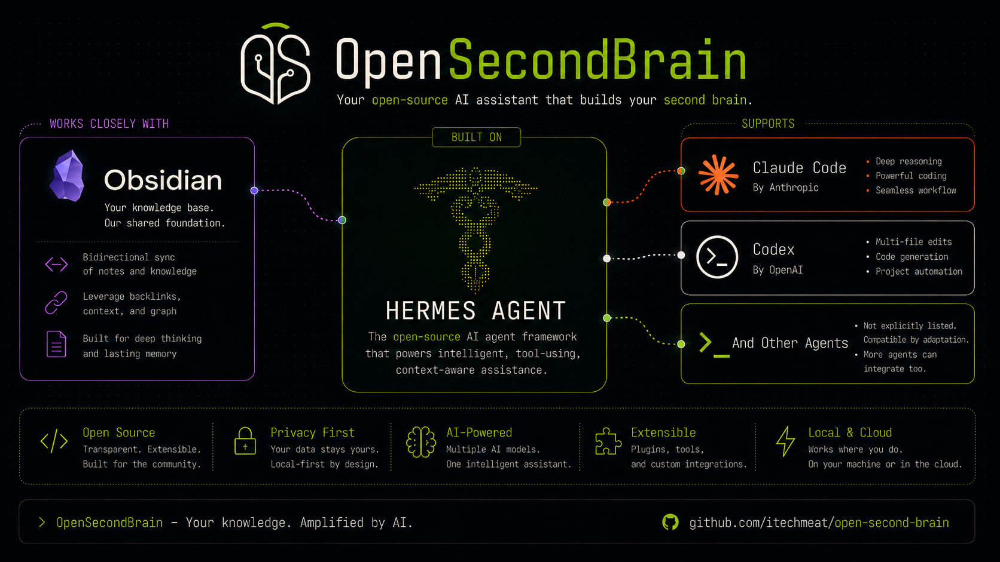
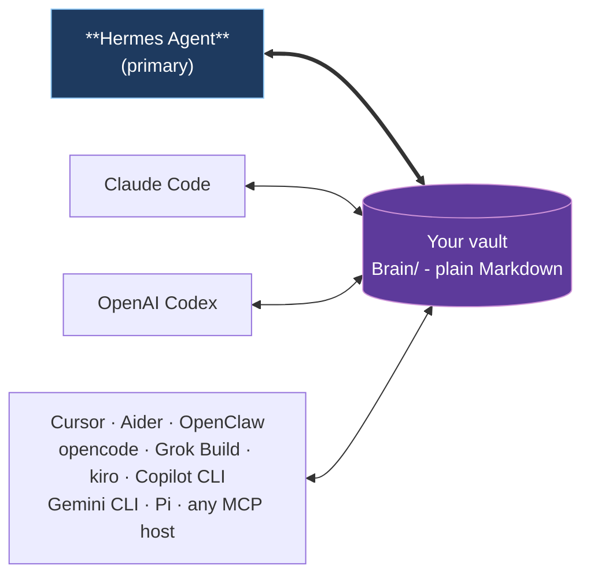

# Open Second Brain



> An [Obsidian](https://obsidian.md)-native memory layer for your AI agent. Plain Markdown you own, in the same vault you already use.

Open Second Brain plugs into [Hermes Agent](https://github.com/NousResearch/hermes-agent) and turns your Obsidian vault into a memory layer the agent reads and writes through deterministic CLI / MCP tools. Preferences, signals, evidence, and audit trails are real `.md` files under `Brain/` in the vault you already open in Obsidian every day. You can grep them, version them with git, search them in Obsidian, edit them by hand. No daemon, no vector black box, no hidden state outside the vault.

## What is new

Open Second Brain 1.48.0 is about work you can watch, bound and stop, and about claims that were checked before they were printed. Nine units picked by priority off the tracker, and reconnaissance against the real source before any of them was designed - a pass that corrected six of the nine task bodies rather than following them, because they describe a system with a resident daemon, a chat-model client of its own, and an ingest that locks too often. This one has none of those.

What it had instead was long work that reported nothing. `o2b brain dream` produced its first observable character after it had already finished, so a caller could not tell a slow pass from a hung one. A cancellation contract was fully written and passed by no production call site, which made its error class dead code. A herd of detached reindexes was spawned at startup with their standard error discarded, so every loser of the lock race died where nobody could see it. Now the long passes emit newline-delimited progress on standard error under `--progress`, over stdio to an MCP client that asks for it, and the passes that can observe an interrupt stop at a checkpoint and exit on the shell's own signal convention. The ones that cannot observe one install no handler and say so, because a synchronous function never yields the event loop and a handler that cannot run is worse than none - it swallows the keystroke that used to work.

The other half is what the tool says about itself. A successful install now states where your brain is, what filesystem backs it, whether the search index is inside that vault, and which outbound services are configured - each measured at the moment it is printed. What cannot be measured is worded as a catalogue rather than a scan, and every row names the verb that created that state and the verb that removes it. The project scanner walks once and stops entering what the repository ignores: 24148 files visited became 2729, and 530.6 ms became 57.5 ms, measured on this repository.

Then five reviewers were given the finished branch with no knowledge of how it was built, told that a comment is a claim rather than evidence and that a test which cannot fail proves nothing. They returned forty-four reproduced findings, and one of them ran thirty-seven mutations of the production code of which ten went green. The release's own argument caught it six times - three long operations that emitted progress and then simply stopped arriving, a documented deadline four call paths did not have, and, worst, the census the previous release's entire argument rests on turning out to read no source at all. Three findings were then resolved the opposite way to the obvious one, each because a measurement decided it: making a pass async does not deliver a signal either, a shorter lock budget made this branch's own contention test fail, and the proposed semaphore guard cannot see the case that matters. The [CHANGELOG](CHANGELOG.md) has all of it, including what was found and deliberately left open.

One decision is reversed here rather than quietly performed. Release 1.46.0 recorded that there would be no registry of embedding-provider shutdown dates, because a hand-maintained table over an open set of endpoints would rot in place and be believed. The objection was right, and this design answers both halves of it: a surveyed negative expires, a positive carries the date it was reviewed, a model the survey does not know is reported as unsurveyed rather than as having no announced shutdown, and an operator who has read a vendor's announcement can declare it without waiting for a release.

Previous release, 1.47.0, wired what already existed: nine capabilities that were exported, tested and used elsewhere, each with a site that needed them and did not call them - a destructive-operation gate with two call sites against roughly twenty-five destructive operations, and a ranker that read a document's authoring instant nine lines after ranking on the file's modification time.

Previous release, 1.46.0, was about claims the code could not back up. Nine units, four of them reported on the public tracker, and what they have in common is not a subsystem: in every one, the information needed to tell two cases apart either existed already and was thrown away, or cost one filesystem call nobody made. A search that returned nothing could not tell you whether the corpus was empty or the embedder was down, though fifteen degradation signals were being computed and then flattened into prose or dropped. Entity intake decided whether to trust a source from the shape of a string, never asking whether a file was behind it - and the caller supplying that string is the same agent that read the material being classified. Two concurrent writers racing for the same filename lost one of the records outright, measured at twelve dropped events out of twenty-four. The Hermes plugin and the core resolved different vaults while a docstring claimed they were identical, which is why a setup that worked showed as unconfigured for five weeks with nobody able to say why.

You can now say what you want indexed instead of listing everything you do not, with `vault.include_paths`; absent, it changes nothing, and that is measured against the previous release rather than asserted. A write tells you what is wrong with the page it just wrote, instead of deferring to a sweep that may never run. Recall telemetry carries which channel delivered, so a hook that was never installed and a hook that ran and stayed quiet stop looking identical. Every advertised tool parameter is documented and CI keeps it that way, and an unknown argument is named back to you with a suggestion rather than silently ignored.

Some of what was asked for is not here, and the absence is a decision. There was no registry of embedding-provider shutdown dates, because the only way to build one is a hand-maintained table over an open set of endpoints that would rot in place and be believed - a decision 1.48.0 reverses above, having answered that objection rather than set it aside. The schema-completeness guard covers input schemas only, because the output vocabulary declares union-typed fields with no type on purpose and the rule would demand a lie there. And the fix the intake issue asked for - let the host supply the trust verdict instead of the caller - is unbuildable, because no unforgeable caller identity exists in this surface, a conclusion this project had already reached elsewhere and not applied here. What shipped instead removes the free bypass and makes the claim auditable; it does not make the claim true, and the code says so. Four reviewers were then given the finished branch with no knowledge of how it was built, and told that a comment is a claim rather than evidence. They found twelve defects, two of them regressions this work introduced and invisible to its own tests. All are fixed, and the [CHANGELOG](CHANGELOG.md) names them.

Previous release, 1.45.1, fixed a Hermes flush that had been discarded at the boundary since 0.32.0 and a starter vault that went stale ninety days after it was authored. Before it, 1.45.0 was about silence not being an answer, and 1.44.0 about what the index already knew: thirteen units on the retrieval path, most of them values the system computed and discarded before anything could see them. Details for all three live in the [CHANGELOG](CHANGELOG.md).

Previous release, 1.43.0, was about provenance at the boundary: what enters your vault, under whose authority, validated against what, and backed by what proof. Entities an agent extracts from an untrusted source - a scraped page, a fetched article - now land in a quarantine lane instead of becoming first-class Brain entities, and trust is derived from the shape of the source identity rather than from any word list. You can declare in `_brain.yaml` which path prefixes a caller-named write may touch, and a write outside them is refused with the command that resolves it; its authority is the config file, not the caller, because a caller can name itself anything. Note creation gains an idempotent skip whose result tells you which happened, validation before the write lands, and a template mode with a deliberately small grammar. A back-dated note - an imported log, a meeting record - now ranks by the date its body declares rather than by when the file was touched, with the source of that date recorded beside it. Schema mutations can be previewed before they touch the vault, which matters more than it sounds: `--dry-run` was previously parsed and ignored. And an outcome an agent posts about its own work now carries the kernel's own on-disk evidence beside the claim, with a mismatch recorded rather than resolved.

Two things 1.43.0 deliberately did not build are worth knowing about, because their absence was a decision rather than an omission. There is no independent verifier, because agent identity here is an unauthenticated string and two records asserting two names chosen by one process are not two actors. And there is no pack fetched by URL, because a schema pack has no portable representation and no registry to install into. Five independent reviewers were given the finished branch and found thirty defects, nine of them introduced by this work and three of them mechanisms nothing could make fire; one of those three was removed rather than repaired. The [CHANGELOG](CHANGELOG.md) has the detail, including what was found and deliberately left open.

Previous release, 1.42.0, was a structural wave with no new capability: the six modules that cost the most to change, both import cycles removed, and nine places where absence and inability-to-examine had been collapsed into one answer. Details live in the [CHANGELOG](CHANGELOG.md).

Previous release, 1.41.0, was a signals-that-survive wave: eight units that carry a signal the system already computes the last few metres, to the decision it should have changed. Ingest now honours the repository's own `.gitignore`, nested ignore files, `.git/info/exclude` and submodule boundaries, through the same discovery module the hygiene scan uses - so a repo path stops pulling in the build artifacts it already declares as noise. A recall graded weak no longer evaporates when the call returns: repeated weak recall on the same question becomes a tracked, self-closing gap task. A query that names a period is ranked for that period instead of against it, detected from ISO and `since:`/`until:` tokens only so it behaves the same in every language. A scope-less capture says which routing signal it was missing and which scopes the vault actually has. Model-authored payloads are checked against a declared shape before they become knowledge, unconditionally - a validator that can be switched off is one the write path cannot rely on. Plain text can now seed a fact or a skill, not only a taste signal. And resumed work is recognised by a declared identity rather than by a fifteen-minute clock, so a branch or worktree switch stops breaking the chain. A ninth unit was built, reviewed, and reverted rather than shipped, because proving it inert was easier than pretending it was not - the [CHANGELOG](CHANGELOG.md) says why.

## Why

- **Lives in your Obsidian vault.** Open `Brain/preferences/pref-no-internal-abbrev.md` in Obsidian and you literally see what your agent learned about you - title, status, evidence count, confidence band, body text. Wikilinks, backlinks, graph view all work.
- **You own the data.** Plain Markdown on your filesystem. No service to cancel, no cloud account, no schema migration when a vendor pivots. Syncthing to your other machines if you want.
- **Memory that learns deterministically.** A `dream` pass turns repeat signals into rules and retires the ones nothing applies any more. Counters and atomic file moves - no LLM inside the algorithm, no surprise hallucinations in your memory.
- **One vault, every agent.** Hermes Agent is the primary integration. Claude Code, OpenAI Codex, Cursor, Aider, OpenClaw, opencode, Grok Build, kiro, Copilot CLI, Gemini CLI, and Pi all plug into the same Brain through MCP.

## One vault, many runtimes


```mermaid
flowchart LR
    Vault[("Your vault<br/>Brain/ - plain Markdown")]
    Hermes["**Hermes Agent**<br/>(primary)"]
    CC[Claude Code]
    Codex[OpenAI Codex]
    Others["Cursor · Aider · OpenClaw<br/>opencode · Grok Build · kiro · Copilot CLI<br/>Gemini CLI · Pi · any MCP host"]

    Hermes <==> Vault
    CC <--> Vault
    Codex <--> Vault
    Others <--> Vault

    style Hermes fill:#1e3a5f,stroke:#90caf9,color:#fff
    style Vault fill:#5d3a9b,stroke:#ce93d8,color:#fff
```

Hermes Agent owns the schedule (dream cron, daily digests, Telegram delivery). Other runtimes participate as readers and writers of the same Brain through MCP - no per-runtime fork of the memory.

## Quick start with Hermes Agent

**The simplest path - let your agent set it up.** Paste this into Hermes (or whichever AI agent already has shell access on the target machine):

> Install Open Second Brain for me by following the steps at <https://github.com/itechmeat/open-second-brain/blob/main/install/hermes.md>. My vault is at `/path/to/your-vault`.

The agent reads the install doc, runs every command, and verifies the result. That's it.

If you prefer running the steps yourself:

```bash
# 1. Install the plugin
hermes plugins install itechmeat/open-second-brain --enable
hermes gateway restart

# 2. Put `o2b` on PATH
~/.hermes/plugins/open-second-brain/scripts/o2b install-cli

# 3. Bootstrap the vault
o2b init       --vault /path/to/your-vault --name "My Second Brain"
o2b brain init --vault /path/to/your-vault --primary-agent <agent-name>

# 4. Verify
o2b doctor --vault /path/to/your-vault
```

Enable Open Second Brain as the memory provider in `~/.hermes/config.yaml` (`memory.provider: open-second-brain`) and restart the gateway one more time - the agent now injects `Brain/active.md` into its system prompt, recalls context before each turn, and writes signals through `brain_feedback`, all through the one native provider. Full step-by-step: [`install/hermes.md`](install/hermes.md).

## Other runtimes

| Runtime                                                          | Install                                                                                             |
| ---------------------------------------------------------------- | --------------------------------------------------------------------------------------------------- |
| Claude Code                                                      | Marketplace plugin (bundled `.mcp.json` + hooks) - [`install/claudecode.md`](install/claudecode.md) |
| OpenAI Codex                                                     | `codex plugin marketplace add ...` - [`install/codex.md`](install/codex.md)                         |
| OpenClaw                                                         | Native JS plugin, no MCP needed - [`install/openclaw.md`](install/openclaw.md)                      |
| opencode                                                         | `o2b install --target opencode --apply` (MCP servers + native plugin) - [`install/opencode.md`](install/opencode.md) |
| Grok Build                                                       | `o2b install --target grok --apply` (MCP in `config.toml` + native hooks) - [`install/grok.md`](install/grok.md) |
| Cursor · Aider · kiro · Copilot CLI · Gemini CLI · Pi            | `o2b install --target <name> --apply` - see [`install/`](install/)                                  |
| Any other MCP host                                               | `o2b install --target generic --apply` - [`install/generic.md`](install/generic.md)                 |

Each non-Hermes target writes a sidecar manifest under `<vault>/.open-second-brain/install.lock.json` so `o2b uninstall --target <name> --apply` removes exactly what it added.

## What you get

- **Your memory as Markdown.** Every rule the agent learns about you is a file under `Brain/` you can open, edit, grep, and version. Obsidian wikilinks, backlinks, and the graph view just work - there is no separate UI to learn.
- **Memory that learns, and forgets, on its own.** A nightly `dream` pass turns repeated corrections into rules and retires the ones nothing uses any more. Deterministic by design: counters and atomic file moves, no LLM guessing inside your memory.
- **One brain, every agent.** Teach a rule in one agent and the next one already knows it - Hermes, Claude Code, Codex, Cursor, and the rest read and write the same vault.
- **You stay in control.** Pin, merge, retire, or roll back any rule from the `o2b` CLI. Every Brain mutation takes a verified snapshot first, so a bad change is one `o2b brain rollback` away.
- **Search that explains itself.** Keyword plus an optional semantic layer over your vault, with results that show why they surfaced and what was missing - not a black box. Opt into a structured per-result score breakdown (`explain`), inline trust metadata (age, superseded, conflict), a relevance threshold that returns nothing rather than weak noise, and reinforcement that lifts memories you have marked useful. Track retrieval quality over time with `brain_eval` and the recall benchmark (hit@k, MRR, answer-containment@k).
- **Conversations survive compaction.** When the host compresses context and rotates the session id, capture and recall stitch the segments back into one conversation - any segment id returns the whole lineage.
- **Memory that cleans itself, on your terms.** `o2b brain hygiene scan` surfaces contested facts, near-duplicate rules, stale derived pages, and never-recalled memories; `apply` executes only the findings you select, and stale pages recompile from their recorded sources with a dry-run preview.
- **A vault that stays fresh, consistent, and scoped.** `o2b search watch` keeps the index live as you edit, debounced and incremental; note identity is Unicode-normalized so the same file is one entry across macOS and Linux devices instead of a phantom cross-device duplicate; and recall accepts an opt-in `agent_scope` so a page marked with an `owner:` is reachable only to its owner while shared pages stay open to all.
- **Knowledge that knows where it came from.** Drop a source document and the agent's extraction becomes cross-referenced entity and concept pages plus a summary page that backlinks the source and lists its connections; N sources become one dated report whose every finding cites the source that flagged it; a derived fact carries a `deduced`/`inferred` provenance level and links back to its premises, and recall trusts an operator-stated rule above a machine-derived one. A fact can declare an `owner:` so multi-agent brains keep separate truth spaces, and a standing-query attention flow surfaces the open loops you declare. The plugin never runs a model itself - the agent owns generation, the vault owns the durable, provenanced record - and every behaviour is opt-in.
- **An index that survives interruption.** Stopping `o2b search watch` mid-sync finishes the in-flight pass at a file boundary before exiting (within `search_shutdown_grace_seconds`) instead of killing it mid-write; an incremental run is already resumable through the unchanged-file fastpath, and `search_resume_reindex` extends that to a full rebuild - an interrupted reindex resumes its staging build instead of starting over, guarded by a signature so a drifted build is discarded rather than trusted. Both default off, so behaviour is unchanged unless you ask for it.
- **A brain you can carry, hand off, and write to in process.** `o2b brain bank-export` serialises a whole vault - preferences, the page graph, a per-page interchange contract (path, kind, advisory confidence/provenance, citations, aliases, freshness), and the sources dashboard - into one deterministic, schema-versioned bundle for backup, migration, or downstream-tool ingest; `bank-import` reconstructs the page graph and the preferences - the latter through the audited preference transaction, so the trial window, confidence band, revision counter and audit trail are maintained and a bundle that is behind the vault is refused instead of rewinding it - and reports the rest as carried-not-restored rather than faking a full restore. A `brain_create_note` MCP tool writes an actual vault note (path + frontmatter + content) atomically, refusing traversal, the Brain root, and clobbering. And `createBrain(vault)` is a thin in-process SDK over the same core functions - bank/graph export-import, preference export, source ingest plus list/get/delete, and note creation - so scripts and agents manage brain content without the CLI or MCP layer.
- **Recall you can tune, and a working set that prunes itself.** `o2b search --profile fast|balanced|thorough` (and the `brain_search` `profile` field) pick a recall preset over the same bounded knobs the self-tuner uses - an explicit profile wins over a learned grid point, and no profile leaves ranking bit-for-bit unchanged. `o2b brain file-context <path>` surfaces prior vault work that mentions a file before you read it; `o2b brain co-occurrence` proposes relationship edges between entities repeatedly co-referenced from the same notes, scored structurally over the wikilink graph with no natural-language word list in any language; and `o2b brain continuity rank` weights working-memory records by a usage-driven decay derived only from real recall telemetry, so stale decisions fade while actively-recalled ones stay prominent. All deterministic, all read-only or suggestion-only.
- **Session knowledge you can query, trace, and walk.** `o2b brain session-summary` (and `brain_session_summary`) stores a session-scoped digest over four categories - request, decisions, learnings, next_steps - that the agent extracts and the kernel only stores, so you can ask what a session decided as one unit. `o2b brain idea-lineage <id>` traces how a derived artifact was reached as an observation to synthesis to conclusion graph over the edges already recorded (continuity `sourceRefs`, or a preference's belief-evolution), cycle-guarded and depth-bounded. `o2b brain note-history <path>` splits a note's git history into episodic phases on a deterministic commit-time gap - language-agnostic, no commit-message parsing. The kernel never calls a model; absent inputs report honestly rather than fabricating.
- **Operational readability for code partners and large vaults.** Open Second Brain now exposes a read-only CodeGraph report (`o2b partner codegraph report`, `brain_codegraph_report`) that resolves the in-scope code project, reports the codegraph index state with node and edge counts, and structurally parses Cargo.toml for Rust workspace members. The report is honest about missing CLIs, missing indexes, and non-Rust projects. For large vaults, community materialization can run in fixed-size batches (`o2b brain clusters run --batch-size N`, `brain_clusters` `batch_size`) with per-batch success or isolated failure reporting, while the default run stays byte-identical.
- **Consistent feedback categorization.** A vault-local `feedback.default_scope` in `Brain/_brain.yaml` gives agent-recorded signals a consistent category (for example `coding`) when no explicit scope is provided, with the same precedence across the inbox signal, its shared-namespace mirror, and any force-confirmed preference. The effective scope is computed once at the signal write boundary and byte-identical output is preserved when the setting is absent or no explicit scope is given.
- **Path-safe vault writes.** The write-session commit chokepoint now re-resolves every target through `ensureInsideVault` before any directory creation, read, or write, catching symlinked ancestors that point outside the vault root. The backstop fails closed: a target resolving outside the configured vault is rejected and nothing is written. All other caller-derived vault paths already funnel through guarded constructors; regression tests pin both invariants.
- **Recall that pays for depth only on demand.** General vault search now offers the same progressive 3-layer disclosure session-recall already had. `o2b search "<q>" --disclosure cards` (and the `brain_search` `disclosure: "cards"` field) returns compact layer-1 cards - path, title, score, reasons, a bounded snippet, and a `path:Lstart-Lend` pointer - instead of full content per hit, so recall stays token-cheap. Drill a hit with `o2b search expand --chunk <id>` (or `brain_search_expand`) to get layer 2 (the fuller note) and layer 3 (the raw chunk transcript, paginated by cursor). It reuses the existing index read - no new index, no model - and the default `full` mode is byte-identical to before. Cards compose with cross-vault recall too: `--global --disclosure cards` returns the token-cheap layer-1 cards merged across every origin (each labelled by its origin), not an empty result set.

- **A today surface for the operator, and prose that writes back.** `o2b brain today` (and `brain_brief view=today`) renders a read-only, live-derived dashboard - due and overdue obligations, open loops, a chronologically merged typed activity timeline with relative ages, and totals - where every section is re-derived on demand from the vault, never stored, and a failing section reports its error while the rest still render. Jot `@osb loop <text>` in any note to keep an intention visible until you close it with `@osb loop close id=<id>` (ids are printed on the dashboard; loop markers survive scans and are never consumed). Jot `@osb set note=<target> field=<field> value=<value>` and `o2b brain apply-markers --apply` turns it into a schema-validated frontmatter mutation - fail-closed target resolution (ambiguous titles list candidates instead of guessing), one `attribute-write` audit event per applied change with the prior value, idempotent consumption of applied markers, and the whole write path gated behind the opt-in `guardrails.marker_writeback` flag. Report mode needs no flag and writes nothing.

That is the day-to-day picture. The full capability surface, every CLI verb, and the mental model live in the [documentation](#documentation) below.

## Safety

- Plain Markdown on your filesystem. No daemon, no background writes. The MCP server is a stdio subprocess that exits with the parent runtime. An optional HTTP transport (`o2b mcp --transport http`) is off by default and safe by design: it binds loopback (`127.0.0.1`), enforces a Host/Origin DNS-rebinding guard on every request, and exposes an unauthenticated `GET /health` liveness probe. A bearer token (`--api-key`) is optional on loopback and mandatory when binding a non-loopback host - the server refuses to expose an unauthenticated endpoint on the network.
- Your vault is the only source of truth - no hidden state, no cloud copy.
- Brain mutations (`dream`, `merge`, `upgrade`) take a pre-run snapshot with a SHA-256 sidecar; `o2b brain rollback` aborts on drift unless `--force-rollback`. Destructive cleanups (`forget-source --confirm`, `entity prune --confirm`) run behind the same snapshot gate and report their recovery point; dry runs take no snapshot.
- Store hardening: `o2b brain doctor --remediate` can tighten existing `Brain/` files to owner-only permissions (dry-run first, idempotent), the doctor flags vault-internal symlinks that resolve outside the vault, and MCP responses carry an opaque `vault://` store reference instead of the absolute host path unless `expose_host_paths: true` is set.
- Secrets are not supposed to live in the vault. Daily logs and config exports run through a best-effort redactor, `$secret:NAME` references resolve from the local environment and are never stored, and Brain redaction strips `<private>...</private>` regions before storage.
- Automatically surfaced Brain context passes through a deterministic prompt-injection guard; filtered output returns a placeholder with a reason code and the source Markdown is never rewritten. Opt into `untrusted_source_delimiting` for language-agnostic structural containment instead: an untrusted span is wrapped in a provenance-carrying `<untrusted_source path sha256>` delimiter and neutralized by structure (invisible/control characters, delimiter breakouts) rather than a per-language word list, losslessly and identically for every language.
- Context receipts and recall telemetry are opt-in and store redacted metadata, hashes, and counters rather than raw prompt text.

## Updating

```bash
o2b update                    # detect runtimes, skip unchanged, apply, verify
o2b doctor                    # confirm the new manifest validates
```

Updates need no manual symlink surgery: hooks resolve the active plugin version
on their own and the `~/.local/bin` CLI symlinks self-heal on the next session
start. Per-runtime upgrade paths and the canonical version source live in
[`install.md`](install.md); the update-safety contract (and the invariants any
change to hooks/launcher/install must keep) lives in
[`docs/updating.md`](docs/updating.md).

## Documentation

| Topic                                              | Doc                                                              |
| -------------------------------------------------- | ---------------------------------------------------------------- |
| Mental model, vault layout, dream mechanics        | [`docs/how-it-works.md`](docs/how-it-works.md)                   |
| MCP protocol, tools, lifecycle, writer split       | [`docs/mcp.md`](docs/mcp.md)                                     |
| Full CLI reference (every verb, every flag)        | [`docs/cli-reference.md`](docs/cli-reference.md)                 |
| Update safety contract + hook/launcher invariants  | [`docs/updating.md`](docs/updating.md)                           |
| Hermes cron jobs (daily digest, discipline report) | [`docs/hermes-cron.md`](docs/hermes-cron.md)                     |
| Cross-project pointer (multi-host vaults)          | [`docs/cross-project-pointer.md`](docs/cross-project-pointer.md) |
| Observability contract (events, gates, payloads)   | [`docs/observability.md`](docs/observability.md)                 |
| Metrics layer (the dashboard data contract)        | [`docs/metrics.md`](docs/metrics.md)                             |
| Frozen-surface and stability policy                | [`docs/stability.md`](docs/stability.md)                         |
| Architecture                                       | [`docs/architecture.md`](docs/architecture.md)                   |
| Origin idea                                        | [`docs/idea.md`](docs/idea.md)                                   |

## Uninstalling

```bash
o2b uninstall                       # print plan (read-only)
o2b uninstall --apply-local --remove-cli   # remove local state and symlinks
```

Your vault is never touched by the uninstall flow. Delete it yourself with normal filesystem tools if you want to.

## License

MIT. Source: <https://github.com/itechmeat/open-second-brain>.
