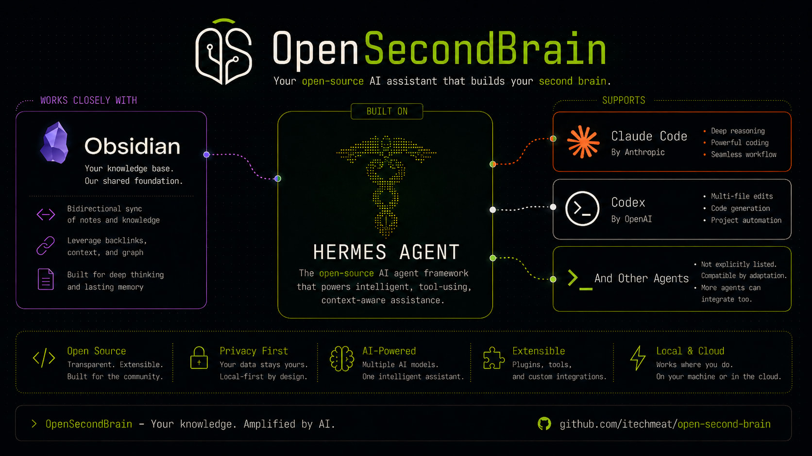
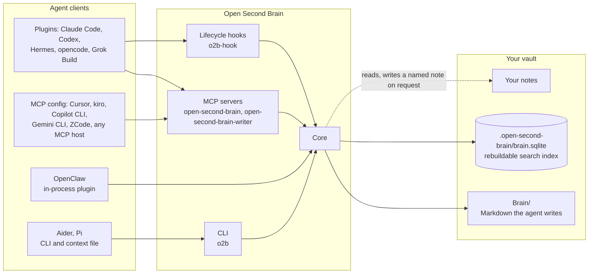
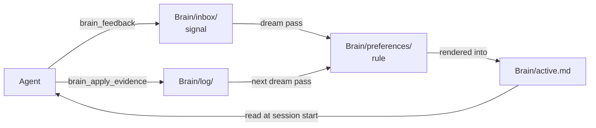

# Open Second Brain



Open Second Brain is a memory layer for AI agents that lives in an [Obsidian](https://obsidian.md) vault. Agents read and write it through MCP servers, lifecycle hooks and the `o2b` CLI. Everything the agent learns is a Markdown file under `Brain/`, so you can open, edit, grep and version it like any other note. A deterministic `dream` pass turns repeated signals into rules and retires the ones nothing uses; no model runs inside that algorithm.

## How it fits


```mermaid
flowchart LR
    subgraph Clients["Agent clients"]
        Plug["Plugins: Claude Code, Codex,<br/>Hermes, opencode, Grok Build"]
        Mcp["MCP config: Cursor, kiro, Copilot CLI,<br/>Gemini CLI, ZCode, any MCP host"]
        Claw["OpenClaw<br/>in-process plugin"]
        Cliu["Aider, Pi<br/>CLI and context file"]
    end
    subgraph Product["Open Second Brain"]
        Srv["MCP servers<br/>open-second-brain, open-second-brain-writer"]
        Hooks["Lifecycle hooks<br/>o2b-hook"]
        Cli["CLI<br/>o2b"]
        Core["Core"]
    end
    subgraph Vault["Your vault"]
        Brain["Brain/<br/>Markdown the agent writes"]
        Notes["Your notes"]
        Index[(".open-second-brain/brain.sqlite<br/>rebuildable search index")]
    end
    Plug --> Srv
    Plug --> Hooks
    Mcp --> Srv
    Claw --> Core
    Cliu --> Cli
    Srv --> Core
    Hooks --> Core
    Cli --> Core
    Core --> Brain
    Core --> Index
    Core -. reads, writes a named note on request .-> Notes
```

Each client reaches the same core through a plugin, an MCP registration or the CLI. The core keeps its own records under `Brain/` and a generated search index under `.open-second-brain/` that it can rebuild from the files. Your notes are read; the note tools write one only at a path the caller names.


```mermaid
flowchart LR
    Agent["Agent"] -->|brain_feedback| Inbox["Brain/inbox/<br/>signal"]
    Inbox -->|dream pass| Pref["Brain/preferences/<br/>rule"]
    Pref -->|rendered into| Active["Brain/active.md"]
    Active -->|read at session start| Agent
    Agent -->|brain_apply_evidence| Log["Brain/log/"]
    Log -->|next dream pass| Pref
```

The learning loop: signals become rules, rules reach the next session through `Brain/active.md`, and applied or violated evidence confirms, quarantines or retires them. Details: [`docs/how-it-works.md`](docs/how-it-works.md#a-preferences-lifecycle).

## Install

1. Install [Bun](https://bun.sh/) 1.1 or later: [`install/prerequisites.md`](install/prerequisites.md).
2. Install the plugin for your client (guides below), or get the `o2b` CLI: [`install/prerequisites.md`](install/prerequisites.md#get-the-o2b-cli).
3. Create the vault files:

   ```bash
   o2b init       --vault /path/to/vault --name "My Second Brain"
   o2b brain init --vault /path/to/vault
   ```

4. Connect the client (table below), then check the result:

   ```bash
   o2b doctor --vault /path/to/vault
   o2b install --check
   ```

The full router with readiness criteria is [`install.md`](install.md); native Windows is covered in [`install/windows.md`](install/windows.md).

## Supported clients

| Client | Integration | Guide |
| --- | --- | --- |
| Claude Code | Marketplace plugin: MCP servers and hooks | [`install/claudecode.md`](install/claudecode.md) |
| OpenAI Codex | Marketplace plugin, then `o2b install --target codex --apply` | [`install/codex.md`](install/codex.md) |
| Hermes Agent | Plugin and memory provider | [`install/hermes.md`](install/hermes.md) |
| OpenClaw | Native plugin, no MCP | [`install/openclaw.md`](install/openclaw.md) |
| opencode | `o2b install --target opencode --apply`: MCP servers and a native plugin | [`install/opencode.md`](install/opencode.md) |
| Grok Build | `o2b install --target grok --apply`: MCP servers and hooks | [`install/grok.md`](install/grok.md) |
| Cursor | `o2b install --target cursor --apply` | [`install/cursor.md`](install/cursor.md) |
| kiro | `o2b install --target kiro --apply` | [`install/kiro.md`](install/kiro.md) |
| GitHub Copilot CLI | `o2b install --target copilot-cli --apply` | [`install/copilot-cli.md`](install/copilot-cli.md) |
| Gemini CLI | `o2b install --target gemini-cli --apply` | [`install/gemini-cli.md`](install/gemini-cli.md) |
| ZCode | MCP servers added to its config by hand | [`install/zcode.md`](install/zcode.md) |
| Aider | `o2b install --target aider --apply`: context file, no MCP | [`install/aider.md`](install/aider.md) |
| Pi | `o2b install --target pi --apply`: skill over the CLI | [`install/pi.md`](install/pi.md) |
| Any other MCP host | `o2b install --target generic --apply --out -` prints the server entries | [`install/generic.md`](install/generic.md) |

`o2b uninstall --target <name> --apply` removes what `o2b install` wrote; the vault is never touched ([`install.md`](install.md#uninstall)).

## Capabilities

- **Preferences that learn and expire.** Signals, a deterministic dream pass, confidence and retirement: [how it works](docs/how-it-works.md#a-preferences-lifecycle).
- **Reversible changes.** Brain mutations take a snapshot first; `o2b brain rollback` restores it: [snapshots](docs/how-it-works.md#snapshots-and-rollback).
- **Attributed writes.** `o2b brain writes` lists every note write by agent and device, `writes revert` plans a restore, `o2b brain freeze` stops all writers, and `o2b brain log verify` checks the hash-chained log: [Brain CLI](docs/cli-reference.md#brain-observing-memory).
- **Search.** Keyword search with an optional semantic lane, result explanations, recall profiles and compact cards: [search CLI](docs/cli-reference.md#search), [ranking](docs/how-it-works.md#full-text-search).
- **Session recall.** Import agent transcripts already on disk and search them: [session logs](docs/cli-reference.md#session-logs-this-machine-already-has-since-v1500).
- **Hygiene.** `o2b brain hygiene scan` finds contested, duplicate, stale and unused memories; `apply` runs only the findings you pick: [maintenance](docs/cli-reference.md#maintenance-and-operator-surfaces).
- **Claim ledger.** `o2b brain truth ingest` records an entity claim with an optional validity window (`--valid-from`/`--valid-until`; with the flags absent, a window on the source record's frontmatter is adopted and frozen at ingest), `truth events` recalls a windowed slice of the ledger, and `truth state` grounds an agent-stated claim with an anchoring verdict - committed, or reported back with reason codes: [entity truth CLI](docs/cli-reference.md#entity-truth-and-self-improving-dream-since-v0430).
- **Corrections.** `o2b brain lifecycle correct <target>` reports a correction's blast radius and retires the affected records - validity-closed by default, tombstoned with `--flatly-wrong`, dry run by default and `--apply` to write. A retired record that recall can still serve is served only beside its correction, never alone: [belief lifecycle CLI](docs/cli-reference.md#belief-lifecycle-and-decision-memory-since-v1330).
- **Sharing and backup.** Knowledge packs export a chosen subset; `o2b brain bank-export` writes a one-file backup bundle: [knowledge packs](docs/cli-reference.md#knowledge-packs).
- **Secret custody.** Credentials live encrypted in the vault's state dir behind a capability-gated store; `$secret:NAME` references resolve at the use sites, `o2b brain secret unlock` wraps the keyfile under a passphrase, and `secret export`/`import` move the store between installs as one passphrase-encrypted bundle: [custody CLI](docs/cli-reference.md#write-time-integrity-and-governance-since-v0440).
- **Today view and note markers.** `o2b brain today`, `@osb loop` and `@osb set` markers: [Brain CLI](docs/cli-reference.md#brain-observing-memory).
- **Self-inspection.** `o2b version`, `o2b install --friction` and `o2b state status` report what is installed and where state lives: [CLI reference](docs/cli-reference.md#core).
- **MCP surface.** Tools, tool profiles for hosts with tool limits, and the always-loaded writer server: [`docs/mcp.md`](docs/mcp.md).

## Optional features

- **Semantic search:** an embedding provider plus `sqlite-vec`; the `embeddings-setup` skill walks through it: [`skills/embeddings-setup/SKILL.md`](skills/embeddings-setup/SKILL.md).
- **Decision models:** a typed judgment model that can rerank search and filter candidates, off by default per use: [`docs/decision-models.md`](docs/decision-models.md).
- **Deep relational recall:** a fourth search arm over typed links, off by default. Its traversal runs under width budgets - 8 seeds, 4 edges per node, 16 nodes in total, and a hub above 12 walked edges is reached but not expanded - each overridable through an `OPEN_SECOND_BRAIN_SEARCH_TRAVERSAL_*` environment variable or a `search_traversal_*` config key; entity co-occurrence bridges join the walk by default and switch off separately (`OPEN_SECOND_BRAIN_SEARCH_ENTITY_BRIDGES`): [retrieval quality](docs/cli-reference.md#retrieval-quality-and-context-delivery-since-v1370).

## What is new

1.78.0 puts credential custody under an operator passphrase. The secrets keyfile wraps into a scrypt envelope behind `o2b brain secret unlock`/`lock`, `$secret:NAME` references resolve through the custody store at the embedding, decision-model, research, Telegram and installation-secret use sites, and `secret export`/`import` move the store between installs as one passphrase-encrypted bundle. Resolved credential literals are redacted at the error and config-mapping boundaries, composed tags must parse as Obsidian tags, a declared page vocabulary gates capture writes, import and upgrade plans carry an approval digest that apply must match, and a changed extraction contract reprocesses the sources it covers. Every release is described in the [CHANGELOG](CHANGELOG.md).

## Documentation

| Topic | Page |
| --- | --- |
| Mental model, vault layout, dream pass, safety properties | [`docs/how-it-works.md`](docs/how-it-works.md) |
| Every CLI verb and flag | [`docs/cli-reference.md`](docs/cli-reference.md) |
| MCP protocol, tools, writer split | [`docs/mcp.md`](docs/mcp.md) |
| Architecture and configuration model | [`docs/architecture.md`](docs/architecture.md) |
| Updating (`o2b update`) and upgrade notes | [`docs/updating.md`](docs/updating.md) |
| Observability events | [`docs/observability.md`](docs/observability.md) |
| Metrics data contract | [`docs/metrics.md`](docs/metrics.md) |
| Cross-project pointer | [`docs/cross-project-pointer.md`](docs/cross-project-pointer.md) |
| Scheduled Brain digest (Hermes cron) | [`docs/hermes-cron.md`](docs/hermes-cron.md) |
| Stability policy | [`docs/stability.md`](docs/stability.md) |
| Origin of the idea | [`docs/idea.md`](docs/idea.md) |

## Project

[CHANGELOG](CHANGELOG.md) · [Security policy](SECURITY.md) · [Source on GitHub](https://github.com/itechmeat/open-second-brain) · [MIT License](LICENSE)
