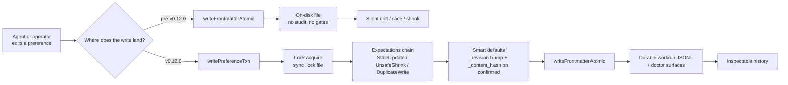

## Summary

Adds the **Brain Integrity Suite** to the Open Second Brain preference write path: every confirmed preference now carries a content hash, every dream write goes through a typed-collision chokepoint, and every dream invocation leaves a durable on-disk workrun. The destructive-from-confirmed retire gate and the read-only `brain_review_candidates` MCP tool round out the bundle. Eight atomic features, one cohesive PR.

## Why this matters

The pre-v0.12.0 write path could not tell a legitimate edit apart from a write race or a silent shrink; the v0.12.0 path surfaces every category as a typed error or a doctor warning.

## Concrete benefits

- **Drift becomes observable.** Hand-edits to a confirmed preference produce a `content-hash-drift` warning in `brain_doctor` instead of going silent.
- **Crash forensics.** A dream pass killed mid-execution leaves a `dream-runs/<run-id>.jsonl` with phases up to the killpoint. The next pass scans for dangling workruns and surfaces them.
- **Destructive-proof retires.** When `retire.confirmed_evidence_min_threshold` is set, the dream pass refuses to retire a confirmed (unpinned) preference whose accumulated evidence is below the floor. Skipped retires surface in `DreamRunSummary.gated_retires`.
- **Pre-flight visibility.** `brain_review_candidates` lets an agent or operator ask "what would the next dream pass do?" without touching disk.
- **Single chokepoint for future gates.** New collision modes plug into `writePreferenceTxn` as expectation functions; no parallel patches across `preference.ts` and `dream.ts`.

## What ships

| Module | Role |
|---|---|
| `src/core/brain/sync-lockfile.ts` | Single-attempt sync exclusive-create primitive. EEXIST -> `Error.code = 'ELOCKED'`. |
| `src/core/brain/preference-txn.ts` | `writePreferenceTxn` chokepoint, `BrainCollisionError` with four typed `kind` discriminants, three expectation factories. |
| `src/core/brain/content-hash.ts` | `computeContentHash` and `verifyContentHash` over the canonical trimmed `(principle, scope)` pair. |
| `src/core/brain/dream-workrun.ts` | JSONL workrun writer + scanner. Recovery is non-resuming; the doctor surfaces dangling files. |
| `src/core/brain/review-candidates.ts` | Read-only projection over `dream({ dryRun: true })`. |
| `src/core/brain/dream.ts` | Promotion + refresh writes routed through the txn; destructive-from-confirmed retire gate wired into the retires loop. |
| `src/core/brain/doctor.ts` | New checks: `content-hash-drift` and `dangling-workrun`. |
| `src/mcp/brain-tools.ts` + `instructions.ts` | New MCP tool `brain_review_candidates`. |

## Test plan

- [x] `bun test` - 2379 pass / 0 fail / 5937 expects across the full suite (including 64 new tests across 11 new test files).
- [x] `bun run typecheck` - clean.
- [x] `bun run sync-version:check` - canonical 0.12.0 across seven manifests.
- [x] Integration coverage: a fresh dream pass that promotes an unconfirmed pref to confirmed writes `_content_hash` matching the canonical hash on disk (`tests/core/brain/dream-content-hash-promotion.test.ts`).
- [x] Idempotency invariant: a second dream pass on the same vault state produces byte-identical preference files (`tests/core/brain.dream.test.ts:512`).
- [x] Starter bundle no-op: `dream` on the curated starter at a fixed `--now` returns `changed: false` (`tests/core/brain/starter.test.ts:158`).
- [x] Doctor drift: writing a confirmed pref with a stale `_content_hash` surfaces exactly one `content-hash-drift` warning (`tests/core/brain/doctor-drift.test.ts`).
- [x] Workrun lifecycle: phases recorded in order, dry-run skips emission, `scanDanglingWorkruns` returns paths of unfinalised files (`tests/core/brain/dream-workrun.test.ts`).
- [x] Destructive-gate pure decision: nine branches of `shouldGateRetireFromConfirmed` covered (`tests/core/brain/dream-destructive-gate.test.ts`).
- [x] MCP wiring: `brain_review_candidates` registered in `BRAIN_TOOLS`, returns six fields all empty on a fresh vault (`tests/mcp/brain-review-candidates.test.ts`). Tool count 31 -> 32.

## Design and decision trail

- `docs/brainstorm/brain-integrity-suite/design.md` - the chosen approach and rejected alternatives.
- `docs/brainstorm/brain-integrity-suite/plan.md` - the per-task implementation plan.
- `docs/brainstorm/brain-integrity-suite/variants.md` - audit trail of the three architectural variants the consultant produced.

## Notes

- Default-off rollout for the destructive-from-confirmed gate (`retire.confirmed_evidence_min_threshold`) keeps every pre-v0.12.0 dream behaviour byte-identical until the operator opts in via `Brain/_brain.yaml`.
- `proper-lockfile` remains a runtime dep for Pay Memory; the brain write path uses its own sync primitive to avoid migrating every caller signature to async. Decision rationale captured in the design doc.
- The `drift-detected` log event kind was planned but is not emitted in v0.12.0; the doctor warning is the surface. The enum entry is intentionally absent rather than promised-and-unmet.
