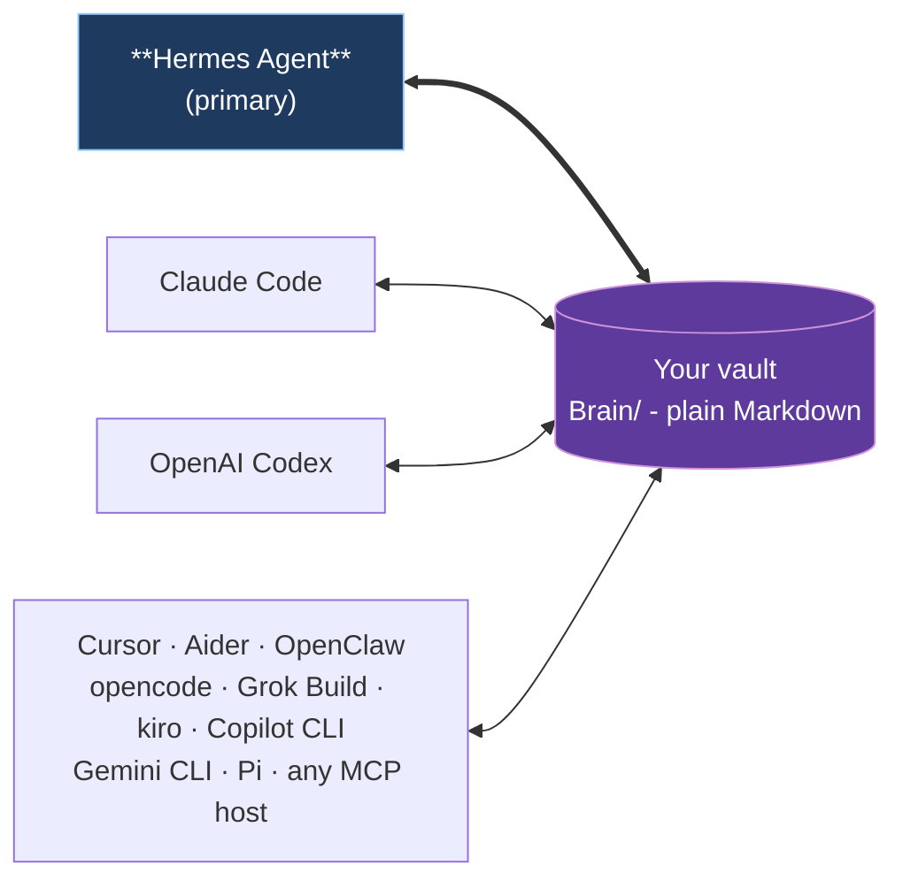

You are consulting on Open Second Brain, a TypeScript/Bun project that provides an Obsidian-native memory layer for Hermes Agent and other MCP hosts.

Return exactly 3 distinct architectural variants for the release scope below. For each variant use this exact shape:

## Variant N: <name>
Approach: 2-3 sentences.
Trade-offs:
- ...
- ...
Complexity: small|medium|large
Risk: low|medium|high

After the three variants, return exactly one recommendation section:

## Recommended: Variant N
Rationale: 2-4 sentences.

Do not include code. Do not include sections outside the variants and recommendation.

# Release scope
Chosen scope: CodeGraph and MCP operational readability
Slug: codegraph-mcp-operational-readability
Branch: feat/codegraph-mcp-operational-readability
In-scope task ids: t_a1e76788, t_a286135c

# In-scope card bodies

## t_a1e76788
id:       t_a1e76788
title:    [upstream:graphify] Cargo workspace dependency extraction for Rust projects
status:   triage   priority: 1   assignee: -
----- body -----
**Source**: https://github.com/safishamsi/graphify/releases/tag/v0.8.38
**Repo**: safishamsi/graphify (44200★)
**Released**: v0.8.38 (2026-06-11T22:54:39Z)

## What
Graphify v0.8.38 adds Cargo workspace dependency extraction: `graphify extract ./my-workspace --cargo` maps Rust workspace crates and internal `crate_depends_on` edges. This enables analysis of Rust workspace structures with crate-level dependency graphs.

## Why useful for OSB
OSB integrates with Graphify via the codegraph partner module (src/core/partner/codegraph.ts) but the integration focuses on general code graphs. Adding support for Graphify's `--cargo` flag would let OSB operators analyze Rust workspace dependencies as first-class graph structures — crate dependencies, internal crate_depends_on edges, and workspace membership. This complements the existing language support in Graphify.

## Status in OSB
- **Verdict**: not_in_osb_useful
- **Codegraph hints**: src/core/partner/codegraph.ts detects CodeGraph presence/status but has no `--cargo` flag support or Rust workspace-specific extraction logic; no crate_depends_on edge type in OSB's graph schema

## Notes
Could extend the codegraph integration to pass `--cargo` when a Cargo workspace is detected, and map the resulting crate_depends_on edges into OSB's graph. The feature is opt-in via CLI flag.
----- last comments -----
[osb-triage-validator] osb-triage-validator @ 2026-06-13T10:33Z:
- sanity: clean
- cluster: leave: graphify codegraph-partner cluster with t_6c9f4434 - separate backends.
- priority: set to 1: value depends on external fact


## t_a286135c
id:       t_a286135c
title:    [upstream:graphify] Multi-batch community labeling for large graphs
status:   triage   priority: 1   assignee: -
----- body -----
**Source**: https://github.com/safishamsi/graphify/releases/tag/v0.8.36
**Repo**: safishamsi/graphify (44200★)
**Released**: v0.8.36 (2026-06-08T22:58:46Z)

## What
Graphify v0.8.36 added multi-batch community labeling: `label_communities` now chunks in groups of 100 (configurable `batch_size=`) for 16k-context models; partial batch failures no longer drop the whole pass.

## Why useful for OSB
OSB's community detection (src/core/brain/link-graph/communities.ts:74 detectCommunities) processes all nodes in memory with no batching. For large vaults with many notes, this could exceed context limits when using LLM-based labeling. Multi-batch processing with configurable batch size and partial failure resilience would make community labeling scalable and robust.

## Status in OSB
- **Verdict**: not_in_osb_useful
- **Codegraph hints**: src/core/brain/link-graph/communities.ts:74 detectCommunities (no batching, processes all nodes in memory); src/core/brain/link-graph/communities.ts:226 renderClusterNote (generates cluster notes); no batch_size parameter or partial failure handling

## Notes
Graphify's approach: chunk communities into groups of 100, process each batch independently, continue on partial failures. Configurable batch_size for different context windows. Could be adapted for OSB's LLM-based community labeling (if added).

---

## Phase 0 implementation plan pointer

Follow `docs/brainstorm/codegraph-readability-mcp-operations/plan.md`, section `t_a286135c - [upstream:graphify] Multi-batch community labeling for large graphs`, on branch `feat/codegraph-readability-mcp-operations`. Implement under TDD: write/adjust the focused failing test first, then make it pass, then refactor.

## Overall release scope

This card ships as part of the single release scope "CodeGraph readability and MCP operations" on shared branch `feat/codegraph-readability-mcp-operations`.

In-scope cards:

- `t_85252236` - [upstream:graphify] Offline code-only extraction without API keys
- `t_a286135c` - [upstream:graphify] Multi-batch community labeling for large graphs

Combined design: `docs/brainstorm/codegraph-readability-mcp-operations/design.md`.

The cards are driven one at a time on the shared branch. Before editing, inspect the current branch commits and build on any previously-driven in-scope card commits. Do not duplicate sibling work and do not introduce conflicting abstractions; update shared docs/changelog sections in place if a sibling already touched them.
----- last comments -----
[osb-triage-validator] osb-triage-validator @ 2026-06-09T14:26Z:
- sanity: clean
- cluster: no cluster
- priority: set to 1: not_in_osb_useful, multi-batch labeling presupposes LLM-based community labeling that OSB communit


# Project/runtime
- package: open-second-brain 1.11.0
- runtime/language: Bun + TypeScript ESM
- test/lint/typecheck scripts: bun run test, bun run lint, bun run typecheck, bun run validate
- public docs prefer full product name "Open Second Brain" rather than abbreviation.
- Engineering rules: SOLID, KISS, DRY; no misleading fallbacks; no hardcoding; English-only artifacts; language-agnostic behavior where natural-language processing would otherwise be tempting.

# Recent git log
c2c3ff4 feat: Session Knowledge Synthesis Suite - structured session summaries, idea-lineage, episodic note history (v1.11.0) (#100)
56dd3dd fix(hermes): bridge EOF - byte streams, stderr drain, retry loop (#92)
35b824e feat: Recall & Working-Memory Quality Suite - selectable profiles, usage decay, co-occurrence, file-context (v1.10.0) (#99)
929d54c feat: Brain Portability & Interop Suite - bank export/import, page contract, brain_create_note, in-process SDK (v1.9.0) (#98)
7cdbfc0 feat: Indexer Durability & Resilience Suite - cooperative abort, graceful watch shutdown, resumable reindex (v1.8.0) (#97)
8b679fe feat: Knowledge Provenance Suite - ingest, research, NER, derived facts, owner-scope, standing-query (v1.7.0) (#96)
6e59a42 feat: Vault Integrity & Trust Suite - untrusted-source containment, NFC identity, watch-sync, O(1) graph, agent-scope (v1.6.0) (#95)
70d95c6 chore(release): bump version to 1.5.0 (#94)
e4df212 feat: Search & Recall Quality Suite - explainable scores, trust, threshold, reinforce, eval (#93)
2e74afe feat: native Grok Build CLI integration - bundled plugin, hooks, session import (v1.4.0) (#91)
3e7e233 fix(hermes): serialize handle_tool_call result to a string (v1.3.1) (#90)
2abc90b fix(changelog): the opencode integration ships in v1.3.0, not a phantom 1.4.0 (#89)
96f1ff4 feat: native opencode integration - config-correct install, bundled plugin, session capture (#88)
0340560 feat: Continuity, Hygiene & Freshness Suite - session lineage, memory hygiene, anticipatory cache (v1.3.0) (#87)
8972f13 refactor: SOLID/DRY decomposition - domain modules, unified helpers, surface guards (v1.2.0) (#86)
6651228 refactor: language-agnostic fact extraction + README slim (v1.1.0) (#85)
9886d9a refactor: make search and classification language-agnostic (#84)
618870e refactor!: remove the pay.sh integration and the Pay Memory layer (#83)
72bac52 fix(hermes): advertise static tool schemas so the provider registers with its full tool set (#81)
ff43abd fix(ci): treat an existing release as success in the release workflow (#80)


# README summary excerpt
# Open Second Brain


> An [Obsidian](https://obsidian.md)-native memory layer for your AI agent. Plain Markdown you own, in the same vault you already use.

Open Second Brain plugs into [Hermes Agent](https://github.com/NousResearch/hermes-agent) and turns your Obsidian vault into a memory layer the agent reads and writes through deterministic CLI / MCP tools. Preferences, signals, evidence, and audit trails are real `.md` files under `Brain/` in the vault you already open in Obsidian every day. You can grep them, version them with git, search them in Obsidian, edit them by hand. No daemon, no vector black box, no hidden state outside the vault.

## Why

- **Lives in your Obsidian vault.** Open `Brain/preferences/pref-no-internal-abbrev.md` in Obsidian and you literally see what your agent learned about you - title, status, evidence count, confidence band, body text. Wikilinks, backlinks, graph view all work.
- **You own the data.** Plain Markdown on your filesystem. No service to cancel, no cloud account, no schema migration when a vendor pivots. Syncthing to your other machines if you want.
- **Memory that learns deterministically.** A `dream` pass turns repeat signals into rules and retires the ones nothing applies any more. Counters and atomic file moves - no LLM inside the algorithm, no surprise hallucinations in your memory.
- **One vault, every agent.** Hermes Agent is the primary integration. Claude Code, OpenAI Codex, Cursor, Aider, OpenClaw, opencode, Grok Build, kiro, Copilot CLI, Gemini CLI, and Pi all plug into the same Brain through MCP.

## One vault, many runtimes



Hermes Agent owns the schedule (dream cron, daily digests, Telegram delivery). Other runtimes participate as readers and writers of the same Brain through MCP - no per-runtime fork of the memory.

## Quick start with Hermes Agent

**The simplest path - let your agent set it up.** Paste this into Hermes (or whichever AI agent already has shell access on the target machine):

> Install Open Second Brain for me by following the steps at <https://github.com/itechmeat/open-second-brain/blob/main/install/hermes.md>. My vault is at `/path/to/your-vault`.

The agent reads the install doc, runs every command, and verifies the result. That's it.

If you prefer running the steps yourself:

```bash
# 1. Install the plugin
hermes plugins install itechmeat/open-second-brain --enable
hermes gateway restart

# 2. Put `o2b` on PATH
~/.hermes/plugins/open-second-brain/scripts/o2b install-cli

# 3. Bootstrap the vault
o2b init       --vault /path/to/your-vault --name "My Second Brain"
o2b brain init --vault /path/to/your-vault --primary-agent <agent-name>

# 4. Verify
o2b doctor --vault /path/to/your-vault
```

Enable Open Second Brain as the memory provider in `~/.hermes/config.yaml` (`memory.provider: open-second-brain`) and restart the gateway one more time - the agent now injects `Brain/active.md` into its system prompt, recalls context before each turn, and writes signals through `brain_feedback`, all through the one native provider. Full step-by-step: [`install/hermes.md`](install/hermes.md).

## Other runtimes

| Runtime                                                          | Install                                                                                             |
| ---------------------------------------------------------------- | --------------------------------------------------------------------------------------------------- |
| Claude Code                                                      | Marketplace plugin (bundled `.mcp.json` + hooks) - [`install/claudecode.md`](install/claudecode.md) |
| OpenAI Codex                                                     | `codex plugin marketplace add ...` - [`install/codex.md`](install/codex.md)                         |
| OpenClaw                                                         | Native JS plugin, no MCP needed - [`install/openclaw.md`](install/openclaw.md)                      |
| opencode                                                         | `o2b install --target opencode --apply` (MCP servers + native plugin) - [`install/opencode.md`](install/opencode.md) |
| Grok Build                                                       | `o2b install --target grok --apply` (MCP in `config.toml` + native hooks) - [`install/grok.md`](install/grok.md) |
| Cursor · Aider · kiro · Copilot CLI · Gemini CLI · Pi            | `o2b install --target <name> --apply` - see [`install/`](install/)                                  |
| Any other MCP host                                               | `o2b install --target generic --apply` - [`install/generic.md`](install/generic.md)                 |

Each non-Hermes target writes a sidecar manifest under `<vault>/.open-second-brain/install.lock.json` so `o2b uninstall --target <name> --apply` removes exactly what it added.

## What you get

- **Your memory as Markdown.** Every rule the agent learns about you is a file under `Brain/` you can open, edit, grep, and version. Obsidian wikilinks, backlinks, and the graph view just work - there is no separate UI to learn.
- **Memory that learns, and forgets, on its own.** A nightly `dream` pass turns repeated corrections into rules and retires the ones nothing uses any more. Deterministic by design: counters and atomic file moves, no LLM guessing inside your memory.
- **One brain, every agent.** Teach a rule in one agent and the next one already knows it - Hermes, Claude Code, Codex, Cursor, and the rest read and write the same vault.
- **You stay in control.** Pin, merge, retire, or roll back any rule from the `o2b` CLI. Every Brain mutation takes a verified snapshot first, so a bad change is one `o2b brain rollback` away.
- **Search that explains itself.** Keyword plus an optional semantic layer over your vault, with results that show why they surfaced and what was missing - not a black box. Opt into a structured per-result score breakdown (`explain`), inline trust metadata (age, superseded, conflict), a relevance threshold that returns nothing rather than weak noise, and reinforcement that lifts memories you have marked useful. Track retrieval quality over time with `brain_eval` and the recall benchmark (hit@k, MRR, answer-containment@k).
- **Conversations survive compaction.** When the host compresses context and rotates the session id, capture and recall stitch the segments back into one conversation - any segment id returns the whole lineage.
- **Memory that cleans itself, on your terms.** `o2b brain hygiene scan` surfaces contested facts, near-duplicate rules, stale derived pages, and never-recalled memories; `apply` executes only the findings you select, and stale pages recompile from their recorded sources with a dry-run preview.
- **A vault that stays fresh, consistent, and scoped.** `o2b search watch` keeps the index live as you edit, debounced and incremental; note identity is Unicode-normalized so the same file is one entry across macOS and Linux devices instead of a phantom cross-device duplicate; and recall accepts an opt-in `agent_scope` so a page marked with an `owner:` is reachable only to its owner while shared pages stay open to all.
- **Knowledge that knows where it came from.** Drop a source document and the agent's extraction becomes cross-referenced entity and concept pages plus a summary page that backlinks the source and lists its connections; N sources become one dated report whose every finding cites the source that flagged it; a derived fact carries a `deduced`/`inferred` provenance level and links back to its premises, and recall trusts an operator-stated rule above a machine-derived one. A fact can declare an `owner:` so multi-agent brains keep separate truth spaces, and a standing-query attention flow surfaces the open loops you declare. The plugin never runs a model itself - the agent owns generation, the vault owns the durable, provenanced record - and every behaviour is opt-in.
- **An index that survives interruption.** Stopping `o2b search watch` mid-sync finishes the in-flight pass at a file boundary before exiting (within `search_shutdown_grace_seconds`) instead of killing it mid-write; an incremental run is already resumable through the unchanged-file fastpath, and `search_resume_reindex` extends that to a full rebuild - an interrupted reindex resumes its staging build instead of starting over, guarded by a signature
[truncated]

# Top CHANGELOG entry excerpt
# Changelog

All notable changes to this project will be documented in this file.

The format is based on [Keep a Changelog](https://keepachangelog.com/en/1.1.0/),
and this project adheres to [Semantic Versioning](https://semver.org/spec/v2.0.0.html).

## [1.11.0] - 2026-06-14

### Added

- **Session Knowledge Synthesis Suite.** Three additive, deterministic,
  language-agnostic units that turn temporal activity into structured,
  queryable, provenance-traced knowledge. Every unit is a new surface; with no
  new surface in use, reads are byte-identical to before, and the kernel never
  calls an LLM (agent-extracted data is stored verbatim; everything else is a
  pure read).
  - **Structured session summary (`o2b brain session-summary`,
    `brain_session_summary`).** A session-scoped digest over four canonical
    categories - request, decisions, learnings, next_steps - stored as one
    append-only continuity record (`session_summary_digest`), distinct from the
    `session_summary_node` recall rollup and the per-line `pre_compact_extract`.
    The agent supplies the already-extracted categories; the kernel validates,
    dedupes by content hash, and appends, never parsing prose into categories.
    An all-empty digest is rejected; absent a write, reads return null.
  - **Idea-lineage provenance tracer (`o2b brain idea-lineage`,
    `brain_idea_lineage`).** A read-only tracer reconstructing how a derived
    artifact was reached as an observation -> synthesis -> conclusion graph. A
    continuity id walks the `sourceRefs` graph (raw turns are observations,
    summaries/extracts/digests synthesis, the queried record the conclusion),
    resolving edges by record id or turn id, cycle-guarded and depth-bounded; a
    preference id adapts the existing `buildBeliefEvolution` lifecycle into the
    same shape. Unknown ids fail with a typed error rather than a silent empty
    chain.
  - **Episodic note-history decomposition (`o2b brain note-history`,
    `brain_note_history`).** Splits a note's git commit chain into recallable
    episodic phases on a deterministic commit-time gap (default 72h) - a
    language-agnostic rule that never depends on commit-message wording. Each
    phase carries the commit subjects, dates, and authors. A missing repo
    reports `available: false` (no fabricated phase); a path with no commits
    reports `available: true` with zero phases (empty is distinct from broken).
    The sanitized read-only git reader gains an additive `path` pathspec filter.

## [1.10.0] - 2026-06-14

### Added

- **Recall & Working-Memory Quality Suite.** Four additive, deterministic,
  language-agnostic units on top of the mature search/recall subsystem. Every
  unit is flag- or surface-gated; with no profile, flag, or new surface in use,
  search and continuity reads are byte-identical to before.
  - **Selectable recall profiles (`o2b search --profile`, `brain_search`
    `profile` field).** Named presets `fast | balanced | thorough` expand to a
    fixed knob tuple over the same bounded axes the self-tuning grid ranges over
    (candidate pool, traversal depth, learned weights, query expansion) and are
    applied through the same `applyTunedParameters` machinery, so a profile and
    a learned grid point stay coherent. An explicitly selected profile takes
    precedence over a persisted self-tuning grid point; an unknown profile name
    fails loud with a typed `SearchError`. No profile selected leaves ranking on
    the existing config path, bit-for-bit.
  - **Usage-driven working-memory decay (`o2b brain continuity rank`).**
    Continuity records are append-only and immutable, so decay is a pure
    read-side weight in `(0, 1]`, never a mutation. `decayWeight` combines
    record age (exponential half-life) with a usage signal derived only from
    existing `recall_telemetry` surfaced-artifact references; a record whose
    sources were never surfaced - such as a session-scoped `pre_compact_extract`
    decision - has no usage and decays by age alone, with no fabricated coupling.
    `rank` lists working-memory records freshest and most-recalled first.
  - **Language-agnostic co-occurrence auto-relate (`o2b brain co-occurrence`).**
    Entities repeatedly co-referenced from the same notes are scored with a
    structural PMI / document-frequency metric over the wikilink graph - link
    incidence only, no natural-language word list in any language, so a
    non-Latin vault scores identically for the same structure. Output is a
    derived, schema-versioned, hashed suggestion artifact (re-validated on read,
    fail-soft); notes are never mutated and an already directly-linked pair is
    never re-suggested. `--write` persists `Brain/link-graph/co-occurrence.json`.
  - **File-context recall (`o2b brain file-context`, `brain_file_context` MCP
    tool).** Given a file path, surface prior vault work that mentions it by
    querying the existing index with terms derived structurally from the path
    (basename + stem, no natural-language processing, no LLM). A size gate skips
    trivial files (default 1500 bytes) and returns an explicit reason rather
    than a fabricated empty hit.

## [1.9.0] - 2026-06-14

### Added

- **Brain Portability & Interop Suite.** Brain content becomes portable in and
  out of a vault, with provenance, and programmatically writable - composing the
  existing portability helpers rather than adding a new subsystem. Every unit is
  an additive new surface; no existing exporter, importer, CLI verb, or MCP tool
  changes behaviour.
  - **Whole-vault bank export/import (`o2b brain bank-export` / `bank-import`).**
    `exportBankBundle` composes the existing exporters - preferences, the page
    link-graph, the page interchange contract, and the read-only sources
    dashboard - into one deterministic, schema-versioned envelope for backup,
    cross-instance migration, or downstream-tool ingest. `importBankBundle`
    reconstructs the part that round-trips (the page graph, delegated to
    `importVaultGraph` under a conflict mode) and reports preferences, page
    contracts, and the sources dashboard as carried-not-restored - no silent
    partial restore. An unsupported bundle schema fails loudly with a typed
    `BankImportError`.
  - **Page interchange contract (`projectPageContracts`).** A pure, read-only
    projection of every user vault page to a stable, schema-versioned record
    (`path`, `kind`, advisory `confidence`/`provenance`, flattened `citations`,
    `aliases`, `freshness`) a downstream importer can consume without knowing
    Open Second Brain internals. Derivation is structural only (frontmatter
    fields, body wikilinks, typed-relation targets, file mtime); an absent
    advisory field is reported as `null`, never synthesised.
  - **`brain_create_note` MCP tool.** Writes an actual vault note file (path +
    frontmatter + content) atomically through `ensureInsideVault` - distinct
    from `brain_note`, which only appends a log line. Refuses path traversal, the
    Brain machinery root, vault-scope-excluded paths, and overwriting an existing
    note, each with a typed error mapped to INVALID_PARAMS.
  - **In-process SDK (`createBrain(vault)`).** A thin façade over the existing
    core functions - bank export/import, graph export/import, preference export,
    `ingestSource`, and `createNote` - plus source-backed reads
    (`listSources`/`getSource`/`deleteSource`) over the `kind: brain-source`
    summary pages. Every method is a one-line delegation; the upstream
    `writeStatus` maps to `ingestSource` (Open Second Brain has no separate
    source status lifecycle). A source id that resolves outside `Brain/sources`
    is treated as not-found and never deleted.

## [1.8.0] - 2026-06-13

### Added

- **Indexer Durability & Resilience Suite.** Interrupting a long index run no
  longer risks losing work or wedging the index. The suite makes cancellation
  cooperative, the watcher shutdown graceful, a
[truncated]

# Related files and observations

## src/core/partner/codegraph.ts
Current optional partner doctor integration detects code project roots, checks for codegraph CLI, checks .codegraph presence, and runs `codegraph status -j <projectPath>`. It never installs or mutates codegraph and skips silently if the CLI is absent.
/**
 * Partner integration with codegraph (https://github.com/colbymchenry/codegraph).
 *
 * OSB never installs, initializes, or writes data for codegraph. This
 * module only detects presence and reports back through the standard
 * doctor `CheckResult` shape so agents (and humans) know whether the
 * partner tool is available, indexed, or missing in the current scope.
 *
 * Detection scope is intentionally narrow: the current working directory
 * plus the top-level siblings of the vault's parent (where users often
 * keep their code projects next to the vault) plus any explicit extras
 * from config. No deep filesystem walk.
 */

import { existsSync, readdirSync, statSync } from "node:fs";
import { dirname, join, resolve } from "node:path";

import type { CheckResult } from "../types.ts";

const CODE_MANIFESTS: ReadonlyArray<string> = [
  "package.json",
  "pyproject.toml",
  "Cargo.toml",
  "go.mod",
  "tsconfig.json",
  "Gemfile",
  "composer.json",
  "build.gradle",
  "pom.xml",
];

const DEFAULT_LIMIT = 50;

function isDir(path: string): boolean {
  try {
    return statSync(path).isDirectory();
  } catch {
    return false;
  }
}

/**
 * Heuristic check: does `dir` look like a code project root?
 * Requires BOTH a `.git/` directory AND at least one recognised
 * manifest file (the two-signal rule rejects a stray `package.json`
 * inside a notes folder).
 */
export function isCodeProject(dir: string): boolean {
  try {
    if (!existsSync(dir)) return false;
    if (!isDir(join(dir, ".git"))) return false;
    return CODE_MANIFESTS.some((m) => existsSync(join(dir, m)));
  } catch {
    return false;
  }
}

export interface FindCodeProjectsOptions {
  readonly cwd: string;
  readonly vault: string;
  readonly scanExtraPaths?: ReadonlyArray<string>;
  readonly limit?: number;
}

/**
 * Walk the candidate scope (cwd + top-level siblings of `dirname(vault)`
 * + explicit extras) and return every path that passes `isCodeProject`.
 * The scan is bounded at `limit` inspected directories (default 50)
 * so a huge vault parent cannot slow doctor down.
 */
export function findCodeProjects(opts: FindCodeProjectsOptions): string[] {
  const limit = opts.limit ?? DEFAULT_LIMIT;
  const seen = new Set<string>();
  const found: string[] = [];
  let scanned = 0;

  const consider = (raw: string): void => {
    if (scanned >= limit) return;
    const path = resolve(raw);
    if (seen.has(path)) return;
    seen.add(path);
    if (!isDir(path)) return;
    scanned += 1;
    if (isCodeProject(path)) found.push(path);
  };

  consider(opts.cwd);

  const vaultParent = dirname(resolve(opts.vault));
  if (isDir(vaultParent)) {
    let entries: string[] = [];
    try {
      entries = readdirSync(vaultParent);
    } catch {
      entries = [];
    }
    entries.sort((a, b) => a.localeCompare(b));
    for (const name of entries) {
      if (scanned >= limit) break;
      consider(join(vaultParent, name));
    }
  }

  for (const extra of opts.scanExtraPaths ?? []) {
    if (scanned >= limit) break;
    consider(extra);
  }

  return found;
}

export interface CodegraphStatusData {
  readonly initialized: boolean;
  readonly nodeCount?: number;
  readonly fileCount?: number;
  readonly edgeCount?: number;
}

export type CodegraphStatusResult =
  | { readonly ok: true; readonly data: CodegraphStatusData }
  | { readonly ok: false; readonly error: string };

export interface CodegraphCheckDeps {
  readonly whichCodegraph?: () => string | null;
  readonly runStatusJson?: (projectPath: string) => CodegraphStatusResult;
}

export interface CodegraphCheckOptions {
  readonly cwd: string;
  readonly vault: string;
  readonly scanExtraPaths?: ReadonlyArray<string>;
  readonly limit?: number;
  readonly disabled?: boolean;
}

function defaultWhichCodegraph(): string | null {
  if (typeof Bun !== "undefined" && typeof (Bun as { which?: unknown }).which === "function") {
    const found = (Bun as unknown as { which: (cmd: string) => string | null }).which("codegraph");
    return found ?? null;
  }
  return null;
}

function defaultRunStatusJson(projectPath: string): CodegraphStatusResult {
  try {
    const proc = Bun.spawnSync({
      cmd: ["codegraph", "status", "-j", projectPath],
      stdout: "pipe",
      stderr: "pipe",
    });
    const stdout = new TextDecoder().decode(proc.stdout).trim();
    const stderr = new TextDecoder().decode(proc.stderr).trim();
    if (!proc.success) {
      if (stdout) {
        try {
          const parsed = JSON.parse(stdout) as CodegraphStatusData;
          return { ok: true, data: parsed };
        } catch {}
      }
      return { ok: false, error: stderr || `codegraph status exited ${proc.exitCode}` };
    }
    if (!stdout) {
      return { ok: false, error: stderr || "empty status output" };
    }
    const parsed = JSON.parse(stdout) as CodegraphStatusData;
    return { ok: true, data: parsed };
  } catch (exc) {
    return { ok: false, error: (exc as Error).message ?? String(exc) };
  }
}

/**
 * Doctor-grade check for codegraph partnership. Returns `null` (skip,
 * no doctor output) when the current scope is not a code project, when the
 * user has explicitly disabled the check, or when the codegraph CLI is not
 * installed — codegraph is an optional partner OSB never installs, so its
 * absence must not fail doctor.
 *
 * Non-null results carry a single `code_graph` `CheckResult` describing
 * one of three states: `not_indexed`, `ok`, or `error`.
 */
export function checkCodegraph(
  opts: CodegraphCheckOptions,
  deps?: CodegraphCheckDeps,
): CheckResult | null {
  if (opts.disabled) return null;

  const projects = findCodeProjects(opts);
  if (projects.length === 0) return null;

  const project = projects[0]!;
  const whichFn = deps?.whichCodegraph ?? defaultWhichCodegraph;
  const cliPath = whichFn();

  if (!cliPath) {
    // codegraph is an optional partner OSB never installs. If the CLI is not
    // on PATH there is nothing to check — skip silently rather than failing
    // doctor, so `o2b doctor` stays green for users (and CI) without codegraph.
    return null;
  }

  const indexDir = join(project, ".codegraph");
  if (!isDir(indexDir)) {
    return {
      name: "code_graph",
      ok: false,
      message: `code project at ${project}: not indexed (run: codegraph init ${project})`,
    };
  }

  const runFn = deps?.runStatusJson ?? defaultRunStatusJson;
  const status = runFn(project);
  if (!status.ok) {
    return {
      name: "code_graph",
      ok: false,
      message: `code project at ${project}: codegraph status failed: ${status.error}`,
    };
  }

  if (!status.data.initialized) {
    return {
      name: "code_graph",
      ok: false,
      message: `code project at ${project}: not indexed (run: codegraph init ${project})`,
    };
  }

  const nodes = status.data.nodeCount ?? 0;
  const files = status.data.fileCount ?? 0;
  return {
    name: "code_graph",
    ok: true,
    message: `code project at ${project}: indexed (${nodes} nodes, ${files} files)`,
  };
}


## src/core/brain/link-graph/communities.ts
Current cluster detection is deterministic in-process label propagation over the resolved vault link graph, with cluster note materialization. It is not LLM community labeling and has no batching parameter or partial batch failure concept today.
/**
 * Graph-wide community detection with materialized cluster notes
 * (link-recall-intelligence, t_4ba927ec).
 *
 * `buildConceptCluster` assembles depth-1 backlinks for ONE named
 * target; nothing discovered structure across the whole graph. This
 * pass runs deterministic synchronous label propagation over the
 * resolved doc-level link graph (undirected): labels start as sorted
 * document ids, every sweep assigns each node the most frequent label
 * among its neighbours (lowest label breaks ties), and a fixed
 * iteration cap guarantees termination on oscillating topologies
 * (bipartite stars flip forever under synchronous updates). No
 * Louvain dependency, no randomness - identical input, identical
 * communities.
 *
 * Communities of size >= minSize materialize one derived note each
 * under `Brain/clusters/`. Cluster notes are projections, not prose:
 * members ranked by internal degree, shared entities from the index,
 * link density - synthesis stays with the calling agent (the
 * deep-synthesis rule). Notes are regenerated every run; a note whose
 * community vanished is removed, but ONLY when it carries the
 * generated marker - hand-written files in the directory are never
 * touched.
 */

import { mkdirSync, readdirSync, rmSync } from "node:fs";
import { basename, join } from "node:path";

import type { Store } from "../../search/store.ts";
import { getGraphSnapshot } from "./graph-index.ts";
import { atomicWriteFileSync } from "../../fs-atomic.ts";
import { isoSecond } from "../time.ts";
import { formatFrontmatter, parseFrontmatter } from "../../vault.ts";

export const COMMUNITY_DEFAULT_MIN_SIZE = 4;
export const COMMUNITY_MAX_ITERATIONS = 20;
/** Shared entities listed per cluster note. */
const CLUSTER_TOP_ENTITIES = 5;

export interface CommunityMember {
  readonly path: string;
  /** Edges to other members of the same community. */
  readonly internalDegree: number;
}

export interface Community {
  /**
   * Stable id: the most-central member's vault-relative path with
   * `/` flattened to `-` (basename alone collides when two folders
   * hold same-named hub notes, and colliding ids would overwrite
   * each other's cluster files).
   */
  readonly id: string;
  /** Members ranked by internal degree desc, path asc. */
  readonly members: ReadonlyArray<CommunityMember>;
  readonly size: number;
  /** internal edges / possible edges, [0, 1]. */
  readonly density: number;
}

export interface DetectCommunitiesOptions {
  readonly minSize?: number;
  readonly maxIterations?: number;
  /**
   * Cooperative deadline (t_06784b8d): checkpointed at entry and once
   * per propagation sweep.
   */
  readonly safeguard?: import("../safeguard.ts").Safeguard;
}

/**
 * Deterministic label propagation over the store's resolved link
 * graph. Read-only.
 */
export function detectCommunities(store: Store, opts: DetectCommunitiesOptions = {}): Community[] {
  const minSize = Math.max(2, opts.minSize ?? COMMUNITY_DEFAULT_MIN_SIZE);
  const maxIterations = Math.max(1, opts.maxIterations ?? COMMUNITY_MAX_ITERATIONS);
  opts.safeguard?.checkpoint();

  // Resolved undirected adjacency + pathById come from the memoized
  // graph snapshot (Unit 4): identical structure to the previous
  // per-call rebuild, but O(1) on repeat reads against an unchanged
  // index. Label propagation below is unchanged - the options vary per
  // call, so only the option-independent graph is shared.
  const snapshot = getGraphSnapshot(store);
  const pathById = snapshot.pathById;
  const adjacency = snapshot.adjacency;

  // Synchronous sweeps in sorted-id order; lowest label wins ties.
  const nodes = snapshot.nodesSorted;
  const labels = new Map<number, number>(nodes.map((n) => [n, n]));
  for (let iteration = 0; iteration < maxIterations; iteration++) {
    // Cooperative deadline: abort between sweeps (read-only pass).
    opts.safeguard?.checkpoint();
    let changed = false;
    const next = new Map<number, number>();
    for (const node of nodes) {
      const counts = new Map<number, number>();
      for (const neighbour of adjacency.get(node)!) {
        const label = labels.get(neighbour)!;
        counts.set(label, (counts.get(label) ?? 0) + 1);
      }
      let bestLabel = labels.get(node)!;
      let bestCount = 0;
      for (const [label, count] of counts) {
        if (count > bestCount || (count === bestCount && label < bestLabel)) {
          bestLabel = label;
          bestCount = count;
        }
      }
      next.set(node, bestLabel);
      if (bestLabel !== labels.get(node)) changed = true;
    }
    for (const [node, label] of next) labels.set(node, label);
    if (!changed) break;
  }

  // Group, rank members, compute density. Groups are final-label
  // equivalence classes: when the iteration cap interrupts an
  // oscillating topology, a group is not guaranteed to be a connected
  // component - acceptable for a digest surface, never for routing.
  const groups = new Map<number, number[]>();
  for (const node of nodes) {
    const label = labels.get(node)!;
    const group = groups.get(label);
    if (group) group.push(node);
    else groups.set(label, [node]);
  }

  const communities: Community[] = [];
  for (const ids of groups.values()) {
    if (ids.length < minSize) continue;
    const memberSet = new Set(ids);
    let internalEdges = 0;
    const members = ids
      .map((id) => {
        let degree = 0;
        for (const neighbour of adjacency.get(id)!) {
          if (memberSet.has(neighbour)) degree++;
        }
        internalEdges += degree;
        return { path: pathById.get(id)!, internalDegree: degree };
      })
      .toSorted((a, b) =>
        a.internalDegree !== b.internalDegree
          ? b.internalDegree - a.internalDegree
          : a.path < b.path
            ? -1
            : 1,
      );
    internalEdges /= 2; // each undirected edge counted from both ends
    const possible = (ids.length * (ids.length - 1)) / 2;
    communities.push(
      Object.freeze({
        id: communityId(members[0]!.path),
        members: Object.freeze(members),
        size: ids.length,
        density: possible === 0 ? 0 : internalEdges / possible,
      }),
    );
  }

  return communities.toSorted((a, b) => (a.id < b.id ? -1 : a.id > b.id ? 1 : 0));
}

/** Collision-free id: vault-relative path, `/` -> `-`, no `.md`. */
function communityId(relPath: string): string {
  return relPath.replace(/\.md$/u, "").split("/").join("-");
}

// ── materialization ──────────────────────────────────────────────────────────

const GENERATED_KIND = "brain-cluster";

export interface MaterializeClusterNotesResult {
  readonly written: ReadonlyArray<string>;
  readonly removed: ReadonlyArray<string>;
}

function clustersDir(vault: string): string {
  return join(vault, "Brain", "clusters");
}

/**
 * Regenerate one derived note per community and remove generated
 * notes whose community vanished. Hand-written files (no
 * `kind: brain-cluster`) are never touched.
 */
export function materializeClusterNotes(
  vault: string,
  communities: ReadonlyArray<Community>,
  opts: { readonly store: Store; readonly now: Date },
): MaterializeClusterNotesResult {
  const dir = clustersDir(vault);
  mkdirSync(dir, { recursive: true });

  const written: string[] = [];
  const expected = new Set<string>();
  for (const community of communities) {
    const fileName = `cluster-${community.id}.md`;
    expected.add(fileName);
    const path = join(dir, fileName);
    atomicWriteFileSync(path, renderClusterNote(community, opts));
    written.push(`Brain/clusters/${fileName}`);
  }

  // Stale sweep: only generated notes are eligible for removal.
  const removed: string[] = [];
  for (const file of readdirSync(dir).toSorted()) {
    if (!file.endsWith(".md") || expected.has(file)) continue;
    const full = join(dir, file);
    const [meta] = parseFrontmatter(full);
    if (meta["kind"] !== GENERATED_KIND) continue;
    rmSync(full);
    removed.push(`Brain/clusters/${file}`);
  }

  return Object.freeze({ written: Object.freeze(written), removed: Object.freeze(removed) });
}

function renderClusterNote(
  community: Community,
  opts: { readonly store: Store; readonly now: Date },
): string {
  const entities = sharedEntities(opts.store, community);
  const lines: string[] = [
    `# Cluster: ${community.id}`,
    "",
    "Auto-generated by `o2b brain clusters run`. Do not edit - regenerated on",
    "every run; synthesis belongs to the reading agent, not this file.",
    "",
    `${community.size} notes, link density ${community.density.toFixed(2)}.`,
    "",
    "## Members (by internal degree)",
    "",
  ];
  for (const member of community.members) {
    lines.push(
      `- [[${basename(member.path, ".md")}]] (${member.path}) - ${member.internalDegree} internal link(s)`,
    );
  }
  if (entities.length > 0) {
    lines.push("", "## Shared entities", "");
    for (const [entity, count] of entities) {
      lines.push(`- ${entity} (${count} member note(s))`);
    }
  }
  return formatFrontmatter(
    {
      kind: GENERATED_KIND,
      cluster: community.id,
      generated_at: isoSecond(opts.now),
      size: community.size,
      density: community.density.toFixed(2),
      members: community.members.map((m) => m.path),
    },
    lines.join("\n"),
  );
}

/** Entities appearing in >= 2 member notes, by member count desc. */
function sharedEntities(store: Store, community: Community): Array<[string, number]> {
  const counts = new Map<string, number>();
  const summaries = store.listDocuments();
  for (const member of community.members) {
    const summary = summaries.get(member.path);
    if (!summary) continue;
    for (const entity of store.entitiesForDocument(summary.id)) {
      counts.set(entity, (counts.get(entity) ?? 0) + 1);
    }
  }
  return [...counts.entries()]
    .filter(([, count]) => count >= 2)
    .toSorted((a, b) => (a[1] !== b[1] ? b[1] - a[1] : a[0] < b[0] ? -1 : 1))
    .slice(0, CLUSTER_TOP_ENTITIES);
}


## src/mcp/brain/knowledge-tools.ts excerpt
brain_clusters MCP run/list wraps detectCommunities/materializeClusterNotes. It validates min_size and returns deterministic data.
/**
 * Knowledge graph: foresight, bridge discovery, community clusters, MOC audit, deep synthesis, idea discovery, the claim ledger, and dead ends.
 *
 * Extracted from the former brain-tools.ts monolith; registration
 * happens through the aggregator, which preserves the public
 * BRAIN_TOOLS surface.
 */

import { join } from "node:path";
import { existsSync, readdirSync } from "node:fs";
import { resolveAgentName, resolveTriggerCooldownDays } from "../../core/config.ts";
import { resolveSearchConfig } from "../../core/search/index.ts";
import { Store } from "../../core/search/store.ts";
import { loadSchemaPack } from "../../core/brain/schema-pack.ts";
import {
  acceptBridge,
  bridgePairKey,
  discoverBridges,
  dismissBridge,
  readDismissedBridges,
  writeBridgeProposals,
} from "../../core/brain/link-graph/bridge-discovery.ts";
import {
  detectCommunities,
  materializeClusterNotes,
} from "../../core/brain/link-graph/communities.ts";
import { appendMetric } from "../../core/brain/metrics.ts";
import { parseFrontmatter } from "../../core/vault.ts";
import { createTriggers } from "../../core/brain/triggers/store.ts";
import { deepSynthesis, synthesisCandidates } from "../../core/brain/deep-synthesis.ts";
import { discoverIdeas, ideaCandidates } from "../../core/brain/idea-discovery.ts";
import { auditMoc, MocAuditError } from "../../core/brain/link-graph/moc-audit.ts";
import { normaliseWikilinkTarget } from "../../core/brain/wikilink.ts";
import { isoSecond } from "../../core/brain/time.ts";
import { normalizeAgentArgument } from "../../core/agent-identity.ts";
import { normalizeEntityName } from "../../core/brain/entities/canonical.ts";
import { listDeadEnds, recordDeadEnd } from "../../core/brain/dead-ends.ts";
import { buildForesight, FORESIGHT_HORIZON_DAYS } from "../../core/brain/temporal/foresight.ts";
import { aggregateQuantities } from "../../core/brain/truth/aggregate.ts";
import { detectAgentCollisions } from "../../core/brain/truth/collision.ts";
import { computeTruthStateWithConflicts } from "../../core/brain/truth/conflicts.ts";
import { appendClaimEvent, readClaimEvents } from "../../core/brain/truth/store.ts";
import { INVALID_PARAMS, MCPError } from "../protocol.ts";
import type { ServerContext, ToolDefinition } from "../tools.ts";
import { MCP_PREVIEW_BUDGET } from "../preview-budget.ts";
import { coerceStr, coerceBool } from "../coerce.ts";
import { optionalPositiveInt } from "./shared.ts";

/** Forward-looking projection envelope; read-only fold. */
function toolBrainForesight(
  ctx: ServerContext,
  args: Record<string, unknown>,
): Record<string, unknown> {
  const horizonRaw = args["horizon_days"];
  let horizonDays = FORESIGHT_HORIZON_DAYS;
  if (horizonRaw !== undefined && horizonRaw !== null) {
    if (typeof horizonRaw !== "number" || !Number.isInteger(horizonRaw) || horizonRaw < 1) {
      throw new MCPError(
        INVALID_PARAMS,
        "brain_foresight: horizon_days must be a positive integer",
      );
    }
    horizonDays = horizonRaw;
  }
  return { ...buildForesight(ctx.vault, { now: new Date(), horizonDays }) };
}

// ----- brain_labels (t_7a41f42d) ---------------------------------------------

/**
 * Bridge discovery over the vec index: discover regenerates the
 * reviewable proposals artifact, accept writes one related wikilink,
 * dismiss persists a pair suppression, list reads the artifact back.
 */
async function toolBrainBridges(
  ctx: ServerContext,
  args: Record<string, unknown>,
): Promise<Record<string, unknown>> {
  const op = args["operation"];
  if (op !== "discover" && op !== "list" && op !== "accept" && op !== "dismiss") {
    throw new MCPError(
      INVALID_PARAMS,
      "brain_bridges: operation must be discover|list|accept|dismiss",
    );
  }
  if (op === "accept" || op === "dismiss") {
    const source = args["source"];
    const target = args["target"];
    if (typeof source !== "string" || source.trim() === "") {
      throw new MCPError(
        INVALID_PARAMS,
        `brain_bridges ${op}: source must be a vault-relative path`,
      );
    }
    if (typeof target !== "string" || target.trim() === "") {
      throw new MCPError(
        INVALID_PARAMS,
        `brain_bridges ${op}: target must be a vault-relative path`,
      );
    }
    if (op === "dismiss") {
      return {
        dismissed: bridgePairKey(source, target),
        added: dismissBridge(ctx.vault, source, target),
      };
    }
    try {
      const pack = loadSchemaPack(ctx.vault);
      return { ...acceptBridge(ctx.vault, source, target, { pack }), source, target };
    } catch (exc) {
      const message = (exc as Error).message ?? String(exc);
      if (/outside the vault|does not exist|link constraint/.test(message)) {
        throw new MCPError(INVALID_PARAMS, `brain_bridges accept: ${message}`);
      }
      throw exc;
    }
  }
  if (op === "list") {
    const path = join(ctx.vault, "Brain", "proposals", "bridges.md");
    if (!existsSync(path)) return { exists: false, proposals: 0 };
    const [meta] = parseFrontmatter(path);
    return {
      exists: true,
      path: "Brain/proposals/bridges.md",
      generated_at: meta["generated_at"] ?? null,
      proposals: Number(meta["proposals"] ?? 0),
    };
  }
  // discover
  const max = args["max"];
  if (max !== undefined && (!Number.isInteger(max) || (max as number) < 1)) {
    throw new MCPError(INVALID_PARAMS, "brain_bridges discover: max must be a positive integer");
  }
  const minSimilarity = args["min_similarity"];
  if (
    minSimilarity !== undefined &&
    (typeof minSimilarity !== "number" || minSimilarity <= 0 || minSimilarity > 1)
  ) {
    throw new MCPError(INVALID_PARAMS, "brain_bridges discover: min_similarity must be in (0, 1]");
  }
  const searchConfig = resolveSearchConfig({
    vault: ctx.vault,
    configPath: ctx.configPath ?? undefined,
  });
  if (!existsSync(searchConfig.dbPath)) {
    return { vec_available: false, proposals: [], reason: "index not built" };
  }
  const store = await Store.open(searchConfig, { mode: "read" });
  const now = new Date();
  try {
    const dismissed = readDismissedBridges(ctx.vault);
    const report = discoverBridges(store, {
      ...(max !== undefined ? { maxProposals: max as number } : {}),
      ...(minSimilarity !== undefined ? { minSimilarity } : {}),
      dismissed,
    });
    writeBridgeProposals(ctx.vault, report, { now });
    try {
      appendMetric(ctx.vault, {
        surface: "bridge_discovery",
        runAt: isoSecond(now),
        payload: {
          proposals: report.proposals.length,
          scanned_candidates: report.scannedCandidates,
          vec_available: report.vecAvailable,
          dismissed_total: dismissed.size,
        },
      });
    } catch {
      // Metrics are observability, not correctness.
    }
    return {
      vec_available: report.vecAvailable,
      ...(report.reason !== undefined ? { reason: report.reason } : {}),
      scanned_candidates: report.scannedCandidates,
      proposals: report.proposals,
      artifact: "Brain/proposals/bridges.md",
    };
  } finally {
    await store.close();
  }
}

// ----- brain_clusters (t_4ba927ec) --------------------------------------------

/** Graph-wide community detection with materialized cluster notes. */
async function toolBrainClusters(
  ctx: ServerContext,
  args: Record<string, unknown>,
): Promise<Record<string, unknown>> {
  const op = args["operation"];
  if (op !== "run" && op !== "list") {
    throw new MCPError(INVALID_PARAMS, "brain_clusters: operation must be run|list");
  }
  if (op === "list") {
    const dir = join(ctx.vault, "Brain", "clusters");
    if (!existsSync(dir)) return { clusters: [] };
    const clusters = readdirSync(dir)
      .filter((f) => f.endsWith(".md"))
      .toSorted()
      .map((f) => {
        const [meta] = parseFrontmatter(join(dir, f));
        return meta["kind"] === "brain-cluster"
          ? {
              path: `Brain/clusters/${f}`,
              cluster: String(meta["cluster"] ?? ""),
              size: Number(meta["size"] ?? 0),
              density: Number(meta["density"] ?? 0),
              generated_at: String(meta["generated_at"] ?? ""),
            }
          : null;
      })
      .filter((c) => c !== null);
    return { clusters };
  }
  const minSize = args["min_size"];
  if (minSize !== undefined && (!Number.isInteger(minSize) || (minSize as number) < 2)) {
    throw new MCPError(INVALID_PARAMS, "brain_clusters run: min_size must be an integer >= 2");
  }
  const searchConfig = resolveSearchConfig({
    vault: ctx.vault,
    configPath: ctx.configPath ?? undefined,
  });
  if (!existsSync(searchConfig.dbPath)) {
    return { communities: [], reason: "index not built" };
  }
  const store = await Store.open(searchConfig, { mode: "read" });
  const now = new Date();
  try {
    const communities = detectCommunities(
      store,
      minSize !== undefined ? { minSize: minSize as number } : {},
    );
    co
[truncated]

## src/cli/brain/verbs/clusters.ts excerpt
CLI cluster run/list is deterministic, fail-soft for missing index, and records metrics.
/**
 * `o2b brain clusters run|list` (t_4ba927ec): graph-wide community
 * detection over the search index's link graph. `run` detects
 * communities (deterministic label propagation), materializes one
 * derived note per community under `Brain/clusters/`, removes stale
 * generated notes, and records one `communities` metric. `list`
 * reads the generated notes back. Fail-soft on a missing index.
 *
 * Exit codes: 0 on success/fail-soft skip, 1 on an operational
 * failure, 2 on usage errors.
 */

import { existsSync, readdirSync } from "node:fs";
import { join } from "node:path";

import {
  detectCommunities,
  materializeClusterNotes,
  COMMUNITY_DEFAULT_MIN_SIZE,
} from "../../../core/brain/link-graph/communities.ts";
import { graphStats } from "../../../core/brain/link-graph/graph-index.ts";
import { appendMetric } from "../../../core/brain/metrics.ts";
import {
  createSafeguard,
  resolveSafeguardTimeoutMs,
  SafeguardTimeoutError,
} from "../../../core/brain/safeguard.ts";
import { isoSecond } from "../../../core/brain/time.ts";
import { resolveSearchConfig } from "../../../core/search/index.ts";
import { Store } from "../../../core/search/store.ts";
import { SearchError } from "../../../core/search/types.ts";
import { parseFrontmatter } from "../../../core/vault.ts";
import { brainVerbContext, fail, ok, okJson, parse } from "../helpers.ts";

const USAGE = "usage: o2b brain clusters run [--min-size N] | list  [--vault <path>] [--json]";

export async function cmdBrainClusters(argv: string[]): Promise<number> {
  const { flags, positional } = parse(argv, {
    vault: { type: "string" },
    "min-size": { type: "string" },
    json: { type: "boolean" },
  });
  const asJson = flags["json"] === true;
  const action = positional[0];
  if ((action !== "run" && action !== "list") || positional.length !== 1) {
    process.stderr.write(`${USAGE}\n`);
    return 2;
  }

  const { config, vault } = brainVerbContext(flags);

  try {
    if (action === "list") {
      const dir = join(vault, "Brain", "clusters");
      if (!existsSync(dir)) {
        if (asJson) okJson({ clusters: [] });
        else ok("no cluster notes yet - run: o2b brain clusters run");
        return 0;
      }
      const clusters = readdirSync(dir)
        .filter((f) => f.endsWith(".md"))
        .toSorted()
        .map((f) => {
          const [meta] = parseFrontmatter(join(dir, f));
          return meta["kind"] === "brain-cluster"
            ? {
                path: `Brain/clusters/${f}`,
                cluster: String(meta["cluster"] ?? ""),
                size: Number(meta["size"] ?? 0),
                density: Number(meta["density"] ?? 0),
                generated_at: String(meta["generated_at"] ?? ""),
              }
            : null;
        })
        .filter((c) => c !== null);
      if (asJson) okJson({ clusters });
      else if (clusters.length === 0) ok("no generated cluster notes");
      else {
        for (const c of clusters) {
          ok(`${c.cluster}: ${c.size} notes, density ${c.density} (${c.path})`);
        }
      }
      return 0;
    }

    // run
    const minSize = parsePositiveInt(flags["min-size"] as string | undefined);
    if (minSize === false) {
      process.stderr.write("brain clusters run: --min-size must be a positive integer\n");
      return 2;
    }

    const searchConfig = resolveSearchConfig({ vault, configPath: config ?? undefined });
    let store: Store;
    try {
      store = await Store.open(searchConfig, { mode: "read" });
    } catch (exc) {
      if (
        exc instanceof SearchError &&
        (exc.code === "INDEX_MISSING" || exc.code === "SCHEMA_MISMATCH")
      ) {
        if (asJson) okJson({ communities: 0, reason: "index not built" });
        else ok("clusters run: search index not initialised - run: o2b search index");
        return 0;
      }
      throw exc;
    }

    const now = new Date();
    try {
      const safeguard = createSafeguard({
        operation: "clusters",
        timeoutMs: resolveSafeguardTimeoutMs("clusters", config ?? undefined),
      });
      const communities = detectCommunities(store, {
        ...(minSize !== undefined ? { minSize } : {}),
        safeguard,
      });
      // O(1) from the snapshot detectCommunities just built (same index
      // revision -> cache hit, no second graph rebuild).
      const stats = graphStats(store, { top: 5 });
      const result = materializeClusterNotes(vault, communities, { store, now });
      try {
        appendMetric(vault, {
          surface: "communities",
          runAt: isoSecond(now),
          payload: {
            communities: communities.length,
            sizes: communities.map((c) => c.size),
            written: result.written.length,
            removed: result.removed.length,
            min_size: minSize ?? COMMUNITY_DEFAULT_MIN_SIZE,
          },
        });
      } catch {
        // Metrics are observability, not correctness.
      }
      if (asJson) {
        okJson({
          communities: communities.map((c) => ({
            id: c.id,
            size: c.size,
            density: c.density,
            members: c.members.map((m) => m.path),
          })),
          graph: {
            documents: stats.documentCount,
            linked_nodes: stats.nodeCount,
            edges: stats.edgeCount,
            top_degree: stats.topByDegree,
          },
          written: result.written,
          removed: result.removed,
        });
      } else if (communities.length === 0) {
        ok("clusters run: no communities at the current threshold");
        ok(`  graph: ${stats.nodeCount} linked nodes, ${stats.edgeCount} edges`);
      } else {
        ok(`clusters run: ${communities.length} communit${communities.length === 1 ? "y" : "ies"}`);
        for (const c of communities) {
          ok(`  ${c.id}: ${c.size} notes, density ${c.density.toFixed(2)}`);
        }
        ok(`  graph: ${stats.nodeCount} linked nodes, ${stats.edgeCount} edges`);
        if (result.removed.length > 0) ok(`  removed stale: ${result.removed.join(", ")}`);
      }
      return 0;
    } finally {
      await store.close();
    }
  } catch (exc) {
    const timedOut = exc instanceof SafeguardTimeoutError;
    const message = `clusters ${action} failed: ${(exc as Error).message ?? exc}`;
    if (asJson) {
      okJson({ ok: false, message, ...(timedOut ? { timed_out: true } : {}) });
      return 1;
    }
    return fail(message);
  }
}

function parsePositiveInt(raw: string | undefined): number | undefined | false {
  if (raw === undefined) return undefined;
  const n = Number(raw);
  return Number.isInteger(n) && n > 0 ? n : false;
}


## tests/cli/brain-clusters.test.ts
/**
 * `o2b brain clusters` CLI surface (t_4ba927ec): run detects
 * communities, materializes derived notes, records the communities
 * metric; list reads them back; the maintenance lane executes the
 * bridges and clusters tasks under its lease.
 */

import { afterEach, beforeEach, expect, test } from "bun:test";
import { mkdirSync, mkdtempSync, rmSync, writeFileSync } from "node:fs";
import { tmpdir } from "node:os";
import { join } from "node:path";

import { bootstrapBrain } from "../../src/core/brain/init.ts";
import { indexVault } from "../../src/core/search/indexer.ts";
import { listMetrics } from "../../src/core/brain/metrics.ts";
import { makeConfig } from "../helpers/search-fixtures.ts";
import { runCli } from "../helpers/run-cli.ts";

let tmp: string;
let vault: string;

beforeEach(() => {
  tmp = mkdtempSync(join(tmpdir(), "o2b-cli-clusters-"));
  vault = join(tmp, "vault");
  mkdirSync(join(vault, "Brain"), { recursive: true });
  const group = ["team-a", "team-b", "team-c", "team-d"];
  for (const name of group) {
    const others = group
      .filter((g) => g !== name)
      .map((g) => `[[${g}]]`)
      .join(" ");
    writeFileSync(join(vault, `${name}.md`), `# ${name}\n\nSee ${others}.\n`);
  }
});

afterEach(() => {
  rmSync(tmp, { recursive: true, force: true });
});

async function index(): Promise<void> {
  await indexVault(
    makeConfig({ vault, dbPath: join(vault, ".open-second-brain", "brain.sqlite") }),
  );
}

test("run on an unindexed vault exits 0 with a reason", async () => {
  const r = await runCli(["brain", "clusters", "run", "--vault", vault, "--json"]);
  expect(r.returncode).toBe(0);
  expect(JSON.parse(r.stdout)).toMatchObject({ communities: 0, reason: "index not built" });
});

test("run materializes the community, records the metric, list reads it back", async () => {
  await index();
  const run = await runCli(["brain", "clusters", "run", "--vault", vault, "--json"]);
  expect(run.returncode).toBe(0);
  const parsed = JSON.parse(run.stdout) as {
    communities: Array<{ id: string; size: number }>;
    written: string[];
    graph: { documents: number; linked_nodes: number; edges: number };
  };
  expect(parsed.communities).toHaveLength(1);
  expect(parsed.communities[0]!.size).toBe(4);
  expect(parsed.written).toHaveLength(1);
  // Unit 4: O(1) graph stats from the precomputed snapshot. The seeded
  // 4-clique has 4 linked nodes and 6 undirected edges.
  expect(parsed.graph.linked_nodes).toBe(4);
  expect(parsed.graph.edges).toBe(6);

  const metrics = listMetrics(vault, { surface: "communities" });
  expect(metrics).toHaveLength(1);
  expect(metrics[0]!.payload).toMatchObject({ communities: 1, written: 1 });

  const list = await runCli(["brain", "clusters", "list", "--vault", vault, "--json"]);
  const listed = JSON.parse(list.stdout) as { clusters: Array<{ size: number }> };
  expect(listed.clusters).toHaveLength(1);
  expect(listed.clusters[0]!.size).toBe(4);
});

test("min-size above the community suppresses it", async () => {
  await index();
  const run = await runCli([
    "brain",
    "clusters",
    "run",
    "--min-size",
    "5",
    "--vault",
    vault,
    "--json",
  ]);
  expect(JSON.parse(run.stdout)).toMatchObject({ communities: [] });
});

test("maintenance lane executes the bridges and clusters tasks", async () => {
  // dream needs an initialised Brain config.
  const configPath = join(tmp, "config.yaml");
  writeFileSync(configPath, `vault: ${vault}\n`);
  bootstrapBrain(vault, { configPath });
  const r = await runCli(["brain", "maintenance", "run", "--vault", vault, "--json"]);
  expect(r.returncode).toBe(0);
  const parsed = JSON.parse(r.stdout) as {
    verdict: string;
    tasks: Array<{ name: string; ok: boolean }>;
  };
  expect(parsed.verdict).toBe("run");
  const names = parsed.tasks.map((t) => t.name);
  expect(names).toEqual(["dream", "reindex", "bridges", "clusters"]);
  expect(parsed.tasks.every((t) => t.ok)).toBe(true);
  // The lane's reindex built the index, so both passes left a metric.
  expect(listMetrics(vault, { surface: "bridge_discovery" })).toHaveLength(1);
  expect(listMetrics(vault, { surface: "communities" })).toHaveLength(1);
});

test("usage errors exit 2", async () => {
  const r = await runCli(["brain", "clusters", "nope", "--vault", vault]);
  expect(r.returncode).toBe(2);
  const bad = await runCli(["brain", "clusters", "run", "--min-size", "0", "--vault", vault]);
  expect(bad.returncode).toBe(2);
});


## tests/core/partner/codegraph.test.ts excerpt
import { afterEach, beforeEach, describe, expect, test } from "bun:test";
import { mkdirSync, mkdtempSync, rmSync, writeFileSync } from "node:fs";
import { tmpdir } from "node:os";
import { join } from "node:path";

import {
  checkCodegraph,
  findCodeProjects,
  isCodeProject,
} from "../../../src/core/partner/codegraph.ts";

let tmp: string;

beforeEach(() => {
  tmp = mkdtempSync(join(tmpdir(), "o2b-codegraph-partner-"));
});

afterEach(() => {
  rmSync(tmp, { recursive: true, force: true });
});

function makeRepo(dir: string, manifest: string = "package.json"): string {
  mkdirSync(dir, { recursive: true });
  mkdirSync(join(dir, ".git"));
  writeFileSync(join(dir, manifest), "{}\n");
  return dir;
}

function makeIndexed(dir: string): void {
  mkdirSync(join(dir, ".codegraph"), { recursive: true });
  writeFileSync(join(dir, ".codegraph", "codegraph.db"), "");
}

describe("isCodeProject", () => {
  test("empty directory is not a code project", () => {
    expect(isCodeProject(tmp)).toBe(false);
  });

  test(".git alone is not enough", () => {
    mkdirSync(join(tmp, ".git"));
    expect(isCodeProject(tmp)).toBe(false);
  });

  test("manifest alone is not enough", () => {
    writeFileSync(join(tmp, "package.json"), "{}\n");
    expect(isCodeProject(tmp)).toBe(false);
  });

  test(".git + package.json -> code project", () => {
    makeRepo(tmp);
    expect(isCodeProject(tmp)).toBe(true);
  });

  test(".git + tsconfig.json -> code project", () => {
    makeRepo(tmp, "tsconfig.json");
    expect(isCodeProject(tmp)).toBe(true);
  });

  test(".git + pyproject.toml -> code project", () => {
    makeRepo(tmp, "pyproject.toml");
    expect(isCodeProject(tmp)).toBe(true);
  });

  test(".git + Cargo.toml -> code project", () => {
    makeRepo(tmp, "Cargo.toml");
    expect(isCodeProject(tmp)).toBe(true);
  });

  test(".git + go.mod -> code project", () => {
    makeRepo(tmp, "go.mod");
    expect(isCodeProject(tmp)).toBe(true);
  });

  test("non-existent dir -> false", () => {
    expect(isCodeProject(join(tmp, "missing"))).toBe(false);
  });
});

describe("findCodeProjects", () => {
  test("cwd as a code project is included", () => {
    const repo = makeRepo(join(tmp, "repo"));
    const out = findCodeProjects({ cwd: repo, vault: join(tmp, "vault") });
    expect(out).toContain(repo);
  });

  test("empty scope yields empty result", () => {
    mkdirSync(join(tmp, "vault"));
    mkdirSync(join(tmp, "vault-sibling"));
    const out = findCodeProjects({ cwd: tmp, vault: join(tmp, "vault") });
    expect(out).toEqual([]);
  });

  test("vault parent siblings are inspected", () => {
    const vault = join(tmp, "vault");
    mkdirSync(vault);
    const sibling = makeRepo(join(tmp, "my-app"));
    const out = findCodeProjects({ cwd: vault, vault });
    expect(out).toContain(sibling);
  });

  test("does not descend below depth 1 in vault parent", () => {
    const vault = join(tmp, "vault");
    mkdirSync(vault);
    const nested = makeRepo(join(tmp, "outer", "inner", "deep-repo"));
    const out = findCodeProjects({ cwd: vault, vault });
    expect(out).not.toContain(nested);
  });

  test("honors scanExtraPaths", () => {
    mkdirSync(join(tmp, "vault"));
    const extra = makeRepo(join(tmp, "elsewhere", "ext-repo"));
    const out = findCodeProjects({
      cwd: join(tmp, "vault"),
      vault: join(tmp, "vault"),
      scanExtraPaths: [extra],
    });
    expect(out).toContain(extra);
  });

  test("dedupes overlapping scopes", () => {
    const repo = makeRepo(join(tmp, "repo"));
    const out = findCodeProjects({
      cwd: repo,
      vault: join(tmp, "vault"),
      scanExtraPaths: [repo],
    });
    expect(out.filter((p: string) => p === repo).length).toBe(1);
  });

  test("bails out at the scan limit", () => {
    const vault = join(tmp, "vault");
    mkdirSync(vault);
    for (let i = 0; i < 60; i++) {
      makeRepo(join(tmp, `repo-${i}`));
    }
    const out = findCodeProjects({ cwd: vault, vault, limit: 10 });
    expect(out.length).toBeLessThanOrEqual(10);
  });
});

describe("checkCodegraph", () => {
  test("null when nothing in scope is a code project", () => {
    mkdirSync(join(tmp, "vault"));
    const r = checkCodegraph(
      { cwd: tmp, vault: join(tmp, "vault") },
      { whichCodegraph: () => null },
    );
    expect(r).toBeNull();
  });

  test("null when disabled", () => {
    const repo = makeRepo(join(tmp, "repo"));
    const r = checkCodegraph(
      { cwd: repo, vault: join(tmp, "vault"), disabled: true },
      { whichCodegraph: () => "/usr/bin/codegraph" },
    );
    expect(r).toBeNull();
  });

  test("code project + no CLI -> skipped (codegraph is optional)", () => {
    // OSB never installs codegraph; its absence is normal, not a doctor
    // failure. When the CLI is not on PATH the check is skipped entirely so
    // `o2b doctor` stays green for the many users without codegraph.
    const repo = makeRepo(join(tmp, "repo"));
    const r = checkCodegraph(
      { cwd: repo, vault: join(tmp, "vault") },
      { whichCodegraph: () => null },
    );
    expect(r).toBeNull();
  });

  test("code project + CLI + no .codegraph/ -> not_indexed", () => {
    const repo = makeRepo(join(tmp, "repo"));
    const r = checkCodegraph(
      { cwd: repo, vault: join(tmp, "vault") },
      { whichCodegraph: () => "/usr/bin/codegraph" },
    );
    expect(r!.ok).toBe(false);
    expect(r!.message.toLowerCase()).toContain("not indexed");
    expect(r!.message).toContain("codegraph init");
  });

  test("code project + CLI + indexed + status ok -> ok", () => {
    const repo = makeRepo(join(tmp, "repo"));
    makeIndexed(repo);
    const r = checkCodegraph(
      { cwd: repo, vault: join(tmp, "vault") },
      {
        whichCodegraph: () => "/usr/bin/codegraph",
        runStatusJson: () => ({
          ok: true,
          data: { initialized: true, nodeCount: 4737, fileCount: 392, edgeCount: 11342 },
        }),
      },
    );
    expect(r!.ok).toBe(true);
    expect(r!.message).toContain("4737");
    expect(r!.message).toContain("392");
  });

  test("status reports initialized:false -> not_indexed", () => {
    const repo = makeRepo(join(tmp, "repo"));
    makeIndexed(repo);
    const r = checkCodegraph(
      { cwd: repo, vault: join(tmp, "vault") },
      {
        whichCodegraph: () => "/usr/bin/codegraph",
        runStatusJson: () => ({ ok: true, data: { initialized: false } }),
      },
    );
    expect(r!.ok).toBe(false);
    expect(r!.message.toLowerCase()).toContain("not indexed");
  });

  test("status returns an error -> error state surfaced", () => {
    const repo = makeRepo(join(tmp, "repo"));
    makeIndexed(repo);
    const r = checkCodegraph(
      { cwd: repo, vault: join(tmp, "vault") },
      {
        whichCodegraph: () => "/usr/bin/codegraph",
        runStatusJson: () => ({ ok: false, error: "stale lock" }),
      },
    );
    expect(r!.ok).toBe(false);
    expect(r!.message.toLowerCase()).toContain("stale lock");
  });

  test("falls back to real PATH lookup when no whichCodegraph dep provided", () => {
    const repo = makeRepo(join(tmp, "repo"));
    // No injected dep -> real PATH lookup. The result is environment-dependent
    // (null when codegraph is not installed, a code_graph result when it is),
    // so assert only that the fallback wiring runs without throwing and yields
    // a well-formed value either way.
    const r = checkCodegraph({ cwd: repo, vault: join(tmp, "vault") });
    expect(r === null || r.name === "code_graph").toBe(true);
  });
});


# Docs index
- docs/architecture.md
- docs/brainstorm/agent-boundary-control-surfaces/README.md
- docs/brainstorm/agent-boundary-control-surfaces/cli-output/claude.md
- docs/brainstorm/agent-boundary-control-surfaces/cli-output/prompt.md
- docs/brainstorm/agent-boundary-control-surfaces/design.md
- docs/brainstorm/agent-boundary-control-surfaces/plan.md
- docs/brainstorm/agent-boundary-control-surfaces/variants.md
- docs/brainstorm/agent-capability-cli-integration/README.md
- docs/brainstorm/agent-capability-cli-integration/adr.md
- docs/brainstorm/agent-capability-cli-integration/cli-output/claude.md
- docs/brainstorm/agent-capability-cli-integration/cli-output/prompt.md
- docs/brainstorm/agent-capability-cli-integration/context.md
- docs/brainstorm/agent-capability-cli-integration/design.md
- docs/brainstorm/agent-capability-cli-integration/implementation-notes.md
- docs/brainstorm/agent-capability-cli-integration/notes.md
- docs/brainstorm/agent-capability-cli-integration/phase-log.md
- docs/brainstorm/agent-capability-cli-integration/plan.md
- docs/brainstorm/agent-capability-cli-integration/pr-notes.md
- docs/brainstorm/agent-capability-cli-integration/scope.md
- docs/brainstorm/agent-capability-cli-integration/task-body.md
- docs/brainstorm/agent-capability-cli-integration/test-matrix.md
- docs/brainstorm/agent-capability-cli-integration/variants.md
- docs/brainstorm/agent-capability-cli-integration/verification.md
- docs/brainstorm/agent-surface-suite/cli-output/claude.md
- docs/brainstorm/agent-surface-suite/cli-output/prompt.md
- docs/brainstorm/agent-surface-suite/design.md
- docs/brainstorm/agent-surface-suite/plan.md
- docs/brainstorm/agent-surface-suite/variants.md
- docs/brainstorm/agent-write-contract-suite/cli-output/claude.md
- docs/brainstorm/agent-write-contract-suite/cli-output/prompt.md
- docs/brainstorm/agent-write-contract-suite/design.md
- docs/brainstorm/agent-write-contract-suite/plan.md
- docs/brainstorm/agent-write-contract-suite/variants.md
- docs/brainstorm/auto-migrate-on-upgrade/design.md
- docs/brainstorm/auto-migrate-on-upgrade/plan.md
- docs/brainstorm/auto-migrate-on-upgrade/variants.md
- docs/brainstorm/brain-centric-layout/design.md
- docs/brainstorm/brain-centric-layout/plan.md
- docs/brainstorm/brain-integrity-suite/cli-output/claude.md
- docs/brainstorm/brain-integrity-suite/cli-output/prompt.md
- docs/brainstorm/brain-integrity-suite/design.md
- docs/brainstorm/brain-integrity-suite/plan.md
- docs/brainstorm/brain-integrity-suite/pr-body.md
- docs/brainstorm/brain-integrity-suite/variants.md
- docs/brainstorm/brain-lifecycle-review-suite/cli-output/claude.md
- docs/brainstorm/brain-lifecycle-review-suite/cli-output/prompt.md
- docs/brainstorm/brain-lifecycle-review-suite/design.md
- docs/brainstorm/brain-lifecycle-review-suite/plan.md
- docs/brainstorm/brain-lifecycle-review-suite/variants.md
- docs/brainstorm/brain-lifecycle-suite/cli-output/claude.md
- docs/brainstorm/brain-lifecycle-suite/cli-output/prompt.md
- docs/brainstorm/brain-lifecycle-suite/design.md
- docs/brainstorm/brain-lifecycle-suite/plan.md
- docs/brainstorm/brain-lifecycle-suite/variants.md
- docs/brainstorm/brain-model-semantics-foundation/adr.md
- docs/brainstorm/brain-model-semantics-foundation/cli-output/claude.md
- docs/brainstorm/brain-model-semantics-foundation/cli-output/prompt.md
- docs/brainstorm/brain-model-semantics-foundation/design.md
- docs/brainstorm/brain-model-semantics-foundation/plan.md
- docs/brainstorm/brain-model-semantics-foundation/variants.md
- docs/brainstorm/brain-portability-interop/cli-output/claude.md
- docs/brainstorm/brain-portability-interop/cli-output/prompt.md
- docs/brainstorm/brain-portability-interop/design.md
- docs/brainstorm/brain-portability-interop/plan.md
- docs/brainstorm/brain-portability-interop/variants.md
- docs/brainstorm/brain-safety-governance-suite/cli-output/claude.md
- docs/brainstorm/brain-safety-governance-suite/cli-output/prompt.md
- docs/brainstorm/brain-safety-governance-suite/design.md
- docs/brainstorm/brain-safety-governance-suite/plan.md
- docs/brainstorm/brain-safety-governance-suite/variants.md
- docs/brainstorm/cjk-schema-lifecycle-recovery/cli-output/claude.md
- docs/brainstorm/cjk-schema-lifecycle-recovery/cli-output/prompt.md
- docs/brainstorm/cjk-schema-lifecycle-recovery/design.md
- docs/brainstorm/cjk-schema-lifecycle-recovery/plan.md
- docs/brainstorm/cjk-schema-lifecycle-recovery/variants.md
- docs/brainstorm/context-continuity-receipts-suite/cli-output/claude.md
- docs/brainstorm/context-continuity-receipts-suite/cli-output/prompt.md
- docs/brainstorm/context-continuity-receipts-suite/design.md
- docs/brainstorm/context-continuity-receipts-suite/plan.md
- docs/brainstorm/context-continuity-receipts-suite/variants.md
- docs/brainstorm/continuity-hygiene-freshness/cli-output/claude.md
- docs/brainstorm/continuity-hygiene-freshness/cli-output/prompt.md
- docs/brainstorm/continuity-hygiene-freshness/design.md
- docs/brainstorm/continuity-hygiene-freshness/plan.md
- docs/brainstorm/continuity-hygiene-freshness/variants.md
- docs/brainstorm/cross-agent-query-foundation/cli-output/claude.md
- docs/brainstorm/cross-agent-query-foundation/cli-output/prompt.md
- docs/brainstorm/cross-agent-query-foundation/design.md
- docs/brainstorm/cross-agent-query-foundation/plan.md
- docs/brainstorm/cross-agent-query-foundation/variants.md
- docs/brainstorm/embedding-provider-suite/cli-output/claude.md
- docs/brainstorm/embedding-provider-suite/cli-output/prompt.md
- docs/brainstorm/embedding-provider-suite/design.md
- docs/brainstorm/embedding-provider-suite/plan.md
- docs/brainstorm/embedding-provider-suite/variants.md
- docs/brainstorm/entity-truth-dream-suite/cli-output/claude.md
- docs/brainstorm/entity-truth-dream-suite/cli-output/prompt.md
- docs/brainstorm/entity-truth-dream-suite/design.md
- docs/brainstorm/entity-truth-dream-suite/plan.md
- docs/brainstorm/entity-truth-dream-suite/variants.md
- docs/brainstorm/grok-native-integration/cli-output/claude.md
- docs/brainstorm/grok-native-integration/cli-output/prompt.md
- docs/brainstorm/grok-native-integration/design.md
- docs/brainstorm/grok-native-integration/plan.md
- docs/brainstorm/grok-native-integration/variants.md
- docs/brainstorm/hermes-memory-provider/cli-output/claude.md
- docs/brainstorm/hermes-memory-provider/cli-output/prompt.md
- docs/brainstorm/hermes-memory-provider/design.md
- docs/brainstorm/hermes-memory-provider/plan.md
- docs/brainstorm/hermes-memory-provider/variants.md
- docs/brainstorm/hermes-static-tool-schemas/cli-output/claude.md
- docs/brainstorm/hermes-static-tool-schemas/cli-output/prompt.md
- docs/brainstorm/hermes-static-tool-schemas/design.md
- docs/brainstorm/hermes-static-tool-schemas/plan.md
- docs/brainstorm/hermes-static-tool-schemas/variants.md
- docs/brainstorm/hook-update-resilience/design.md
- docs/brainstorm/hook-update-resilience/plan.md
- docs/brainstorm/hook-update-resilience/variants.md
- docs/brainstorm/indexer-durability/cli-output/claude.md
- docs/brainstorm/indexer-durability/cli-output/prompt.md
- docs/brainstorm/indexer-durability/design.md
- docs/brainstorm/indexer-durability/plan.md
- docs/brainstorm/indexer-durability/variants.md
- docs/brainstorm/knowledge-provenance/cli-output/claude.md
- docs/brainstorm/knowledge-provenance/cli-output/prompt.md
- docs/brainstorm/knowledge-provenance/design.md
- docs/brainstorm/knowledge-provenance/plan.md
- docs/brainstorm/knowledge-provenance/variants.md
- docs/brainstorm/language-agnostic-fact-extraction/cli-output/claude.md
- docs/brainstorm/language-agnostic-fact-extraction/cli-output/prompt.md
- docs/brainstorm/language-agnostic-fact-extraction/design.md
- docs/brainstorm/language-agnostic-fact-extraction/plan.md
- docs/brainstorm/language-agnostic-fact-extraction/variants.md
- docs/brainstorm/link-graph-surfaces/cli-output/claude.md
- docs/brainstorm/link-graph-surfaces/cli-output/prompt.md
- docs/brainstorm/link-graph-surfaces/design.md
- docs/brainstorm/link-graph-surfaces/plan.md
- docs/brainstorm/link-graph-surfaces/variants.md
- docs/brainstorm/link-recall-intelligence/cli-output/claude.md
- docs/brainstorm/link-recall-intelligence/cli-output/prompt.md
- docs/brainstorm/link-recall-intelligence/design.md
- docs/brainstorm/link-recall-intelligence/plan.md
- docs/brainstorm/link-recall-intelligence/variants.md
- docs/brainstorm/mcp-context-economy/cli-output/claude.md
- docs/brainstorm/mcp-context-economy/cli-output/prompt.md
- docs/brainstorm/mcp-context-economy/design.md
- docs/brainstorm/mcp-context-economy/plan.md
- docs/brainstorm/mcp-context-economy/variants.md
- docs/brainstorm/memory-integrity/cli-output/claude.md
- docs/brainstorm/memory-integrity/cli-output/prompt.md
- docs/brainstorm/memory-integrity/design.md
- docs/brainstorm/memory-integrity/plan.md
- docs/brainstorm/memory-integrity/variants.md
- docs/brainstorm/memory-observability-suite/atof-atif-mapping.md
- docs/brainstorm/memory-observability-suite/cli-output/claude.md
- docs/brainstorm/memory-observability-suite/cli-output/prompt.md
- docs/brainstorm/memory-observability-suite/design.md
- docs/brainstorm/memory-observability-suite/plan.md
- docs/brainstorm/memory-observability-suite/variants.md
- docs/brainstorm/opencode-native-integration/cli-output/claude.md

# Active Brain preferences relevant to this design
---
kind: brain-active
generated_at: 2026-06-14T14:16:01Z
---

# Active Brain Preferences

Auto-generated by `dream`. Do not edit — changes will be overwritten.

## Confirmed (30)

- `pref-no-exclamation-marks-in-docs` (scope: writing, confidence: high (0.95)) — Do NOT use exclamation marks in technical documentation; use neutral, measured punctuation.
- `pref-agents-use-user-chat-language` (confidence: medium (0.52)) — Every agent that sends a user-facing message MUST write that message in the language of the user's most recent inbound chat reply, detected at runtime from the visible task / session context. Do NOT hardcode any specific language (Russian, English, Chinese, etc.) — what the chat language is today may be different tomorrow. Skill / instruction source files stay in the project's authoring language (English by convention); only the OUTBOUND user message translates. Also: do NOT name specific users (Sergey, etc.) in skill files, workflows, or shared rules — the user identity is server-specific runtime context, not part of the rule.
- `pref-full-product-name-in-public` (scope: writing, confidence: medium (0.51)) — В публичных материалах Open Second Brain (release notes, README, документация, code comments, agent skills, картинки, CHANGELOG) использовать полное название "Open Second Brain", не аббревиатуру "OSB". Аббревиатуру "OSB" оператор использует только в личной переписке для краткости.
- `pref-no-claude-code-marker-in-public` (scope: writing, confidence: medium (0.51)) — Не добавлять "🤖 Generated with [Claude Code](https://claude.com/claude-code)" или подобные маркеры авторства AI в публичные артефакты Open Second Brain (release notes, PR descriptions, commit messages для public-facing коммитов). Co-Authored-By trailer в commit messages допустим, но не visible AI-маркеры в prose.
- `pref-description-is-not-authorization` (confidence: low (0.00)) — When the user describes a rule, fix, or desired change during a discussion — even with imperative-sounding phrasing like "давай так:" or "пусть агент делает X" — that is design intent, NOT authorization to edit code/skills/configs. In observation mode (and generally during planning), wait for an unambiguous per-action go-ahead like "правь / фиксим / поехали / сделай это сейчас" before touching files. The single exception in observation mode is appending to the agreed observation log (Issues.md); everything else needs explicit per-edit approval.
- `pref-diagram-connectors-clean-orthogonal` (scope: writing, confidence: low) — Соединительные/обратные стрелки в SVG-диаграммах должны быть аккуратными: прямые сегменты или ортогональный маршрут со скруглёнными углами (H/V + Q-скругления, stroke-linejoin round), якорённые к краям блоков. НЕ диагональные кривые Безье со случайными контрольными точками, которые выглядят криво. Якорить концы к реальным граням блоков, не стартовать из пустого места под углом.
- `pref-frontx-native-only-when-learning-frontx` (scope: coding, confidence: low (0.33)) — При обучении/тренировке FrontX использовать исключительно FrontX-native подходы (EventBus, slices, actions, lifecycle, federation shared) — не заменять их vanilla-альтернативами ради «упрощения».
- `pref-language-agnostic-search` (scope: coding, confidence: low) — Поиск и классификация в Open Second Brain должны быть языко-независимыми: нельзя гейтить, классифицировать, ранжировать или извлекать поведение по захардкоженным спискам слов естественного языка (приветствия, стоп-слова, ключевые слова, отрицания) — ни на одном языке. Вместо этого: структурные сигналы, явные поля frontmatter, частота в корпусе (document-frequency/IDF), либо извлечение агентом/LLM.
- `pref-merge-on-github-approval-not-chat` (scope: git, confidence: low (0.21)) — Когда репозиторий имеет branch protection с required approval, агент использует GitHub PR approval как signal к merge, а не chat-подтверждение. Это значит: agent отправляет PR, опрашивает `gh pr view --json reviewDecision` (или включает `gh pr merge --auto`), и при `APPROVED` автоматически делает squash merge без дополнительного "ок" в чате. Stop-point остаётся, но он signal-based.
- `pref-meta-conventions-allowed-in-skills` (scope: orchestration, confidence: low) — Skills MAY include meta-level directives that tell agents to follow the host system's own conventions ("use Hermes conventions for X"), pointing the agent back at the system as source of truth. These are NOT crutches. What stays forbidden is concrete content that encodes specifics of those conventions in the skill itself (direction, scale, ordering rules, anti-X warnings). The distinction: meta = "follow Hermes for X" (allowed). Concrete = "Hermes priority direction is DESC" / "P1 means top" (crutch).
- `pref-never-propose-hermes-convention-violations` (scope: orchestration, confidence: low (0.21)) — Никогда не предлагать пользователю решения, которые отходят от конвенций или schema-design Hermes. Если Hermes имеет `DEFAULT 0` - не предлагать `NULL`. Если Hermes сортирует `ORDER BY priority DESC` - не предлагать инвертировать сортировку. Любое отклонение от Hermes должно идти ТОЛЬКО как явный bugfix самого Hermes (через upstream PR), не как локальный divergent workaround. Если предлагаешь вариант - сначала проверяй: не предлагает ли он отойти от Hermes intent. Прецедент: предложение менять `priority=0` на `NULL` для семантики "не оценено" - схема Hermes уже использует 0 как default, NULL это divergence.
- `pref-no-automerge-without-operator-request` (scope: process, confidence: low) — Не включать auto-merge на PR, пока оператор явно не попросил мержить: на репозитории без branch protection `gh pr merge --auto` сливает мгновенно, до ревью. Если оператор просил дождаться ревью (CodeRabbit или своего) — PR должен оставаться открытым до вердикта; merge — отдельное явное действие оператора.
- `pref-no-em-dashes` (scope: writing, confidence: low) — Never use long (em) dashes in generated texts (posts, docs, copy, любые материалы). Use a regular hyphen, colon, or restructure the sentence instead.
- `pref-no-em-dashes-ever` (scope: writing, confidence: low) — Никогда не использовать длинные тире (em dash) в любых текстах: чат, документы, комментарии, релизы. Заменять обычным дефисом, запятой или перестройкой фразы. Правило вечное, заявлено оператором явно.
- `pref-no-em-dashes-russian-writing` (scope: writing, confidence: low (0.14)) — Forbidden to use em-dashes (long dashes, U+2014 «—») in Russian-language content I write for this user — blog posts, documentation, Telegram messages, any user-facing prose. Use regular hyphens with surrounding spaces ( - ) instead. This applies to ALL Russian writing for them, not just one post. The rule is explicit and was reinforced by manual file edits replacing every em-dash with a hyphen.
- `pref-no-priority-direction-in-skills` (scope: orchestration, confidence: low) — Skills, references, and playbooks for Hermes agents MUST NOT describe priority direction at all - not via 'higher = more important', not via 'matches ORDER BY DESC', not via examples that imply direction. Even a 'factual SQL-mechanic description' inside a skill is a crutch. The agent is a Hermes agent and must learn priority semantics natively from Hermes itself (source code, --help, dispatcher behavior). Skill text may state only what the field is (integer, default 0) and CLI usage (pass a number, not a string).
- `pref-no-typescript-cast-crutches` (scope: coding, confidence: low) — Forbidden to use `as` / `as unknown as <T>` TypeScript casts as a shortcut to silence type errors caused by inadequate object construction. Build the value with the correct type from the start — use object literals with conditional spreads (`...(value !== undefined ? { field: value } : {})`), narrowing functions that return the correct literal type, or split builders. `as` is a code smell indicating the value's construction shape doesn't match the contract; fix the construction, don't cast around it. Exceptions: legitimate framework boundaries (e.g. JSON.parse → typed shape after validation), `as const` for literal narrowing, `satisfies` for shape checks.
- `pref-outbound-default-english` (scope: writing, confidence: low) — Тексты от имени оператора (Zulip, YouTrack, Outline, почта) по умолчанию пиши на английском. На русском — только если оператор явно попросил, либо если по истории Zulip видно, что с этим адресатом он общается на русском (основной язык общения помечен в списке коллег в CLAUDE.md). Это правило про OUTBOUND-контент, а не про язык диалога со мной (диалог — русский).
- `pref-plain-language-actionable-only` (scope: communication, confidence: low) — Объяснять простыми словами, без академической терминологии и жаргона (аудитория может быть нетехнической, напр. фронтендер). Предлагать только действенные решения, без длинных рассуждений о том, что НЕ подходит.
- `pref-release-diagram-style-v33-35` (scope: writing, confidence: low) — Релизные диаграммы Open Second Brain делать в подходе релизов v0.33-v0.35 (и
[truncated]

# Constraints to consider
- The two task cards are upstream Graphify-inspired, but Open Second Brain currently integrates with the optional `codegraph` partner, not Graphify as an owned runtime dependency.
- `t_a1e76788` requests Rust Cargo workspace dependency operational readability around code graph extraction and internal crate dependency edges.
- `t_a286135c` mentions Graphify multi-batch community labeling, but Open Second Brain currently has deterministic graph-wide cluster detection, not LLM labeling. Treat this as an operational readability/robustness opportunity only if it fits existing surfaces without inventing an LLM labeling subsystem.
- Prefer additive, option-gated behavior with typed errors and honest absent-data reports. Existing behavior should remain byte-identical unless a new flag/surface is used.
