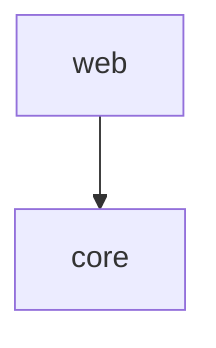

# Expected output, before and after

Fixture project (a git repository): root `package.json` (`name: demo`, `dependencies: zod`, `devDependencies: typescript`), root `pyproject.toml` (`dependencies = ["Requests>=2", "click"]`), `packages/core/package.json` (`name: @demo/core`, `dependencies: left-pad`), `packages/web/package.json` (`name: @demo/web`, `dependencies: @demo/core, react`), `infra/main.tf` with a module whose `source` embeds URL credentials. `<fixture>` replaces the machine path; `<key>` is the repo key.

The "before" blocks were captured on 400b20ea with the CLI from the worktree. The "after" blocks are the target shape pinned by the plan.

## `o2b brain architect <fixture>/proj`

Before:

```
architecture notes for proj-2e8f4f13: 4 created, 0 updated, 0 unchanged
overview: <fixture>/vault/Brain/projects/arch/proj-2e8f4f13/overview.md
```

After (first run on the same vault; a manifest line appears only when some manifest is not read, so this fixture prints none):

```
architecture notes for proj-2e8f4f13: 0 created, 3 updated, 1 unchanged
overview: <fixture>/vault/Brain/projects/arch/proj-2e8f4f13/overview.md
```

After, with a malformed `pyproject.toml`:

```
architecture notes for proj-2e8f4f13: 0 created, 1 updated, 3 unchanged
manifests: 1 malformed (pyproject.toml), see the overview's dependencies region
overview: <fixture>/vault/Brain/projects/arch/proj-2e8f4f13/overview.md
```

## `o2b brain architect <fixture>/proj --json`

Before:

```json
{
  "ok": true,
  "repo_key": "proj-2e8f4f13",
  "dir": "<fixture>/vault/Brain/projects/arch/proj-2e8f4f13",
  "overview_path": "<fixture>/vault/Brain/projects/arch/proj-2e8f4f13/overview.md",
  "decisions_path": "<fixture>/vault/Brain/projects/arch/proj-2e8f4f13/decisions.md",
  "module_paths": [
    "<fixture>/vault/Brain/projects/arch/proj-2e8f4f13/modules/core.md",
    "<fixture>/vault/Brain/projects/arch/proj-2e8f4f13/modules/web.md"
  ],
  "created": 0,
  "updated": 0,
  "unchanged": 4
}
```

After (additive field, always present, sorted by path):

```json
{
  "ok": true,
  "repo_key": "proj-2e8f4f13",
  "dir": "...",
  "overview_path": "...",
  "decisions_path": "...",
  "module_paths": ["...modules/core.md", "...modules/web.md"],
  "manifests": [
    { "path": "package.json", "ecosystem": "npm", "status": "read" },
    { "path": "packages/core/package.json", "ecosystem": "npm", "status": "read" },
    { "path": "packages/web/package.json", "ecosystem": "npm", "status": "read" },
    { "path": "pyproject.toml", "ecosystem": "pypi", "status": "read" }
  ],
  "created": 0,
  "updated": 0,
  "unchanged": 4
}
```

## Overview regions

Before:

```
<!-- o2b:begin module-map -->
Containment only: the scan records no import edges, so this diagram claims none.
...
<!-- o2b:end module-map -->
<!-- o2b:begin dependencies -->
- zod
<!-- o2b:end dependencies -->
```

After (`module-map` unchanged; module names are excluded from the external list):

```
<!-- o2b:begin dependencies -->
Manifests:
- `package.json` (npm): read
- `packages/core/package.json` (npm): read
- `packages/web/package.json` (npm): read
- `pyproject.toml` (pypi): read

npm:
- left-pad
- react
- zod
Not listed (npm): dev 1

pypi:
- click
- requests
<!-- o2b:end dependencies -->
<!-- o2b:begin module-dependencies -->
Declared only: an edge means a module's manifest names another module of this project as a runtime dependency; no import is measured.


<!-- o2b:end module-dependencies -->
```

A malformed manifest renders as ``- `pyproject.toml` (pypi): malformed - <parser message>``; an unsupported one as ``- `pom.xml` (maven): unsupported``.

## Module note `modules/web.md`

Before:

```
---
kind: arch-module
repo_key: proj-2e8f4f13
module: web
---

<!-- o2b:begin facts -->
...
```

After:

```
---
kind: arch-module
repo_key: proj-2e8f4f13
module: web
depends_on:
  - "[[Brain/projects/arch/proj-2e8f4f13/modules/core|core]]"
---

<!-- o2b:begin facts -->
...
<!-- o2b:begin dependencies -->
Manifests:
- `packages/web/package.json` (npm): read

npm:
- react

Depends on modules:
- [[Brain/projects/arch/proj-2e8f4f13/modules/core|core]]
<!-- o2b:end dependencies -->
```

After indexing, the search store holds a link from `modules/web.md` to `modules/core` with `relation: depends_on`.

## `o2b brain pre-extract <fixture>/proj/infra/main.tf`

Input:

```hcl
module "net" {
  source = "git::https://user:<credential>@example.com/net.git"
}
resource "aws_instance" "web" {
  ami = var.ami
  depends_on = [module.net]
}
variable "ami" {}
```

Before:

```
pre-extract: <fixture>/proj/infra/main.tf unextracted (unsupported source extension ".tf" for code-structure pre-extraction)
```

After:

```
pre-extract: <fixture>/proj/infra/main.tf (hcl)
  module module.net
  resource aws_instance.web
  variable var.ami
  depends_on aws_instance.web -> module.net
  imports <fixture>/proj/infra/main.tf -> git::https://***REDACTED***@example.com/net.git
  references aws_instance.web -> var.ami
```

`--json` after: `{"ok": true, "path": "...", "extracted": true, "language": "hcl", "entities": [...], "edges": [...]}` with the same seeds; no attribute value (`var.ami` is a reference, not a value) appears.

## Import specifier with credentials (TypeScript, found and fixed)

`import x from "https://user:<credential>@example.com/m.js";`

Before: `imports a.ts -> https://user:<credential>@example.com/m.js`

After: `imports a.ts -> https://***REDACTED***@example.com/m.js`

## Left-over surfaces (remote reach, vault with a confirmed `visibility: private` preference)

- `brain_context` before: `content` contains the private principle and `counts.confirmed` includes it. After: identical to the same vault without that preference (principle absent, counts restated); local reach unchanged.
- `resources/read osb://preferences/active` before: the file bytes including the principle. After: as `brain_context`.
- `brain_pre_compress_pack` before: the head and the top-K list include the principle. After: absent.
- `brain_health` before: a contradiction or stale-claim family can name the private preference. After: the family is dropped and the verdict refolded, as for the owner scope.
- `brain_doctor {repair: true}` before: the plan lists a fix for the private preference and `apply` rewrites it. After: no fix, no `unfixable` count, no write and no log event for it at remote reach; local still fixes it.
