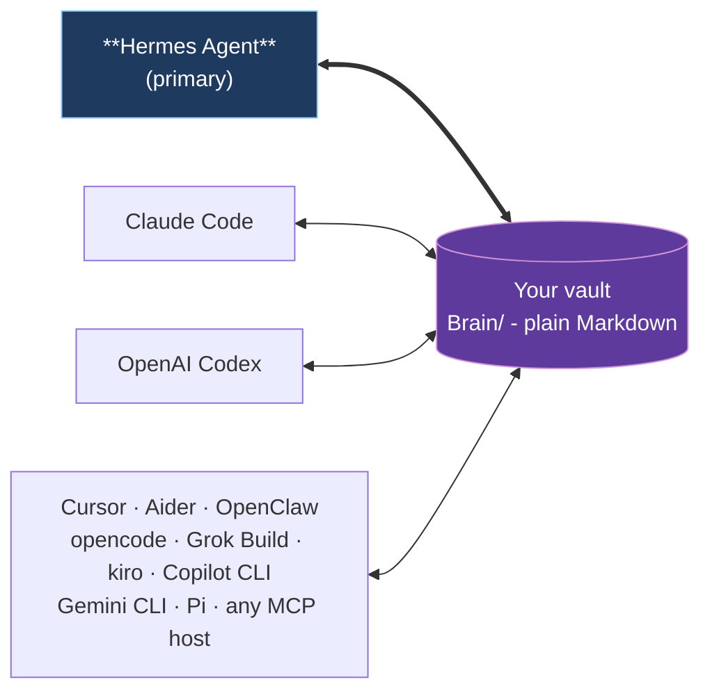

# Consultant prompt: Memory subsystem alignment

You are an external architecture consultant for Open Second Brain. Return exactly 3 distinct architectural variants, then exactly one recommendation. Do not write code. Do not add sections outside the required sections.

Required output format:

## Variant 1: <short name>
Approach: 2-3 sentences.
Trade-offs:
- ...
- ...
Complexity: small|medium|large
Risk: low|medium|high

## Variant 2: <short name>
Approach: 2-3 sentences.
Trade-offs:
- ...
- ...
Complexity: small|medium|large
Risk: low|medium|high

## Variant 3: <short name>
Approach: 2-3 sentences.
Trade-offs:
- ...
- ...
Complexity: small|medium|large
Risk: low|medium|high

## Recommended: Variant N
Rationale: 2-4 sentences.

Project: Open Second Brain. Language/runtime: TypeScript on Bun/Node-style stdlib, MCP tools plus Hermes plugin adapter. The core must remain deterministic and provider-agnostic: no LLM calls from the kernel. Vault data is plain Markdown/JSONL under Brain/.

Release scope: Memory subsystem alignment. Branch: feat/memory-subsystem-alignment. In-scope cards ship together: t_64ec5bbd, t_c492e539, t_5e06b572.

Engineering constraints: SOLID / KISS / DRY; additive and backward-compatible; no misleading fallbacks; no hardcoding; English-only project strings; abstract multi-language behavior; byte-identical when feature flags/optional fields are absent where a card says so.


## In-scope task bodies

### t_64ec5bbd
```text
id:       t_64ec5bbd
title:    Make pinned_context budget honest: surface truncation instead of silent data loss
status:   triage   priority: 3   assignee: fullstack-engineer
----- body -----
Trigger: the core motivation of Hermes PR #48507 is GRACEFUL budget handling - when the memory store is near its character budget, the tool rejects the add and asks the model to consolidate, rather than losing data silently. Batch ops then let consolidate+add happen in one turn.

Current state in Open Second Brain (verified): brain_pinned_context silently truncates. src/core/brain/pinned.ts sets MAX_PINNED_CONTEXT_LEN = 20000 and normalisePinnedContent -> sanitiseTextField truncates via s.slice(0, maxLen) (src/core/redactor.ts) with NO error and NO signal. The caller believes the full content was pinned; the tail is silently dropped.

Why this is a defect, not a style nit: it is exactly the misleading/deceptive fallback the project brief forbids. The agent gets a success response while data was lost.

Goal: when content exceeds the pinned-context budget, do NOT silently drop the tail. Instead return an explicit, structured signal (e.g. truncated: true with original/stored byte counts, or a budget-exceeded outcome that mirrors Hermes consolidate-then-retry semantics) so the agent can consolidate. Pairs naturally with the batch-write task (t batch sibling) which gives the agent the one-call consolidate+rewrite path.

Constraints: additive and backward-compatible for content within budget (no behavior change there); language-agnostic; no silent fallbacks. Add a test asserting that over-budget input produces an explicit truncation/rejection signal rather than a silent success.
----- last comments -----
[phase0-brainstorm] PHASE-0 BRAINSTORM HANDOFF — card stays in triage until the release step drives it. Do not dispatch from this comment.

Release: memory-subsystem-alignment · branch: feat/memory-subsystem-alignment (b
[default] Restored to triage: was erroneously archived during cleanup of the cancelled osb-feature-release run osb-feature-release-9cd7afba. These cards are the active feature backlog (memory-subsystem-alignmen
[phase0-brainstorm] PHASE-0 BRAINSTORM — implementation handoff for THIS card (card stays in triage until the release step drives it; do not self-dispatch).

IMPLEMENTATION PLAN for THIS task: docs/brainstorm/memory-subs

```

### t_c492e539
```text
id:       t_c492e539
title:    Add atomic batch (operations array) writes to Open Second Brain writer tools
status:   triage   priority: 3   assignee: fullstack-engineer
----- body -----
Trigger: Hermes PR #48507 adds an operations array to its memory tool - a single call applies add/replace/remove atomically against the FINAL budget (all-or-nothing; any malformed op aborts the batch with no write). Measured ~52% fewer memory tool calls.

Current state in Open Second Brain (verified): every writer is single-operation-per-call.
- brain_pinned_context (src/mcp/brain/context-tools.ts) accepts exactly one of read|write|append|clear per call.
- continuity append (src/core/brain/continuity/store.ts appendContinuityRecord) writes one JSON line per call under a lockfile.

Goal: add an atomic multi-operation mode so the agent can free space and add in one turn, all-or-nothing.
- pinned_context: accept an optional ordered operations array (write/append/clear/replace segments) applied atomically; reject the whole batch on any invalid op without partial writes.
- continuity: optionally accept a batch of records appended atomically under one lock acquisition.

Companion polish from the same PR (fold in here, low cost): make writer success responses terminal/idempotent-signalling (a done-style marker) so the agent does not redundantly re-call after a successful write.

Relationship to sibling task: if the on_memory_write bridge (t_5e06b572) lands, the host may forward a batch operations array that the bridge must apply atomically - so this batch primitive is the natural substrate for that bridge. Sequence accordingly.

Constraints: additive, byte-identical-when-flags-off, language-agnostic, no misleading partial-write fallbacks. Tests must prove atomicity (a malformed op in the middle leaves the store unchanged).
----- last comments -----
[phase0-brainstorm] PHASE-0 BRAINSTORM HANDOFF — card stays in triage until the release step drives it. Do not dispatch from this comment.

Release: memory-subsystem-alignment · branch: feat/memory-subsystem-alignment (b
[default] Restored to triage: was erroneously archived during cleanup of the cancelled osb-feature-release run osb-feature-release-9cd7afba. These cards are the active feature backlog (memory-subsystem-alignmen
[phase0-brainstorm] PHASE-0 BRAINSTORM — implementation handoff for THIS card (card stays in triage until the release step drives it; do not self-dispatch).

IMPLEMENTATION PLAN for THIS task: docs/brainstorm/memory-subs

```

### t_5e06b572
```text
id:       t_5e06b572
title:    Implement the on_memory_write memory-provider bridge (capture host native memory writes)
status:   triage   priority: 4   assignee: fullstack-engineer
----- body -----
Problem: plugin.yaml and plugins/hermes/plugin.yaml both declare memory_provider: true and list on_memory_write under hooks, but no handler exists in src (grep for on_memory_write / memoryWrite returns zero implementations). The Open Second Brain vault is written ONLY through explicit brain_* MCP calls; the Hermes host agent native memory-tool writes never flow in. Hermes PR #48507 states external providers bridge adds/replaces via on_memory_write, and PR #48262 shows OpenViking as a working provider - so the contract is live on the host side and our side is a no-op stub.

Goal: implement the on_memory_write handler so the host agent native memory-tool writes are persisted into the Open Second Brain vault (e.g. as a continuity record kind and/or pinned-context update), making the vault the durable backing store rather than requiring the agent to remember to call brain_* explicitly.

Required before coding (do not hardcode a guessed signature): verify the EXACT on_memory_write invocation contract against Hermes source and the merged PRs #48507/#48262 - payload shape (add/replace/remove, batch operations array, content fields), how the hook is registered/discovered, and the success-response contract. Treat Hermes as the source of truth for the contract.

Constraints (project brief): provider-agnostic kernel must never call an LLM; additive only; byte-identical-when-flags-off must hold; language-agnostic (no hardcoded natural-language word lists); no misleading fallbacks. Add tests proving host writes land in the vault and that the path is a no-op when the host does not invoke the hook.

This is the strategic item: it converts a declared-but-unimplemented capability into a real one, directly triggered by the two PRs.
----- last comments -----
[phase0-brainstorm] PHASE-0 BRAINSTORM HANDOFF — card stays in triage until the release step drives it. Do not dispatch from this comment.

Release: memory-subsystem-alignment · branch: feat/memory-subsystem-alignment (b
[default] Restored to triage: was erroneously archived during cleanup of the cancelled osb-feature-release run osb-feature-release-9cd7afba. These cards are the active feature backlog (memory-subsystem-alignmen
[phase0-brainstorm] PHASE-0 BRAINSTORM — implementation handoff for THIS card (card stays in triage until the release step drives it; do not self-dispatch).

IMPLEMENTATION PLAN for THIS task: docs/brainstorm/memory-subs

```


## Recent git log
```text
4db7862 fix(hermes): pass --repo so bridge skill discovery resolves repoRoot (#103) (#106)
0a4b6da feat: calendar obligations, agenda synthesis, OKF portability, Obsidian Bases and steelman synthesis (v1.15.0) (#105)
f8b4abf feat(brain): add feedback default scope and vault write containment (#104)
20ea7ef feat: per-handoff LLM generation tracing and prompt-prefix stability metric (#102)
9c1d48f feat: CodeGraph and MCP operational readability (v1.12.0) (#101)
c2c3ff4 feat: Session Knowledge Synthesis Suite - structured session summaries, idea-lineage, episodic note history (v1.11.0) (#100)
56dd3dd fix(hermes): bridge EOF - byte streams, stderr drain, retry loop (#92)
35b824e feat: Recall & Working-Memory Quality Suite - selectable profiles, usage decay, co-occurrence, file-context (v1.10.0) (#99)
929d54c feat: Brain Portability & Interop Suite - bank export/import, page contract, brain_create_note, in-process SDK (v1.9.0) (#98)
7cdbfc0 feat: Indexer Durability & Resilience Suite - cooperative abort, graceful watch shutdown, resumable reindex (v1.8.0) (#97)
8b679fe feat: Knowledge Provenance Suite - ingest, research, NER, derived facts, owner-scope, standing-query (v1.7.0) (#96)
6e59a42 feat: Vault Integrity & Trust Suite - untrusted-source containment, NFC identity, watch-sync, O(1) graph, agent-scope (v1.6.0) (#95)
70d95c6 chore(release): bump version to 1.5.0 (#94)
e4df212 feat: Search & Recall Quality Suite - explainable scores, trust, threshold, reinforce, eval (#93)
2e74afe feat: native Grok Build CLI integration - bundled plugin, hooks, session import (v1.4.0) (#91)
3e7e233 fix(hermes): serialize handle_tool_call result to a string (v1.3.1) (#90)
2abc90b fix(changelog): the opencode integration ships in v1.3.0, not a phantom 1.4.0 (#89)
96f1ff4 feat: native opencode integration - config-correct install, bundled plugin, session capture (#88)
0340560 feat: Continuity, Hygiene & Freshness Suite - session lineage, memory hygiene, anticipatory cache (v1.3.0) (#87)
8972f13 refactor: SOLID/DRY decomposition - domain modules, unified helpers, surface guards (v1.2.0) (#86)
```


## README summary
```markdown
# Open Second Brain


> An [Obsidian](https://obsidian.md)-native memory layer for your AI agent. Plain Markdown you own, in the same vault you already use.

Open Second Brain plugs into [Hermes Agent](https://github.com/NousResearch/hermes-agent) and turns your Obsidian vault into a memory layer the agent reads and writes through deterministic CLI / MCP tools. Preferences, signals, evidence, and audit trails are real `.md` files under `Brain/` in the vault you already open in Obsidian every day. You can grep them, version them with git, search them in Obsidian, edit them by hand. No daemon, no vector black box, no hidden state outside the vault.

## What is new

Open Second Brain 1.15.0 adds calendar-aware obligations and agenda synthesis: recurring commitments live as first-class pages under Brain/obligations/ with a deterministic next-due date, and a stateless agenda command turns caller-provided calendar events into overlap conflicts, free focus blocks, and external-organizer flags. A portable Open Knowledge Format bundle lets you export a Brain to a directory and import it in another vault, staging untrusted pages for review or writing them directly with a trusted flag. Fresh vaults are stamped with native Obsidian Bases views over projects, people, tasks, and daily logs, and topic synthesis now surfaces a strongest-objection steelman next to its findings.

## Why

- **Lives in your Obsidian vault.** Open `Brain/preferences/pref-no-internal-abbrev.md` in Obsidian and you literally see what your agent learned about you - title, status, evidence count, confidence band, body text. Wikilinks, backlinks, graph view all work.
- **You own the data.** Plain Markdown on your filesystem. No service to cancel, no cloud account, no schema migration when a vendor pivots. Syncthing to your other machines if you want.
- **Memory that learns deterministically.** A `dream` pass turns repeat signals into rules and retires the ones nothing applies any more. Counters and atomic file moves - no LLM inside the algorithm, no surprise hallucinations in your memory.
- **One vault, every agent.** Hermes Agent is the primary integration. Claude Code, OpenAI Codex, Cursor, Aider, OpenClaw, opencode, Grok Build, kiro, Copilot CLI, Gemini CLI, and Pi all plug into the same Brain through MCP.

## One vault, many runtimes



Hermes Agent owns the schedule (dream cron, daily digests, Telegram delivery). Other runtimes participate as readers and writers of the same Brain through MCP - no per-runtime fork of the memory.

## Quick start with Hermes Agent

**The simplest path - let your agent set it up.** Paste this into Hermes (or whichever AI agent already has shell access on the target machine):

> Install Open Second Brain for me by following the steps at <https://github.com/itechmeat/open-second-brain/blob/main/install/hermes.md>. My vault is at `/path/to/your-vault`.

The agent reads the install doc, runs every command, and verifies the result. That's it.

If you prefer running the steps yourself:

```bash
# 1. Install the plugin
hermes plugins install itechmeat/open-second-brain --enable
hermes gateway restart

# 2. Put `o2b` on PATH
~/.hermes/plugins/open-second-brain/scripts/o2b install-cli

# 3. Bootstrap the vault
o2b init       --vault /path/to/your-vault --name "My Second Brain"
o2b brain init --vault /path/to/your-vault --primary-agent <agent-name>

# 4. Verify
o2b doctor --vault /path/to/your-vault
```

Enable Open Second Brain as the memory provider in `~/.hermes/config.yaml` (`memory.provider: open-second-brain`) and restart the gateway one more time - the agent now injects `Brain/active.md` into its system prompt, recalls context before each turn, and writes signals through `brain_feedback`, all through the one native provider. Full step-by-step: [`install/hermes.md`](install/hermes.md).

## Other runtimes

| Runtime                                                          | Install                                                                                             |
| ---------------------------------------------------------------- | --------------------------------------------------------------------------------------------------- |
| Claude Code                                                      | Marketplace plugin (bundled `.mcp.json` + hooks) - [`install/claudecode.md`](install/claudecode.md) |
| OpenAI Codex                                                     | `codex plugin marketplace add ...` - [`install/codex.md`](install/codex.md)                         |
| OpenClaw                                                         | Native JS plugin, no MCP needed - [`install/openclaw.md`](install/openclaw.md)                      |
| opencode                                                         | `o2b install --target opencode --apply` (MCP servers + native plugin) - [`install/opencode.md`](install/opencode.md) |
| Grok Build                                                       | `o2b install --target grok --apply` (MCP in `config.toml` + native hooks) - [`install/grok.md`](install/grok.md) |
| Cursor · Aider · kiro · Copilot CLI · Gemini CLI · Pi            | `o2b install --target <name> --apply` - see [`install/`](install/)                                  |
| Any other MCP host                                               | `o2b install --target generic --apply` - [`install/generic.md`](install/generic.md)                 |

Each non-Hermes target writes a sidecar manifest under `<vault>/.open-second-brain/install.lock.json` so `o2b uninstall --target <name> --apply` removes exactly what it added.

## What you get

- **Your memory as Markdown.** Every rule the agent learns about you is a file under `Brain/` you can open, edit, grep, and version. Obsidian wikilinks, backlinks, and the graph view just work - there is no separate UI to learn.
- **Memory that learns, and forgets, on its own.** A nightly `dream` pass turns repeated corrections into rules and retires the ones nothing uses any more. Deterministic by design: counters and atomic file moves, no LLM guessing inside your memory.
- **One brain, every agent.** Teach a rule in one agent and the next one already knows it - Hermes, Claude Code, Codex, Cursor, and the rest read and write the same vault.
- **You stay in control.** Pin, merge, retire, or roll back any rule from the `o2b` CLI. Every Brain mutation takes a verified snapshot first, so a bad change is one `o2b brain rollback` away.
- **Search that explains itself.** Keyword plus an optional semantic layer over your vault, with results that show why they surfaced and what was missing - not a black box. Opt into a structured per-result score breakdown (`explain`), inline trust metadata (age, superseded, conflict), a relevance threshold that returns nothing rather than weak noise, and reinforcement that lifts memories you have marked useful. Track retrieval quality over time with `brain_eval` and the recall benchmark (hit@k, MRR, answer-containment@k).
- **Conversations survive compaction.** When the host compresses context and rotates the session id, capture and recall stitch the segments back into one conversation - any segment id returns the whole lineage.
- **Memory that cleans itself, on your terms.** `o2b brain hygiene scan` surfaces contested facts, near-duplicate rules, stale derived pages, and never-recalled memories; `apply` executes only the findings you select, and stale pages recompile from their recorded sources with a dry-run preview.
- **A vault that stays fresh, consistent, and scoped.** `o2b search watch` keeps the index live as you edit, debounced and incremental; note identity is Unicode-normalized so the same file is one entry across macOS and Linux devices instead of a phantom cross-device duplicate; and recall accepts an opt-in `agent_scope` so a page marked with an `owner:` is reachable only to its owner while shared pages stay open to all.
- **Knowledge that knows where it came from.** Drop a source document and the agent's extraction becomes cross-referenced entity and concept pages plus a summary page that backlinks the source and lists its connections; N sources become one dated report whose every finding cites the source that flagged it; a derived fact carries a `deduced`/`inferred` provenance level and links back to its premises, and recall trusts an operator-stated rule above a machine-derived one. A fact can declare an 
...[truncated 8771 chars]
```


## Top changelog entry
```markdown
# Changelog

All notable changes to this project will be documented in this file.

The format is based on [Keep a Changelog](https://keepachangelog.com/en/1.1.0/),
and this project adheres to [Semantic Versioning](https://semver.org/spec/v2.0.0.html).

## [1.15.0] - 2026-06-19

### Added

- **Calendar-aware obligations and agenda synthesis.** Two deterministic,
  vault-native surfaces inspired by the obsidian-second-brain calendar
  commands, built to Open Second Brain's contract: the kernel never
  reaches a calendar API or calls a model - the host runtime (e.g. the
  google-workspace skill) fetches events and the Brain owns the durable,
  deterministic record and analysis.
  - **Recurring obligations (`brain_obligation`, `o2b brain obligation`).**
    First-class Brain pages under `Brain/obligations/<slug>.md` tracking a
    periodic commitment (weekly review, monthly report, quarterly audit)
    with a cadence and a deterministically computed `next_due` date.
    `add` creates the page (next-due starts at the anchor), `done` records
    a completion and advances next-due by exactly one cadence interval from
    the completion date, `list` (optionally `--overdue`) sorts by next-due
    with an overdue flag and days-until-due, `show` reads one, `remove`
    archives into `Brain/obligations/archive/`. Cadences: `daily`,
    `weekly`, `biweekly`, `monthly`, `quarterly`, `yearly`, and
    `every-<N>-days`; month-based cadences clamp to the last day of short
    months (Jan 31 + 1 month -> Feb 28/29). Markdown-first and operator
    readable in Obsidian; cadence arithmetic is pure UTC calendar math, so
    the same inputs always yield the same next-due date.
  - **Agenda synthesis (`brain_agenda`, `o2b brain agenda`).** A stateless
    analysis over caller-provided calendar events (a JSON array, or piped
    on stdin for the CLI): overlap **conflicts** between events, free
    **focus blocks** (the gaps a scheduler would slot work into, optionally
    clipped to a `--workday-start`/`--workday-end` window), and
    **external-organizer** flags for events organised outside the
    operator's own email domain(s). Pure function of its input - no vault
    writes, no clock, no model - so a given event list always yields the
    same snapshot.
  - **MCP surface.** Adds `brain_agenda` and `brain_obligation` to the
    frozen tool set; both carry input schemas and the deliberate
    surface-change is pinned in the parity guard.

- **Open Knowledge Format (OKF) export and import.** A portable,
  producer-agnostic bundle for moving a Brain (or part of one) between
  vaults and producers, with a deterministic export-then-import
  round-trip and a review gate for untrusted sources.
  - **Export (`brain okf-export`, `o2b brain okf-export`).** Writes a
    self-contained OKF bundle to a directory: `concepts/`, `queries/`,
    and `references/` pages plus a date-grouped `log.md` and an
    `okf.json` manifest. Read-only on the vault; `--force` overwrites a
    non-empty target directory.
  - **Import (`brain okf-import`, `o2b brain okf-import`).** Reads an OKF
    bundle directory. By default pages land under `OKF Review/` stamped
    `okf_review: pending` as review candidates; `--trusted` writes each
    page straight to its recorded vault-relative path. Foreign-producer
    bundles get producer and raw-type provenance stamped, with
    producer-specific (`x-*`) frontmatter preserved.

- **Obsidian Bases view definitions stamped at vault init.** Four
  native `.base` files are now written into `Brain/bases/` whenever a
  vault is bootstrapped (`o2b brain init`), giving operators structured,
  performant views over the Brain collections without any Dataview
  plugin dependency. Inspired by the obsidian-second-brain
  `/obsidian-projects` + Bases templates work, adapted to Open Second
  Brain's real frontmatter rather than copied verbatim:
  - `projects.base` → canonical entities with `category: project`
    (`Brain/entities/project/`), with Active / Archived / All table
    views, a status icon, and a "stale since update" formula.
  - `people.base` → canonical entities with `category: person`
    (`Brain/entities/person/`), surfacing optional operator-added
    `role` / `company` columns alongside status and freshness.
  - `tasks.base` → recurring obligations (`Brain/obligations/`), ordered
    by an `overdue` formula and `next_due`, with days-until-due.
  - `daily.base` → log days (`Brain/log/`) as a date-sorted table plus a
    calendar view.
  - Files are inert structural scaffolding (no plugin required; ignored
    by editors that do not render Bases) and are stamped like the
    operating manual: written only when absent, overwritten under
    `--force`, never clobbering operator edits on a plain re-run. The
    templates ship under `src/core/brain/templates/bases/` so they
    travel with the published `src/` tree.

- **Strongest-objection steelman in synthesis outputs.** Both the
  `osb://topic/{slug}` resource and `brain_deep_synthesis` now surface
  the single best-formed argument *against* their own implicit
  conclusion, rather than only enumerating tensions within the source
  material. Inspired by obsidian-wiki's steelman section, adapted to
  Open Second Brain's deterministic-core contract (no generated prose —
  the strongest counter-finding is selected by fixed priority and
  framed as a seed for the calling agent to develop).
  - `brain_deep_synthesis` (and `o2b brain deep-synthesis`) add a
    `strongest_objection` field with `basis`
    (contradiction → superseded → stale → knowledge_gap →
    thin_evidence), `statement`, and `source_artifacts`. It is `null`
    only for a larger internally-consistent body, and
    `strongest_objection` joins the dossier's `checked` dimensions.
  - `osb://topic/{slug}` gains an always-present **Strongest objection**
    section steelmanning the current preference: a previously-retired
    rule, a quarantined rule, a recorded negative counter-signal, or an
    unconfirmed-trial caveat, falling back to an explicit "no standing
    objection" line.


```


## Architecture and docs index
```text
docs/architecture.md
docs/cli-reference.md
docs/cross-project-pointer.md
docs/hermes-cron.md
docs/how-it-works.md
docs/idea.md
docs/images/readme-poster.jpg
docs/mcp.md
docs/metrics.md
docs/observability.md
docs/plans/2026-05-06-cli-foundation.md
docs/plans/2026-05-10-pay-memory.md
docs/plans/2026-05-15-brain-observing-memory.md
docs/plans/2026-05-15-brain-roadmap.md
docs/plans/2026-05-16-brain-capture-and-fields-design.md
docs/plans/2026-05-16-brain-capture-and-fields-impl.md
docs/plans/2026-05-16-brain-search-design.md
docs/plans/2026-05-16-brain-search-impl.md
docs/plans/2026-05-17-brain-onboarding-quality-design.md
docs/plans/2026-05-17-brain-onboarding-quality-impl.md
docs/plans/2026-05-17-tier-a-snapshot-confidence-pointer-design.md
docs/plans/2026-05-17-tier-a-snapshot-confidence-pointer-impl.md
docs/plans/2026-05-18-agent-discipline-tail-design.md
docs/plans/2026-05-18-agent-discipline-tail-impl.md
docs/plans/2026-05-18-brain-maturity-design.md
docs/plans/2026-05-18-brain-maturity-impl.md
docs/plans/2026-05-18-v0.10.6-design.md
docs/plans/2026-05-18-v0.10.6-impl.md
docs/plans/2026-05-19-v0.10.8-design.md
docs/plans/2026-05-19-v0.10.8-impl.md
docs/plans/2026-05-19-vault-scope-design.md
docs/plans/2026-05-19-vault-scope-impl.md
docs/plans/2026-05-20-multi-runtime-install-design.md
docs/plans/2026-05-20-multi-runtime-install-impl.md
docs/plans/2026-05-20-v0.10.10-design.md
docs/plans/2026-05-20-v0.10.10-impl.md
docs/plans/2026-05-20-v0.10.12-impl.md
docs/stability.md
docs/updating.md
```

```markdown
# Architecture

Open Second Brain is organized around a stable core and multiple runtime adapters.

## Layers

```text
Agent runtime
  -> runtime adapter/plugin
    -> skills and commands
      -> CLI/core library
        -> vault files and local config
```

## Core responsibilities

The core (`src/core/`) provides deterministic operations for:

- locating and validating configuration;
- initializing a vault profile (`o2b brain init`);
- recording taste signals, applied-evidence, and narrative milestones into `Brain/log/<YYYY-MM-DD>.md` (plus a JSONL sidecar);
- running the nightly `dream` learning pass (deterministic, no LLM calls);
- exporting redacted config snapshots;
- checking vault health (`o2b brain doctor`);
- querying preferences, signals, and link-graph relationships through the MCP and CLI surface.

The core does not depend on Hermes, Claude Code, Codex, OpenClaw, or Obsidian internals.

## Runtime adapters

### Hermes adapter

The Hermes adapter can be a real runtime plugin:

```text
plugins/hermes/
  plugin.yaml
  __init__.py
```

Possible responsibilities:

- register available hooks;
- check configuration at gateway startup;
- expose readiness diagnostics;
- connect Hermes session metadata to Open Second Brain profiles;
- optionally add event capture hooks when safe and explicit.

The Hermes adapter must not silently change model routing, write secrets, or mutate unrelated vault areas.

### Claude Code adapter

Claude Code support should be packaged through plugin metadata and bundled skills/commands.

The adapter should focus on:

- installing skills;
- exposing slash-command style workflows where supported;
- optionally configuring hooks;
- optionally declaring MCP configuration in later versions.

### Codex adapter

Codex supports plugins as installable distribution units for reusable skills and apps. The Codex adapter should include:

```text
.codex-plugin/plugin.json
skills/
.mcp.json        # later, optional
hooks/           # later, optional
assets/          # later, optional
```

v0 should keep Codex support simple: plugin manifest plus shared skills and scripts.

### OpenClaw adapter

OpenClaw discovers Open Second Brain as a Native plugin via the
`openclaw.extensions` entry in `package.json`. The entry
(`src/openclaw/index.ts`) reads and writes the vault directory
directly with `node:fs` / `node:path`; no subprocess is spawned, so
the OpenClaw security scanner (which blocks `child_process` imports)
accepts the plugin.

Installation (always installs the latest from `main`; do not append `@v...`):

```bash
openclaw plugins install git:github.com/itechmeat/open-second-brain
```

The OpenClaw adapter must remain compatible with the Hermes, Claude
Code, and Codex adapters. The `o2b mcp` MCP server is the canonical
way for any runtime to reach the writer / reader tools.

## Configuration model

Open Second Brain separates immutable package code from mutable user configuration and data.

### Machine-local config

Machine-local config points a runtime to a vault and environment profile.

Suggested path:

```text
$OPEN_SECOND_BRAIN_CONFIG
~/.config/open-second-brain/config.yaml
```

Example:

```yaml
version: 1
instance_name: My Second Brain
runtime: hermes
environment_name: <hostname>
vault:
  path: <absolute-path-to-Obsidian-vault>
identity:
  agent_name: <chosen-agent-name>
  user_language: <BCP-47 tag, e.g. en or ru>
policy:
  write_mode: agent-owned-dir
```

Machine-local config may contain absolute paths. It must not contain secrets.

### Vault-portable config

Vault-portable config lives at `<vault>/Brain/_brain.yaml` and travels
with backup/sync. It describes:

- schema version + dream / retire / confidence / snapshot thresholds;
- optional `notes.read_paths` (user-authored folders the agent may read);
- optional `temporal:`, `link_graph:`, `guardrails:`, `discipline_report:` tuning blocks;
- `vault.ignore_paths` (exclusion policy for every vault walker).

It must not contain secrets.

## Backup model

Open Second Brain should assume the vault is the primary portable backup unit.

Recommended behavior:

- vault-portable config is backed up with the vault;
- machine-local config can be regenerated with `o2b init --adopt-vault`;
- `o2b export-config` writes a redacted machine snapshot into the vault;
- secrets are excluded and represented as `[REDACTED]` only when needed.

## Vault layout

The agent owns one directory in the vault: `Brain/`. The write
contract stays simple ("agent writes only under `Brain/`").
User-authored notes (daily journals, weekly notes) live wherever the
operator names them; the agent reads those paths only when they are
listed in `notes.read_paths`.

```text
Brain/
  _brain.yaml              # schema + thresholds + notes.read_paths (validated by o2b brain doctor)
  _BRAIN.md                # operating manual for agents (rendered by o2b brain init)
  active.md                # derived digest, auto-regenerated
  inbox/                   # raw taste signals, sig-<date>-<slug>.md
    processed/             # signals already folded into a preference
  preferences/             # active rules: pref-<slug>.md, status unconfirmed | confirmed
  retired/                 # ret-<slug>.md with retired_reason
  log/                     # YYYY-MM-DD.md, append-only event log (dream / apply-evidence / etc.)
  .snapshots/              # <run_id>.tar.zst, pre-run snapshots for o2b brain rollback
                           # plus hygiene-<date>/ archives (pages moved, never deleted)
  .state/                  # machine state, excluded from indexing (since v1.3.0):
                           #   session-lineage.jsonl (compression-chain ledger)
                           #   anticipatory/<root>.json (hook-warmed context cache)
```

This layout is intentionally agent-owned: every artefact Open Second
Brain writes lives under `Brain/`. User-authored content elsewhere in
the vault is read-only to the agent and stays under operator control.

## Brain layer

Three architectural invariants:

- **Filesystem-first.** No database, no daemon. Every artifact is plain Markdown with YAML frontmatter; backup is `cp -r` or `tar`.
- **Deterministic core.** The `dream` algorithm is a pure function of inputs (signals, preferences, log, configuration, current time). No LLM calls inside the core. Semantic merging, if needed, is delegated to external agents via the same CLI / MCP surface. External judgment (the bench judge, the hygiene conflict resolver) goes through one sanctioned fail-open boundary: the operator-configured command bridge (`src/core/reliability/command-bridge.ts`).
- **Pre-run snapshot + atomic per-file writes.** Each `dream` run takes a `.snapshots/<run_id>.tar.zst` before any state change; per-file writes go through `fs-atomic` (temp + rename). Combined with retention of the most-recent N snapshots, this gives reversible, audit-friendly mutation.

The layered diagram from the top of this document still holds — `Brain/` sits at the same level as the vault files in the bottom layer:

```text
Agent runtime
  -> runtime adapter/plugin
    -> skills and commands (brain-memory skill, open-second-brain skill)
      -> CLI/core library (src/core/brain/*)
        -> vault files: Brain/ (observing memory)
```

Full design: [`docs/plans/2026-05-15-brain-observing-memory.md`](plans/2026-05-15-brain-observing-memory.md).

As of v0.10.10 the always-loaded `open-second-brain-writer` MCP
server hosts one read tool (`brain_context`) alongside the three
writers (`brain_feedback`, `brain_apply_evidence`, `brain_note`).
The reader exists for runtimes without a `SessionStart` hook
(Cursor, Aider, raw Claude API) — they call it once at session
start to pull the same `Brain/active.md` content the hook-aware
runtimes get auto-injected. The MCP server name is preserved for
backward compatibility with existing client `.mcp.json` entries;
renaming is deferred until a second reader joins the always-load
scope.

## Event log

The Brain event log is append-only. It records operational events,
not polished knowledge.

Storage: `<vault>/Brain/log/<YYYY-MM-DD>.md` (Markdown for human
reading) plus a JSONL sidecar at `<vault>/Brain/log/<YYYY-MM-DD>.jsonl`
(machine-friendly for downstream tooling). Each event kind is one
line per row, written through atomic temp+rename. The shared
redactor strips secret-shaped tokens before write.

## Security rules

Open Second Brain must not store:

- API keys;
- tokens;
- passwords;
- private SSH keys;
- credentials;
- connection strings containing secrets.

If secret-like content appears in input, tools should redact it as `[REDACTED]` before writing.

```


## Related files

### src/core/brain/pinned.ts
```ts
import { existsSync, readFileSync } from "node:fs";

import { atomicWriteFileSync } from "../fs-atomic.ts";
import { sanitiseTextField } from "../redactor.ts";
import { brainPinnedPath } from "./paths.ts";

export const MAX_PINNED_CONTEXT_LEN = 20_000;

export interface PinnedContext {
  readonly path: string;
  readonly present: boolean;
  readonly content: string;
}

export function readPinnedContext(vault: string): PinnedContext {
  const path = brainPinnedPath(vault);
  if (!existsSync(path)) {
    return { path, present: false, content: "" };
  }
  return {
    path,
    present: true,
    content: readFileSync(path, "utf8").trimEnd(),
  };
}

export function writePinnedContext(vault: string, content: unknown): PinnedContext {
  const path = brainPinnedPath(vault);
  const normalised = normalisePinnedContent(content);
  atomicWriteFileSync(path, normalised.length > 0 ? `${normalised}\n` : "");
  return { path, present: true, content: normalised };
}

export function appendPinnedContext(vault: string, content: unknown): PinnedContext {
  const incoming = normalisePinnedContent(content);
  if (incoming.length === 0) return readPinnedContext(vault);

  const current = readPinnedContext(vault).content;
  const next = current.length > 0 ? `${current}\n\n${incoming}` : incoming;
  return writePinnedContext(vault, next);
}

export function clearPinnedContext(vault: string): PinnedContext {
  const path = brainPinnedPath(vault);
  atomicWriteFileSync(path, "");
  return { path, present: true, content: "" };
}

function normalisePinnedContent(content: unknown): string {
  return sanitiseTextField(content, {
    maxLen: MAX_PINNED_CONTEXT_LEN,
  }).trim();
}

```

### src/core/redactor.ts
```ts
/**
 * Best-effort secret redactor + text-field normaliser shared across
 * the Brain writers.
 *
 * The redactor catches six secret-bearing keys in four assignment
 * shapes:
 *
 *   key=value                     env-style assignments
 *   key: value                    YAML / log lines / single-line `key: token`
 *   "key": "value"                JSON object entries
 *   Authorization: Bearer <token> HTTP authorization header (special case)
 *
 * Each match keeps the key (and surrounding quoting) and replaces the
 * value with the literal `***REDACTED***`. The transform is
 * intentionally narrow — receipts and signals carry a disclaimer that
 * the agent must visually inspect output before posting externally.
 *
 * `normaliseTextField` is the shared input sanitiser for fields that
 * land in YAML frontmatter or single-line Markdown bullets. It strips
 * C0 control characters (except `\n` and `\t`), folds the unicode line
 * separators `U+2028` / `U+2029` to `\n`, NFC-normalises, and caps
 * length to `maxLen`. The function never throws — out-of-spec input
 * is silently coerced into something safe to persist. A misrecorded
 * signal is worse than a missed one (the dream pass picks up patterns
 * from repeats); a YAML-poisoning signal is worse than either.
 */

const PLACEHOLDER = "***REDACTED***";

export const PRIVATE_REGION_PLACEHOLDER = "***PRIVATE***";

/**
 * Maximum input size accepted by `redactRawOutput`. Receipts have no
 * legitimate reason to embed multi-megabyte payloads — a runaway pipe
 * of server logs is the realistic cause of an oversize input. Capping
 * at 256 KB keeps the four-pass regex pipeline bounded and avoids a
 * DoS vector for whoever's caller is feeding the redactor.
 */
export const MAX_REDACTOR_INPUT = 256 * 1024;
const TRUNCATION_MARKER =
  "\n\n[…truncated for size; original exceeded 256 KB. Inspect raw output before sharing.]\n";

const PRIVATE_OPEN_TAG_RE = /<private\b[^>]*>/gi;
const PRIVATE_CLOSE_TAG_RE = /<\/private>/gi;

/**
 * Canonical list of secret-bearing field names. Each entry is the
 * underscore-separated canonical form; the regex builder below makes
 * `_` and `-` interchangeable and `_` optional, so a single entry
 * `api_key` covers `api_key` / `apikey` / `api-key` automatically.
 * Don't add the visual variants here — they're already covered.
 */
export const SECRET_KEYS: ReadonlyArray<string> = [
  "api_key",
  "token",
  "access_token",
  "refresh_token",
  "bearer",
  "secret",
  "client_secret",
  "authorization",
  "private_key",
  "password",
  "passwd",
  "pwd",
  "credential",
  "credentials",
  "session_token",
];

const KEY_PATTERN = SECRET_KEYS.map((k) => k.replace(/[-_]/g, "[-_]?")).join("|");

// `key=value` (env-style): value runs to whitespace or end of line.
const ENV_RE = new RegExp(`\\b(${KEY_PATTERN})(\\s*=\\s*)([^\\s\\r\\n]+)`, "gi");

// `key: value` outside of JSON quoting. Excludes the `"key": ...` JSON
// shape and the `Authorization: Bearer X` header (handled below).
const COLON_VALUE_RE = new RegExp(
  `(?<!")\\b(${KEY_PATTERN})(\\s*:\\s*)("[^"]*"|'[^']*'|[^\\r\\n]+)`,
  "gi",
);

// `"key": "value"` JSON entries.
const JSON_ENTRY_RE = new RegExp(
  `("(?:${KEY_PATTERN})"\\s*:\\s*)("(?:[^"\\\\]|\\\\.)*"|true|false|null|-?\\d+(?:\\.\\d+)?)`,
  "gi",
);

// `Authorization: Bearer <token>` header. COLON_VALUE_RE already
// redacts `authorization: ...` lines, but the canonical HTTP header is
// common enough that we preserve the `Bearer ` prefix for readability
// and only replace the token portion.
const BEARER_RE = /\b(Bearer\s+)([A-Za-z0-9._\-+/=]+)/gi;

export function stripPrivateRegions(text: string): string {
  if (!text) return text;

  let output = "";
  let cursor = 0;
  PRIVATE_OPEN_TAG_RE.lastIndex = 0;
  PRIVATE_CLOSE_TAG_RE.lastIndex = 0;

  while (cursor < text.length) {
    PRIVATE_OPEN_TAG_RE.lastIndex = cursor;
    const openMatch = PRIVATE_OPEN_TAG_RE.exec(text);
    if (!openMatch) {
      output += text.slice(cursor);
      break;
    }

    output += text.slice(cursor, openMatch.index);
    output += PRIVATE_REGION_PLACEHOLDER;

    let depth = 1;
    let scan = PRIVATE_OPEN_TAG_RE.lastIndex;
    while (depth > 0) {
      PRIVATE_OPEN_TAG_RE.lastIndex = scan;
      PRIVATE_CLOSE_TAG_RE.lastIndex = scan;
      const nextOpen = PRIVATE_OPEN_TAG_RE.exec(text);
      const nextClose = PRIVATE_CLOSE_TAG_RE.exec(text);
      if (!nextClose) return output;

      if (nextOpen && nextOpen.index < nextClose.index) {
        depth += 1;
        scan = PRIVATE_OPEN_TAG_RE.lastIndex;
      } else {
        depth -= 1;
        scan = PRIVATE_CLOSE_TAG_RE.lastIndex;
      }
    }
    cursor = scan;
  }

  return output;
}

export interface RedactRawOutputOptions {
  /**
   * Maximum input length before the truncation guard fires. Defaults to
   * {@link MAX_REDACTOR_INPUT} (256 KiB) - the right cap for receipts,
   * where a multi-megabyte payload is a runaway log pipe. Callers that
   * must redact-without-losing-data (the MCP artifact store, whose whole
   * job is to preserve the full payload for later fetch) pass
   * `Number.POSITIVE_INFINITY` to disable truncation while still scrubbing
   * secrets.
   */
  readonly maxInput?: number;
  /**
   * Known secret values to scrub verbatim (write-time-integrity-
   * governance, secret custody): every literal occurrence is replaced
   * before the pattern passes run, so a credential injected into a
   * subprocess env can never travel back through captured output even
   * when no key=value shape surrounds it.
   */
  readonly literals?: ReadonlyArray<string>;
}

export function redactRawOutput(text: string, opts: RedactRawOutputOptions = {}): string {
  if (!text) return text;

  // Scrub known literals BEFORE the truncation guard: a secret value
  // straddling the cut boundary must not survive as a partial
  // fragment in the kept prefix.
  let out = text;
  for (const literal of opts.literals ?? []) {
    if (literal.length === 0) continue;
    out = out.split(literal).join(PLACEHOLDER);
  }

  const maxInput = opts.maxInput ?? MAX_REDACTOR_INPUT;
  if (out.length > maxInput) out = out.slice(0, maxInput) + TRUNCATION_MARKER;

  out = stripPrivateRegions(out);

  // Order matters: handle JSON entries first so the COLON_VALUE_RE
  // doesn't also match inside JSON pairs (the negative-lookbehind
  // keeps it off the `"key":` portion, but if we ran COLON_VALUE_RE
  // first, a value like `"token": "abc123"` could be partially
  // mangled).
  out = out.replace(JSON_ENTRY_RE, (_match, keyPart: string, value: string) => {
    if (value.startsWith('"')) return `${keyPart}"${PLACEHOLDER}"`;
    return `${keyPart}${PLACEHOLDER}`;
  });

  out = out.replace(ENV_RE, (_match, key: string, sep: string) => {
    return `${key}${sep}${PLACEHOLDER}`;
  });

  // Bearer headers BEFORE the generic colon rule.
  out = out.replace(BEARER_RE, (_match, prefix: string) => `${prefix}${PLACEHOLDER}`);

  out = out.replace(COLON_VALUE_RE, (match, key: string, sep: string, value: string) => {
    if (value.includes(PLACEHOLDER)) return match;
    if (value.startsWith('"') && value.endsWith('"')) {
      return `${key}${sep}"${PLACEHOLDER}"`;
    }
    if (value.startsWith("'") && value.endsWith("'")) {
      return `${key}${sep}'${PLACEHOLDER}'`;
    }
    return `${key}${sep}${PLACEHOLDER}`;
  });

  return out;
}

// ----- Text-field normaliser ------------------------------------------------

/**
 * C0 control characters (U+0000…U+001F) are illegal in YAML scalars
 * except for `\t` (`	`) and `\n` (`
`). U+007F (DEL) is
 * similarly hazardous. Strip everything in that range outside the
 * two allowed control bytes — those are what we encounter in normal
 * text and want to preserve verbatim.
 */
const FORBIDDEN_C0_RE = /[\x00-\x08\x0B-\x0C\x0E-\x1F\x7F]/g;

/**
 * The Unicode line separator (U+2028) and paragraph separator
 * (U+2029) are technically legal but render as line breaks in most
 * editors and confuse one-line YAML scalars. Fold both to `\n` so
 * a downstream Markdown reader sees normal line breaks.
 */
const UNICODE_LINE_SEP_RE = /[\u2028\u2029]/g;

export interface NormaliseTextFieldOptions {
  /** Hard upper bound on output length in UTF-16 code units. */
  readonly maxLen: number;
  /**
   * When `true`, also strip newlines and tabs — appropriate for
   * single-line fields like `principle` or `scope` where a stray
   * newline would corrupt the YAML scalar.
   */
  readonly singleLine?: boolean;
}

/**
 * Normalise a free-form text field for safe persistence in Brain
 * frontmatter or apply-evidence log payloads. Never throws — invalid
 * input is coerced to a safe shape (empty string for non-strings,
 * truncation for over-length input).
 *
 * Pipeline:
 *   1. Coerce non-string to empty.
 *   2. Strip forbidden C0 controls (everything except `\t`/`\n`).
 *   3. Fold U+2028 / U+2029 to `\n`.
 *   4. If `singleLine`, collapse `\n`/`\r`/`\t` runs to a single space.
 *   5. NFC-normalise so combining characters don't trip the length cap.
 *   6. Truncate to `maxLen`.
 *
 * Trim is left to the caller — the writer for a given field decides
 * whether leading / trailing whitespace is significant.
 */
export function normaliseTextField(value: unknown, opts: NormaliseTextFieldOptions): string {
  if (typeof value !== "string") return "";
  let s = value.replace(FORBIDDEN_C0_RE, "");
  s = s.replace(UNICODE_LINE_SEP_RE, "\n");
  if (opts.singleLine) {
    s = s.replace(/[\r\n\t]+/g, " ");
  } else {
    // Normalise CRLF to LF so multi-line fields don't carry Windows
    // line endings into YAML or Markdown.
    s = s.replace(/\r\n/g, "\n").replace(/\r/g, "\n");
  }
  s = s.normalize("NFC");
  if (s.length > opts.maxLen) {
    s = s.slice(0, opts.maxLen);
  }
  return s;
}

/**
 * Convenience: redact + normalise in one call. Used by the Brain
 * writers (`writeSignal`, `appendApplyEvidence`) to keep field
 * sanitisation consistent across surfaces.
 */
export function sanitiseTextField(value: unknown, opts: NormaliseTextFieldOptions): string {
  if (typeof value !== "string") return "";
  return normaliseTextField(redactRawOutput(value), opts);
}

```

### src/mcp/brain/context-tools.ts
```ts
/**
 * Context assembly: write sessions, pinned scratchpad, session bootstrap, context packing, receipts, presets, and pre-compress/pre-compact surfaces.
 *
 * Extracted from the former brain-tools.ts monolith; registration
 * happens through the aggregator, which preserves the public
 * BRAIN_TOOLS surface.
 */

import { existsSync, readFileSync } from "node:fs";
import { resolveAgentName } from "../../core/config.ts";
import { brainActivePath, brainDirs } from "../../core/brain/paths.ts";
import { regenerateActive, type RegenerateActiveResult } from "../../core/brain/active.ts";
import { parseFrontmatter } from "../../core/vault.ts";
import { readVaultInstructionFile } from "../../core/brain/vault-instruction-file.ts";
import { normalizeAgentArgument } from "../../core/agent-identity.ts";
import {
  WriteSessionRequestError,
  abandonSession,
  approveSession,
  openArtifactSession,
  sessionEnvelope,
} from "../../core/brain/write-session/engine.ts";
import { dispatchSubmit, openPanelSession } from "../../core/brain/write-session/panel.ts";
import { listWriteSessions, readWriteSession } from "../../core/brain/write-session/store.ts";
import type { WriteSessionEnvelope } from "../../core/brain/write-session/types.ts";
import {
  appendPinnedContext,
  clearPinnedContext,
  readPinnedContext,
  writePinnedContext,
  type PinnedContext,
} from "../../core/brain/pinned.ts";
import { INVALID_PARAMS, MCPError } from "../protocol.ts";
import type { ServerContext, ToolDefinition } from "../tools.ts";
import { coerceStr, coerceInt } from "../coerce.ts";
import { vaultRelativeSafe } from "./shared.ts";

/**
 * One agent-facing surface for the write-session kernel: `op`
 * discriminates the lifecycle operation, `kind` (open only) picks
 * artifact vs panel. Envelopes are the same JSON the CLI prints -
 * status, step, prompt, errors, attempts_left, expires_at, target.
 * Structured request failures surface as INVALID_PARAMS with the
 * machine-readable error list in the message.
 */
async function toolBrainWriteSession(
  ctx: ServerContext,
  args: Record<string, unknown>,
): Promise<Record<string, unknown>> {
  const op = coerceStr(args, "op", true)!;
  const sessionId = coerceStr(args, "session_id", false);
  const requireSessionId = (): string => {
    if (!sessionId) {
      throw new MCPError(INVALID_PARAMS, `brain_write_session: op '${op}' requires session_id`);
    }
    return sessionId;
  };
  try {
    switch (op) {
      case "open": {
        const kind = coerceStr(args, "kind", false) ?? "artifact";
        const agent =
          normalizeAgentArgument(coerceStr(args, "agent", false) ?? null) ??
          resolveAgentName(ctx.configPath ?? undefined);
        const requireReview = args["require_review"] === true;
        if (kind === "panel") {
          const topic = coerceStr(args, "topic", true)!;
          const personasRaw = args["personas"];
          const personas = Array.isArray(personasRaw)
            ? personasRaw.filter((x): x is string => typeof x === "string")
            : undefined;
          const target = coerceStr(args, "target", false);
          return asRecord(
            openPanelSession(ctx.vault, {
              agent,
              topic,
              requireReview,
              ...(personas && personas.length > 0 ? { personas } : {}),
              ...(target ? { targetPath: target } : {}),
            }),
          );
        }
        if (kind !== "artifact") {
          throw new MCPError(
            INVALID_PARAMS,
            `brain_write_session: kind must be 'artifact' or 'panel', got '${kind}'`,
          );
        }
        const target = coerceStr(args, "target", true)!;
        const intent = coerceStr(args, "intent", false) ?? "create";
        if (intent !== "create" && intent !== "overwrite" && intent !== "merge") {
          throw new MCPError(
            INVALID_PARAMS,
            `brain_write_session: intent must be create|overwrite|merge, got '${intent}'`,
          );
        }
        const schemaType = coerceStr(args, "schema_type", false);
        const prompt = coerceStr(args, "prompt", false);
        const retryCap = args["retry_cap"];
        return asRecord(
          openArtifactSession(ctx.vault, {
            agent,
            targetPath: target,
            intent,
            requireReview,
            ...(schemaType ? { schemaType } : {}),
            ...(prompt ? { prompt } : {}),
            ...(typeof retryCap === "number" ? { retryCap } : {}),
          }),
        );
      }
      case "submit": {
        const id = requireSessionId();
        const text = coerceStr(args, "text", true)!;
        return asRecord(dispatchSubmit(ctx.vault, { sessionId: id, text }));
      }
      case "approve":
        return asRecord(approveSession(ctx.vault, { sessionId: requireSessionId() }));
      case "abandon":
        return asRecord(abandonSession(ctx.vault, { sessionId: requireSessionId() }));
      case "status": {
        const id = requireSessionId();
        const probe = readWriteSession(ctx.vault, id, new Date().toISOString());
        if (probe.error !== null) throw new MCPError(INVALID_PARAMS, probe.error);
        if (probe.session === null) {
          throw new MCPError(INVALID_PARAMS, `unknown write-session: ${id}`);
        }
        return asRecord(sessionEnvelope(probe.session));
      }
      case "list": {
        const limit = coerceInt(args, "limit", 100, 1, 500);
        const sessions = listWriteSessions(ctx.vault, new Date().toISOString());
        return {
          total: sessions.length,
          sessions: sessions.slice(0, limit).map((rec) => asRecord(sessionEnvelope(rec))),
        };
      }
      default:
        throw new MCPError(
          INVALID_PARAMS,
          `brain_write_session: op must be open|submit|approve|abandon|status|list, got '${op}'`,
        );
    }
  } catch (err) {
    if (err instanceof WriteSessionRequestError) {
      // Preserve the {code, path, message} boundary contract: the
      // structured list rides MCPError's data slot, the message stays
      // human-readable prose.
      throw new MCPError(
        INVALID_PARAMS,
        err.message,
        err.errors.length > 0 ? { errors: err.errors } : undefined,
      );
    }
    throw err;
  }
}

function asRecord(envelope: WriteSessionEnvelope): Record<string, unknown> {
  return { ...envelope };
}

// ----- brain_context (v0.10.10) --------------------------------------------

type PinnedContextOperation = "read" | "write" | "append" | "clear";

function coercePinnedContextOperation(args: Record<string, unknown>): PinnedContextOperation {
  const operation = coerceStr(args, "operation", false) ?? "read";
  if (
    operation !== "read" &&
    operation !== "write" &&
    operation !== "append" &&
    operation !== "clear"
  ) {
    throw new MCPError(
      INVALID_PARAMS,
      "brain_pinned_context operation must be one of: read, write, append, clear",
    );
  }
  return operation;
}

function serializePinnedContext(
  ctx: ServerContext,
  pinned: PinnedContext,
  operation?: PinnedContextOperation,
): Record<string, unknown> {
  return {
    ...(operation ? { operation } : {}),
    present: pinned.present,
    path: vaultRelativeSafe(ctx.vault, pinned.path),
    absolute_path: pinned.path,
    content: pinned.content,
  };
}

async function toolBrainPinnedContext(
  ctx: ServerContext,
  args: Record<string, unknown>,
): Promise<Record<string, unknown>> {
  const operation = coercePinnedContextOperation(args);
  let pinned: PinnedContext;
  if (operation === "read") {
    pinned = readPinnedContext(ctx.vault);
  } else if (operation === "write") {
    pinned = writePinnedContext(ctx.vault, coerceStr(args, "content", true)!);
  } else if (operation === "append") {
    pinned = appendPinnedContext(ctx.vault, coerceStr(args, "content", true)!);
  } else {
    pinned = clearPinnedContext(ctx.vault);
  }
  return serializePinnedContext(ctx, pinned, operation);
}

function appendPinnedToContextContent(activeContent: string, pinnedContent: string): string {
  if (pinnedContent.length === 0) return activeContent;
  const pinnedBlock = `## Pinned context\n\n${pinnedContent}`;
  const trimmedActive = activeContent.trimEnd();
  if (trimmedActive.length === 0) return `${pinnedBlock}\n`;
  return `${trimmedActive}\n\n${pinnedBlock}\n`;
}

type BrainContextCounts = RegenerateActiveResult["counts"];

const EMPTY_CONTEXT_COUNTS: BrainContextCounts = {
  confirmed: 0,
  quarantine: 0,
  retired_recent: 0,
  most_applied_30d: 0,
};

/**
 * Read-only pull-bootstrap of `Brain/active.md` + the active-preference
 * counts. Built for runtimes that have no `SessionStart` hook (Cursor,
 * Aider, raw Claude API): one tool call gives the agent the same
 * shortcut card the SessionStart-aware runtimes get injected
 * automatically.
 *
 * Behaviour matrix:
 *   - Brain/ absent           → present:false, content:"", zero counts.
 *   - Brain/ present, active.md absent → call regenerateActive (idempotent)
 *                                        and read the regenerated file.
 *   - Brain/ present, active.md fresh  → idempotent regenerate is a no-op
 *                                        rewrite; the on-disk body is
 *                                        returned verbatim.
 */
async function toolBrainContext(ctx: ServerContext): Promise<Record<string, unknown>> {
  const dirs = brainDirs(ctx.vault);
  const activePath = brainActivePath(ctx.vault);
  const pinned = readPinnedContext(ctx.vault);
  if (!existsSync(dirs.brain)) {
    return {
      vault_path: ctx.vault,
      present: false,
      active_path: activePath,
      content: "",
      counts: EMPTY_CONTEXT_COUNTS,
      generated_at: null,
      pinned: serializePinnedContext(ctx, pinned),
    };
  }

  let counts: BrainContextCounts = EMPTY_CONTEXT_COUNTS;
  let error: string | undefined;
  try {
    counts = regenerateActive(ctx.vault).counts;
  } catch (err) {
    error = (err as Error)?.message ?? String(err);
  }

  // After a successful regenerateActive, active.md is guaranteed to
  // exist (the function either wrote it or confirmed an equal body
  // already on disk). A read failure here is an unrelated filesystem
  // race, not a missing-file branch — handle it in the same `error`
  // slot the regenerate failure uses.
  let content = "";
  let generatedAt: string | null = null;
  if (!error) {
    try {
      content = readFileSync(activePath, "utf8");
      const [meta] = parseFrontmatter(activePath);
      const v = meta["generated_at"];
      if (typeof v === "string" && v.trim().length > 0) {
        generatedAt = v;
      }
    } catch (err) {
      error = (err as Error)?.message ?? String(err);
      content = "";
      generatedAt = null;
    }
  }
  content = appendPinnedToContextContent(content, pinned.content);

  // Optional vault-root instruction file (v0.10.17). Absent file =
  // field omitted so hosts that strip unknown fields stay
  // byte-identical. Read errors are silently swallowed - this is a
  // best-effort enrichment, not a hard contract.
  let vaultInstruction: ReturnType<typeof readVaultInstructionFile> = null;
  try {
    vaultInstruction = readVaultInstructionFile(ctx.vault);
  } catch {
    vaultInstruction = null;
  }

  return {
    vault_path: ctx.vault,
    present: true,
    active_path: activePath,
    content,
    counts,
    generated_at: generatedAt,
    pinned: serializePinnedContext(ctx, pinned),
    ...(error ? { error } : {}),
    ...(vaultInstruction
      ? {
          vault_instruction: {
            path: vaultInstruction.path,
            content: vaultInstruction.content,
            lines: vaultInstruction.lines,
          },
        }
      : {}),
  };
}

// ----- brain_digest --------------------------------------------------------

const PINNED_CONTEXT_OUTPUT_SCHEMA: NonNullable<ToolDefinition["outputSchema"]> = {
  type: "object",
  required: ["present", "path", "absolute_path", "cont
...[truncated 5016 chars]
```

### src/core/brain/continuity/store.ts
```ts
import { createHash } from "node:crypto";
import { existsSync, mkdirSync, readFileSync, readdirSync, statSync, writeFileSync } from "node:fs";
import { join } from "node:path";

import { BRAIN_LOG_REL, ensureInsideVault } from "../paths.ts";
import { acquireLockSync } from "../sync-lockfile.ts";
import { safeContinuityPayload } from "./redaction.ts";
import { CONTINUITY_SCHEMA_VERSION } from "./types.ts";
import type {
  AppendContinuityRecordInput,
  ContinuityRecord,
  ContinuityRecordFilter,
  ContinuityRecordKind,
  ContinuityRecordPage,
  ContinuitySourceRef,
} from "./types.ts";

export type {
  AppendContinuityRecordInput,
  ContinuityPayload,
  ContinuityRecord,
  ContinuityRecordFilter,
  ContinuityRecordKind,
  ContinuityRecordPage,
  ContinuitySourceRef,
} from "./types.ts";

export interface AppendSourceInvalidationInput {
  readonly createdAt: string;
  readonly source: ContinuitySourceRef;
  readonly reason: string;
}

export interface ContinuityPaginationOptions extends ContinuityRecordFilter {
  readonly limit: number;
  readonly cursor?: string;
}

const CONTINUITY_REL = `${BRAIN_LOG_REL}/continuity`;
const CURSOR_PREFIX = "offset:";

export function continuityLogPath(vault: string, month: string): string {
  if (!/^\d{4}-\d{2}$/.test(month)) throw new Error(`invalid continuity month: ${month}`);
  return ensureInsideVault(join(vault, CONTINUITY_REL, `${month}.jsonl`), vault);
}

export function appendContinuityRecord(
  vault: string,
  input: AppendContinuityRecordInput,
): ContinuityRecord {
  return appendRecord(vault, buildRecord(input));
}

export function appendContinuitySourceInvalidation(
  vault: string,
  input: AppendSourceInvalidationInput,
): ContinuityRecord {
  return appendRecord(
    vault,
    buildRecord({
      kind: "source_invalidation",
      createdAt: input.createdAt,
      sourceRefs: [input.source],
      payload: { reason: input.reason },
    }),
  );
}

export function listContinuityRecords(
  vault: string,
  filter: ContinuityRecordFilter = {},
): ReadonlyArray<ContinuityRecord> {
  return Object.freeze(readAllRecords(vault).filter((record) => matches(record, filter)));
}

export function paginateContinuityRecords(
  vault: string,
  opts: ContinuityPaginationOptions,
): ContinuityRecordPage {
  const limit = Math.max(1, Math.floor(opts.limit));
  const start = parseCursor(opts.cursor);
  const filtered = listContinuityRecords(vault, opts);
  const records = filtered.slice(start, start + limit);
  const next = start + limit < filtered.length ? `${CURSOR_PREFIX}${start + limit}` : null;
  return Object.freeze({ records: Object.freeze(records), nextCursor: next });
}

function buildRecord(
  input:
    | AppendContinuityRecordInput
    | {
        readonly kind: "source_invalidation";
        readonly createdAt: string;
        readonly sourceRefs: ReadonlyArray<ContinuitySourceRef>;
        readonly payload: Readonly<Record<string, unknown>>;
      },
): ContinuityRecord {
  const payloadResult = safeContinuityPayload(input.payload ?? {});
  const sourceRefs = Object.freeze([...(input.sourceRefs ?? [])]);
  // `schema` stays OUT of recordId(): identical records must keep
  // identical dedup ids across the version-stamp transition.
  const id = recordId(input.kind, input.createdAt, sourceRefs, payloadResult.payload);
  return Object.freeze({
    schema: CONTINUITY_SCHEMA_VERSION,
    id,
    kind: input.kind,
    createdAt: input.createdAt,
    sourceRefs,
    payload: payloadResult.payload,
    private: payloadResult.private,
    redacted: payloadResult.redacted,
  });
}

function appendRecord(vault: string, record: ContinuityRecord): ContinuityRecord {
  const path = continuityLogPath(vault, record.createdAt.slice(0, 7));
  mkdirSync(join(vault, CONTINUITY_REL), { recursive: true });
  const handle = acquireLockSync(path);
  try {
    writeFileSync(path, `${JSON.stringify(record)}\n`, {
      encoding: "utf8",
      flag: "a",
    });
  } finally {
    handle.release();
  }
  return record;
}

function readAllRecords(vault: string): ContinuityRecord[] {
  const dir = ensureInsideVault(join(vault, CONTINUITY_REL), vault);
  if (!existsSync(dir)) return [];
  const records: ContinuityRecord[] = [];
  for (const name of readdirSync(dir).toSorted()) {
    if (!name.endsWith(".jsonl")) continue;
    const path = ensureInsideVault(join(dir, name), vault);
    let st;
    try {
      st = statSync(path);
    } catch {
      continue;
    }
    if (!st.isFile()) continue;
    for (const line of readFileSync(path, "utf8").split("\n")) {
      if (!line.trim()) continue;
      try {
        records.push(JSON.parse(line) as ContinuityRecord);
      } catch {
        continue;
      }
    }
  }
  records.sort((a, b) => a.createdAt.localeCompare(b.createdAt) || a.id.localeCompare(b.id));
  return records;
}

function matches(record: ContinuityRecord, filter: ContinuityRecordFilter): boolean {
  if (filter.kind && record.kind !== filter.kind) return false;
  if (filter.sourceId && !record.sourceRefs.some((source) => source.id === filter.sourceId)) {
    return false;
  }
  if (filter.since && record.createdAt < filter.since) return false;
  if (filter.until && record.createdAt > filter.until) return false;
  return true;
}

function parseCursor(cursor: string | undefined): number {
  if (cursor === undefined) return 0;
  if (!cursor.startsWith(CURSOR_PREFIX)) return 0;
  const value = Number.parseInt(cursor.slice(CURSOR_PREFIX.length), 10);
  return Number.isFinite(value) && value >= 0 ? value : 0;
}

function recordId(
  kind: ContinuityRecordKind,
  createdAt: string,
  sourceRefs: ReadonlyArray<ContinuitySourceRef>,
  payload: Readonly<Record<string, unknown>>,
): string {
  const hash = createHash("sha256")
    .update(JSON.stringify({ kind, createdAt, sourceRefs, payload }), "utf8")
    .digest("hex")
    .slice(0, 16);
  return `ctn_${createdAt.replace(/[^0-9]/g, "").slice(0, 14)}_${hash}`;
}

```

### src/core/brain/continuity/types.ts
```ts
/**
 * Contract-wide continuity schema version (Memory Observability Suite,
 * t_26040ee8), stamped on every new record at `buildRecord()`.
 *
 * Evolution rule: additive optional fields do NOT bump the version;
 * renames, removals, or semantic changes bump to `o2b.continuity.v2`.
 * Records written before the stamp existed carry no `schema` field and
 * are read as v1. Existing JSONL files are never migrated.
 */
export const CONTINUITY_SCHEMA_VERSION = "o2b.continuity.v1";

export type ContinuityRecordKind =
  | "context_receipt"
  | "recall_telemetry"
  | "gate_telemetry"
  | "pre_compact_extract"
  | "session_turn"
  | "session_summary_node"
  | "session_summary_digest"
  | "generation_report"
  | "source_invalidation";

export type ContinuityPayload = Readonly<Record<string, unknown>>;

export interface ContinuitySourceRef {
  readonly id: string;
  readonly path?: string;
  readonly hash?: string;
  readonly kind?: string;
}

export interface ContinuityRecord {
  /**
   * Schema version of the record's on-disk shape. `undefined` on legacy
   * records written before the stamp existed - readers treat that as v1.
   * Deliberately EXCLUDED from `recordId()` so identical records dedupe
   * identically across the stamp transition.
   */
  readonly schema?: string;
  readonly id: string;
  readonly kind: ContinuityRecordKind;
  readonly createdAt: string;
  readonly sourceRefs: ReadonlyArray<ContinuitySourceRef>;
  readonly payload: ContinuityPayload;
  readonly private: boolean;
  readonly redacted: boolean;
}

export interface AppendContinuityRecordInput {
  readonly kind: Exclude<ContinuityRecordKind, "source_invalidation">;
  readonly createdAt: string;
  readonly sourceRefs?: ReadonlyArray<ContinuitySourceRef>;
  readonly payload?: ContinuityPayload;
}

export interface ContinuityRecordFilter {
  readonly kind?: ContinuityRecordKind;
  readonly sourceId?: string;
  readonly since?: string;
  readonly until?: string;
}

export interface ContinuityRecordPage {
  readonly records: ReadonlyArray<ContinuityRecord>;
  readonly nextCursor: string | null;
}

```

### plugin.yaml
```ts
name: open-second-brain
version: "1.15.0"
description: "Open Second Brain - native Hermes memory provider backed by an Obsidian-compatible Markdown vault."
author: "Open Second Brain contributors"
memory_provider: true
hooks:
  - system_prompt_block
  - prefetch
  - sync_turn
  - on_pre_compress
  - on_session_end
  - on_memory_write
  - shutdown

```

### plugins/hermes/plugin.yaml
```ts
name: open-second-brain
version: "1.15.0"
description: "Open Second Brain - native Hermes memory provider backed by an Obsidian-compatible Markdown vault."
author: "Open Second Brain contributors"
memory_provider: true
hooks:
  - system_prompt_block
  - prefetch
  - sync_turn
  - on_pre_compress
  - on_session_end
  - on_memory_write
  - shutdown

```


## Focused grep findings
```text
src/core/vault.ts:2: * Vault operations: frontmatter parse/write, slugify, wikilink extraction,
src/core/bench/fixture.ts:15:import { appendContinuityRecord } from "../brain/continuity/store.ts";
src/core/bench/fixture.ts:90:    appendContinuityRecord(vaultDir, {
src/core/redactor.ts:277:export function sanitiseTextField(value: unknown, opts: NormaliseTextFieldOptions): string {
src/core/brain/apply-evidence.ts:34:import { sanitiseTextField } from "../redactor.ts";
src/core/brain/apply-evidence.ts:161:  const artifact = sanitiseTextField(input.artifact, {
src/core/brain/apply-evidence.ts:166:    input.note !== undefined ? sanitiseTextField(input.note, { maxLen: NOTE_MAX_LEN }) : undefined;
src/core/brain/untrusted-source.ts:6: * source text into model-facing operations (dream, deep-synthesis,
src/core/brain/preference.ts:31: *      atomic operations (write the new file, unlink the old) to keep
src/core/brain/link-graph/communities.ts:176: * Per-batch outcome from a batched materialization run (t_a286135c,
src/core/brain/link-graph/communities.ts:177: * Graphify-inspired). Present only when `batchSize` is supplied; the
src/core/brain/link-graph/communities.ts:178: * unbatched path stays byte-identical and omits it.
src/core/brain/link-graph/communities.ts:181:  /** 0-based batch position. */
src/core/brain/link-graph/communities.ts:183:  /** Inclusive community offset this batch starts at. */
src/core/brain/link-graph/communities.ts:185:  /** Exclusive community offset this batch ends at. */
src/core/brain/link-graph/communities.ts:187:  /** Relative paths written by this batch (partial if it failed midway). */
src/core/brain/link-graph/communities.ts:191:   * after all writes, attributed to the final batch.
src/core/brain/link-graph/communities.ts:194:  /** Failure detail; present only when the batch threw. */
src/core/brain/link-graph/communities.ts:201:  /** Per-batch results; present only when `batchSize` was supplied. */
src/core/brain/link-graph/communities.ts:202:  readonly batches?: ReadonlyArray<ClusterBatch>;
src/core/brain/link-graph/communities.ts:209:   * Opt-in batching for large graphs (t_a286135c): materialize
src/core/brain/link-graph/communities.ts:211:   * batch is isolated and reported instead of dropping the whole pass.
src/core/brain/link-graph/communities.ts:214:  readonly batchSize?: number;
src/core/brain/link-graph/communities.ts:217:   * write); lets callers and tests force a deterministic batch fault.
src/core/brain/link-graph/communities.ts:231: * With `batchSize` set, communities are written in fixed-size chunks
src/core/brain/link-graph/communities.ts:232: * and each batch is isolated: a batch that throws is recorded with an
src/core/brain/link-graph/communities.ts:233: * `error` and the remaining batches continue. The stale sweep keys off
src/core/brain/link-graph/communities.ts:234: * the full detected set, so a failed batch leaves its prior note in
src/core/brain/link-graph/communities.ts:247:  // sweep regardless of batch success: a failed batch keeps its prior
src/core/brain/link-graph/communities.ts:258:  let batches: ClusterBatch[] | undefined;
src/core/brain/link-graph/communities.ts:259:  if (opts.batchSize === undefined) {
src/core/brain/link-graph/communities.ts:262:    if (!Number.isInteger(opts.batchSize) || opts.batchSize < 1) {
src/core/brain/link-graph/communities.ts:263:      throw new Error("materializeClusterNotes: batchSize must be a positive integer");
src/core/brain/link-graph/communities.ts:265:    const size = opts.batchSize;
src/core/brain/link-graph/communities.ts:266:    batches = [];
src/core/brain/link-graph/communities.ts:269:      const batchWritten: string[] = [];
src/core/brain/link-graph/communities.ts:272:        for (let i = start; i < end; i++) batchWritten.push(writeOne(communities[i]!));
src/core/brain/link-graph/communities.ts:274:        // Independent batches keep going; record stable bounds + detail.
src/core/brain/link-graph/communities.ts:277:      written.push(...batchWritten);
src/core/brain/link-graph/communities.ts:278:      batches.push(
src/core/brain/link-graph/communities.ts:283:          written: Object.freeze([...batchWritten]),
src/core/brain/link-graph/communities.ts:302:  // Attribute the single global sweep to the final batch so the
src/core/brain/link-graph/communities.ts:303:  // per-batch `removed` contract carries a real value.
src/core/brain/link-graph/communities.ts:304:  if (batches && batches.length > 0) {
src/core/brain/link-graph/communities.ts:305:    const last = batches[batches.length - 1]!;
src/core/brain/link-graph/communities.ts:306:    batches[batches.length - 1] = Object.freeze({ ...last, removed: Object.freeze([...removed]) });
src/core/brain/link-graph/communities.ts:312:    ...(batches ? { batches: Object.freeze(batches) } : {}),
src/core/brain/dream.ts:2: * `dream` — the only mutating batch operation in the Brain layer.
src/core/brain/dream.ts:177:   * Sub-operations the dream pass attempted but could not fully
src/core/brain/dream.ts:383:  // Order of operations matters for the on-disk invariants:
src/core/brain/session-summary.ts:22:import { appendContinuityRecord, listContinuityRecords } from "./continuity/store.ts";
src/core/brain/session-summary.ts:96:  const record = appendContinuityRecord(vault, {
src/core/brain/trust/check-role-permission.ts:5: * Each role is allowed a static subset of operations. The gate is
src/core/brain/trust/check-role-permission.ts:27: * Static role -> set-of-allowed-operations matrix. Used as a quick
src/core/brain/trust/role.ts:5: * static subset of operations on the brain state. The matrix lives in
src/core/brain/trust/role.ts:18: *                  role. The permission helper rejects all operations
src/core/brain/doctor.ts:179: * these are sub-operations the doctor attempted but cannot claim
src/core/brain/doctor.ts:211:   * Sub-operations the doctor attempted but could not fully verify.
src/core/brain/recall-telemetry.ts:1:import { appendContinuityRecord, listContinuityRecords } from "./continuity/store.ts";
src/core/brain/recall-telemetry.ts:57:  return appendContinuityRecord(vault, {
src/core/brain/entities/registry.ts:2: * Canonical entity registry operations (Memory Integrity Suite).
src/core/brain/entities/registry.ts:8: * All operations are deterministic - the caller injects the clock.
src/core/brain/git/ingest.ts:179:  const batch: GitRecord[] = [...newTagRecords, ...newCommitRecords];
src/core/brain/git/ingest.ts:180:  const appendResult = appendGitRecords(vault, key, batch);
src/core/brain/git/store.ts:175: * entries of the same batch.
src/core/brain/log.ts:11: * Two operations:
src/core/brain/pre-compact-extract.ts:3:import { appendContinuityRecord, listContinuityRecords } from "./continuity/store.ts";
src/core/brain/pre-compact-extract.ts:73:        appendContinuityRecord(vault, {
src/core/brain/write-session/engine.ts:259: * Load a session that can still accept operations. An expired-on-read
src/core/brain/note.ts:14:import { sanitiseTextField } from "../redactor.ts";
src/core/brain/note.ts:57:  const sanitised = sanitiseTextField(input.text, {
src/core/brain/context-receipts.ts:3:import { appendContinuityRecord, listContinuityRecords } from "./continuity/store.ts";
src/core/brain/context-receipts.ts:81:  return appendContinuityRecord(vault, {
src/core/brain/pin.ts:2: * Pin / unpin operations.
src/core/brain/manifest.ts:237: * operations stay symmetrical with the archive itself.
src/core/brain/generation-reports.ts:31:import { appendContinuityRecord, listContinuityRecords } from "./continuity/store.ts";
src/core/brain/generation-reports.ts:106:    return appendContinuityRecord(vault, {
src/core/brain/pinned.ts:4:import { sanitiseTextField } from "../redactor.ts";
src/core/brain/pinned.ts:7:export const MAX_PINNED_CONTEXT_LEN = 20_000;
src/core/brain/pinned.ts:29:  const normalised = normalisePinnedContent(content);
src/core/brain/pinned.ts:35:  const incoming = normalisePinnedContent(content);
src/core/brain/pinned.ts:49:function normalisePinnedContent(content: unknown): string {
src/core/brain/pinned.ts:50:  return sanitiseTextField(content, {
src/core/brain/pinned.ts:51:    maxLen: MAX_PINNED_CONTEXT_LEN,
src/core/brain/heal-enrich.ts:5: * narrow operations, both safe to re-run:
src/core/brain/prompt-prefix.ts:6: * retain / consolidate / reflect operations - it caches the common
src/core/brain/prompt-prefix.ts:7: * leading bytes across the repeated LLM calls those operations make.
src/core/brain/gate-telemetry.ts:18:import { appendContinuityRecord, listContinuityRecords } from "./continuity/store.ts";
src/core/brain/gate-telemetry.ts:50:  return appendContinuityRecord(vault, {
src/core/brain/templates/_BRAIN.md.tpl:94:## `dream` — the batch pass
src/core/brain/templates/_BRAIN.md.tpl:124:- Brain operations stay scoped to `Brain/`. User-authored notes (daily
src/core/brain/session-recall.ts:3:import { appendContinuityRecord, listContinuityRecords } from "./continuity/store.ts";
src/core/brain/session-recall.ts:252:  return appendContinuityRecord(vault, {
src/core/brain/session-recall.ts:300:      appendContinuityRecord(vault, {
src/core/brain/safeguard.ts:3: * deadline + output caps for long-running brain operations (dream,
src/core/brain/continuity/store.ts:47:export function appendContinuityRecord(
src/core/brain/status.ts:227:    // collisions and manual `mv` operations can desync the two).
src/core/brain/schema-admin.ts:84:  readonly batch_size: number;
src/core/brain/schema-admin.ts:260:  opts: { dryRun?: boolean; batchSize?: number } = {},
src/core/brain/schema-admin.ts:264:    batch_size: opts.batchSize ?? 100,
src/core/brain/signal.ts:28:import { sanitiseTextField } from "../redactor.ts";
src/core/brain/signal.ts:301:  const principle = sanitiseTextField(sanitisePrinciple(input.principle), {
src/core/brain/signal.ts:306:    ? sanitiseTextField(input.scope, {
src/core/brain/signal.ts:311:  const raw = input.raw ? sanitiseTextField(input.raw, { maxLen: RAW_MAX_LEN }) : input.raw;
src/core/brain/signal.ts:314:        sanitiseTextField(s, { maxLen: SOURCE_ITEM_MAX_LEN, singleLine: true }),
src/core/brain/lint-consolidate.ts:5: * Two operations ship in v0.10.15:
src/core/brain/dead-ends.ts:16:import { sanitiseTextField } from "../redactor.ts";
src/core/brain/dead-ends.ts:85:  const approach = sanitiseTextField(input.approach, {
src/core/brain/dead-ends.ts:89:  const reason = sanitiseTextField(input.reason, { maxLen: REASON_MAX_LEN }).trim();
src/core/brain/dead-ends.ts:92:      ? sanitiseTextField(input.context, { maxLen: CONTEXT_MAX_LEN }).trim() || null
src/core/brain/capture-boundary.ts:7: * (batch import). The pipeline order is fixed - classify/suppress
src/core/search/embeddings/openai-compat.ts:7: *   - One concurrent batch per semaphore slot (`embedding_concurrency`).
src/core/search/embeddings/openai-compat.ts:8: *   - Each batch contains up to `embedding_batch_size` texts.
src/core/search/embeddings/openai-compat.ts:132:    const batches = chunkArray(
src/core/search/embeddings/openai-compat.ts:134:      this.config.batchSize,
src/core/search/embeddings/openai-compat.ts:140:    // queued ones the moment any batch fails. Without this, a 4xx on
src/core/search/embeddings/openai-compat.ts:141:    // batch #1 still bills the remaining N-1 batches that were already
src/core/search/embeddings/openai-compat.ts:145:    const tasks = batches.map(async (batch) => {
src/core/search/embeddings/openai-compat.ts:150:          batch.map((b) => b.text),
src/core/search/embeddings/openai-compat.ts:156:          out[batch[i]!.originalIndex] = vectors[i]!;
src/core/search/embeddings/openai-compat.ts:314:          `embedding dimension changed mid-batch: expected ${this._dimension}, got ${arr.length}`,
src/core/search/embeddings/openai-compat.ts:332:      // Parent-cancelled batches surface as a synthetic
src/core/search/embeddings/openai-compat.ts:334:      // race against the abort and re-spend budget on a batch the
src/core/search/index.ts:105:  batchSize: 32,
src/core/search/index.ts:225:  validateIntegerRange(config.semantic.batchSize, "embedding_batch_size", {
src/core/search/index.ts:368:  const batchSize = parseInteger(
src/core/search/index.ts:369:    envOrConfig(env, config, "OPEN_SECOND_BRAIN_EMBEDDING_BATCH", "embedding_batch_size"),
src/core/search/index.ts:370:    DEFAULTS.batchSize,
src/core/search/index.ts:371:    "embedding_batch_size",
src/core/search/index.ts:389:    batchSize,
src/core/search/types.ts:443:  readonly batchSize: number;
src/core/search/watch-runner.ts:13: *     its next file / embed-batch boundary), and await it to settle -
src/core/search/store.ts:222: * across the await points (embed batches); a multi-minute fully
src/core/search/indexer.ts:85:   * batches, never mid-write. An aborted signal throws
src/core/search/indexer.ts:548:  const batchSize = Math.max(1, config.semantic.batchSize);
src/core/search/indexer.ts:549:  // Hand the provider a super-batch sized to fully saturate its
src/core/search/indexer.ts:553:  const superBatch = batchSize * Math.max(1, config.semantic.concurrency);
src/core/search/indexer.ts:556:    // Cooperative deadline: embedding batches are the other long
src/core/search/indexer.ts:557:    // phase of an index run - abort between batches, never mid-batch.
src/core/search/indexer.ts:560:    const batch = pending.slice(i, i + superBatch);
src/core/search/indexer.ts:561:    const texts = batch.map((p) => p.content);
src/core/search/indexer.ts:564:    if (vectors.length !== batch.length) {
src/core/search/indexer.ts:567:        `provider returned ${vectors.length} vectors for ${batch.length} inputs`,
src/core/search/indexer.ts:570:    // Lock in the auto-detected dimension on the very first batch.
src/core/search/indexer.ts:579:    for (let j = 0; j < batch.length; j++) {
src/core/search/indexer.ts:580:      const chunkId = batch[j]!.chunkId;
src/cli/command-manifest.ts:169:              flag("batch-size", "string"),
src/cli/brain/verbs/clusters.ts:36:  "usage: o2b brain clusters run [--min-size N] [--batch-size N] | list  [--vault <path>] [--json]";
src/cli/brain/verbs/clusters.ts:42:    "batch-size": { type: "string" },
src/cli/brain/verbs/clusters.ts:94:    const batchSize = parsePositiveInt(flags["batch-size"] as string | undefined);
src/cli/brain/verbs/clusters.ts:95:    if (batchSize === false) {
src/cli/brain/verbs/clusters.ts:96:      process.stderr.write("brain clusters run: --batch-size must be a positive integer\n");
src/cli/brain/verbs/clusters.ts:132:        ...(batchSize !== undefined ? { batchSize } : {}),
src/cli/brain/verbs/clusters.ts:134:      const failedBatches = result.batches?.filter((b) => b.error !== undefined) ?? [];
src/cli/brain/verbs/clusters.ts:145:            ...(result.batches
src/cli/brain/verbs/clusters.ts:146:              ? { batches: result.batches.length, failed_batches: failedBatches.length }
src/cli/brain/verbs/clusters.ts:169:          ...(result.batches ? { batches: result.batches } : {}),
src/cli/brain/verbs/clusters.ts:180:        if (result.batches) {
src/cli/brain/verbs/clusters.ts:182:            `  batches: ${result.batches.length} (${failedBatches.length} failed)` +
src/cli/brain/verbs/schema.ts:47:    "batch-size": { type: "string", default: "100" },
src/cli/brain/verbs/schema.ts:103:        const batchSize = Number.parseInt(flags["batch-size"] as string, 10);
src/cli/brain/verbs/schema.ts:104:        if (!Number.isInteger(batchSize) || batchSize <= 0) {
src/cli/brain/verbs/schema.ts:105:          throw new Error("--batch-size must be a positive integer");
src/cli/brain/verbs/schema.ts:110:            batchSize,
src/cli/brain/help-text.ts:647:    "the smallest possible fix per finding. Two operations:\n" +
src/mcp/stdio.ts:26: * batch requests (an array at the top level) yield a `-32600` invalid-request
src/mcp/stdio.ts:27: * response, matching the 2025-06-18 spec which removed batch support.
src/mcp/stdio.ts:58:          "batch requests are not supported by the 2025-06-18 spec",
src/mcp/stdio.ts:111:            "batch requests are not supported by the 2025-06-18 spec",
src/mcp/schema-tools.ts:80:      "Apply an atomic batch of schema mutations to Brain/_brain.yaml and write an audit record.",
src/mcp/profiles.ts:35:  "brain_pinned_context",
src/mcp/registry-guard.ts:87:  brain_pinned_context: "pinned.md is operator-curated and small by practice",
src/mcp/tools.ts:316:  "brain_pinned_context",
src/mcp/instructions.ts:6: * `brain_note`, `brain_pinned_context`) plus the read-only `brain_context` reader live on the
src/mcp/instructions.ts:32:  - brain_pinned_context  — read/write/append/clear Brain/pinned.md for
src/mcp/instructions.ts:48:brain_note / brain_pinned_context over any duplicate exposed by the full server — both call the same
src/mcp/instructions.ts:87:    "milestones that fit neither; brain_pinned_context for current-task " +
src/mcp/brain/context-tools.ts:177:      "brain_pinned_context operation must be one of: read, write, append, clear",
src/mcp/brain/context-tools.ts:432:    name: "brain_pinned_context",
src/mcp/brain/context-tools.ts:445:          description: "Pinned context body for write/append operations.",
src/mcp/brain/knowledge-tools.ts:221:  const batchSize = args["batch_size"];
src/mcp/brain/knowledge-tools.ts:222:  if (batchSize !== undefined && (!Number.isInteger(batchSize) || (batchSize as number) < 1)) {
src/mcp/brain/knowledge-tools.ts:223:    throw new MCPError(INVALID_PARAMS, "brain_clusters run: batch_size must be an integer >= 1");
src/mcp/brain/knowledge-tools.ts:242:      ...(batchSize !== undefined ? { batchSize: batchSize as number } : {}),
src/mcp/brain/knowledge-tools.ts:253:          ...(materialized.batches
src/mcp/brain/knowledge-tools.ts:255:                batches: materialized.batches.length,
src/mcp/brain/knowledge-tools.ts:256:                failed_batches: materialized.batches.filter((b) => b.error !== undefined).length,
src/mcp/brain/knowledge-tools.ts:273:      ...(materialized.batches ? { batches: materialized.batches } : {}),
src/mcp/brain/knowledge-tools.ts:623:      "Graph-wide community detection: run applies deterministic label propagation, materializes one note per community of size >= min_size under Brain/clusters/, removes stale notes, records a metric; list reads them back. Optional batch_size chunks work with isolated, reported per-batch failures.",
src/mcp/brain/knowledge-tools.ts:633:        batch_size: {
src/mcp/brain/knowledge-tools.ts:637:            "Materialize communities in chunks of this size (run); each batch is isolated and reported in the batches array. Default: single pass.",
src/mcp/hydrate-tool.ts:9: * `names` batch it returns the full input/output schemas for exactly
src/mcp/hydrate-tool.ts:11: * never fails the batch.
plugin.yaml:5:memory_provider: true
plugin.yaml:12:  - on_memory_write
plugins/hermes/plugin.yaml:5:memory_provider: true
plugins/hermes/plugin.yaml:12:  - on_memory_write
tests/fixtures/identity-reminder/hermes.txt:1:[open-second-brain] Identity: @test-agent. After every durable artifact this turn (code shipped, bug fixed, config or deployment change, instruction-file edit, content artifact created, research finding or design decision reached, investigation that surfaced a fact future sessions should know), record it through the Brain writer tools: call `brain_feedback` if the turn surfaced a new user preference, `brain_apply_evidence` (`result: applied | violated | outdated`) if a preference in `Brain/preferences/` scopes to the artifact, or `brain_note` for narrative milestones that fit neither. The Brain log entry lands in `Brain/log/<today>.md` (with the JSONL sidecar) under the resolved `@test-agent` identity. Hermes turns are short; do not batch the calls across turns. Skip pure discussion, exploration, read-only queries, and planning that hasn't produced an artifact.
tests/fixtures/recall-benchmark/vault/embeddings-pipeline.md:3:The indexer batches chunk texts to the configured embedding provider; the
tests/e2e/memory-observability.integration.test.ts:18:import { appendContinuityRecord } from "../../src/core/brain/continuity/store.ts";
tests/e2e/memory-observability.integration.test.ts:55:  appendContinuityRecord(vault, {
tests/core/redactor.test.ts:7:  sanitiseTextField,
tests/core/redactor.test.ts:102:describe("sanitiseTextField", () => {
tests/core/redactor.test.ts:105:    const out = sanitiseTextField(input, { maxLen: 100, singleLine: true });
tests/core/redactor.test.ts:112:    expect(sanitiseTextField(undefined, { maxLen: 10 })).toBe("");
tests/core/brain/intentions.test.ts:91:test("Brain/pinned.md is never touched by intention operations", () => {
tests/core/brain/trust/role.test.ts:36:  test("enumerates exactly the six documented operations", () => {
tests/core/brain/continuity-store.test.ts:8:  appendContinuityRecord,
tests/core/brain/continuity-store.test.ts:27:    const record = appendContinuityRecord(vault, {
tests/core/brain/continuity-store.test.ts:60:      appendContinuityRecord(vault, {
tests/core/brain/continuity-store.test.ts:85:        appendContinuityRecord(vault, {
tests/core/brain/continuity-store.test.ts:96:    const record = appendContinuityRecord(vault, {
tests/core/brain/continuity-store.test.ts:106:    appendContinuityRecord(vault, {
tests/core/brain/safeguard.test.ts:3: * caps for long-running brain operations. Bun + synchronous SQLite
tests/core/brain/continuity-export.test.ts:16:  appendContinuityRecord,
tests/core/brain/continuity-export.test.ts:37:  appendContinuityRecord(vault, {
tests/core/brain/continuity-export.test.ts:42:  appendContinuityRecord(vault, {
tests/core/brain/continuity-export.test.ts:54:  appendContinuityRecord(vault, {
tests/core/brain/continuity-export.test.ts:68:  appendContinuityRecord(vault, {
tests/core/brain/continuity-export.test.ts:126:    appendContinuityRecord(vault, {
```


## Active Brain preferences
No Brain/active.md or brain_query was available in this repository/workspace.
