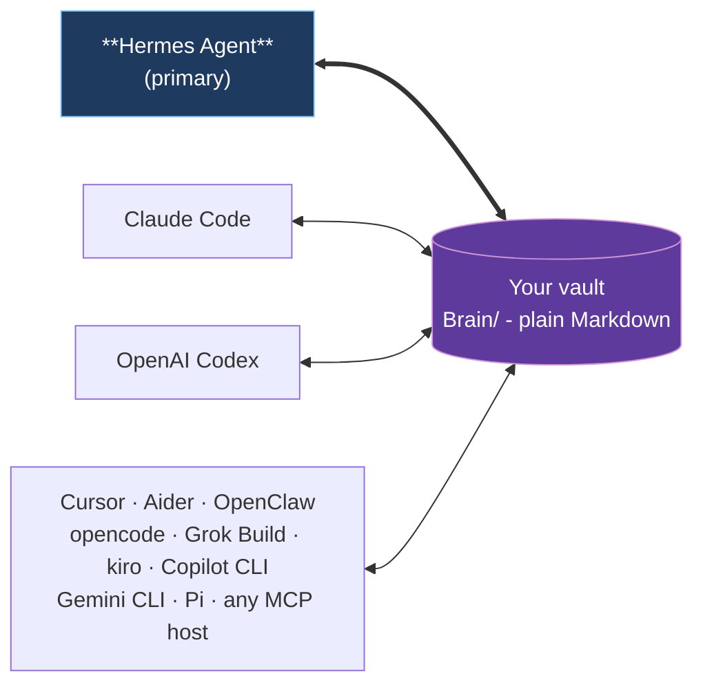

You are a senior backend architecture consultant for Open Second Brain.

Return EXACTLY these sections and nothing else:

## Variant 1
Approach: 2-3 sentences.
Trade-offs:
- bullet
- bullet
Complexity: small|medium|large
Risk: low|medium|high

## Variant 2
Approach: 2-3 sentences.
Trade-offs:
- bullet
- bullet
Complexity: small|medium|large
Risk: low|medium|high

## Variant 3
Approach: 2-3 sentences.
Trade-offs:
- bullet
- bullet
Complexity: small|medium|large
Risk: low|medium|high

## Recommended: Variant N
2-3 sentence rationale.

No code. No sections outside the four sections above.

Context:
- Project: Open Second Brain; TypeScript on Bun; package version currently "version": "1.13.0",.
- Branch: feat/path-safe-vault-writes; release intent: one low-priority small patch-scope task, patch version later, no release in this phase.
- Scope: Path-safe vault writes. In-scope card: t_7b1049bb only.
- Engineering constraints: SOLID, KISS, DRY; no misleading fallbacks; no hardcoding; English-only project artifacts; language-agnostic behavior; no TypeScript cast crutches; TDD for implementation.
- Preserve pre-existing unrelated uncommitted changes: src/core/brain/morning-brief.ts and src/core/brain/time.ts.
- Current finding: code already has ensureInsideVault, src/core/brain/paths.ts path constructors, createNote containment, validateSlug for many Brain ids, but direct writers still exist and writeFrontmatter/writeFrontmatterAtomic do not themselves accept a containment root.

Task body:
```text
id:       t_7b1049bb
title:    [upstream:EverOS] Path-safe identifier sanitization and write-containment guard for vault writes
status:   triage   priority: 1   assignee: -
----- body -----
**Source**: https://github.com/EverMind-AI/EverOS/releases/tag/v1.0.1
**Repo**: EverMind-AI/EverOS (6886★)
**Released**: v1.0.1 (2026-06-16T13:50:05Z)

## What
Two layered path-traversal defenses for an agent-owned Markdown store. First, caller-supplied identifiers that become path segments (the upstream `sender_id`, analogous to any OSB-side identifier that feeds a filename or sub-path) are validated against a character whitelist and reject the `.` and `..` tokens, while still admitting `@` and `+` so email-style and plus-addressed ids pass. Second, the Markdown writer resolves every write target and rejects anything that lands outside the configured memory root before it reads, creates parent dirs, or writes; the API layer maps that backstop to HTTP 400.

## Why useful for OSB
Open Second Brain owns the `Brain/` subtree of an Obsidian vault and writes files whose names derive from slugs, topics, preference ids, and other partly-agent/partly-caller-supplied strings; a missing containment check could let a crafted slug or id escape `Brain/` and clobber user notes or files outside the vault. A resolve-and-contain guard in the single write path, plus identifier sanitization at the boundary, is a cheap defense-in-depth measure that matches Open Second Brain's "agent writes only inside its own directory" invariant.

## Status in OSB
- **Verdict**: unverified
- **Codegraph hints**: unverified — codegraph tool unavailable in this run; no mcp__codegraph__codegraph_* tool was exposed to the orchestrator, so OSB source coverage could not be checked.

## Notes
Verification needed: confirm whether Open Second Brain already centralizes vault writes through a single helper that resolves the target against the `Brain/` root (and `notes.read_paths` boundaries) and rejects `..`/absolute escapes, and whether slug/topic/pref-id generation already strips path separators and dot-tokens. If a single write chokepoint exists, this is likely a small hardening add; if writes are scattered, scope grows to routing them through one guarded function. Tie the containment root to the configured Brain directory rather than a hardcoded path, and keep the identifier whitelist language-agnostic (structural character classes, not natural-language wordlists).
----- last comments -----
[osb-triage-validator] osb-triage-validator @ 2026-06-17T14:00:55Z:
- sanity: clean
- cluster: no cluster
- priority: set to 1: verdict remains unverified because codegraph was unavailable in this run; security hardening si

```

Git status:
```text
## feat/path-safe-vault-writes
 M src/core/brain/morning-brief.ts
 M src/core/brain/time.ts
?? docs/brainstorm/path-safe-vault-writes/

```

Recent git log:
```text
bbc8af8 feat(brain): configurable feedback.default_scope for feedback signals
c841bd5 chore(brainstorm): default-scope-feedback
20ea7ef feat: per-handoff LLM generation tracing and prompt-prefix stability metric (#102)
9c1d48f feat: CodeGraph and MCP operational readability (v1.12.0) (#101)
c2c3ff4 feat: Session Knowledge Synthesis Suite - structured session summaries, idea-lineage, episodic note history (v1.11.0) (#100)
56dd3dd fix(hermes): bridge EOF - byte streams, stderr drain, retry loop (#92)
35b824e feat: Recall & Working-Memory Quality Suite - selectable profiles, usage decay, co-occurrence, file-context (v1.10.0) (#99)
929d54c feat: Brain Portability & Interop Suite - bank export/import, page contract, brain_create_note, in-process SDK (v1.9.0) (#98)
7cdbfc0 feat: Indexer Durability & Resilience Suite - cooperative abort, graceful watch shutdown, resumable reindex (v1.8.0) (#97)
8b679fe feat: Knowledge Provenance Suite - ingest, research, NER, derived facts, owner-scope, standing-query (v1.7.0) (#96)
6e59a42 feat: Vault Integrity & Trust Suite - untrusted-source containment, NFC identity, watch-sync, O(1) graph, agent-scope (v1.6.0) (#95)
70d95c6 chore(release): bump version to 1.5.0 (#94)
e4df212 feat: Search & Recall Quality Suite - explainable scores, trust, threshold, reinforce, eval (#93)
2e74afe feat: native Grok Build CLI integration - bundled plugin, hooks, session import (v1.4.0) (#91)
3e7e233 fix(hermes): serialize handle_tool_call result to a string (v1.3.1) (#90)
2abc90b fix(changelog): the opencode integration ships in v1.3.0, not a phantom 1.4.0 (#89)
96f1ff4 feat: native opencode integration - config-correct install, bundled plugin, session capture (#88)
0340560 feat: Continuity, Hygiene & Freshness Suite - session lineage, memory hygiene, anticipatory cache (v1.3.0) (#87)
8972f13 refactor: SOLID/DRY decomposition - domain modules, unified helpers, surface guards (v1.2.0) (#86)
6651228 refactor: language-agnostic fact extraction + README slim (v1.1.0) (#85)

```

README excerpt:
```markdown
# Open Second Brain


> An [Obsidian](https://obsidian.md)-native memory layer for your AI agent. Plain Markdown you own, in the same vault you already use.

Open Second Brain plugs into [Hermes Agent](https://github.com/NousResearch/hermes-agent) and turns your Obsidian vault into a memory layer the agent reads and writes through deterministic CLI / MCP tools. Preferences, signals, evidence, and audit trails are real `.md` files under `Brain/` in the vault you already open in Obsidian every day. You can grep them, version them with git, search them in Obsidian, edit them by hand. No daemon, no vector black box, no hidden state outside the vault.

## Why

- **Lives in your Obsidian vault.** Open `Brain/preferences/pref-no-internal-abbrev.md` in Obsidian and you literally see what your agent learned about you - title, status, evidence count, confidence band, body text. Wikilinks, backlinks, graph view all work.
- **You own the data.** Plain Markdown on your filesystem. No service to cancel, no cloud account, no schema migration when a vendor pivots. Syncthing to your other machines if you want.
- **Memory that learns deterministically.** A `dream` pass turns repeat signals into rules and retires the ones nothing applies any more. Counters and atomic file moves - no LLM inside the algorithm, no surprise hallucinations in your memory.
- **One vault, every agent.** Hermes Agent is the primary integration. Claude Code, OpenAI Codex, Cursor, Aider, OpenClaw, opencode, Grok Build, kiro, Copilot CLI, Gemini CLI, and Pi all plug into the same Brain through MCP.

## One vault, many runtimes



Hermes Agent owns the schedule (dream cron, daily digests, Telegram delivery). Other runtimes participate as readers and writers of the same Brain through MCP - no per-runtime fork of the memory.

## Quick start with Hermes Agent

**The simplest path - let your agent set it up.** Paste this into Hermes (or whichever AI agent already has shell access on the target machine):

> Install Open Second Brain for me by following the steps at <https://github.com/itechmeat/open-second-brain/blob/main/install/hermes.md>. My vault is at `/path/to/your-vault`.

The agent reads the install doc, runs every command, and verifies the result. That's it.

If you prefer running the steps yourself:

```bash
# 1. Install the plugin
hermes plugins install itechmeat/open-second-brain --enable
hermes gateway restart

# 2. Put `o2b` on PATH
~/.hermes/plugins/open-second-brain/scripts/o2b install-cli

# 3. Bootstrap the vault
o2b init       --vault /path/to/your-vault --name "My Second Brain"
o2b brain init --vault /path/to/your-vault --primary-agent <agent-name>

# 4. Verify
o2b doctor --vault /path/to/your-vault
```

Enable Open Second Brain as the memory provider in `~/.hermes/config.yaml` (`memory.provider: open-second-brain`) and restart the gateway one more time - the agent now injects `Brain/active.md` into its system prompt, recalls context before each turn, and writes signals through `brain_feedback`, all through the one native provider. Full step-by-step: [`install/hermes.md`](install/hermes.md).

## Other runtimes

| Runtime                                                          | Install                                                                                             |
| ---------------------------------------------------------------- | --------------------------------------------------------------------------------------------------- |
| Claude Code                                                      | Marketplace plugin (bundled `.mcp.json` + hooks) - [`install/claudecode.md`](install/claudecode.md) |
| OpenAI Codex                                                     | `codex plugin marketplace add ...` - [`install/codex.md`](install/codex.md)                         |
| OpenClaw                                                         | Native JS plugin, no MCP needed - [`install/openclaw.md`](install/openclaw.md)                      |
| opencode                                                         | `o2b install --target opencode --apply` (MCP servers + native plugin) - [`install/opencode.md`](install/opencode.md) |
| Grok Build                                                       | `o2b install --target grok --apply` (MCP in `config.toml` + native hooks) - [`install/grok.md`](install/grok.md) |
| Cursor · Aider · kiro · Copilot CLI · Gemini CLI · Pi            | `o2b install --target <name> --apply` - see [`install/`](install/)                                  |
| Any other MCP host                                               | `o2b install --target generic --apply` - [`install/generic.md`](install/generic.md)                 |

Each non-Hermes target writes a sidecar manifest under `<vault>/.open-second-brain/install.lock.json` so `o2b uninstall --target <name> --apply` removes exactly what it added.

## What you get

```

Top CHANGELOG entry:
```markdown
# Changelog

All notable changes to this project will be documented in this file.

The format is based on [Keep a Changelog](https://keepachangelog.com/en/1.1.0/),
and this project adheres to [Semantic Versioning](https://semver.org/spec/v2.0.0.html).

## [Unreleased]

### Added

- **Configurable default scope for feedback signals
  (`feedback.default_scope`).** A vault-local default applied to
  `brain_feedback` / `o2b brain feedback` writes that pass no explicit
  `scope`, so agent-recorded signals can land in a consistent category
  (for example `coding`) instead of staying uncategorized. The rule is a
  single precedence at the signal write boundary: an explicit per-call
  scope always wins; otherwise the configured default is used; otherwise
  the `scope` field is omitted exactly as before. With no
  `feedback.default_scope` configured and no explicit scope, signal
  output is byte-identical to prior behaviour.
  - **Config block.** Optional `feedback:` block in `Brain/_brain.yaml`
    with a `default_scope` string, validated through the normal Brain
    config policy against the same constraints as a signal `scope` field
    (non-empty after trim, single-line, at most 128 characters). Invalid
    values are rejected by config validation and surfaced by
    `o2b brain doctor` rather than silently ignored.
  - **Parity across surfaces.** The effective scope is computed once and
    reused for the inbox signal, its shared-namespace mirror, and any
    force-confirmed preference, so a preference never diverges in scope
    from the signal that produced it. Distinct from the `owner_scoped_facts`
    and vault guardrail settings, which govern fact visibility rather than
    feedback categorization.

```

Docs excerpts:
```markdown
### docs/architecture.md
# Architecture

Open Second Brain is organized around a stable core and multiple runtime adapters.

## Layers

```text
Agent runtime
  -> runtime adapter/plugin
    -> skills and commands
      -> CLI/core library
        -> vault files and local config
```

## Core responsibilities

The core (`src/core/`) provides deterministic operations for:

- locating and validating configuration;
- initializing a vault profile (`o2b brain init`);
- recording taste signals, applied-evidence, and narrative milestones into `Brain/log/<YYYY-MM-DD>.md` (plus a JSONL sidecar);
- running the nightly `dream` learning pass (deterministic, no LLM calls);
- exporting redacted config snapshots;
- checking vault health (`o2b brain doctor`);
- querying preferences, signals, and link-graph relationships through the MCP and CLI surface.

The core does not depend on Hermes, Claude Code, Codex, OpenClaw, or Obsidian internals.

## Runtime adapters

### Hermes adapter

The Hermes adapter can be a real runtime plugin:

```text
plugins/hermes/
  plugin.yaml
  __init__.py
```

Possible responsibilities:

- register available hooks;
- check configuration at gateway startup;
- expose readiness diagnostics;
### docs/how-it-works.md
# How Open Second Brain Works

A working guide for engineers and agents to the mechanics of the
observing memory layer. Read this when you want to understand what the
system does, not what to configure.

## Mental model

Open Second Brain accumulates **preferences** and learns from real
usage. Three responsibilities:

- **Capture.** Agents and humans drop taste signals into `Brain/inbox/`.
- **Accretion.** A deterministic `dream` pass turns repeat signals into
  rules.
- **Application.** Agents record whether they applied or violated each
  rule when producing durable artifacts.

The LLM lives outside the system: agents use it to detect signals in
conversation and to apply rules during work. The system uses counters,
thresholds, and atomic file operations — no LLM inside the algorithm,
no surprise, no hallucinated memory.

## Vault layout

The agent owns one top-level directory in the vault: `Brain/`, so the
agent's entire write contract is "I touch only `Brain/`".

```text
<vault>/
├── Brain/                          # agent-writable
│   ├── _brain.yaml                 # schema, thresholds, retention, vault.ignore_paths, notes.read_paths
│   ├── _BRAIN.md                   # operating manual for agents
│   ├── active.md                   # derived: confirmed + quarantine + recently retired
│   ├── inbox/                      # raw taste signals
│   │   ├── sig-<date>-<slug>.md
│   │   └── processed/              # signals already folded into rules
│   ├── preferences/                # active rules
│   │   └── pref-<slug>.md          # status: unconfirmed | confirmed | quarantine
│   ├── retired/                    # archived rules
│   │   └── ret-<slug>.md           # retired_reason: stale-no-evidence | expired-unconfirmed | rebutted | user-rejected | quarantine-violated | superseded-by-context
│   ├── log/                        # daily event log
│   │   └── YYYY-MM-DD.md           # append-only, typed events
│   └── .snapshots/                 # pre-dream snapshots
│       └── dream-<run-id>.tar.zst
│
### docs/mcp.md
# MCP tool server

The optional Model Context Protocol (MCP) server exposes Open Second Brain's
deterministic operations as tools that Hermes Agent (or any other MCP client)
can route through its tool registry.

The server is **optional**: the `o2b` CLI remains the supported baseline. Nothing
in Open Second Brain depends on the MCP server being running.

## Protocol

- Transport: stdio (JSON-RPC 2.0, newline-delimited).
- Protocol version: `2025-06-18`.
- Capabilities advertised: `tools` and `resources` (see "Resources"
  below). No `prompts` or `sampling`.
- Standard MCP lifecycle: `initialize`, `notifications/initialized`,
  `tools/list`, `tools/call`, optional `ping`.

## Tool Highlights

The full server currently advertises 79 tools; the 18 deprecated predecessor
names were removed in 1.0.0 and now answer a precise INVALID_PARAMS tombstone
(see "Consolidated views and deprecated aliases" below). The table highlights
the operator-facing core,
schema, agent-source, health, and recovery tools; the full surface
also includes Brain writer, review, query, temporal, link-graph, and search
tools. In Claude Code, the full schema can push MCP definitions beyond 10% of
the context window, causing `MCPSearch` tool-search deferral; use the writer
split below for the always-loaded writer subset, or the runtime capability
flags for a narrower per-process full server.

| Tool                        | Purpose                                                                                                                                        | Required arguments                             |
| --------------------------- | ---------------------------------------------------------------------------------------------------------------------------------------------- | ---------------------------------------------- |
| `second_brain_capabilities` | Report the tools available to this MCP process and the withheld-tool reasons after runtime capability filtering.                               | —                                              |
| `second_brain_status`       | Report config and vault status, with secrets redacted.                                                                                         | —                                              |
| `second_brain_query`        | List vault pages with an optional case-insensitive title substring.                                                                            | —                                              |
| `vault_health`              | Run vault, config, and plugin manifest health checks.                                                                                          | —                                              |
| `brain_health`              | Run semantic Brain Health checks and return the health verdict/domains.                                                                        | —                                              |
| `brain_mcp_landscape`       | List the MCP servers configured across the vault: name, source config file, packages, and required env-var names. Env values never read.       | —                                              |
| `brain_codegraph_report`    | Read-only codegraph partner report: in-scope code project, index state (`no_project`/`absent`/`not_indexed`/`indexed` with counts/`error`), and structural `Cargo.toml` workspace members. Never installs, extracts, or mutates; non-Rust projects report `cargo_workspace: null` with a reason. | —                                              |
| `brain_agent_query`         | Read-only source-agent retrieval over Brain provenance. Filters by agents, topic, free-text query, contribution kind, and limit.               | —                                              |
| `brain_agent_diff`          | Read-only comparison between source agents using browse/search/diff/map modes over the same provenance foundation.                             | —                                              |
| `brain_audit`               | Read-only per-preference mutation trail (create / promote / update / retire / merge) with agent, reason, revision + content-hash before/after. | `pref_id`                                      |
| `brain_brief`               | Read-only Brain summary for any window: `view: morning \| daily \| weekly \| monthly \| operator \| digest`.                                   | `view`                                         |
| `brain_analytics`           | Read-only Brain analytics for any lens: `view: timeline \| attention_flows \| belief_evolution \| concept_synthesis`.                          | `view`                                         |
```

Active Brain preferences relevant excerpt:
```markdown
- `pref-full-product-name-in-public` (scope: writing, confidence: medium (0.51)) — В публичных материалах Open Second Brain (release notes, README, документация, code comments, agent skills, картинки, CHANGELOG) использовать полное название "Open Second Brain", не аббревиатуру "OSB". Аббревиатуру "OSB" оператор использует только в личной переписке для краткости.
- `pref-language-agnostic-search` (scope: coding, confidence: low) — Поиск и классификация в Open Second Brain должны быть языко-независимыми: нельзя гейтить, классифицировать, ранжировать или извлекать поведение по захардкоженным спискам слов естественного языка (приветствия, стоп-слова, ключевые слова, отрицания) — ни на одном языке. Вместо этого: структурные сигналы, явные поля frontmatter, частота в корпусе (document-frequency/IDF), либо извлечение агентом/LLM.
- `pref-no-em-dashes` (scope: writing, confidence: low) — Never use long (em) dashes in generated texts (posts, docs, copy, любые материалы). Use a regular hyphen, colon, or restructure the sentence instead.
- `pref-no-em-dashes-ever` (scope: writing, confidence: low) — Никогда не использовать длинные тире (em dash) в любых текстах: чат, документы, комментарии, релизы. Заменять обычным дефисом, запятой или перестройкой фразы. Правило вечное, заявлено оператором явно.
- `pref-no-em-dashes-russian-writing` (scope: writing, confidence: low (0.14)) — Forbidden to use em-dashes (long dashes, U+2014 «—») in Russian-language content I write for this user — blog posts, documentation, Telegram messages, any user-facing prose. Use regular hyphens with surrounding spaces ( - ) instead. This applies to ALL Russian writing for them, not just one post. The rule is explicit and was reinforced by manual file edits replacing every em-dash with a hyphen.
- `pref-no-typescript-cast-crutches` (scope: coding, confidence: low) — Forbidden to use `as` / `as unknown as <T>` TypeScript casts as a shortcut to silence type errors caused by inadequate object construction. Build the value with the correct type from the start — use object literals with conditional spreads (`...(value !== undefined ? { field: value } : {})`), narrowing functions that return the correct literal type, or split builders. `as` is a code smell indicating the value's construction shape doesn't match the contract; fix the construction, don't cast around it. Exceptions: legitimate framework boundaries (e.g. JSON.parse → typed shape after validation), `as const` for literal narrowing, `satisfies` for shape checks.
- `pref-self-review-after-implementation` (scope: coding, confidence: low (0.21)) — После фазы implementation (TDD) обязательна отдельная фаза self-review через superpowers-skills: `superpowers:requesting-code-review` (security scan, quality gates, auto-fix) и `superpowers:verification-before-completion` (запуск verification commands и подтверждение output перед claim success). Self-review предшествует QA и созданию PR.
- `pref-version-bump-via-sync-script` (scope: git, confidence: low) — В этом репозитории версию бампать только через `bun run scripts/sync-version.ts`: единственный источник правды - поле version в package.json, скрипт пробрасывает её в манифесты (plugin.yaml, .claude-plugin/.codex-plugin/openclaw json) и pyproject.toml. Руками править версию в зеркальных файлах нельзя - CI-джоба validate гейтит на `sync-version.ts --check` и падает на дрейфе до всех остальных проверок.
- `pref-full-product-name-in-public` (scope: writing, applied_in_window: 51)
- `pref-no-typescript-cast-crutches` (scope: coding, applied_in_window: 14)
- `pref-no-em-dashes-ever` (scope: writing, applied_in_window: 13)
- `pref-self-review-after-implementation` (scope: coding, applied_in_window: 12)
- `pref-no-em-dashes-russian-writing` (scope: writing, applied_in_window: 9)
- `pref-language-agnostic-search` (scope: coding, applied_in_window: 8)
```

Related file excerpts:
### src/core/path-safety.ts lines 1-144
```ts
/**
 * Path-safety helpers shared by every module that writes into the vault.
 *
 * Centralises the "is this path inside the vault?" check and a reusable
 * vault-relative path renderer. Every module that constructs a path to
 * write must funnel through `ensureInsideVault` so a malicious or buggy
 * input (e.g. a slug with `..`, an absolute symlink target) cannot land a
 * file outside the vault root.
 */

import { existsSync, realpathSync } from "node:fs";
import { dirname, posix, relative, resolve, sep } from "node:path";

/**
 * Throw if `target` is not the vault root or a descendant of it.
 *
 * The check is twofold:
 *
 *   1. `path.resolve` normalises `..` so a slug like `../etc/passwd`
 *      cannot pretend to be inside the vault. The platform path
 *      separator (`/` or `\`) is used for the prefix check so siblings
 *      that share a name prefix (`/v` vs `/v-evil`) are rejected.
 *   2. `fs.realpathSync` follows symlinks for the deepest existing
 *      ancestor of the target, then re-runs the prefix check on the
 *      resolved real paths. This blocks the case where a directory
 *      *inside* the vault is itself a symlink to somewhere outside it
 *      (`<vault>/Brain/payments/escape -> /tmp/outside`) — without
 *      realpath, the lexical check would happily admit the path.
 *
 * Returns the resolved (lexical) absolute path of `target`. Callers that
 * need the realpath should call `realpathSync` themselves on the result;
 * we deliberately return the lexical form so wikilinks rendered from it
 * keep matching what the user sees in Obsidian.
 */
export function ensureInsideVault(target: string, vault: string): string {
  const resolvedTarget = resolve(target);
  const resolvedVault = resolve(vault);

  if (!isLexicallyInside(resolvedTarget, resolvedVault)) {
    throw new Error(`path escapes vault: ${target}`);
  }

  // Realpath protection only matters when the vault actually exists on
  // disk — otherwise there is no symlink to follow. Pure-lexical inputs
  // (used by unit tests) skip this branch and rely on step 1 above.
  if (existsSync(resolvedVault)) {
    const realVault = safeRealpath(resolvedVault);
    const realAncestor = safeRealpath(deepestExistingAncestor(resolvedTarget));
    if (!isLexicallyInside(realAncestor, realVault)) {
      throw new Error(`path escapes vault via symlink: ${target}`);
    }
  }

  return resolvedTarget;
}

function isLexicallyInside(target: string, root: string): boolean {
  // Windows file paths are case-insensitive at the filesystem level —
  // `C:\Vault\x.md` and `c:\vault\x.md` resolve to the same inode. Doing
  // a case-sensitive string compare on Windows would falsely reject a
  // user's lower-cased argument against a vault stored with the canonical
  // capitalisation. POSIX stays case-sensitive.
  const t = process.platform === "win32" ? target.toLowerCase() : target;
  const r = process.platform === "win32" ? root.toLowerCase() : root;
  return t === r || t.startsWith(r + sep);
}

function deepestExistingAncestor(target: string): string {
  let cur = target;
  // Walk up until we hit a path that exists. `dirname` of a top-level
  // path returns itself; the loop terminates either at the first existing
  // ancestor (the common case — vault root exists) or at the root.
  while (!existsSync(cur)) {
    const parent = dirname(cur);
    if (parent === cur) return cur;
    cur = parent;
  }
  return cur;
}

function safeRealpath(p: string): string {
  // realpath throws on non-existent paths and on permission failure.
  // For non-existent we fall back to the lexical form (the
  // `deepestExistingAncestor` walk above tries to avoid this case);
  // for permission failure we surface the error so the caller learns
  // about it instead of silently disabling symlink protection.
  try {
    return realpathSync(p);
  } catch (err) {
    if ((err as NodeJS.ErrnoException)?.code === "ENOENT") return p;
    throw err;
  }
}

/**
 * Convert an OS-native path to POSIX form (forward slashes).
 *
 * Returns the input unchanged on POSIX hosts (`sep === "/"`); on
 * Windows, replaces every `\\` separator with `/`. Used by the
 * vault walkers when they project absolute or vault-relative OS
 * paths into the POSIX form that `matchIgnore` and Obsidian
 * wikilinks both expect.
 */
export function toPosix(p: string): string {
  return sep === "/" ? p : p.split(sep).join("/");
}

/**
 * Canonical vault-relative note identity: forward-slash POSIX form plus
 * Unicode NFC.
 *
 * The same note has byte-different vault-relative paths across devices:
 * macOS (APFS/HFS+) stores filenames decomposed (NFD), while Linux and
 * Android store them precomposed (NFC). On a Syncthing peer set that
 * splits one note into two identities, defeating incremental-index
 * change detection (constant re-index churn) and surfacing phantom
 * cross-device duplicates. Funnelling every path that keys a note's
 * identity (the index change-detection key, provenance stamping)
 * through this helper collapses both forms to one NFC identity.
 *
 * Idempotent: an already-POSIX, already-NFC path - the Linux common
 * case - returns byte-identical, so the normalisation is invisible on
 * the dominant platform and only the macOS NFD path actually converges.
 */
export function canonicalNotePath(p: string): string {
  return toPosix(p).normalize("NFC");
}

/**
 * Vault-relative path with forward slashes.
 *
 * Markdown rendering and Obsidian wikilinks both want forward slashes
 * regardless of host OS, so we collapse Windows-style backslashes to
 * `/`. Returns the input unchanged if it is not inside the vault — that
 * guards `ensureInsideVault` callers that want to display the rejected
 * path back to the user without crashing.
 */
export function vaultRelative(target: string, vault: string): string {
  const rel = relative(resolve(vault), resolve(target));
  return rel
    .split(/[\\/]/)
    .filter((p) => p.length > 0)
    .join(posix.sep);
}
```
### src/core/vault.ts lines 120-220
```ts
/**
 * Write a Markdown file with YAML-like frontmatter. Lists are serialized as
 * inline arrays. Scalars that would break the simple parser are quoted and
 * standard control chars are escaped.
 *
 * This variant is non-atomic — used for non-critical writes where a torn
 * file on crash is acceptable (the regenerated `index.md` would just be
 * rebuilt next run; the bootstrap files are templates that can be
 * re-emitted). For writes that must survive concurrent agents and
 * crashes, use `writeFrontmatterAtomic` instead.
 */
export function writeFrontmatter(path: string, metadata: FrontmatterMap, body: string): void {
  mkdirSync(dirname(path), { recursive: true });
  writeFileSync(path, formatFrontmatter(metadata, body), "utf8");
}

export interface WriteFrontmatterAtomicOptions {
  /**
   * When `true`, overwrite an existing target atomically (`rename(2)`).
   * When `false` (default), fail with an `EEXIST`-shaped Error if the
   * target already exists, atomically (`link(2)` semantics).
   */
  readonly overwrite?: boolean;
  /**
   * Optional human-readable label for the artifact kind (e.g. `"receipt"`,
   * `"asset"`, `"pending request"`). When the underlying write hits
   * `EEXIST` and `overwrite` is false, the resulting error message becomes
   * `"<kind> already exists: <path>"` instead of the raw `EEXIST: ...`.
   * The label is purely cosmetic — callers that don't supply it get the
   * native errno error.
   */
  readonly existsErrorKind?: string;
  /** Vault root used to render the relative path in the EEXIST message. */
  readonly vaultForRelativePath?: string;
}

/**
 * Atomic frontmatter writer with optional exclusive-create semantics.
 *
 * Used by the Brain writers where:
 *   - the file must not be torn on crash → atomic rename/link;
 *   - "refuse to overwrite" must be race-free across concurrent processes
 *     (CLI + MCP server, multiple agents) → exclusive `link(2)` instead
 *     of the TOCTOU-prone `existsSync` + `writeFileSync` pair.
 *
 * On EEXIST the function throws either:
 *   - the native `Error & { code: "EEXIST" }` when no `existsErrorKind`
 *     was supplied (matches the underlying `link(2)` semantics so callers
 *     that want to inspect `err.code` still can), or
 *   - a friendlier `Error("<kind> already exists: <relative-path>")`
 *     when `existsErrorKind` was supplied — saves every caller from
 *     re-implementing the same try/catch.
 */
export function writeFrontmatterAtomic(
  path: string,
  metadata: FrontmatterMap,
  body: string,
  opts: WriteFrontmatterAtomicOptions = {},
): void {
  const contents = formatFrontmatter(metadata, body);
  if (opts.overwrite) {
    atomicWriteFileSync(path, contents);
    return;
  }
  try {
    atomicCreateFileSyncExclusive(path, contents);
  } catch (err) {
    if (opts.existsErrorKind && (err as NodeJS.ErrnoException)?.code === "EEXIST") {
      const rel = opts.vaultForRelativePath
        ? path.startsWith(opts.vaultForRelativePath + "/")
          ? path.slice(opts.vaultForRelativePath.length + 1)
          : path
        : path;
      throw new Error(`${opts.existsErrorKind} already exists: ${rel}`, { cause: err });
    }
    throw err;
  }
}

/**
 * Convert a free-form title to a URL-safe slug. Lowercase, alphanumeric
 * runs joined by `-`, trimmed to 64 chars. Empty / non-ASCII inputs fall
 * back to "note".
 */
export function slugify(value: string): string {
  const lowered = value.trim().toLowerCase();
  let slug = lowered.replace(SLUG_INVALID_RE, "-").replace(/^-+|-+$/g, "");
  if (!slug) slug = "note";
  slug = slug.slice(0, SLUG_MAX_LEN).replace(/-+$/, "");
  return slug || "note";
}

/**
 * Extract unique `[[wikilink]]` targets from Markdown content. Skips media
 * file extensions and links inside fenced or inline code blocks.
 */
export function extractWikilinks(content: string): string[] {
  const masked = content.replace(CODE_BLOCK_RE, " ");
  const seen = new Set<string>();
  const result: string[] = [];
  for (const m of masked.matchAll(WIKILINK_TARGET_RE)) {
```
### src/core/brain/paths.ts lines 140-230
```ts
/** Path of the transient current-task scratchpad read by `brain_context`. */
export function brainPinnedPath(vault: string): string {
  return ensureInsideVault(join(brainDirs(vault).brain, BRAIN_PINNED_FILE), vault);
}

/** Active-signal path: `Brain/inbox/sig-<date>-<slug>.md`. */
export function signalPath(vault: string, date: string, slug: string): string {
  const d = validateIsoDate(date);
  const s = validateSlug(slug);
  return ensureInsideVault(join(brainDirs(vault).inbox, `sig-${d}-${s}.md`), vault);
}

/** Processed-signal path: `Brain/inbox/processed/sig-<date>-<slug>.md`. */
export function processedSignalPath(vault: string, date: string, slug: string): string {
  const d = validateIsoDate(date);
  const s = validateSlug(slug);
  return ensureInsideVault(join(brainDirs(vault).processed, `sig-${d}-${s}.md`), vault);
}

/** Preference path: `Brain/preferences/pref-<slug>.md`. */
export function preferencePath(vault: string, slug: string): string {
  const s = validateSlug(slug);
  return ensureInsideVault(join(brainDirs(vault).preferences, `pref-${s}.md`), vault);
}

/** Ingested source summary page: `Brain/sources/src-<slug>.md`. */
export function sourcePagePath(vault: string, slug: string): string {
  const s = validateSlug(slug);
  return ensureInsideVault(join(vault, BRAIN_SOURCES_REL, `src-${s}.md`), vault);
}

/** Cited research report page: `Brain/reports/<date>-<slug>.md`. */
export function reportPagePath(vault: string, date: string, slug: string): string {
  const d = validateIsoDate(date);
  const s = validateSlug(slug);
  return ensureInsideVault(join(vault, BRAIN_REPORTS_REL, `${d}-${s}.md`), vault);
}

/**
 * Per-preference edit-history sidecar: `Brain/preferences/pref-<slug>.history.jsonl`.
 * Lives next to the preference file; never enters the search index
 * because the walker only yields `.md` files.
 */
export function preferenceHistoryPath(vault: string, slug: string): string {
  const s = validateSlug(slug);
  return ensureInsideVault(join(brainDirs(vault).preferences, `pref-${s}.history.jsonl`), vault);
}

/** Retired-preference path: `Brain/retired/ret-<slug>.md`. */
export function retiredPath(vault: string, slug: string): string {
  const s = validateSlug(slug);
  return ensureInsideVault(join(brainDirs(vault).retired, `ret-${s}.md`), vault);
}

/** Pending skill-proposal path: `Brain/skill-proposals/pending/prop-<slug>.md`. */
export function skillProposalPendingPath(vault: string, slug: string): string {
  const s = validateSlug(slug);
  return ensureInsideVault(join(vault, BRAIN_SKILL_PROPOSALS_PENDING_REL, `prop-${s}.md`), vault);
}

/** Accepted skill-proposal archive path: `Brain/skill-proposals/accepted/prop-<slug>.md`. */
export function skillProposalAcceptedPath(vault: string, slug: string): string {
  const s = validateSlug(slug);
  return ensureInsideVault(join(vault, BRAIN_SKILL_PROPOSALS_ACCEPTED_REL, `prop-${s}.md`), vault);
}

/** Rejected skill-proposal archive path: `Brain/skill-proposals/rejected/prop-<slug>.md`. */
export function skillProposalRejectedPath(vault: string, slug: string): string {
  const s = validateSlug(slug);
  return ensureInsideVault(join(vault, BRAIN_SKILL_PROPOSALS_REJECTED_REL, `prop-${s}.md`), vault);
}

/** Accepted procedure reference path: `Brain/procedures/proc-<slug>.md`. */
export function procedurePath(vault: string, slug: string): string {
  const s = validateSlug(slug);
  return ensureInsideVault(join(vault, BRAIN_PROCEDURES_REL, `proc-${s}.md`), vault);
}

/** Procedural-memory index path: `Brain/procedural-memory/index.json`. */
export function proceduralMemoryIndexPath(vault: string): string {
  return ensureInsideVault(join(vault, BRAIN_PROCEDURAL_MEMORY_REL, "index.json"), vault);
}

/** Procedural-memory usage sidecar path: `Brain/procedural-memory/usage.jsonl`. */
export function proceduralMemoryUsagePath(vault: string): string {
  return ensureInsideVault(join(vault, BRAIN_PROCEDURAL_MEMORY_REL, "usage.jsonl"), vault);
}

/** Procedural graph projection path: `Brain/procedural-memory/graph.json`. */
export function proceduralGraphPath(vault: string): string {
  return ensureInsideVault(join(vault, BRAIN_PROCEDURAL_MEMORY_REL, "graph.json"), vault);
```
### src/core/brain/notes/create-note.ts lines 1-122
```ts
/**
 * createNote primitive (Brain Portability & Interop suite, Unit D).
 *
 * The single write primitive behind the `brain_create_note` MCP tool and
 * the SDK `createNote` method. It writes one Markdown note atomically,
 * funnelled through `ensureInsideVault`, and refuses - with a typed
 * {@link CreateNoteError}, never a silent skip - any path that is not a
 * `.md` file, traverses outside the vault, lands in the Brain machinery
 * root, is excluded by the vault scope, or would clobber an existing
 * file. Refusing loudly is deliberate: a connected agent must learn its
 * write was rejected rather than believe a note exists when it does not.
 */

import { mkdirSync } from "node:fs";
import { dirname, join, posix } from "node:path";

import type { FrontmatterMap } from "../../types.ts";
import { ensureInsideVault } from "../../path-safety.ts";
import { writeFrontmatterAtomic } from "../../vault.ts";
import { inspectPath, resolveVaultScope } from "../../vault-scope/index.ts";
import { BRAIN_ROOT_REL } from "../paths.ts";

/** Machine-readable reason a {@link createNote} call was refused. */
export type CreateNoteErrorCode = "invalid_path" | "excluded" | "exists" | "outside_vault";

export class CreateNoteError extends Error {
  readonly code: CreateNoteErrorCode;
  constructor(code: CreateNoteErrorCode, message: string) {
    super(message);
    this.name = "CreateNoteError";
    this.code = code;
  }
}

export interface CreateNoteInput {
  /** Vault-relative target path; must end in `.md`. */
  readonly path: string;
  /** Optional frontmatter map written above the body. */
  readonly frontmatter?: FrontmatterMap;
  /** Optional Markdown body. */
  readonly content?: string;
}

export interface CreateNoteResult {
  /** Vault-relative POSIX path of the created note. */
  readonly path: string;
  readonly created: true;
}

/**
 * Create one Markdown note in the vault. Returns the created note's
 * vault-relative path; throws {@link CreateNoteError} on any refusal.
 */
export function createNote(vault: string, input: CreateNoteInput): CreateNoteResult {
  if (!input.path.toLowerCase().endsWith(".md")) {
    throw new CreateNoteError("invalid_path", `note path must end in .md: ${input.path}`);
  }
  // The tool addresses notes by a vault-relative path; an absolute path is
  // ambiguous (which root?) and is refused rather than silently re-rooted.
  if (input.path.startsWith("/") || input.path.startsWith("\\")) {
    throw new CreateNoteError("invalid_path", `note path must be vault-relative: ${input.path}`);
  }

  // inspectPath normalises the relative path and throws on `..` traversal;
  // an absolute path also has no place here. Translate both into a typed
  // CreateNoteError so callers get one error surface.
  const scope = resolveVaultScope(vault);
  let inspected;
  try {
    inspected = inspectPath(input.path, scope, vault);
  } catch (err) {
    throw new CreateNoteError("invalid_path", err instanceof Error ? err.message : String(err));
  }
  const relPath = inspected.relPath;
  if (relPath === "") {
    throw new CreateNoteError("invalid_path", `empty note path: ${input.path}`);
  }

  // The Brain machinery root is owned by the brain's own writers; a
  // free-form note tool must never author into it (default vault-scope
  // rules ignore Brain/.snapshots only, not the whole Brain root).
  const firstSegment = relPath.split("/")[0];
  if (firstSegment === BRAIN_ROOT_REL) {
    throw new CreateNoteError(
      "excluded",
      `the Brain machinery root is not writable via create_note: ${relPath}`,
    );
  }

  if (inspected.excluded) {
    throw new CreateNoteError(
      "excluded",
      `path is excluded by vault scope (${inspected.rule?.raw ?? "rule"}): ${relPath}`,
    );
  }

  let abs: string;
  try {
    abs = ensureInsideVault(join(vault, relPath), vault);
  } catch (err) {
    throw new CreateNoteError("outside_vault", err instanceof Error ? err.message : String(err));
  }

  mkdirSync(dirname(abs), { recursive: true });
  try {
    writeFrontmatterAtomic(abs, input.frontmatter ?? {}, input.content ?? "", {
      overwrite: false,
      existsErrorKind: "note",
      vaultForRelativePath: vault,
    });
  } catch (err) {
    const code = (err as NodeJS.ErrnoException)?.code;
    const exists =
      code === "EEXIST" || (err instanceof Error && /already exists/.test(err.message));
    if (exists) {
      throw new CreateNoteError("exists", `note already exists: ${relPath}`);
    }
    throw err;
  }

  return { path: relPath.split(/[\\/]/).join(posix.sep), created: true };
}
```
### tests/core/path-safety.test.ts lines 1-98
```ts
import { afterEach, beforeEach, describe, expect, test } from "bun:test";
import { mkdirSync, mkdtempSync, rmSync, symlinkSync, writeFileSync } from "node:fs";
import { tmpdir } from "node:os";
import { join, resolve } from "node:path";

import { ensureInsideVault, vaultRelative } from "../../src/core/path-safety.ts";

// Resolving `/v` produces a platform-appropriate absolute path:
// `/v` on POSIX, `C:\v` (or the current drive) on Windows. Building all
// fixtures off this anchor keeps the assertions portable across both
// without baking POSIX separators into the test inputs.
const VAULT = resolve("/v");
const SIBLING = resolve("/v-evil");
const OUTSIDE = resolve("/etc/passwd");

describe("ensureInsideVault", () => {
  test("accepts the vault root itself", () => {
    expect(ensureInsideVault(VAULT, VAULT)).toBe(VAULT);
  });

  test("accepts descendants", () => {
    const target = join(VAULT, "Notes", "notes", "x.md");
    expect(ensureInsideVault(target, VAULT)).toBe(target);
  });

  test("rejects siblings sharing a name prefix", () => {
    // Without using `path.sep`, the naive `startsWith(vault + "/")` check
    // would happily admit `/v-evil/...` because `/v-evil` starts with `/v`
    // when concatenated. The fixed implementation rejects it.
    expect(() => ensureInsideVault(join(SIBLING, "x.md"), VAULT)).toThrow(/escapes vault/);
  });

  test("rejects paths that resolve outside the vault", () => {
    expect(() => ensureInsideVault(OUTSIDE, VAULT)).toThrow();
    expect(() => ensureInsideVault(join(VAULT, "..", "etc", "passwd"), VAULT)).toThrow();
  });

  test("returns the resolved absolute path", () => {
    const target = join(VAULT, "Notes", "x.md");
    expect(ensureInsideVault(target, VAULT)).toBe(target);
  });
});

describe("ensureInsideVault — realpath / symlink escape", () => {
  // These tests need real on-disk symlinks so realpath() can follow them;
  // the synthetic-path tests above exercise the lexical-only fast path.
  let tmp: string;
  let vault: string;
  let outside: string;

  beforeEach(() => {
    tmp = mkdtempSync(join(tmpdir(), "o2b-path-safety-real-"));
    vault = join(tmp, "vault");
    outside = join(tmp, "outside");
    mkdirSync(vault, { recursive: true });
    mkdirSync(outside, { recursive: true });
    writeFileSync(join(outside, "secret.md"), "secret\n");
  });

  afterEach(() => {
    rmSync(tmp, { recursive: true, force: true });
  });

  test("rejects a target whose ancestor is a symlink to outside the vault", () => {
    // <vault>/escape -> <outside>
    symlinkSync(outside, join(vault, "escape"), "dir");
    const target = join(vault, "escape", "secret.md");
    expect(() => ensureInsideVault(target, vault)).toThrow(/escapes vault via symlink/);
  });

  test("accepts a target inside a real subdirectory", () => {
    const sub = join(vault, "Notes");
    mkdirSync(sub, { recursive: true });
    expect(ensureInsideVault(join(sub, "x.md"), vault)).toBe(join(sub, "x.md"));
  });

  test("accepts a still-non-existent target whose existing ancestor is the vault itself", () => {
    // No symlink involved; just a fresh slug on a real vault. realpath
    // protection should not crash on a path component that doesn't exist
    // yet (the writer creates it after this check passes).
    expect(ensureInsideVault(join(vault, "Notes", "payments", "2026-05-10", "x.md"), vault)).toBe(
      join(vault, "Notes", "payments", "2026-05-10", "x.md"),
    );
  });
});

describe("vaultRelative", () => {
  test("renders descendant paths with forward slashes", () => {
    const target = join(VAULT, "Notes", "notes", "x.md");
    // The renderer always emits forward slashes, even when the host
    // separator is `\`, so wikilinks/Obsidian behave consistently.
    expect(vaultRelative(target, VAULT)).toBe("Notes/notes/x.md");
  });

  test("returns empty string for the vault root itself", () => {
    expect(vaultRelative(VAULT, VAULT)).toBe("");
  });
});
```
### tests/core/brain/notes/create-note.test.ts lines 1-100
```ts
/**
 * createNote primitive (Brain Portability & Interop suite, Unit D).
 *
 * The shared write primitive behind the `brain_create_note` MCP tool and
 * the SDK `createNote` method. Writes a Markdown note atomically under
 * `ensureInsideVault`, honouring vault-scope ignore rules and refusing
 * the Brain machinery root, path traversal, and clobbering an existing
 * file - every refusal is a typed `CreateNoteError`, never a silent skip.
 */

import { afterEach, beforeEach, describe, expect, test } from "bun:test";
import { existsSync, mkdtempSync, readFileSync, rmSync, writeFileSync, mkdirSync } from "node:fs";
import { tmpdir } from "node:os";
import { join } from "node:path";

import { createNote, CreateNoteError } from "../../../../src/core/brain/notes/create-note.ts";

let vault: string;
beforeEach(() => {
  vault = mkdtempSync(join(tmpdir(), "o2b-create-note-"));
});
afterEach(() => rmSync(vault, { recursive: true, force: true }));

describe("createNote", () => {
  test("writes a note with frontmatter and body, returns the vault-relative path", () => {
    const res = createNote(vault, {
      path: "Notes/New.md",
      frontmatter: { title: "New", tags: ["a", "b"] },
      content: "Hello body.",
    });
    expect(res.created).toBe(true);
    expect(res.path).toBe("Notes/New.md");
    const written = readFileSync(join(vault, "Notes/New.md"), "utf8");
    expect(written).toContain("title: New");
    expect(written).toContain("Hello body.");
  });

  test("creates intermediate directories", () => {
    createNote(vault, { path: "A/B/C/Deep.md", content: "x" });
    expect(existsSync(join(vault, "A/B/C/Deep.md"))).toBe(true);
  });

  test("allows a note with no frontmatter and no content", () => {
    const res = createNote(vault, { path: "Notes/Empty.md" });
    expect(res.created).toBe(true);
    expect(existsSync(join(vault, "Notes/Empty.md"))).toBe(true);
  });

  test("rejects a non-.md path with a typed error", () => {
    expect(() => createNote(vault, { path: "Notes/data.json", content: "x" })).toThrow(
      CreateNoteError,
    );
  });

  test("rejects path traversal with a typed error", () => {
    expect(() => createNote(vault, { path: "../escape.md", content: "x" })).toThrow(
      CreateNoteError,
    );
    expect(existsSync(join(vault, "..", "escape.md"))).toBe(false);
  });

  test("rejects an absolute path with a typed error", () => {
    expect(() => createNote(vault, { path: "/etc/evil.md", content: "x" })).toThrow(
      CreateNoteError,
    );
  });

  test("refuses to write into the Brain machinery root", () => {
    expect(() => createNote(vault, { path: "Brain/sneaky.md", content: "x" })).toThrow(
      CreateNoteError,
    );
    expect(existsSync(join(vault, "Brain/sneaky.md"))).toBe(false);
  });

  test("refuses a vault-scope excluded path", () => {
    expect(() => createNote(vault, { path: ".obsidian/plugins/x.md", content: "x" })).toThrow(
      CreateNoteError,
    );
  });

  test("refuses to clobber an existing note (no overwrite)", () => {
    mkdirSync(join(vault, "Notes"), { recursive: true });
    writeFileSync(join(vault, "Notes/Dup.md"), "original", "utf8");
    expect(() => createNote(vault, { path: "Notes/Dup.md", content: "new" })).toThrow(
      CreateNoteError,
    );
    // The original content is untouched.
    expect(readFileSync(join(vault, "Notes/Dup.md"), "utf8")).toBe("original");
  });

  test("the typed error carries a machine-readable code", () => {
    try {
      createNote(vault, { path: "../escape.md", content: "x" });
      throw new Error("expected throw");
    } catch (err) {
      expect(err).toBeInstanceOf(CreateNoteError);
      expect((err as CreateNoteError).code).toBe("invalid_path");
    }
  });
});
```
### tests/core/vault.test.ts lines 120-160
```ts
    writeFrontmatter(path, { summary: value }, "Body.");
    const [meta] = parseFrontmatter(path);
    expect(meta["summary"]).toBe(value);
  });

  test("inline array elements with quotes round-trip", () => {
    const path = join(tmp, "note.md");
    const tags = ["plain", 'say "hi"'];
    writeFrontmatter(path, { tags }, "Body.");
    const [meta] = parseFrontmatter(path);
    expect(meta["tags"]).toEqual(tags);
  });
});

describe("slugify", () => {
  test("lowercases and replaces punctuation", () => {
    expect(slugify("Hello, World!")).toBe("hello-world");
  });

  test("handles non-ASCII and empty inputs", () => {
    expect(slugify("   ")).toBe("note");
    expect(slugify("---")).toBe("note");
    // Geometric / dingbat symbols — purely non-ASCII, stripped down to nothing
    // by the alphanumeric regex. Falls back to the "note" sentinel.
    expect(slugify("★ ☆ ☃")).toBe("note");
  });

  test("truncates long input to 64 chars", () => {
    expect(slugify("a".repeat(200)).length).toBe(64);
  });
});

describe("extractWikilinks", () => {
  test("simple links", () => {
    expect(extractWikilinks("See [[Target]] and [[Other]] for details.")).toEqual([
      "Target",
      "Other",
    ]);
  });

  test("ignores media file extensions", () => {
```
### src/mcp/brain/feedback-tools.ts lines 1-90
```ts
/**
 * Brain write surface: taste signals, the dream learning pass, apply-evidence records, and narrative notes.
 *
 * Extracted from the former brain-tools.ts monolith; registration
 * happens through the aggregator, which preserves the public
 * BRAIN_TOOLS surface.
 */

import { resolve } from "node:path";
import { resolveAgentName } from "../../core/config.ts";
import {
  appendApplyEvidence,
  BrainPreferenceNotFoundError,
  type AppendApplyEvidenceInput,
} from "../../core/brain/apply-evidence.ts";
import { dream } from "../../core/brain/dream.ts";
import {
  applyDreamBundle,
  discardDreamBundle,
  listDreamBundles,
  stageDream,
  validateDreamBundle,
} from "../../core/brain/dream-stage.ts";
import { BRAIN_ROLES } from "../../core/brain/trust/role.ts";
import { resolveEffectiveScope, writeSignal } from "../../core/brain/signal.ts";
import { loadFeedbackDefaultScopeSafe } from "../../core/brain/policy.ts";
import { writePreference } from "../../core/brain/preference.ts";
import { validateBrainFeedbackInput } from "../../core/brain/sessions/validate-feedback.ts";
import { isoDate, isoSecond } from "../../core/brain/time.ts";
import { slugify } from "../../core/vault.ts";
import { normalizeAgentArgument } from "../../core/agent-identity.ts";
import {
  BRAIN_LOG_EVENT_KIND,
  BRAIN_PREFERENCE_STATUS,
  BRAIN_APPLY_RESULT,
  type BrainApplyResult,
  type BrainSignalSign,
} from "../../core/brain/types.ts";
import { appendLogEvent } from "../../core/brain/log.ts";
import { appendBrainNote } from "../../core/brain/note.ts";
import { mirrorSignal, resolveSharedNamespace } from "../../core/brain/shared-namespace.ts";
import { INTERNAL_ERROR, INVALID_PARAMS, MCPError } from "../protocol.ts";
import type { ServerContext, ToolDefinition } from "../tools.ts";
import { coerceStr, coerceBool, coerceIsoDate } from "../coerce.ts";
import { vaultRelativeSafe } from "./shared.ts";

/**
 * Build the slug used in the signal / preference filename. We never let
 * the agent decide the slug directly — taking `topic` as the slug stem
 * is what the design doc §9.2 prescribes (slugs are deterministic from
 * topic). The slug is run through `slugify` defensively so a slightly
 * mis-shaped topic still yields a filesystem-safe basename.
 */
function deriveSlug(topic: string): string {
  return slugify(topic);
}

async function toolBrainFeedback(
  ctx: ServerContext,
  args: Record<string, unknown>,
): Promise<Record<string, unknown>> {
  // Single source of truth for the brain_feedback payload contract —
  // session-replay (sessions/import.ts) and the MCP live path now go
  // through the same validator so rule shape cannot drift between the
  // two surfaces.
  const validated = validateBrainFeedbackInput(args);
  if (!validated.ok) {
    throw new MCPError(INVALID_PARAMS, validated.reason);
  }
  const {
    topic,
    signal: signalRaw,
    principle,
    scope,
    raw,
    source,
    force_confirmed,
  } = validated.value;
  const forceConfirmed = force_confirmed ?? false;

  // Agent-fallback stays MCP-side: validator just hands back the user-
  // supplied value (or undefined); the live path resolves via config
  // when absent.
  const agent =
    normalizeAgentArgument(validated.value.agent ?? null) ??
    resolveAgentName(ctx.configPath ?? undefined);
  const now = new Date();
  const date = isoDate(now);
  const createdAt = isoSecond(now);
  const slug = deriveSlug(topic);
```

Related grep output:
```text
src/core/vault.ts:10:import { mkdirSync, readFileSync, readdirSync, writeFileSync } from "node:fs";
src/core/vault.ts:129: * crashes, use `writeFrontmatterAtomic` instead.
src/core/vault.ts:131:export function writeFrontmatter(path: string, metadata: FrontmatterMap, body: string): void {
src/core/vault.ts:132:  mkdirSync(dirname(path), { recursive: true });
src/core/vault.ts:133:  writeFileSync(path, formatFrontmatter(metadata, body), "utf8");
src/core/vault.ts:163: *     of the TOCTOU-prone `existsSync` + `writeFileSync` pair.
src/core/vault.ts:173:export function writeFrontmatterAtomic(
src/core/vault.ts:204:export function slugify(value: string): string {
src/core/doctor.ts:11:  mkdirSync,
src/core/doctor.ts:46:    mkdirSync(dirname(config), { recursive: true });
src/core/path-safety.ts:6: * write must funnel through `ensureInsideVault` so a malicious or buggy
src/core/path-safety.ts:35:export function ensureInsideVault(target: string, vault: string): string {
src/core/path-safety.ts:135: * guards `ensureInsideVault` callers that want to display the rejected
src/core/config.ts:10:import { mkdirSync, readFileSync } from "node:fs";
src/core/config.ts:242:  mkdirSync(dir, { recursive: true });
src/core/bench/run-store.ts:12:import { existsSync, mkdirSync, readFileSync, writeFileSync } from "node:fs";
src/core/bench/run-store.ts:49:  mkdirSync(runDir, { recursive: true });
src/core/bench/run-store.ts:103:  writeFileSync(join(runDir, CHECKPOINT_FILE), `${JSON.stringify(checkpoint, null, 2)}\n`, "utf8");
src/core/bench/phases.ts:16:import { existsSync, mkdirSync, readFileSync, writeFileSync } from "node:fs";
src/core/bench/phases.ts:90:    mkdirSync(benchResultsDir(run.runDir), { recursive: true });
src/core/bench/phases.ts:97:      writeFileSync(
src/core/bench/phases.ts:117:  writeFileSync(join(run.runDir, "report.json"), `${JSON.stringify(report, null, 2)}\n`, "utf8");
src/core/bench/fixture.ts:12:import { mkdirSync, readFileSync, writeFileSync } from "node:fs";
src/core/bench/fixture.ts:83:  mkdirSync(join(vaultDir, "Brain"), { recursive: true });
src/core/bench/fixture.ts:86:    mkdirSync(dirname(target), { recursive: true });
src/core/bench/fixture.ts:87:    writeFileSync(target, note.body, "utf8");
src/core/reliability/lock.ts:1:import { mkdirSync } from "node:fs";
src/core/reliability/lock.ts:27:  mkdirSync(dirname(targetPath), { recursive: true });
src/core/reliability/audit.ts:1:import { closeSync, fsyncSync, mkdirSync, openSync, writeFileSync } from "node:fs";
src/core/reliability/audit.ts:20:  mkdirSync(auditRoot, { recursive: true });
src/core/reliability/audit.ts:28:    writeFileSync(fileDescriptor, line + "\n", "utf8");
src/core/fs-atomic.ts:18:  mkdirSync,
src/core/fs-atomic.ts:76: * race-free: a plain `existsSync(target) || writeFileSync(...)` is
src/core/fs-atomic.ts:112:  mkdirSync(dir, { recursive: true });
src/core/brain/pref-audit.ts:20: * Append uses `appendFileSync` (the same `O_APPEND` atomicity assumption
src/core/brain/pref-audit.ts:26:import { appendFileSync, existsSync, mkdirSync, readFileSync } from "node:fs";
src/core/brain/pref-audit.ts:128:  mkdirSync(dirname(path), { recursive: true });
src/core/brain/pref-audit.ts:129:  appendFileSync(path, renderPrefAuditLine(record), "utf8");
src/core/brain/recurrence.ts:1:import { appendFileSync, existsSync, mkdirSync, readFileSync } from "node:fs";
src/core/brain/recurrence.ts:4:import { ensureInsideVault } from "../path-safety.ts";
src/core/brain/recurrence.ts:235:  mkdirSync(ensureInsideVault(dirname(path), vault), { recursive: true });
src/core/brain/recurrence.ts:236:  appendFileSync(path, `${JSON.stringify(event)}\n`, { encoding: "utf8" });
src/core/brain/sync-lockfile.ts:5: * `moveToRetired`, `writeFrontmatterAtomic`) and migrating it to async
src/core/brain/sync-lockfile.ts:24:import { closeSync, mkdirSync, openSync, readdirSync, unlinkSync, writeSync } from "node:fs";
src/core/brain/sync-lockfile.ts:68:  mkdirSync(dirname(lockPath), { recursive: true });
src/core/brain/portability/pointer.ts:21:import { existsSync, mkdirSync, readFileSync, rmSync, statSync } from "node:fs";
src/core/brain/portability/pointer.ts:208:  mkdirSync(dirname(path), { recursive: true });
src/core/brain/portability/graph.ts:14:import { existsSync, mkdirSync } from "node:fs";
src/core/brain/portability/graph.ts:22:  writeFrontmatterAtomic,
src/core/brain/portability/graph.ts:29:import { BRAIN_ROOT_REL, ensureInsideVault } from "../paths.ts";
src/core/brain/portability/graph.ts:194: * Every write is guarded by {@link ensureInsideVault}.
src/core/brain/portability/graph.ts:232:      path = ensureInsideVault(join(vault, relPath), vault);
src/core/brain/portability/graph.ts:261:    mkdirSync(dirname(path), { recursive: true });
src/core/brain/portability/graph.ts:262:    writeFrontmatterAtomic(path, meta, body, { overwrite: true, vaultForRelativePath: vault });
src/core/brain/portability/profiles.ts:15:import { existsSync, mkdirSync, readFileSync } from "node:fs";
src/core/brain/portability/profiles.ts:72:  mkdirSync(dirname(path), { recursive: true });
src/core/brain/portability/recall-sources.ts:16:import { existsSync, mkdirSync, readFileSync, statSync } from "node:fs";
src/core/brain/portability/recall-sources.ts:83:  mkdirSync(dirname(path), { recursive: true });
src/core/brain/preference.ts:40:import { formatFrontmatter, parseFrontmatter, writeFrontmatterAtomic } from "../vault.ts";
src/core/brain/preference.ts:328:  writeFrontmatterAtomic(path, metadata, body, {
src/core/brain/preference.ts:505: * writeFrontmatterAtomic} writes a frontmatter-only file.
src/core/brain/preference.ts:1026:  writeFrontmatterAtomic(newPath, newMeta, newBody, {
src/core/brain/link-graph/bridge-discovery.ts:23:import { existsSync, mkdirSync, readFileSync, writeFileSync } from "node:fs";
src/core/brain/link-graph/bridge-discovery.ts:35:  writeFrontmatterAtomic,
src/core/brain/link-graph/bridge-discovery.ts:232:  mkdirSync(dirname(path), { recursive: true });
src/core/brain/link-graph/bridge-discovery.ts:258:  mkdirSync(dirname(path), { recursive: true });
src/core/brain/link-graph/bridge-discovery.ts:259:  writeFileSync(path, JSON.stringify({ pairs: [...dismissed].toSorted() }, null, 2) + "\n");
src/core/brain/link-graph/bridge-discovery.ts:333:  writeFrontmatterAtomic(sourceAbs, metadata, body, { overwrite: true });
src/core/brain/link-graph/communities.ts:26:import { mkdirSync, readdirSync, rmSync } from "node:fs";
src/core/brain/link-graph/communities.ts:243:  mkdirSync(dir, { recursive: true });
src/core/brain/link-graph/co-occurrence.ts:21:import { existsSync, mkdirSync, readFileSync, writeFileSync } from "node:fs";
src/core/brain/link-graph/co-occurrence.ts:160:  mkdirSync(dirname(path), { recursive: true });
src/core/brain/link-graph/co-occurrence.ts:161:  writeFileSync(
src/core/brain/entities/registry.ts:15:import { mkdirSync } from "node:fs";
src/core/brain/entities/registry.ts:18:import { parseFrontmatter, slugify, writeFrontmatterAtomic } from "../../vault.ts";
src/core/brain/entities/registry.ts:160:  mkdirSync(dirname(path), { recursive: true });
src/core/brain/entities/registry.ts:161:  writeFrontmatterAtomic(path, meta, body, {
src/core/brain/entities/registry.ts:202:  const base = `${BRAIN_ENTITY_ID_PREFIX}${category}-${slugify(name)}`;
src/core/brain/inline-rewrite.ts:27:import { mkdirSync, readFileSync } from "node:fs";
src/core/brain/inline-rewrite.ts:53:  mkdirSync(parent, { recursive: true });
src/core/brain/payload-registry.ts:2:import { existsSync, mkdirSync, readFileSync } from "node:fs";
src/core/brain/payload-registry.ts:6:import { ensureInsideVault } from "./paths.ts";
src/core/brain/payload-registry.ts:78:    mkdirSync(this.payloadDir(), { recursive: true });
src/core/brain/payload-registry.ts:91:    return ensureInsideVault(join(this.vault, "Brain", ".payloads"), this.vault);
src/core/brain/payload-registry.ts:95:    return ensureInsideVault(join(this.payloadDir(), `${id}.txt`), this.vault);
src/core/brain/git/decisions.ts:18:import { existsSync, mkdirSync } from "node:fs";
src/core/brain/git/decisions.ts:130:    mkdirSync(dir, { recursive: true });
src/core/brain/git/store.ts:24:import { existsSync, mkdirSync, readdirSync, readFileSync, statSync } from "node:fs";
src/core/brain/git/store.ts:25:import { appendFileSync } from "node:fs";
src/core/brain/git/store.ts:209:    mkdirSync(gitStoreDir(vault, repoKey), { recursive: true });
src/core/brain/git/store.ts:210:    appendFileSync(commitsPath(vault, repoKey), lines.join(""));
src/core/brain/git/store.ts:276:  mkdirSync(gitStoreDir(vault, repoKey), { recursive: true });
src/core/brain/log.ts:28:import { existsSync, mkdirSync, readFileSync } from "node:fs";
src/core/brain/log.ts:312:  mkdirSync(logDir, { recursive: true });
src/core/brain/import-claude-memory.ts:1:import { existsSync, mkdirSync, readFileSync, readdirSync } from "node:fs";
src/core/brain/import-claude-memory.ts:182:    mkdirSync(join(opts.vault, BRAIN_PREFERENCES_REL), { recursive: true });
src/core/brain/truth/store.ts:18:  mkdirSync,
src/core/brain/truth/store.ts:19:  appendFileSync,
src/core/brain/truth/store.ts:23:  writeFileSync,
src/core/brain/truth/store.ts:118:  mkdirSync(truthDir(vault), { recursive: true });
src/core/brain/truth/store.ts:120:  appendFileSync(path, JSON.stringify(event) + "\n");
src/core/brain/truth/store.ts:267:  mkdirSync(truthDir(vault), { recursive: true });
src/core/brain/truth/store.ts:268:  writeFileSync(truthStatePath(vault), JSON.stringify(state, null, 2) + "\n");
src/core/brain/truth/store.ts:417:        writeFileSync(path, kept.join("\n") + "\n");
src/core/brain/handoff.ts:12:import { mkdirSync, writeFileSync } from "node:fs";
src/core/brain/handoff.ts:143:  mkdirSync(dir, { recursive: true });
src/core/brain/handoff.ts:163:  writeFileSync(path, content);
src/core/brain/attention-flows.ts:1:import { existsSync, mkdirSync, readdirSync, readFileSync } from "node:fs";
src/core/brain/attention-flows.ts:4:import { parseFrontmatter, writeFrontmatterAtomic } from "../vault.ts";
src/core/brain/attention-flows.ts:45:  mkdirSync(dir, { recursive: true });
src/core/brain/attention-flows.ts:48:  writeFrontmatterAtomic(
src/core/brain/heal-run.ts:24:  writeFrontmatterAtomic,
src/core/brain/heal-run.ts:94:      writeFrontmatterAtomic(p.path, newMeta, newBody, {
src/core/brain/write-session/engine.ts:25:import { existsSync, mkdirSync, readFileSync } from "node:fs";
src/core/brain/write-session/engine.ts:362:  mkdirSync(dirname(absolute), { recursive: true });
src/core/brain/write-session/panel.ts:75:    input.targetPath ?? `Brain/decisions/panels/panel-${now.slice(0, 10)}-${slugify(topic)}.md`;
src/core/brain/write-session/store.ts:19:import { existsSync, mkdirSync, readdirSync, readFileSync, rmSync } from "node:fs";
src/core/brain/write-session/store.ts:232:  mkdirSync(writeSessionDir(vault), { recursive: true });
src/core/brain/write-session/store.ts:248:  mkdirSync(writeSessionDir(vault), { recursive: true });
src/core/brain/protect.ts:30:import { existsSync, mkdirSync, readFileSync } from "node:fs";

```

Question for variants:
Pick the best small patch-scope architecture for adding defense-in-depth write containment and identifier/path-segment sanitization for vault writes. Compare at least these families: hardening central frontmatter writers with optional vault root; adding explicit safe identifier/path segment helpers and applying to untrusted identifier inputs; minimal audit/tests around existing chokepoints. Recommend what one card can ship safely.
