# How Open Second Brain Works

A working guide for engineers and agents to the mechanics of the
observing memory layer. Read this when you want to understand what the
system does, not what to configure.

## Mental model

Open Second Brain accumulates **preferences** and learns from real
usage. Three responsibilities:

- **Capture.** Agents and humans drop taste signals into `Brain/inbox/`.
- **Accretion.** A deterministic `dream` pass turns repeat signals into
  rules.
- **Application.** Agents record whether they applied or violated each
  rule when producing durable artifacts.

The LLM lives outside the system: agents use it to detect signals in
conversation and to apply rules during work. The system uses counters,
thresholds, and atomic file operations — no LLM inside the algorithm,
no surprise, no hallucinated memory.

## Vault layout

The agent owns one top-level directory in the vault: `Brain/`. Pay
Memory writes nest under `Brain/payments/`, so the agent's entire
write contract is "I touch only `Brain/`".

```text
<vault>/
├── Brain/                          # agent-writable
│   ├── _brain.yaml                 # schema, thresholds, retention, vault.ignore_paths, notes.read_paths
│   ├── _BRAIN.md                   # operating manual for agents
│   ├── active.md                   # derived: confirmed + quarantine + recently retired
│   ├── inbox/                      # raw taste signals
│   │   ├── sig-<date>-<slug>.md
│   │   └── processed/              # signals already folded into rules
│   ├── preferences/                # active rules
│   │   └── pref-<slug>.md          # status: unconfirmed | confirmed | quarantine
│   ├── retired/                    # archived rules
│   │   └── ret-<slug>.md           # retired_reason: stale-no-evidence | expired-unconfirmed | rebutted | user-rejected | quarantine-violated | superseded-by-context
│   ├── log/                        # daily event log
│   │   └── YYYY-MM-DD.md           # append-only, typed events
│   ├── payments/                   # Pay Memory (optional, paid-action audit)
│   │   ├── policies/spending.md
│   │   ├── <YYYY-MM-DD>/<slug>.md  # dated receipts
│   │   ├── assets/                 # generated-asset notes
│   │   ├── drafts/                 # draft artefacts
│   │   ├── reports/                # daily reports
│   │   └── _pending/               # approval workflow
│   └── .snapshots/                 # pre-dream snapshots
│       └── dream-<run-id>.tar.zst
│
├── .open-second-brain/             # derived search index (rebuildable)
│   └── brain.sqlite                # SQLite + FTS5 + optional sqlite-vec
│
└── Daily/                          # OPERATOR-OWNED user notes (any folder name)
    └── 2026-05-14.md               # listed in notes.read_paths for @osb scanning
```

`Brain/active.md` and `.open-second-brain/brain.sqlite` are **derived** —
both can be deleted and rebuilt at any time (`o2b brain dream` and
`o2b search reindex` respectively). They are excluded from the agent's
write contract.

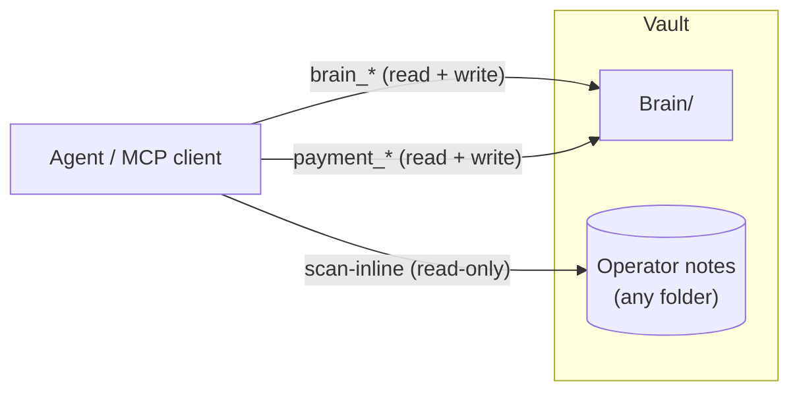

`Brain/` is the only area where the agent writes. User-authored notes
(daily journals, weekly notes, etc.) live in folders the operator
names — wherever they want them. List those folders under
`notes.read_paths` in `_brain.yaml` to opt the agent into scanning
them for `@osb` markers.

## A preference's lifecycle

A preference moves between five states from first signal to retirement:

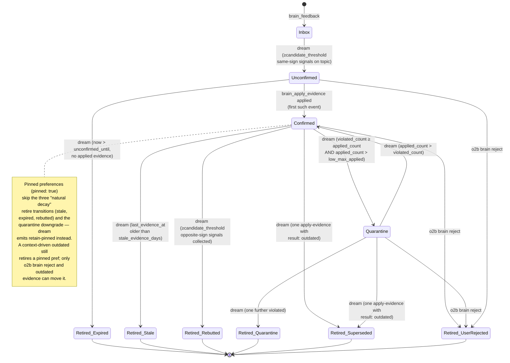

`Inbox` is not really a state of the preference — it is the staging
area for the signals that will eventually create one. The first real
state is `Unconfirmed`: the rule exists but has not yet been applied
in real work.

`Quarantine` (added in v0.9.1) is a probation state for confirmed rules
whose recent evidence has turned dominantly negative without yet
crossing the rebuttal threshold. A quarantined rule is still active —
the agent reads it — but one further `violated` retires it with
`quarantine-violated`, and recovery happens automatically when `applied`
events overtake the violated count.

## End-to-end signal → rule flow

A typical sequence from a user remark to a confirmed preference:

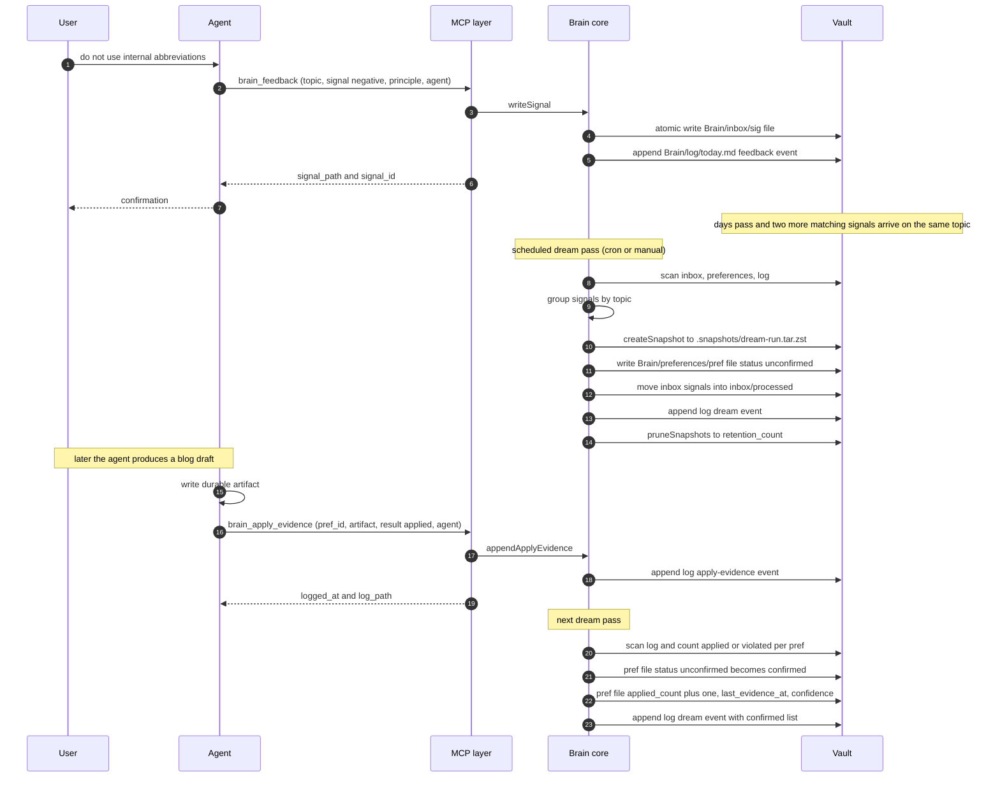

Two important properties of this flow:

- The `dream` pass is the **only** writer of state transitions
  (unconfirmed → confirmed, anything → retired). Signals and
  apply-evidence events are append-only side inputs.
- Every state change is durable on disk before `dream` returns. There
  is no in-memory buffer that could be lost on crash.

## Capture surfaces

Four independent paths land a signal in `Brain/inbox/`:

- **Live** - the agent calls `brain_feedback` (MCP) or `o2b brain feedback` (CLI) the moment the rule is formulated. This is the path the end-to-end sequence above documents.
- **Inline** - the user (or agent) writes an `@osb` marker into any vault Markdown file. `o2b brain scan-inline` finds every marker, creates the corresponding signal, and annotates the source file with `@osb✓ [[sig-...]]` so a re-run is a no-op. Two marker shapes: a single line `@osb feedback negative topic=... principle="..."` or a fenced ` ```osb` block with YAML inside.
- **Session import** - `o2b brain import-session <path>` reads a Claude Code / Codex CLI / Hermes session JSONL and extracts both `@osb` markers from message text and replays of `brain_feedback` tool-use calls. Useful when MCP was not available at recording time or the agent did not make the call live.
- **Lifecycle hook** - Claude Code / Codex hooks call `o2b brain session-hook` through `hooks/session-capture.ts`. `UserPromptSubmit` prompt markers and `PostToolUse` `brain_feedback` inputs are captured immediately through the same signal dedup hash, while SessionStart / Stop / SessionEnd / PostCompact observations append non-blocking lifecycle audit/log rows.

Session capture is role-filterable (since v0.37.0): `session_capture_roles`
in the config (comma-separated subset of `user,assistant,system,tool,meta`)
supplies the default `--filter-role` set for `brain import-session`; an
explicit flag wins, an absent key captures every role, and an unknown role
name fails fast.

SessionEnd carries two more lifecycle duties (since v0.37.0). It clears the
ending session's bound search focus (`search-focus/<scope>.json`) so a
finished session's steering never leaks into the next one - cleanup runs
regardless of the capture boundary. And when `session_handoff` is `"true"`
(default off), it writes an operator-readable handoff note to
`Brain/handoffs/<date>-<scope>.md` - request, completed work, changed files,
learned context, next steps - extracted from the recorded transcript by
deterministic regex (`o2b brain handoff <session-file>` is the manual
equivalent). Alongside the scope-free `Brain/pinned.md` scratchpad, scoped
current-intention chains live at `Brain/intentions/<scope>.md`
(`o2b brain intention set|show|list|move`, MCP `brain_intention`): every
update bumps `version` and appends the superseded text to an in-file history
trail, and `move` retires the chain into `Brain/intentions/history/`.

All four paths share a normalised payload hash so the same rule captured twice from different surfaces dedups automatically. Pinned preferences are exempt from automatic retire (`stale-no-evidence`, `expired-unconfirmed`, `rebutted`); only `o2b brain reject` can retire them.

`o2b brain watchdog` is the recovery surface for this layout. It checks the
Brain config, required directories, and rebuildable search index, emits
exponential backoff metadata for schedulers, and writes an audit record. By
default it only reports a remediation plan; `--remediate` may create missing
Brain directories, but search repair remains a recommendation (`o2b search reindex`)
and snapshot restore is refused unless `--restore <run_id>` and `--force-restore`
are both explicit.

### Cross-project setup

When coding work happens in a project directory that is not the vault itself, add a pointer snippet to your project's `CLAUDE.md` or `AGENTS.md` so the agent knows where to read preferences from. The canonical snippet, the rules for multi-device Syncthing setups, and the `o2b brain set-primary` invocation are in [`cross-project-pointer.md`](cross-project-pointer.md).

A vault shared across hosts should declare a single `primary_agent` in `Brain/_brain.yaml` - the runtime that owns the dream cron. Dream runs from a different agent emit a non-fatal warning (stderr for CLI, `warnings` array for MCP) and tag the dream summary log with `non_primary_agent: <caller>`.

## The dream pass in detail

A single dream invocation is a deterministic pipeline:

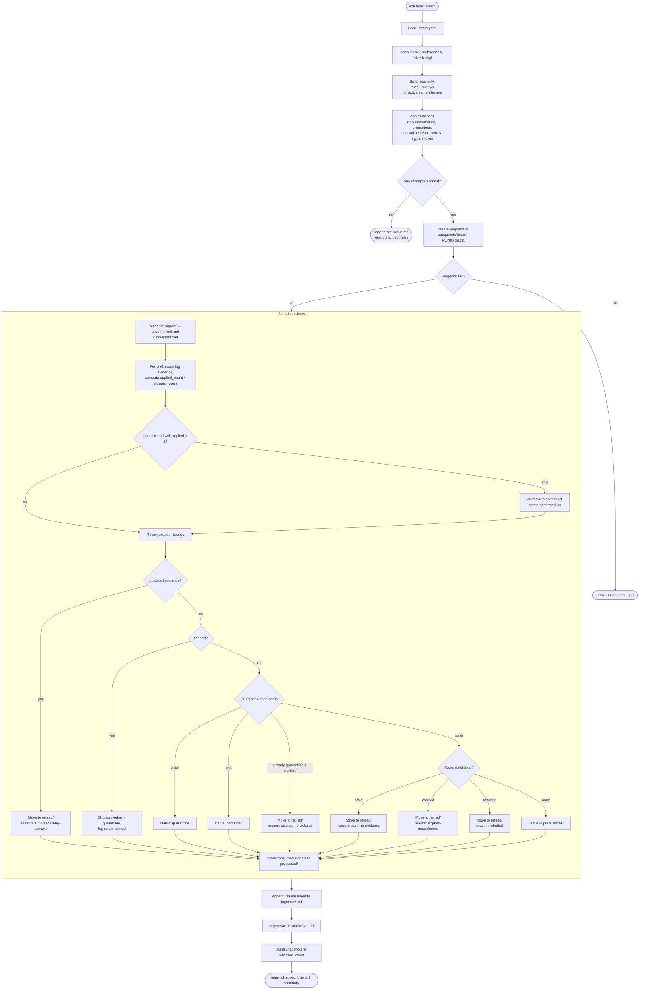

Key rules baked into the pipeline:

- **Threshold by dominant sign.** New unconfirmed preferences are
  created only when `candidate_threshold` (default 3) **same-sign**
  signals on one topic appear within `contradiction_window_days`.
  Mixed signals cancel and the rule does not form.
- **Intent review is audit data.** Each run computes `intent_reviews`
  before mutation so operators can see topics that are ready, weak, or
  conflicted. The review is exposed by `dream`, `brain_review_candidates`,
  `o2b brain intent-review`, and `brain_intent_review`; it preserves the
  existing transition outcomes by default.
- **Pre-run snapshot before any mutation.** If snapshot fails, the run
  aborts without writing anything; safety net cannot be bypassed.
- **Idempotency.** A second dream run on unchanged inputs is a no-op:
  no snapshot, no log entry, no file modifications.
- **Corrupted YAML is tolerated.** A single unparseable signal or
  preference is logged as a `skip-corrupted-frontmatter` event; the
  rest of the run proceeds.

### Lifecycle suite (v0.21.0)

The same pipeline is named as five explicit ordered phases - **close**
(scan) -> **reconcile** (contradictions) -> **synthesize** (promote /
confirm) -> **heal** (auto-retire stale, optional enrichment) -> **log**

- each emitting a workrun checkpoint and a structured entry in
  `DreamRunSummary.phases`. The internals are unchanged; the phases are
  labels over the existing seams, so every invariant above still holds.

- **Reconcile classification.** Each contradiction is bucketed by
  structural signal shape (claims / entity / decisions / source-freshness).
  Only source-freshness with a decisive recency gap auto-resolves - and
  even then it is _recorded_ as a `reconcile` log event, never a
  sub-threshold state mutation. Everything else surfaces in
  `open_questions` for operator review rather than being force-merged.
- **Per-preference audit.** Every mutation (create / promote / update /
  retire / merge) appends one line to `Brain/log/pref-audit/<pref-id>.jsonl`
  with the agent, reason, and revision + content-hash before/after.
  Counter-only churn is suppressed, so a no-op run writes no audit line.
- **Temporal extraction.** On promotion an empty `valid_from` /
  `valid_until` is filled from the source signal - explicit bi-temporal
  fields first, else formal ISO-8601 tokens parsed from the signal text
  (no localized month/day names).
- **Heal enrichment** (opt-in via `dream.heal_enrich_enabled`, default
  off). The heal phase links exact title/alias mentions across user vault
  pages outside the Brain root. Disabled by default so the install stays
  byte-identical.

### Vault portability + session economy (v0.22.0)

A `portability/` subsystem of deterministic primitives, all opt-in or
no-op by default:

- **Session codec.** A pure lossless `compress`/`expand` (`expand(compress(x))
=== x` for all input). Token savings come from reversibly collapsing
  whitespace/blank-line runs behind a Private-Use-Area marker; code and
  structured tokens are preserved byte-for-byte. Opt-in on the signal
  store (gated by a `_raw_codec` marker the reader keys off) and exposed as
  `o2b brain codec`.
- **Sources dashboard.** `o2b brain sources` / `brain_sources` aggregate
  the brain's signals by (agent, source_type) - a read-only projection.
- **Vault-map tokens.** `{{role}}` tokens resolve to user content folders
  via an optional `Brain/_vault-map.yaml` (defaults otherwise), wired into
  scan-inline read paths and graph import. The fixed `Brain/*` layout is
  never routed through the resolver.
- **Multi-vault profiles.** A `profiles.json` registry beside the config;
  `resolveVault` prefers the active profile over the bare `vault` key.
  Activation is a pointer (no symlinks - they sync inconsistently).
- **Graph export/import.** A stable `graph.json` of the user's pages
  (wikilinks + typed relations) and an importer with skip/overwrite/merge
  modes, every write guarded by `ensureInsideVault`.

## Confidence formula

Confidence is computed for every active preference on every dream
pass:

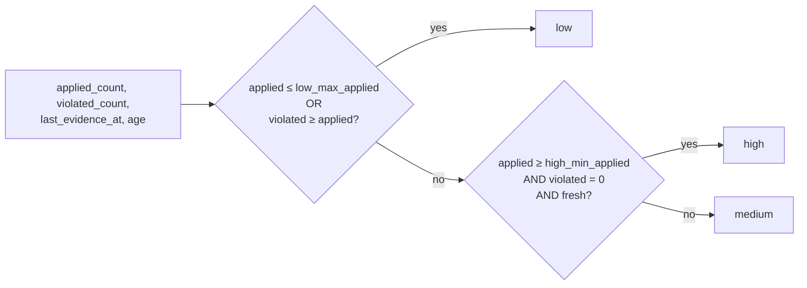

Defaults from `_brain.yaml`:

- `low_max_applied: 2` — rules with two or fewer applications stay
  `low` until they prove themselves.
- `high_min_applied: 10` — high confidence requires ten clean applications.
- `high_freshness_factor: 0.8` — "fresh" means
  `now - last_evidence_at < stale_evidence_days * 0.8`.
- `stale_evidence_days: 90` — the boundary for fresh / stale.
- `medium_min: 0.40`, `high_min: 0.75` — derived-band thresholds on
  the numeric `confidence_value` (see below).

All six are tunable per vault in `Brain/_brain.yaml`.

### Numeric `confidence_value`

Each preference also carries a continuous
`_confidence_value: 0.0–1.0` field, computed alongside the band on
every dream refresh. The value is the **Wilson 95% lower bound** on
`applied / (applied + violated)` modulated by **freshness decay**
that runs linearly from `1.0` at age 0 to `0.0` at
`stale_evidence_days`. The band is the **maximum** of the legacy
step-function and a numeric-threshold view (`medium_min`,
`high_min`) — so legacy boundaries stay intact and numeric tuning
can only lift bands, never demote them. The digest's
`## Confidence shifts` section uses the value to spot drops between
runs; the MCP `brain_query` response and `Brain/active.md` both
expose the number alongside the band for inspection.

## Active preferences injection

A confirmed rule is useless if the agent does not see it during work.
Four cooperating surfaces close that gap (the first three since
v0.9.1, the fourth — `brain_context` — since v0.10.10), all derived
from the same source of truth (`Brain/preferences/`):

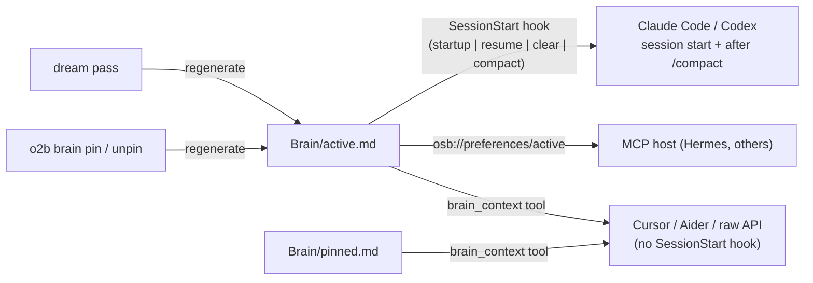

- **`Brain/active.md`** is a derived Markdown digest: confirmed
  preferences (id, scope, confidence, principle), a
  `Most-applied (Nd)` section ranking confirmed/quarantine rules
  by `apply-evidence (result: applied)` events in the trailing
  window (defaults to 30 days / top-10; configurable via
  `active.most_applied_window_days`, `active.most_applied_limit`, and the
  SessionStart injection budget `active.inject_budget_chars`
  in `_brain.yaml`), quarantined preferences with their applied /
  violated counters, and the three most recently retired entries.
  The writer is idempotent — if the rendered body matches the file
  on disk, no I/O happens. The same window / limit drive a mirrored
  `Most-applied (Nd)` section in `brain_digest` output.
- **SessionStart hook** (`startup | resume | clear | compact`) injects
  the body as `additionalContext` so the agent sees current rules at
  the start of every session and again after `/compact` - the
  `compact` matcher replaced the former PostCompact injection, whose
  event no longer exists in current Claude Code. The injected body is
  budgeted (`active.inject_budget_chars`, default 8,000 chars):
  sections drop deterministically (recently retired first, then
  quarantine, then most-applied) and a one-line notice points the
  agent at `brain_context` for the full set. Fails closed - any error
  path exits 0 with no output so the runtime proceeds unaffected.
- **MCP Resources** expose the same content for hosts that prefer
  pull access (`osb://preferences/active` and friends in the table
  above). The MCP `initialize` reply advertises the `resources`
  capability so clients know to enumerate them.
- **`brain_context` MCP tool** (v0.10.10) lives in the always-loaded
  writer-scope MCP server. Runtimes that lack a `SessionStart` hook
  _and_ do not auto-load MCP resources (Cursor, Aider, raw Claude
  API) can fetch the same `active.md` body, pinned current-task context,
  and active-preference counts with a single tool call.
- **`Brain/pinned.md`** is a transient scratchpad for current-task facts.
  Agents update it through `brain_pinned_context` when a fact should survive
  context rotation but should not become a durable preference. Clearing it
  leaves the permanent Brain history untouched.

`active.md` is **not** edited by hand — `o2b brain dream` and pin /
unpin re-derive it from `preferences/` and `retired/`. Deleting the
file is harmless: the next dream regenerates it.

## CLI / MCP surface

The same operations are reachable through two channels. Read columns
are mirrored in MCP; destructive operations are CLI-only by design.

| Operation                  | CLI verb                                            | MCP tool               | Side effect                                                                                                                                                                                                                                                                                                                                                                                                                                                                                                    |
| -------------------------- | --------------------------------------------------- | ---------------------- | -------------------------------------------------------------------------------------------------------------------------------------------------------------------------------------------------------------------------------------------------------------------------------------------------------------------------------------------------------------------------------------------------------------------------------------------------------------------------------------------------------------- |
| Bootstrap layer            | `o2b brain init`                                    | —                      | creates `Brain/` skeleton                                                                                                                                                                                                                                                                                                                                                                                                                                                                                      |
| Record taste signal        | `o2b brain feedback`                                | `brain_feedback`       | writes signal + log event (sanitised)                                                                                                                                                                                                                                                                                                                                                                                                                                                                          |
| Consolidation pass         | `o2b brain dream`                                   | `brain_dream`          | mutates preferences/retired, atomic snapshot, regenerates `Brain/active.md`                                                                                                                                                                                                                                                                                                                                                                                                                                    |
| Record application         | `o2b brain apply-evidence`                          | `brain_apply_evidence` | appends log event; `result ∈ {applied, violated, outdated}`; artifact supports `[[file:120-145]]` ranges                                                                                                                                                                                                                                                                                                                                                                                                       |
| Record milestone           | `o2b brain note <text>`                             | `brain_note`           | appends one `note` log event to `Brain/log/<today>.md` plus the JSONL sidecar. Multi-line collapses to one line. CLI mirror exists for cron / shell.                                                                                                                                                                                                                                                                                                                                                           |
| Pin current-task context   | — (use MCP)                                         | `brain_pinned_context` | writes/appends/clears `Brain/pinned.md`; transient context, not a learned preference                                                                                                                                                                                                                                                                                                                                                                                                                           |
| Pull active context        | — (use MCP)                                         | `brain_context`        | read-only; returns `Brain/active.md` body, pinned context + counts. Always-loaded on the writer MCP server so runtimes without a `SessionStart` hook (Cursor, Aider, raw Claude API) can fetch it at session start.                                                                                                                                                                                                                                                                                            |
| Render summary             | `o2b brain digest [--window Nd]`                    | `brain_digest`         | read-only; includes `top_applied`, `top_referenced`, and `agent_summary` sections                                                                                                                                                                                                                                                                                                                                                                                                                              |
| Pre-dream intent review    | `o2b brain intent-review`                           | `brain_intent_review`  | read-only; classifies active signal clusters as ready, needing evidence, or conflicted before the next `dream`                                                                                                                                                                                                                                                                                                                                                                                                 |
| Lifecycle retention review | `o2b brain retention`                               | `brain_retention`      | read-only; recommends keep / improve / park / prune for retired preferences and processed signals; no artifact is deleted or moved                                                                                                                                                                                                                                                                                                                                                                             |
| Monthly synthesis          | `o2b brain monthly`                                 | `brain_monthly_review` | read-only; month-level counters for events, status transitions, retirements, contradictions, and neglected areas                                                                                                                                                                                                                                                                                                                                                                                               |
| Inspect state              | `o2b brain query`                                   | `brain_query`          | read-only                                                                                                                                                                                                                                                                                                                                                                                                                                                                                                      |
| Computed backlinks         | `o2b brain backlinks <id>`                          | `brain_backlinks`      | read-only; inverted reference map across `preferences/`, `retired/`, `log/`                                                                                                                                                                                                                                                                                                                                                                                                                                    |
| Validate invariants        | `o2b brain doctor`                                  | `brain_doctor`         | read-only; structural lints + semantic-health findings; `--remediate [--dry-run]` applies auto-safe content-hash re-stamps                                                                                                                                                                                                                                                                                                                                                                                     |
| Semantic health            | `o2b brain health`                                  | `brain_health`         | read-only; contradictions, concept gaps, stale claims + clean/watch/investigate verdict                                                                                                                                                                                                                                                                                                                                                                                                                        |
| Preference edit-history    | `o2b brain history <slug>`                          | — (CLI-only)           | read-only; one entry per content mutation (principle / scope / status before -> after)                                                                                                                                                                                                                                                                                                                                                                                                                         |
| Full-text search           | `o2b search "<query>"`                              | `brain_search`         | read-only; FTS5 + optional semantic                                                                                                                                                                                                                                                                                                                                                                                                                                                                            |
| Manage search index        | `o2b search index \| reindex \| status \| check`    | — (CLI-only)           | builds / inspects `<vault>/.open-second-brain/brain.sqlite`. `search check` ends with a `recommendations:` block on missing pieces (key, sqlite-vec, first reindex)                                                                                                                                                                                                                                                                                                                                            |
| Cron template for reindex  | `o2b search reindex --cron-template [--interval N]` | — (CLI-only)           | prints a watchdog script, native crontab line, and `hermes cron create` recipe to stdout (writes nothing)                                                                                                                                                                                                                                                                                                                                                                                                      |
| Operational snapshot       | `o2b status`                                        | `second_brain_status`  | read-only; `brain.*` + `search.*` blocks                                                                                                                                                                                                                                                                                                                                                                                                                                                                       |
| Retire manually            | `o2b brain reject`                                  | — (CLI-only)           | requires `--reason "<text>"`; subsequent signals on the same topic are suppressed                                                                                                                                                                                                                                                                                                                                                                                                                              |
| Merge near-duplicate prefs | `o2b brain merge <keep> <drop>`                     | — (CLI-only)           | folds `evidenced_by` and counters into `keep`; `drop` retires with reason `merged-into`; surfaced as candidates in `brain_digest`                                                                                                                                                                                                                                                                                                                                                                              |
| Toggle pin                 | `o2b brain pin / unpin`                             | — (CLI-only)           | flips `pinned` field; regenerates `Brain/active.md`                                                                                                                                                                                                                                                                                                                                                                                                                                                            |
| Protect Brain/             | `o2b brain protect / unprotect`                     | — (CLI-only)           | machine-enforced deny rules for `claudecode` / `codex` runtimes; sidecar manifest at `.open-second-brain/protect.lock.json`                                                                                                                                                                                                                                                                                                                                                                                    |
| Restore snapshot           | `o2b brain rollback`                                | — (CLI-only)           | overwrites Brain/ from snapshot; from v0.10.6 aborts on drift unless `--force-rollback`, see [Snapshots and rollback](#snapshots-and-rollback)                                                                                                                                                                                                                                                                                                                                                                 |
| Upgrade managed files      | `o2b brain upgrade`                                 | — (CLI-only)           | migrates the three release-owned files (`_brain.yaml`, `_BRAIN.md`, `_OPEN_SECOND_BRAIN.md`) forward. `_brain.yaml` is text-merged additively (user values, comments, and ordering preserved); the other two are byte-compared and overwritten. `--dry-run` prints a per-file plan; `--check` exits 2 on pending updates (CI-friendly); `--apply --yes` takes an `upgrade-<ts>` snapshot before rewriting.                                                                                                     |
| Export active prefs        | `o2b brain export --format json\|llms-txt`          | — (CLI-only)           | read-only dump of `confirmed \| unconfirmed \| quarantine` preferences from `Brain/preferences/`. `--out <path>` writes a file (refuses to overwrite without `--force`); default sink is stdout. Retired and signal artifacts are deliberately excluded.                                                                                                                                                                                                                                                       |
| Force-directed explorer    | `o2b brain explorer [--port \| --export]`           | — (CLI-only)           | live HTTP on `127.0.0.1` (default `:7777`) or single-file HTML at `<path>`; renders preferences + retired as a graph; zero backend. Keyboard-accessible `<ul role="listbox">` mirror of visible nodes (ArrowUp/Down/Home/End/Enter/Escape); layout + filter state persisted to `localStorage` under `osb-explorer-layout:<vault_basename>`; "Reset layout" button clears the key.                                                                                                                              |
| Import Claude memory       | `o2b brain import-claude-memory`                    | — (CLI-only)           | imports `metadata.type=feedback` entries from a Claude Code memory directory into `Brain/preferences/`. `--dry-run` prints a per-file plan; `--apply --yes` takes an `import-claude-memory-<ts>` snapshot before writing. Sidecar manifest `Brain/.imports/claude-memory.json` keys idempotency on body sha256. `UPDATE` preserves the eight evidence-related frontmatter fields. `CONFLICT` (existing pref outside the manifest) lands the safe writes and exits 2.                                           |
| Daily discipline report    | `o2b discipline {report\|install\|uninstall}`       | — (CLI-only)           | renders a deterministic Telegram MarkdownV2 block comparing per-agent brain-events vs runtime-agnostic activity (git/mtime/vault delta) plus a complexity-to-thinking ratio. `install` writes a Hermes cron entry (`--telegram-target` required; `--weekly` installs a Monday digest; `uninstall --weekly` removes only the weekly job). `alert` fires when taste events (`feedback`+`apply_evidence`) are zero while activity is non-zero, or when structural churn grows much faster than recorded thinking. |

Operations that change the **protected set** (`pin`, `unpin`,
`reject`, `rollback`) and the **index lifecycle** (`search index`,
`reindex`, `check`) are kept off the MCP surface — protected-set
moves so an autonomous agent cannot quietly alter what is shielded
from automatic retire, and index management because it is operator
business, never agent business.

In addition to the tools above, MCP hosts can pull structured Brain
content as **resources** (added in v0.9.1):

| Resource URI               | Body                                                                                                                                               |
| -------------------------- | -------------------------------------------------------------------------------------------------------------------------------------------------- |
| `osb://preferences/active` | `Brain/active.md` (auto-regenerated on first read if missing)                                                                                      |
| `osb://digest/latest`      | most recent `brain_digest` rendering                                                                                                               |
| `osb://status`             | Markdown form of the `second_brain_status.brain` block                                                                                             |
| `osb://preference/{id}`    | one `pref-` / `ret-` file                                                                                                                          |
| `osb://topic/{slug}`       | every signal + active/retired pref for a topic                                                                                                     |
| `osb://log/{date}`         | one day's `Brain/log/YYYY-MM-DD.md` (a parallel `YYYY-MM-DD.jsonl` sidecar carries the same events as one JSON row per line for machine consumers) |
| `osb://backlinks/{id}`     | inverted reference map for `<id>`                                                                                                                  |

Resources are pure read; mutating verbs stay on `tools/call`.

## Snapshots and rollback

A snapshot is taken before any state-changing dream run:

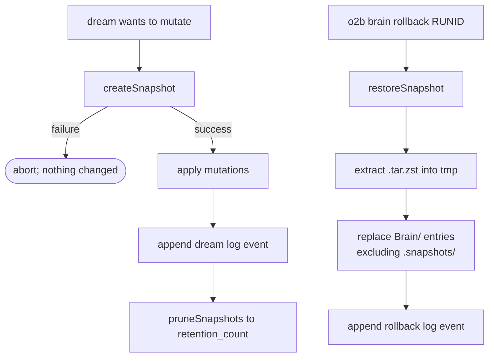

A snapshot captures every file under `Brain/` **except** `.snapshots/`
itself — otherwise rollback would erase any snapshots taken after
this one. Retention defaults to ten newest archives.

From v0.10.6 every snapshot ships with a SHA-256 sidecar manifest
(`Brain/.snapshots/<run_id>.manifest.json`) listing every regular
file under `Brain/` and its hash. `o2b brain rollback` reads the
sidecar back, rebuilds a fresh manifest from the live tree, and
compares: any added / removed / changed entry aborts the rollback
with exit code 2 and a compact drift report on stderr. The intent
is to refuse silent overwrites of Syncthing-delivered edits made on
another device between snapshot and rollback. Pass
`--force-rollback` to override; the resulting rollback log row
records `drift_overridden: true`. Snapshots predating v0.10.6 have
no sidecar — rollback emits a stderr warning, skips the drift
check, and falls through to the legacy direct-restore path so old
archives still recover cleanly. The same sidecar primitive backs
`o2b brain upgrade --dry-run`'s per-file diff: both features share
`src/core/brain/manifest.ts` as the single source of truth for
"what does `Brain/` look like right now".

### Read-only inspectors over the snapshot family

Two CLI surfaces share the same diff renderer over the snapshot
extraction primitive (`extractSnapshotToTemp`), so previewing and
auditing stay byte-equal:

- **`o2b brain rollback <run_id> --dry-run`** — extract the archive
  into a sibling tmp dir, compute the live → snapshot diff, print it,
  drop the tmp dir. Mutually exclusive with `--yes` since
  preview-vs-execute is contradictory. No live writes; no log entry.
- **`o2b brain snapshot diff <run_id_a> [<run_id_b>]`** — same
  renderer, but compares snapshot ↔ snapshot when both ids are
  supplied (and snapshot ↔ live when only one is). `--json` yields
  the structured `BrainTreeDiff` payload for scripting.

The diff classifies every file under each root into six artifact
kinds (preference, retired, signal, log, config, other). Preference
and retired files receive a typed field-level diff for the derived
counters (`_status`, `_applied_count`, `_violated_count`,
`_confidence`, `_confidence_value`, `pinned`, and a few identity
adjuncts); other kinds compare by byte equality and surface as
`(body changed)`.

## Primary agent declaration

`Brain/_brain.yaml` carries an optional `primary_agent: <name> | null`
key. When set, dream runs invoked from a different agent emit:

- a stderr warning of the form `warning: non-primary-dream-run: …`,
- a `warnings` array entry on the MCP `brain_dream` response,
- a `non_primary_agent: <caller>` payload row in the dream summary
  log event.

The dream pass still completes — the declaration is observability,
not access control. Set / clear via `o2b brain set-primary <name>`
or `o2b brain set-primary --clear`. A vault initialised with
`o2b brain init --primary-agent <name>` writes the value into the
fresh `_brain.yaml`. The full multi-device walkthrough is in
[`docs/cross-project-pointer.md`](./cross-project-pointer.md).

## Hygiene: sanitisation and lints

Two cheap, deterministic layers keep the data clean.

**Input sanitisation** (v0.9.1). Every Brain writer routes text fields
through `src/core/redactor.ts` (promoted from Pay Memory) plus a
`normaliseTextField` / `sanitiseTextField` pair:

- C0 control characters are stripped (except `\t` and `\n`); `U+2028`
  and `U+2029` collapse to `\n`; text is NFC-normalised.
- Length caps per field: `principle` ≤ 512 (single-line), `scope` ≤
  128, `raw` ≤ 4096, `source[]` items ≤ 512, `artifact` ≤ 512
  (single-line), `note` ≤ 4096.
- Secret-shaped substrings (`api_key=…`, `token: …`, `bearer …`,
  `authorization: …`, `password=…`, `private_key=…`, etc.) are masked
  with `***REDACTED***`. The `raw` field is the only verbatim-quote
  surface and is intentionally **not** redacted — it carries the
  original user phrasing.
- Explicit `<private>...</private>` regions are stripped before secret
  assignment redaction. An unclosed `<private>` tag strips from the tag to
  the end of the field, which is conservative for accidental paste leaks.
- Inputs that sanitise down to empty fall into the existing "missing
  field" error branch, so the writer never persists a placeholder
  signal.

**Doctor lints** (`o2b brain doctor`, `brain_doctor` MCP). All are pure
functions over the on-disk Brain state — no LLM, no network. The first
group are structural; the last three (v0.14.0) are semantic and also
populate the `semantic_health` report (see `brain_health` below):

| Code                             | Triggers when                                                                                                                                |
| -------------------------------- | -------------------------------------------------------------------------------------------------------------------------------------------- |
| `broken-backlinks`               | a `[[pref-…]]` / `[[ret-…]]` / `[[sig-…]]` reference exists in `preferences/`, `retired/`, `inbox/`, or `log/`, but the target file does not |
| `duplicate-preferences`          | pairwise Jaccard ≥ 0.7 on principle tokens within the same `(topic, scope)` bucket                                                           |
| `low-evidence-confirmed`         | `status: confirmed` with `applied_count ≤ low_max_applied` AND `confirmed_at` older than `unconfirmed_window_days`                           |
| `pinned-without-recent-evidence` | `pinned: true` with no evidence or evidence older than `stale_evidence_days`                                                                 |
| `malformed-evidence-range`       | `apply-evidence` `artifact` uses `[[file:…]]` range syntax but fails validation (`:abc-def`, `:120-100`, bare `:`)                           |
| `orphan-evidence`                | `apply-evidence` `artifact` wikilink does not resolve to any file in the vault                                                               |
| `contradictory-preferences`      | two confirmed preferences share a subject (principle Jaccard ≥ `health.contradiction_jaccard`) but carry an opposite sign of record          |
| `concept-gap`                    | an entity recurs across ≥ `health.concept_gap_min_frequency` corpus entries with no covering preference topic                                |
| `stale-claim`                    | a confirmed preference's newest evidence is older than `health.stale_claim_max_age_days`                                                     |

With `--strict`, warnings demote `ok` to `false` so CI can gate on
hygiene. `brain_doctor` itself stays read-only — auto-modifying state on
a plain doctor run would break the "explicit-driven" invariant. The
explicit opt-in `o2b brain doctor --remediate [--dry-run]` is the only
writer: it plans a dependency-ordered repair and applies the auto-safe
fixes (currently the lossless content-hash re-stamp), bounded by
`health.remediation_step_cap`.

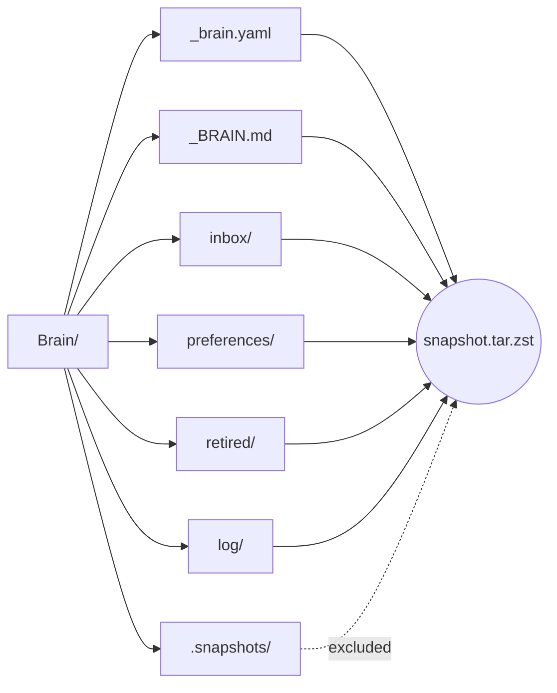

## Integration with agent runtimes

The same MCP tools are advertised to every runtime; only the wiring
differs:

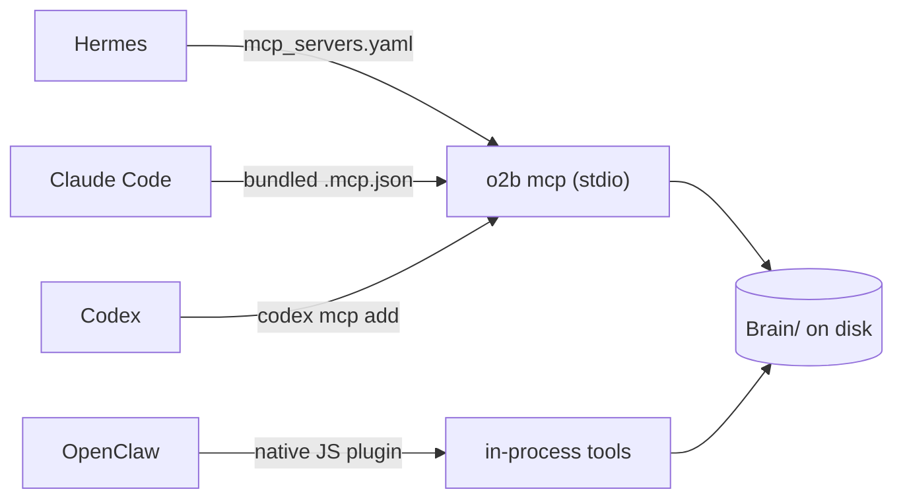

- **Hermes** loads the MCP server via `mcp_servers:` in
  `~/.hermes/config.yaml`. The agent surface also needs the
  `brain-memory` skill enabled in the active profile (via
  `hermes-skills-sync enable <profile> brain-memory`) so the LLM
  recognises preference triggers in conversation.
- **Claude Code** picks up the bundled `.mcp.json` and the
  plugin-shipped `brain-memory/SKILL.md` automatically.
- **Codex** registers the MCP server with `codex mcp add`; the same
  skill bundle is loaded automatically.
- **OpenClaw** runs tools natively in the plugin's Node.js process
  (no subprocess, by security-scanner requirement).

## Full-text search

v0.10.0 adds a deterministic search layer over the entire vault — not
just `Brain/`. The index lives at `<vault>/.open-second-brain/brain.sqlite`
(SQLite + FTS5) and is fully rebuildable from the Markdown files.
Semantic search is optional and pluggable: `sqlite-vec` + any
OpenAI-compatible `/v1/embeddings` endpoint when configured.

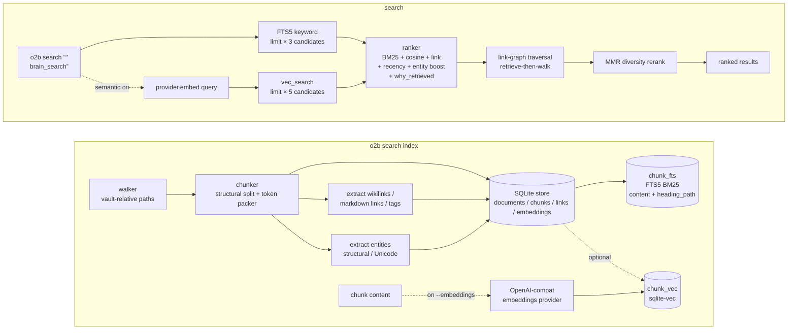

Key behaviours, all driven from `Brain/_brain.yaml`-free `search_*` /
`embedding_*` config keys:

- **Chunker.** Two passes: a structural split (headings, fenced code,
  lists, tables, frontmatter), then a token-budget packer with
  overlap. YAML frontmatter becomes synthetic `chunk_index: 0` so
  `tags:` and other front-matter fields are searchable through FTS5
  alongside the body.
- **Store boundary.** `src/core/search/store.ts` is the single SQL
  home; every other module talks to it through a typed surface. WAL
  mode for concurrent reads, `proper-lockfile` on the index path for
  writer exclusivity (three attempts, 1 s backoff, then
  `INDEX_LOCKED`).
- **Embedding providers (v0.36.0).** `embedding_provider` selects
  `openai-compat` (remote `/v1/embeddings`), `local` (an offline
  feature-hashing embedder: token unigrams + character trigrams hashed
  into a fixed unit-normalised vector, no cloud / key / model download),
  `disabled`, or a name registered through `o2b search provider add`
  (which resolves to `openai-compat` config after the built-ins). One
  `signature.ts` kernel canonicalises `<provider>:<model>:<dimension>`
  and prices it; `embedding_cost_gate_usd` refuses an over-budget run
  unless `--force-cost`, and the local / unlisted-model price is 0.
- **Fusion modes (v0.36.0).** `search_fusion_mode` is `linear` (default,
  the weighted sum below) or `rrf` - Reciprocal Rank Fusion, which scores
  each candidate `Σ 1/(search_rrf_k + rank_in_lane)` across the keyword
  and semantic lanes, min-max-normalised to `[0,1]`. RRF is weightless
  and replaces only the relevance term; every boost below still applies,
  and `linear` is bit-identical to pre-v0.36.0 ranking.
- **Ranking.** `final_score = clamp01(keyword_weight·norm_BM25 +
semantic_weight·cosine + link_boost + recency_boost + entity_boost)`
  (linear mode; in `rrf` mode the first two terms are replaced by the
  fused reciprocal-rank relevance).
  BM25 is min-max-normalised within the candidate set; cosine is
  `1 - L2² / 2` on unit-normalised vectors; link boost rewards
  candidates that other candidates reference via `[[wikilink]]` /
  markdown link (capped at 0.03) or share a tag with (capped at
  0.02); recency is a configurable Weibull decay curve on `mtime`
  (`search_recency_shape` / `search_recency_scale` /
  `search_recency_amplitude`, v0.20.0), defaulting close to the prior
  step function and flooring effectively-stale content to zero; entity
  boost (capped at 0.04) rewards proper-noun overlap between query and
  chunk. Every result carries a `why_retrieved` list of the layers that
  fired.
- **Recall layers (v0.13.0).** After ranking, link-graph traversal
  walks outbound wikilinks from the top hits and merges in related
  documents scored `parent·hop_decay^hop` (bounded by `search_max_hops`
  / `search_max_expansion_per_hit`); then MMR reranks the pool with a
  deterministic token-set similarity so near-duplicates do not crowd
  the top (`search_mmr_lambda`, `1` disables). Header-anchored chunking
  indexes each chunk's heading breadcrumb in a dedicated FTS column
  (weighted below content) so a mid-document chunk keeps its topical
  anchor. Entity and heading layers populate on the next reindex.
- **Query plan + recall economy (v0.20.0).** A pure structural pass
  classifies each query's intent (neutral / exact / entity / broad) from
  its shape - quoted phrases, FTS wildcards, wikilinks, entity-token
  share, token count, no language word lists - and emits a bounded weight
  profile that re-weights the ranking layers (on by default,
  `search_intent_enabled`; neutral is bit-identical). Opt-in synonym
  expansion (`search_synonym_enabled`) broadens recall by OR-ing in terms
  that co-occur across the top candidates' own content - language-agnostic,
  suppressed for exact intent. An opt-in persistent query cache
  (`search_cache_enabled`, `search_cache_ttl_seconds`) serves an identical
  request while the corpus generation (embedding model + dimension +
  schema + a content-reindex revision) is unchanged; cache reads and
  writes are best-effort. `brain_context_pack` additionally accepts
  per-memory and total character caps, and `brain_pre_compress_pack`
  returns a budgeted top-preferences-plus-active.md addendum for
  pre-compression injection.
- **Semantic policy.** Implicit semantic (config default) warns and
  falls back to keyword-only when sqlite-vec is unavailable, the key
  is missing, the provider is down, or no embeddings exist yet.
  Explicit `--semantic` / `semantic: true` on infrastructure failure
  throws a typed `SearchError` so a misconfigured run cannot hide.
  The data-state case (zero embeddings) always warns and skips —
  running `o2b search index --embeddings` is the right answer there.
- **Atomic reindex.** `o2b search reindex` writes to
  `brain.sqlite.new`, renames to `brain.sqlite`, and keeps the
  previous file as `brain.sqlite.bak`. If the main file is missing on
  open and a `.bak` exists, it is auto-restored with a stderr notice.
- **Embedding model fingerprint.** Model + dimension are recorded in
  the index. Changing either drops the `embeddings` and `chunk_vec`
  tables on next open, logs one line, and preserves `chunks` and
  `chunk_fts`; the next `o2b search index --embeddings` repopulates
  vectors.

The MCP `brain_search` tool returns at most 50 results with each
chunk's `content` truncated to 600 characters; diagnostic score
components (`keywordScore`, `semanticScore`, `linkBoost`,
`recencyBoost`) are intentionally absent from the MCP shape — they
live in the CLI's `--verbose` output only, to keep the agent context
small. Index-management verbs (`index`, `reindex`, `check`) are
CLI-only.

Full design and migration notes:
[`docs/plans/2026-05-16-brain-search-design.md`](plans/2026-05-16-brain-search-design.md)
and the matching implementation plan
[`docs/plans/2026-05-16-brain-search-impl.md`](plans/2026-05-16-brain-search-impl.md).

## Workspace reach and proactive insight (since v0.38.0)

Two suites extend where the Brain can be reached and what it
volunteers.

Workspace reach: a `.o2b-vault.json` pointer file written by
`o2b brain project link` binds any project directory (repo, monorepo
package, worktree) to its owning vault; `resolveVault` walks up from
the working directory and honours the nearest pointer after the
`VAULT_DIR` env override and before the profile chain, so commands run
from a linked tree resolve the right Brain with zero per-command
flags. External vaults attach as read-only recall sources
(`o2b brain source add`), and `o2b search <query> --global` unions the
active vault, profile vaults, and sources with per-result origin
labels - reads only, never a write or an index build inside an
external vault. For shell-first use, `o2b brain profile` materializes
a compact `Brain/profile.md` digest plus a `.o2bfs` root marker, and
`o2b brain sgrep` answers with grep-shaped `path:line:` lines.

Proactive insight: `o2b brain trigger scan` converts semantic-health
and retention findings into Markdown trigger records under
`Brain/triggers/` with a strict lifecycle (pending, delivered,
acknowledged, acted, dismissed, expired). Stable cooldown keys make
scans idempotent, and the morning brief delivers pending triggers at
most once per cooldown window - the Brain remembers what the operator
already saw, dismissed, or acted on instead of rediscovering it every
run. `o2b brain deep-synthesis <topic>` builds a deterministic topic
dossier (agreements, contradictions, stale claims, knowledge gaps)
and `o2b brain ideas` ranks next directions from open loops; both can
enqueue their findings as triggers. Opt-in recall-gate telemetry
records every automatic-recall decision with a hashed prompt for
tuning, never the raw text.

## Memory observability (since v0.39.0)

The continuity store is the Brain's flight recorder, and the Memory
Observability Suite turns it into a contract. Every new record is
stamped with a contract-wide schema version (`o2b.continuity.v1`);
legacy records read as v1, nothing is migrated, and the dedup id
deliberately excludes the stamp so identical records keep identical
ids. Gated telemetry surfaces (context-pack receipts and telemetry,
pre-compress, search, the recall gate) route through one lazy emit
kernel: with the gate off the payload thunk never runs, and a broken
continuity store can never fail the operation it was observing. A
read-model normalizes stamped and legacy records identically and
drops `private` records by default, so every read-side consumer
agrees on masking.

Two consumers ship with the suite. `o2b brain continuity export`
renders the store as standard trajectory formats - ATOF JSONL events
or ATIF v1.7 documents (one per session, memory-layer events marked
as deterministic dispatch) - so recall traces feed existing replay
and eval tooling. `o2b brain bench memory` measures recall quality
against disposable fixture vaults: checkpointed phases with resume by
run id, deterministic no-network evaluation, and a report that keeps
quality, latency, and context cost as separate families so a ranking
change cannot hide a token-cost regression behind a quality win. The
full contract - every event kind, its gate, correlation ids, payload
safety, fail-open rules - lives in `docs/observability.md`.

## Project history as memory (since v0.40.0)

A linked project's git history is durable project memory, and the
Project History Suite makes it queryable without the repository
present. `o2b brain git ingest <repo-path>` walks a worktree with a
sanitized read-only reader (fixed argv, full-40-hex sha validation on
everything a caller could supply) and lands commits, tags, and
release ranges as structured records in
`Brain/projects/git/<repo-key>/commits.jsonl`. Typed edges are record
fields - touched files, author, the carrying release attributed by
chronological tag ranges - and a watermark bounds every later run to
`<last>..HEAD`, so incremental ingest is duplicate-free by
construction. A force-pushed or tampered watermark degrades to a
reported full re-scan, never to silent loss. Each repo gets one
deterministic digest note (releases, recent commits, hot files), so
full-text search can discover the history, while `o2b brain git find`
answers "why and when did this file change" from the store alone.

Decision-shaped commits become first-class memory through `o2b brain
git mine`: deterministic heuristics (conventional breaking markers,
BREAKING CHANGE footers, word-boundary decision keywords, revert
shape) surface draft ADR candidates under
`Brain/decisions/candidates/` with matched-signal provenance. A
candidate's identity is its commit sha: re-runs never duplicate, and
an existing file is never touched, so operator curation owns the
draft from the moment it exists.

Architecture knowledge gets the same treatment via `o2b brain
architect <project-path>`: a stdlib-only scanner derives structural
facts (module layout, language mix, entry points, manifests, test
layout - no LLM, no network) and renders an overview plus per-module
notes under `Brain/projects/arch/<repo-key>/`. Generated content
lives between paired `<!-- o2b:begin <id> -->` / `<!-- o2b:end <id>
-->` sentinels: regeneration replaces only generated bodies, operator
prose outside regions survives byte-for-byte, and corrupted markers
fail closed before any write. The same release also closes the
observability gap v0.39.0 left open: `brain_query` now emits opt-in
recall telemetry with a kind-only payload, so the supplied preference
id, topic, or timestamp never lands in a continuity record.

## The agent write contract (since v0.41.0)

The Brain core stays deterministic - no LLM ever runs inside it. The write-session protocol is how that rule survives contact with agents that need to PROPOSE structured artifacts: schema-typed notes, handoffs, curated summaries, panel deliberations.

A calling agent opens a session and receives a JSON envelope: what to generate (`prompt`), what shape it must satisfy (`schema_hints`), and what already occupies the target (`existing` with byte length, content hash, and first heading). The agent generates and submits; the Brain validates fail-closed. A failing submit returns machine-readable `{code, path, message}` errors plus a compact correction prompt - and the session keeps its state, so the agent fixes and resubmits without losing the target, the schema, or its attempt budget (default 3, then terminal `failed`). A clean submit commits atomically, or parks at `needs-review` when the session was opened with the operator gate. Sessions are plain JSON files under `Brain/.sessions/write/` with lazy TTL: they survive process restarts, sync with the vault, and expire on read instead of by daemon.

Three rules are enforced at the commit boundary, not by convention: `create` intent never overwrites an existing file, `merge` appends a session-stamped delimited section without touching existing bytes, and reserved namespaces (preferences, logs, the schema file, machine stores) are refused before a session even opens. Every terminal transition - committed, failed, abandoned, approved - lands exactly one `write-session` audit event in the Brain log.

The decision panel is the first consumer of the kernel: persona steps (operator-curated notes under `Brain/personas/`, or the built-in technical / strategic / risk / user-experience set) walk in declared order, the synthesis step sees every accepted answer, and the committed decision note under `Brain/decisions/panels/` records who argued what through which lens. The Brain contributes sequencing, validation, and the commit; every word of analysis comes from the calling agent.

Two adjacent seams complete the contract. The memory backend boundary (`memory_backend` config key) routes memory import through a format-adapter registry - the Claude Code adapter is the default and byte-identical to the pre-seam behavior, and a second runtime becomes one self-contained module. The shared namespace (`shared_namespace` config key) mirrors explicit remember-writes into a second vault after the primary write succeeds, attributed by agent and origin vault; mirroring is fail-soft by contract, so a broken shared vault degrades to a reported `mirror: "failed"` and the primary write never notices.

## Time-aware recall and activation (since v0.42.0)

Recency used to be one Weibull curve over file mtime: a constantly-useful preference and an untouched note of equal age ranked identically, and `since`/`until` filters confused when a file was written with when its content happened. The Time-Aware Recall & Activation Suite splits those concerns into deterministic, bounded layers.

**Activation.** Every CLI/MCP search that surfaces results records one small JSON event under `Brain/search/activation/` - the query as an FNV-1a hash (never raw text) plus the surfaced paths. The derived activation state is a pure fold over the retained events (delete it, refold, identical), and at query time each candidate's stored strength decays by a content-type half-life: preferences, decisions, and antipatterns never decay, projects fade over ~120 days, handoffs and sessions over ~30, plain notes over 60. The result is a capped `activation` boost that keeps habitually-recalled memories hot without ever floating an irrelevant one. Recording happens AFTER ranking at the orchestrator edge - a query is never affected by its own recording, cache hits never record, and a vault with no events ranks bit-identically to before. Documents repeatedly surfaced together also accumulate co-access pairs in the same fold; when companions land in one candidate pool they reinforce each other with a capped `co_access` boost (single co-occurrences are noise and ignored).

**Freshness trends.** The dream refresh classifies every preference's evidence time distribution - recent 30 days against the prior 30 - into `new | strengthening | stable | weakening | stale` and stamps the label into frontmatter. Recall reads the stamp off preference pages and multiplies the relevance portion (strengthening 1.05, weakening 0.93, stale 0.85), so a rule that keeps earning `applied` events outranks one drifting toward retirement. The belief-evolution envelope carries the live classification with the windowed counts.

**Event time over storage time.** A document declaring `valid_from` / `valid_until` passes a `since`/`until` filter when its validity interval OVERLAPS the query window - storage mtime is only the fallback for documents without event time. An old file describing yesterday's migration window is found by `--since 7d`; a freshly-synced file describing a long-closed event is not. With a time range active, link-graph traversal applies the same discipline: an expansion document bridges in only when its event time falls within a padded neighbourhood of the window (default 7 days), scored by temporal proximity with a `temporal_bridge` reason - causes and consequences, not arbitrary link leakage.

**Two-pass recovery.** Keyword matching is implicit-AND, so a multi-term evidence query whose terms live in different documents can return nothing. In evidence-pack mode that dead end now triggers exactly one broadened retry - the first significant term stays the base group, the rest OR in as alternatives - and the recovered results flow through the normal ranking and a recomputed evidence pack, labelled `second_pass` with a `secondPass` envelope report. Plain searches never broaden; `search_two_pass_enabled: false` turns the retry off entirely.

## Entity truth and the self-improving dream (since v0.43.0)

The Brain recorded facts but had no notion of which one is true NOW: two contradictory claims about the same entity coexisted silently, dedup could merge notes about different people, and the dream pass trusted self-reported evidence with no outcome signal. The Entity Truth & Self-Improving Dream Suite closes both gaps with the same fold-over-append-only discipline the activation store proved.

**The claim ledger.** Claims are append-only JSONL events under `Brain/truth/` (one shard per device, Syncthing-safe), each a versioned `(entity, aspect, value, source, agent, ts)` line parsed fail-closed. A deterministic, order-insensitive fold projects them into addressable slots: the current value of `employer of alice mason`, every superseded prior value with provenance, and `value_conflict` records when two distinct values land within the conflict window from independent sources - resolution is always `ask_user`, never automatic, while a later value outside the window supersedes silently because that is fact evolution, not contradiction. Atomic-fact decomposition feeds the ledger deterministically (markdown structure plus a sentence splitter with an abbreviation guard - no model calls), the actor-framed quantity family captures `I spent 120 USD` shapes, and aggregation sums only exact `(entity, action, unit)` tuples so nearby numbers never pollute a total. The same ledger powers two guards: merges refuse to collapse claims about disjoint people/orgs, and synthesized notes asserting entities their cited sources never mention are flagged as contaminated. Two agents independently writing claims about one entity within 14 days surface push-mode through the trigger queue.

**The self-improving dream.** Apply-evidence events now optionally carry a downstream outcome (`success | failure | unknown`); a rule whose applied events keep co-occurring with failures looks confirmed while actively hurting, so the dream refresh stages an `outcome_regressions` finding with a deterministic confidence penalty - staged for the operator, never silently retired. Failed approaches persist as markdown dead-ends (`Brain/dead-ends/`) that FTS indexes like any note, so recall surfaces "avoid X" beside "prefer Y". Inbox signals rank by surprisal - mean embedding distance to their nearest indexed neighbours, computed over the existing sqlite-vec index with zero provider calls - so review attention lands on genuinely new signals first. The weekly synthesis nominates the single most-developable note of the window, and the foresight fold projects forward for the first time: recurrence cadences yield next-due dates, recent open commitments and questions surface with sources, and an empty vault folds to an empty envelope.

## Write-time integrity and governance (since v0.44.0)

Until now almost nothing about a write into the Brain was declared: any frontmatter field could be hand-edited including the join keys the index depends on, labels were free-form strings that fragment, typed relations connected any two page types, credentials could only be redacted out of memory but never safely used, and the heavy dream/reindex pass could land on top of a live interactive recall. The Write-Time Integrity & Governance Suite makes the schema pack the single declarative ontology and enforces each contract at its existing seam - no new framework layer.

**The ontology lives in the schema pack.** Four additive fields - `labels` (controlled-vocabulary dimensions with fixed enum values), `link_constraints` (allowed `source->target` page-type pairs per link type), `attributes` (per-type fields with natural-language descriptions), and `frontmatter_tiers` (per-kind field tier overrides) - parse, render, and mutate through the same audited machinery the schema pack always had. A vault that declares none of them behaves bit-identically.

**Enforcement at the seam, fail-closed with guidance.** Label assignment rejects an unknown dimension or value WITH the declared vocabulary in the error; attribute validation lists the declared fields with their descriptions, so the error message teaches the domain language instead of just refusing. Link constraints enforce at index materialization: each page's declared `type` is persisted, a post-pass recomputes every typed edge's blocked flag from the current pack on every run - a violating edge falls back to an untyped link instead of feeding typed-relation recall, schema lint lists each violation, and removing the constraint restores the edges without touching any file.

**The tier guard never fights the editor.** Four tiers (identity / system / business / user) map onto the fields framework writers actually emit; the preference files' `_`-prefix convention becomes an explicit system-tier rule. Framework rewrites merge through the tier model - a field a human added by hand survives, and a changed identity join key throws instead of being silently re-accepted - while hand-edits in Obsidian or Vim are never write-denied: the index pass snapshots identity fields, stages a drift finding the snapshot never absorbs, and the operator resolves it through `tiers check | restore | accept`. The doctor warns with the open count.

**Custody, not just redaction.** Secrets live as per-value AES-256-GCM ciphertext beside a 0600 keyfile in the vault-local state dir - never synced as vault content, never returned by any surface. An agent uses a credential by running an allowlisted command with the value injected into the subprocess env; captured output comes back with the value scrubbed as a known literal, the material enters only via the operator's stdin, and every operation lands a no-values audit record under `Brain/log/secret-custody/`. The threat model is stated honestly: this protects against context leakage, sync exposure, and casual reads - not against root.

**Heavy work waits its turn.** The maintenance lane runs dream and reindex behind three gates: a tz-aware local-time window, a busy gate over recent recall telemetry, and an expiring SQLite lease in its own database so holding it never contends with the search index writer lock. Force bypasses the soft gates but never the lease, tasks run stale-first, and every attempt - including each gate refusal - lands in a bounded journal, because a lane you cannot audit is a lane you cannot trust.

## Safety properties

These are invariants of the system, not configuration to enable.

- **Filesystem-first.** Every Brain artifact is a Markdown file with
  YAML frontmatter. `cp -r Brain/` is a complete backup; `tar -czf`
  is a portable bundle.
- **Deterministic.** The dream pass is a pure function of (signals,
  preferences, retired, log, configuration, current time). Given
  identical inputs and a fixed `--now`, two runs produce byte-identical
  output.
- **Idempotent.** Re-running dream without new input or expired
  timestamps is a no-op. Safe to schedule at any frequency.
- **Atomic per-file writes.** Every mutation goes through
  write-temp + rename; an interrupted run never leaves partial files.
- **Audit-traceable.** Every state change emits a typed event in
  `Brain/log/<day>.md` plus a structured `<day>.jsonl` sidecar
  (machine readers prefer the JSONL and fall back to parsing the
  markdown for historical days). The log is append-only; the dream
  log entry for a run records exactly which preferences moved and why.
- **Reversible.** Pre-run snapshots plus
  `o2b brain rollback <run-id>` let you undo any single dream pass.
- **Path-safe.** Every writer routes through a vault-boundary check;
  `Brain/` operations cannot escape the configured vault root.
- **No LLM inside the algorithm.** Semantic merging of similar but
  differently-slugged topics is left to external agents who can call
  the CLI / MCP surface directly — the dream pass itself only does
  counting and atomic file moves.

## Sample lifecycle of one preference

A worked example spanning a hundred days of vault activity:

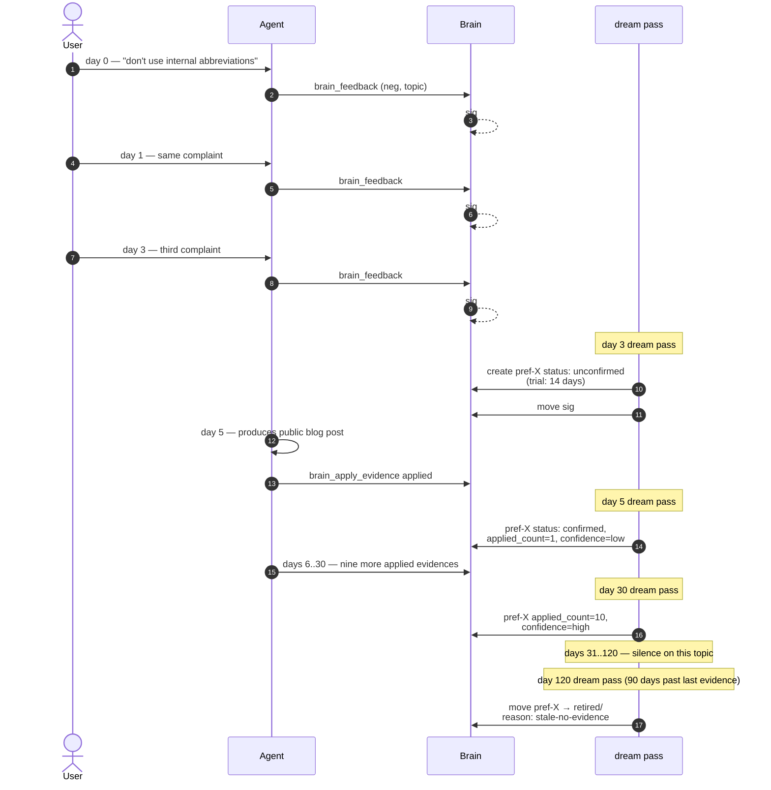

At day 120 the rule has retired itself. The retired note keeps the
full origin (the three signals, the confirmation timestamp, the
ten evidence applications) so its history is auditable forever; only
the active-rule attention budget is freed.

## How a new vault gets bootstrapped

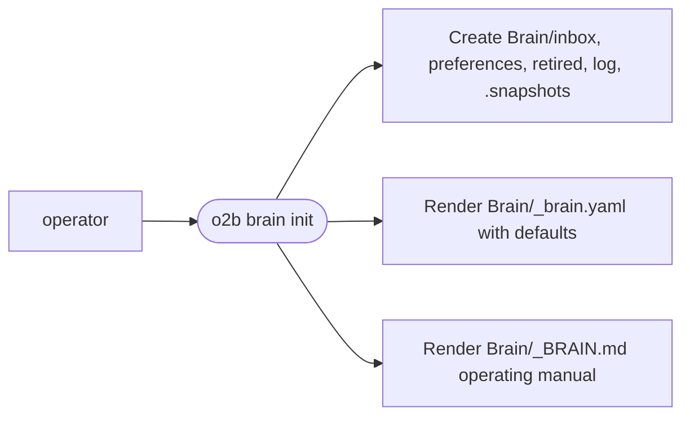

`Brain/_brain.yaml` defaults are sensible for most uses; tune them in
place when real usage reveals different timing. `Brain/_BRAIN.md` is
the per-vault contract for agents — agents read it at the top of any
session that interacts with this vault, and `o2b brain init --force`
re-renders it from the current template.

## Where to go next

- **`docs/observability.md`** — the observability contract: every
  log and continuity event kind, the always-on vs opt-in matrix,
  correlation IDs, payload safety, fail-open rules, and the
  `o2b.continuity.v1` schema version with its evolution rule.
- **`docs/architecture.md`** — layered system architecture beyond
  Brain (vault model, runtime adapters, configuration model).
- **`docs/plans/2026-05-15-brain-observing-memory.md`** — the Brain
  design document, including the full file-format specs and test
  strategy.
- **`docs/plans/2026-05-15-brain-roadmap.md`** — trigger-based roadmap
  of future capabilities (`BRAIN-FUT-NNN` entries).
- **`docs/plans/2026-05-16-brain-search-design.md`** and
  **`docs/plans/2026-05-16-brain-search-impl.md`** — design and
  implementation plan for the v0.10.0 full-text search layer.
- **`docs/mcp.md`** — protocol, schemas, lifecycle, and resource
  surface of the MCP server.
- **`Brain/_BRAIN.md`** (in any initialised vault) — the operating
  manual for agents working with that specific vault.
