# How Open Second Brain Works

A working guide for engineers and agents to the mechanics of the
observing memory layer. Read this when you want to understand what the
system does, not what to configure.

## Mental model

Open Second Brain accumulates **preferences** and learns from real
usage. Three responsibilities:

- **Capture.** Agents and humans drop taste signals into `Brain/inbox/`.
- **Accretion.** A deterministic `dream` pass turns repeat signals into
  rules.
- **Application.** Agents record whether they applied or violated each
  rule when producing durable artifacts.

The LLM lives outside the system: agents use it to detect signals in
conversation and to apply rules during work. The system uses counters,
thresholds, and atomic file operations — no LLM inside the algorithm,
no surprise, no hallucinated memory.

## Vault layout

The vault holds three top-level agent-facing directories. Brain owns
its own, plus a sibling derived-index directory.

```text
<vault>/
├── Brain/                          # observing memory (agent-writable)
│   ├── _brain.yaml                 # schema, thresholds, retention, vault.ignore_paths
│   ├── _BRAIN.md                   # operating manual for agents
│   ├── active.md                   # derived: confirmed + quarantine + recently retired
│   ├── inbox/                      # raw taste signals
│   │   ├── sig-<date>-<slug>.md
│   │   └── processed/              # signals already folded into rules
│   ├── preferences/                # active rules
│   │   └── pref-<slug>.md          # status: unconfirmed | confirmed | quarantine
│   ├── retired/                    # archived rules
│   │   └── ret-<slug>.md           # retired_reason: stale-no-evidence | expired-unconfirmed | rebutted | user-rejected | quarantine-violated | superseded-by-context
│   ├── log/                        # daily event log
│   │   └── YYYY-MM-DD.md           # append-only, typed events
│   └── .snapshots/                 # pre-dream snapshots
│       └── dream-<run-id>.tar.zst
│
├── .open-second-brain/             # derived search index (rebuildable)
│   └── brain.sqlite                # SQLite + FTS5 + optional sqlite-vec
│
├── AI Wiki/                        # curated knowledge surface
│   ├── identity/                   # user.md, agents.md
│   ├── index.md / hot.md
│   ├── payments/ / assets/ / drafts/ / reports/ / policies/   ← Pay Memory subtree
│   └── system/                     # config snapshots, etc.
│
└── Daily/                          # chronological event log + human narrative
    └── YYYY.MM.DD.md
```

`Brain/active.md` and `.open-second-brain/brain.sqlite` are **derived** —
both can be deleted and rebuilt at any time (`o2b brain dream` and
`o2b search reindex` respectively). They are excluded from the agent's
write contract.

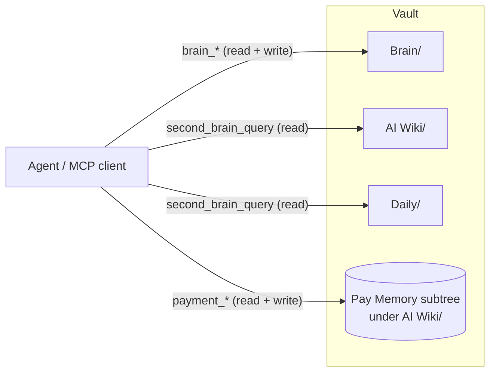

`Brain/` is the only area where the agent records its observing
memory. `AI Wiki/` and `Daily/` are read surfaces for the agent (the
Pay Memory subtree under `AI Wiki/` is the exception: agents write
there through the `payment_*` tools).

## A preference's lifecycle

A preference moves between five states from first signal to retirement:

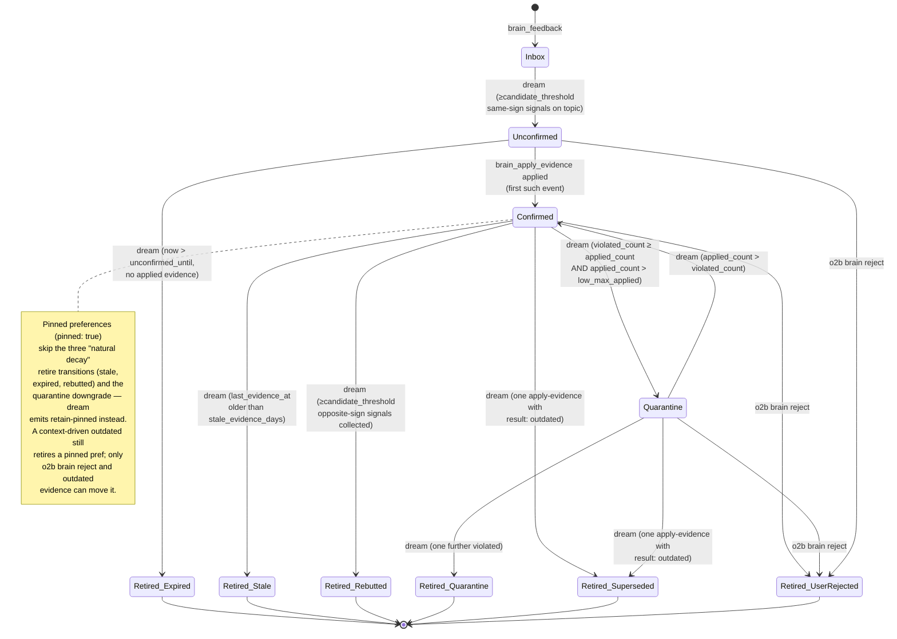

`Inbox` is not really a state of the preference — it is the staging
area for the signals that will eventually create one. The first real
state is `Unconfirmed`: the rule exists but has not yet been applied
in real work.

`Quarantine` (added in v0.9.1) is a probation state for confirmed rules
whose recent evidence has turned dominantly negative without yet
crossing the rebuttal threshold. A quarantined rule is still active —
the agent reads it — but one further `violated` retires it with
`quarantine-violated`, and recovery happens automatically when `applied`
events overtake the violated count.

## End-to-end signal → rule flow

A typical sequence from a user remark to a confirmed preference:

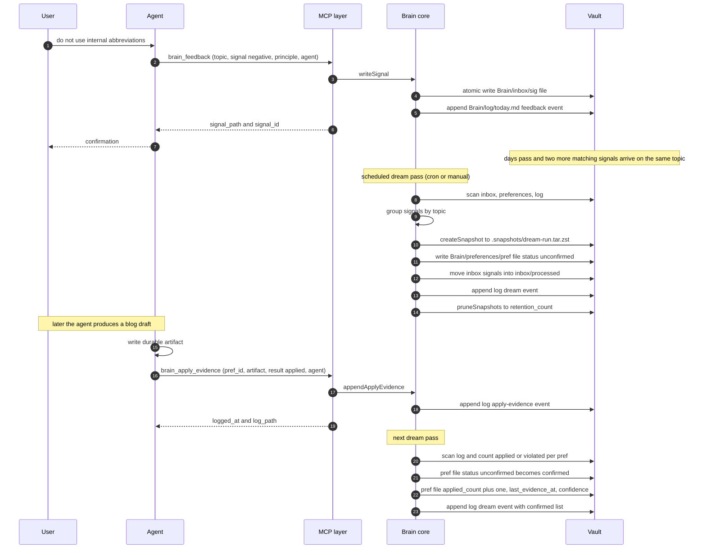

Two important properties of this flow:

- The `dream` pass is the **only** writer of state transitions
  (unconfirmed → confirmed, anything → retired). Signals and
  apply-evidence events are append-only side inputs.
- Every state change is durable on disk before `dream` returns. There
  is no in-memory buffer that could be lost on crash.

## Capture surfaces

Three independent paths land a signal in `Brain/inbox/`:

- **Live** - the agent calls `brain_feedback` (MCP) or `o2b brain feedback` (CLI) the moment the rule is formulated. This is the path the end-to-end sequence above documents.
- **Inline** - the user (or agent) writes an `@osb` marker into any vault Markdown file. `o2b brain scan-inline` finds every marker, creates the corresponding signal, and annotates the source file with `@osb✓ [[sig-...]]` so a re-run is a no-op. Two marker shapes: a single line `@osb feedback negative topic=... principle="..."` or a fenced ` ```osb` block with YAML inside.
- **Session import** - `o2b brain import-session <path>` reads a Claude Code / Codex CLI / Hermes session JSONL and extracts both `@osb` markers from message text and replays of `brain_feedback` tool-use calls. Useful when MCP was not available at recording time or the agent did not make the call live.

All three paths share a normalised payload hash so the same rule captured twice from different surfaces dedups automatically. Pinned preferences are exempt from automatic retire (`stale-no-evidence`, `expired-unconfirmed`, `rebutted`); only `o2b brain reject` can retire them.

### Cross-project setup

When coding work happens in a project directory that is not the vault itself, add a pointer snippet to your project's `CLAUDE.md` or `AGENTS.md` so the agent knows where to read preferences from. The canonical snippet, the rules for multi-device Syncthing setups, and the `o2b brain set-primary` invocation are in [`cross-project-pointer.md`](cross-project-pointer.md).

A vault shared across hosts should declare a single `primary_agent` in `Brain/_brain.yaml` - the runtime that owns the dream cron. Dream runs from a different agent emit a non-fatal warning (stderr for CLI, `warnings` array for MCP) and tag the dream summary log with `non_primary_agent: <caller>`.

## The dream pass in detail

A single dream invocation is a deterministic pipeline:

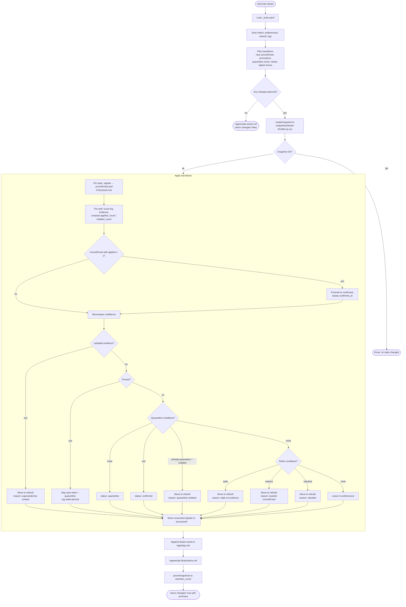

Key rules baked into the pipeline:

- **Threshold by dominant sign.** New unconfirmed preferences are
  created only when `candidate_threshold` (default 3) **same-sign**
  signals on one topic appear within `contradiction_window_days`.
  Mixed signals cancel and the rule does not form.
- **Pre-run snapshot before any mutation.** If snapshot fails, the run
  aborts without writing anything; safety net cannot be bypassed.
- **Idempotency.** A second dream run on unchanged inputs is a no-op:
  no snapshot, no log entry, no file modifications.
- **Corrupted YAML is tolerated.** A single unparseable signal or
  preference is logged as a `skip-corrupted-frontmatter` event; the
  rest of the run proceeds.

## Confidence formula

Confidence is computed for every active preference on every dream
pass:

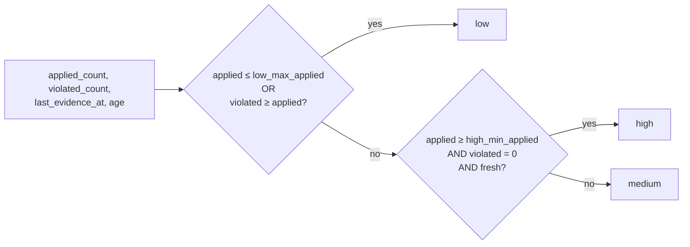

Defaults from `_brain.yaml`:

- `low_max_applied: 2` — rules with two or fewer applications stay
  `low` until they prove themselves.
- `high_min_applied: 10` — high confidence requires ten clean applications.
- `high_freshness_factor: 0.8` — "fresh" means
  `now - last_evidence_at < stale_evidence_days * 0.8`.
- `stale_evidence_days: 90` — the boundary for fresh / stale.
- `medium_min: 0.40`, `high_min: 0.75` — derived-band thresholds on
  the numeric `confidence_value` (see below).

All six are tunable per vault in `Brain/_brain.yaml`.

### Numeric `confidence_value`

Each preference also carries a continuous
`_confidence_value: 0.0–1.0` field, computed alongside the band on
every dream refresh. The value is the **Wilson 95% lower bound** on
`applied / (applied + violated)` modulated by **freshness decay**
that runs linearly from `1.0` at age 0 to `0.0` at
`stale_evidence_days`. The band is the **maximum** of the legacy
step-function and a numeric-threshold view (`medium_min`,
`high_min`) — so legacy boundaries stay intact and numeric tuning
can only lift bands, never demote them. The digest's
`## Confidence shifts` section uses the value to spot drops between
runs; the MCP `brain_query` response and `Brain/active.md` both
expose the number alongside the band for inspection.

## Active preferences injection

A confirmed rule is useless if the agent does not see it during work.
Four cooperating surfaces close that gap (the first three since
v0.9.1, the fourth — `brain_context` — since v0.10.10), all derived
from the same source of truth (`Brain/preferences/`):

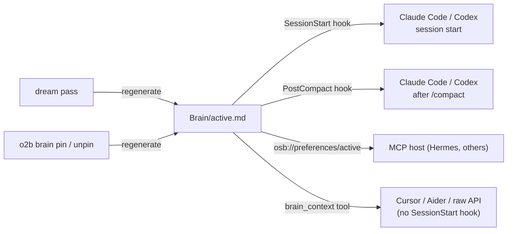

- **`Brain/active.md`** is a derived Markdown digest: confirmed
  preferences (id, scope, confidence, principle), a
  `Most-applied (Nd)` section ranking confirmed/quarantine rules
  by `apply-evidence (result: applied)` events in the trailing
  window (defaults to 30 days / top-10; configurable via
  `active.most_applied_window_days` and `active.most_applied_limit`
  in `_brain.yaml`), quarantined preferences with their applied /
  violated counters, and the three most recently retired entries.
  The writer is idempotent — if the rendered body matches the file
  on disk, no I/O happens. The same window / limit drive a mirrored
  `Most-applied (Nd)` section in `brain_digest` output.
- **SessionStart hook** (`startup | resume | clear`) and
  **PostCompact hook** (`manual | auto`) inject the body as
  `additionalContext` so the agent sees current rules at the start of
  every session and again after `/compact` (otherwise the
  hook-injected context is dropped from long sessions). Both fail
  closed — any error path exits 0 with no output so the runtime
  proceeds unaffected.
- **MCP Resources** expose the same content for hosts that prefer
  pull access (`osb://preferences/active` and friends in the table
  above). The MCP `initialize` reply advertises the `resources`
  capability so clients know to enumerate them.
- **`brain_context` MCP tool** (v0.10.10) lives in the always-loaded
  writer-scope MCP server. Runtimes that lack a `SessionStart` hook
  *and* do not auto-load MCP resources (Cursor, Aider, raw Claude
  API) can fetch the same `active.md` body plus active-preference
  counts with a single tool call.

`active.md` is **not** edited by hand — `o2b brain dream` and pin /
unpin re-derive it from `preferences/` and `retired/`. Deleting the
file is harmless: the next dream regenerates it.

## CLI / MCP surface

The same operations are reachable through two channels. Read columns
are mirrored in MCP; destructive operations are CLI-only by design.

| Operation                | CLI verb                   | MCP tool              | Side effect            |
|--------------------------|----------------------------|-----------------------|------------------------|
| Bootstrap layer          | `o2b brain init`           | —                     | creates `Brain/` skeleton |
| Record taste signal      | `o2b brain feedback`       | `brain_feedback`      | writes signal + log event (sanitised) |
| Consolidation pass       | `o2b brain dream`          | `brain_dream`         | mutates preferences/retired, atomic snapshot, regenerates `Brain/active.md` |
| Record application       | `o2b brain apply-evidence` | `brain_apply_evidence`| appends log event; `result ∈ {applied, violated, outdated}`; artifact supports `[[file:120-145]]` ranges |
| Record milestone         | `o2b brain note <text>`    | `brain_note`          | appends one `note` log event to `Brain/log/<today>.md` plus the JSONL sidecar. Multi-line collapses to one line. CLI mirror exists for cron / shell. |
| Pull active context      | — (use MCP)                | `brain_context`       | read-only; returns `Brain/active.md` body + counts. Always-loaded on the writer MCP server so runtimes without a `SessionStart` hook (Cursor, Aider, raw Claude API) can fetch it at session start. |
| Render summary           | `o2b brain digest [--window Nd]` | `brain_digest`        | read-only; includes `top_applied`, `top_referenced`, and `agent_summary` sections |
| Inspect state            | `o2b brain query`          | `brain_query`         | read-only              |
| Computed backlinks       | `o2b brain backlinks <id>` | `brain_backlinks`     | read-only; inverted reference map across `preferences/`, `retired/`, `log/` |
| Validate invariants      | `o2b brain doctor`         | `brain_doctor`        | read-only; six lint rules |
| Full-text search         | `o2b search "<query>"`     | `brain_search`        | read-only; FTS5 + optional semantic |
| Manage search index      | `o2b search index \| reindex \| status \| check` | — (CLI-only) | builds / inspects `<vault>/.open-second-brain/brain.sqlite`. `search check` ends with a `recommendations:` block on missing pieces (key, sqlite-vec, first reindex) |
| Cron template for reindex | `o2b search reindex --cron-template [--interval N]` | — (CLI-only) | prints a watchdog script, native crontab line, and `hermes cron create` recipe to stdout (writes nothing) |
| Operational snapshot     | `o2b status`               | `second_brain_status` | read-only; `brain.*` + `search.*` blocks |
| Retire manually          | `o2b brain reject`         | — (CLI-only)          | requires `--reason "<text>"`; subsequent signals on the same topic are suppressed |
| Merge near-duplicate prefs | `o2b brain merge <keep> <drop>` | — (CLI-only)   | folds `evidenced_by` and counters into `keep`; `drop` retires with reason `merged-into`; surfaced as candidates in `brain_digest` |
| Toggle pin               | `o2b brain pin / unpin`    | — (CLI-only)          | flips `pinned` field; regenerates `Brain/active.md` |
| Protect Brain/           | `o2b brain protect / unprotect` | — (CLI-only)     | machine-enforced deny rules for `claudecode` / `codex` runtimes; sidecar manifest at `.open-second-brain/protect.lock.json` |
| Restore snapshot         | `o2b brain rollback`       | — (CLI-only)          | overwrites Brain/ from snapshot; from v0.10.6 aborts on drift unless `--force-rollback`, see [Snapshots and rollback](#snapshots-and-rollback) |
| Upgrade managed files    | `o2b brain upgrade`        | — (CLI-only)          | migrates the three release-owned files (`_brain.yaml`, `_BRAIN.md`, `_OPEN_SECOND_BRAIN.md`) forward. `_brain.yaml` is text-merged additively (user values, comments, and ordering preserved); the other two are byte-compared and overwritten. `--dry-run` prints a per-file plan; `--check` exits 2 on pending updates (CI-friendly); `--apply --yes` takes an `upgrade-<ts>` snapshot before rewriting. |
| Export active prefs      | `o2b brain export --format json\|llms-txt` | — (CLI-only) | read-only dump of `confirmed \| unconfirmed \| quarantine` preferences from `Brain/preferences/`. `--out <path>` writes a file (refuses to overwrite without `--force`); default sink is stdout. Retired and signal artifacts are deliberately excluded. |
| Force-directed explorer  | `o2b brain explorer [--port \| --export]` | — (CLI-only) | live HTTP on `127.0.0.1` (default `:7777`) or single-file HTML at `<path>`; renders preferences + retired as a graph; zero backend. Keyboard-accessible `<ul role="listbox">` mirror of visible nodes (ArrowUp/Down/Home/End/Enter/Escape); layout + filter state persisted to `localStorage` under `osb-explorer-layout:<vault_basename>`; "Reset layout" button clears the key. |
| Import Claude memory     | `o2b brain import-claude-memory` | — (CLI-only) | imports `metadata.type=feedback` entries from a Claude Code memory directory into `Brain/preferences/`. `--dry-run` prints a per-file plan; `--apply --yes` takes an `import-claude-memory-<ts>` snapshot before writing. Sidecar manifest `Brain/.imports/claude-memory.json` keys idempotency on body sha256. `UPDATE` preserves the eight evidence-related frontmatter fields. `CONFLICT` (existing pref outside the manifest) lands the safe writes and exits 2. |
| Daily discipline report  | `o2b discipline {report\|install\|uninstall}` | — (CLI-only) | renders a deterministic Telegram MarkdownV2 block comparing per-agent brain-events vs runtime-agnostic activity (git/mtime/vault delta). `install` writes a Hermes cron entry (`--telegram-target` required; `--weekly` installs a Monday digest; `uninstall --weekly` removes only the weekly job). Status is binary: `alert` when taste events (`feedback`+`apply_evidence`) are zero while activity is non-zero. |

Operations that change the **protected set** (`pin`, `unpin`,
`reject`, `rollback`) and the **index lifecycle** (`search index`,
`reindex`, `check`) are kept off the MCP surface — protected-set
moves so an autonomous agent cannot quietly alter what is shielded
from automatic retire, and index management because it is operator
business, never agent business.

In addition to the tools above, MCP hosts can pull structured Brain
content as **resources** (added in v0.9.1):

| Resource URI                      | Body                                              |
|-----------------------------------|---------------------------------------------------|
| `osb://preferences/active`        | `Brain/active.md` (auto-regenerated on first read if missing) |
| `osb://digest/latest`             | most recent `brain_digest` rendering              |
| `osb://status`                    | Markdown form of the `second_brain_status.brain` block |
| `osb://preference/{id}`           | one `pref-` / `ret-` file                         |
| `osb://topic/{slug}`              | every signal + active/retired pref for a topic    |
| `osb://log/{date}`                | one day's `Brain/log/YYYY-MM-DD.md` (a parallel `YYYY-MM-DD.jsonl` sidecar carries the same events as one JSON row per line for machine consumers) |
| `osb://backlinks/{id}`            | inverted reference map for `<id>`                 |

Resources are pure read; mutating verbs stay on `tools/call`.

## Snapshots and rollback

A snapshot is taken before any state-changing dream run:


A snapshot captures every file under `Brain/` **except** `.snapshots/`
itself — otherwise rollback would erase any snapshots taken after
this one. Retention defaults to ten newest archives.

From v0.10.6 every snapshot ships with a SHA-256 sidecar manifest
(`Brain/.snapshots/<run_id>.manifest.json`) listing every regular
file under `Brain/` and its hash. `o2b brain rollback` reads the
sidecar back, rebuilds a fresh manifest from the live tree, and
compares: any added / removed / changed entry aborts the rollback
with exit code 2 and a compact drift report on stderr. The intent
is to refuse silent overwrites of Syncthing-delivered edits made on
another device between snapshot and rollback. Pass
`--force-rollback` to override; the resulting rollback log row
records `drift_overridden: true`. Snapshots predating v0.10.6 have
no sidecar — rollback emits a stderr warning, skips the drift
check, and falls through to the legacy direct-restore path so old
archives still recover cleanly. The same sidecar primitive backs
`o2b brain upgrade --dry-run`'s per-file diff: both features share
`src/core/brain/manifest.ts` as the single source of truth for
"what does `Brain/` look like right now".

### Read-only inspectors over the snapshot family

Two CLI surfaces share the same diff renderer over the snapshot
extraction primitive (`extractSnapshotToTemp`), so previewing and
auditing stay byte-equal:

- **`o2b brain rollback <run_id> --dry-run`** — extract the archive
  into a sibling tmp dir, compute the live → snapshot diff, print it,
  drop the tmp dir. Mutually exclusive with `--yes` since
  preview-vs-execute is contradictory. No live writes; no log entry.
- **`o2b brain snapshot diff <run_id_a> [<run_id_b>]`** — same
  renderer, but compares snapshot ↔ snapshot when both ids are
  supplied (and snapshot ↔ live when only one is). `--json` yields
  the structured `BrainTreeDiff` payload for scripting.

The diff classifies every file under each root into six artifact
kinds (preference, retired, signal, log, config, other). Preference
and retired files receive a typed field-level diff for the derived
counters (`_status`, `_applied_count`, `_violated_count`,
`_confidence`, `_confidence_value`, `pinned`, and a few identity
adjuncts); other kinds compare by byte equality and surface as
`(body changed)`.

## Primary agent declaration

`Brain/_brain.yaml` carries an optional `primary_agent: <name> | null`
key. When set, dream runs invoked from a different agent emit:

- a stderr warning of the form `warning: non-primary-dream-run: …`,
- a `warnings` array entry on the MCP `brain_dream` response,
- a `non_primary_agent: <caller>` payload row in the dream summary
  log event.

The dream pass still completes — the declaration is observability,
not access control. Set / clear via `o2b brain set-primary <name>`
or `o2b brain set-primary --clear`. A vault initialised with
`o2b brain init --primary-agent <name>` writes the value into the
fresh `_brain.yaml`. The full multi-device walkthrough is in
[`docs/cross-project-pointer.md`](./cross-project-pointer.md).

## Hygiene: sanitisation and lints

Two cheap, deterministic layers keep the data clean.

**Input sanitisation** (v0.9.1). Every Brain writer routes text fields
through `src/core/redactor.ts` (promoted from Pay Memory) plus a
`normaliseTextField` / `sanitiseTextField` pair:

- C0 control characters are stripped (except `\t` and `\n`); `U+2028`
  and `U+2029` collapse to `\n`; text is NFC-normalised.
- Length caps per field: `principle` ≤ 512 (single-line), `scope` ≤
  128, `raw` ≤ 4096, `source[]` items ≤ 512, `artifact` ≤ 512
  (single-line), `note` ≤ 4096.
- Secret-shaped substrings (`api_key=…`, `token: …`, `bearer …`,
  `authorization: …`, `password=…`, `private_key=…`, etc.) are masked
  with `***REDACTED***`. The `raw` field is the only verbatim-quote
  surface and is intentionally **not** redacted — it carries the
  original user phrasing.
- Inputs that sanitise down to empty fall into the existing "missing
  field" error branch, so the writer never persists a placeholder
  signal.

**Doctor lints** (`o2b brain doctor`, `brain_doctor` MCP). All six are
pure functions over the on-disk Brain state — no LLM, no network:

| Code | Triggers when |
|---|---|
| `broken-backlinks` | a `[[pref-…]]` / `[[ret-…]]` / `[[sig-…]]` reference exists in `preferences/`, `retired/`, `inbox/`, or `log/`, but the target file does not |
| `duplicate-preferences` | pairwise Jaccard ≥ 0.7 on principle tokens within the same `(topic, scope)` bucket |
| `low-evidence-confirmed` | `status: confirmed` with `applied_count ≤ low_max_applied` AND `confirmed_at` older than `unconfirmed_window_days` |
| `pinned-without-recent-evidence` | `pinned: true` with no evidence or evidence older than `stale_evidence_days` |
| `malformed-evidence-range` | `apply-evidence` `artifact` uses `[[file:…]]` range syntax but fails validation (`:abc-def`, `:120-100`, bare `:`) |
| `orphan-evidence` | `apply-evidence` `artifact` wikilink does not resolve to any file in the vault |

With `--strict`, warnings demote `ok` to `false` so CI can gate on
hygiene. The lints are read-only — `brain_doctor --fix` is explicitly
out of scope because auto-modifying state runs against the
"explicit-driven" invariant.

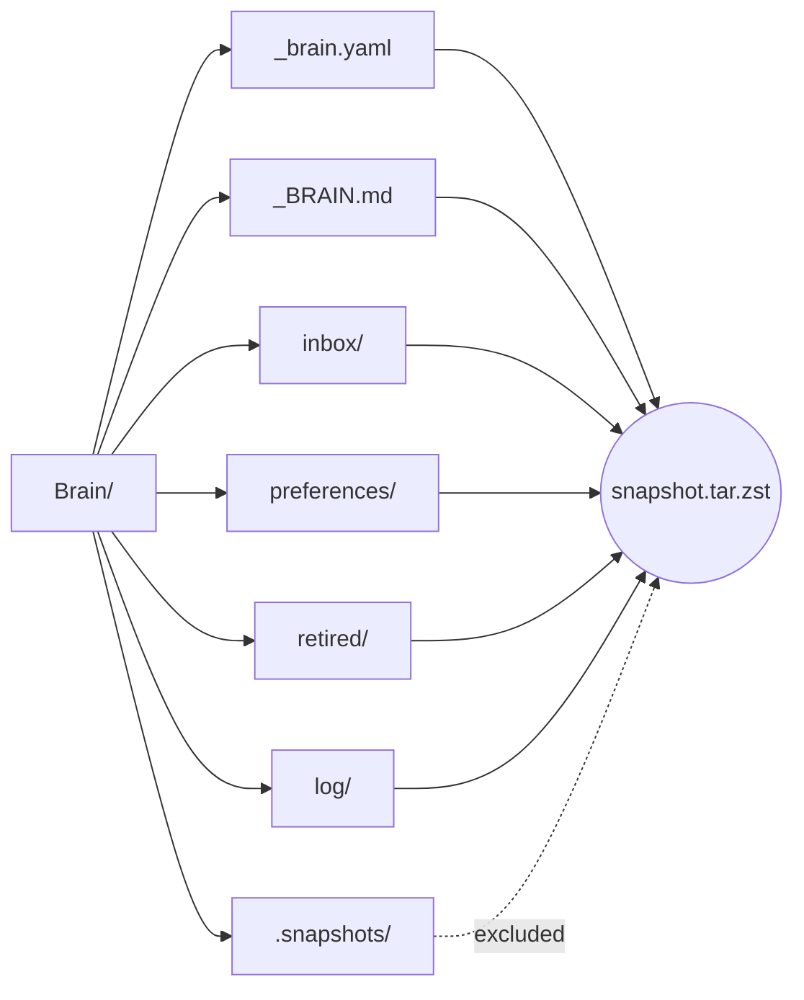

## Integration with agent runtimes

The same MCP tools are advertised to every runtime; only the wiring
differs:

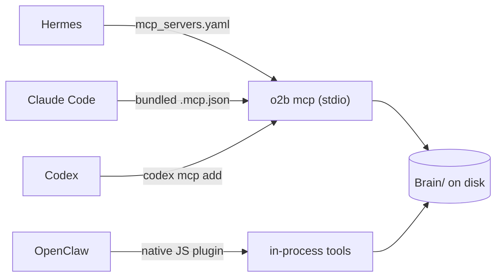

- **Hermes** loads the MCP server via `mcp_servers:` in
  `~/.hermes/config.yaml`. The agent surface also needs the
  `brain-memory` skill enabled in the active profile (via
  `hermes-skills-sync enable <profile> brain-memory`) so the LLM
  recognises preference triggers in conversation.
- **Claude Code** picks up the bundled `.mcp.json` and the
  plugin-shipped `brain-memory/SKILL.md` automatically.
- **Codex** registers the MCP server with `codex mcp add`; the same
  skill bundle is loaded automatically.
- **OpenClaw** runs tools natively in the plugin's Node.js process
  (no subprocess, by security-scanner requirement).

## Full-text search

v0.10.0 adds a deterministic search layer over the entire vault — not
just `Brain/`. The index lives at `<vault>/.open-second-brain/brain.sqlite`
(SQLite + FTS5) and is fully rebuildable from the Markdown files.
Semantic search is optional and pluggable: `sqlite-vec` + any
OpenAI-compatible `/v1/embeddings` endpoint when configured.

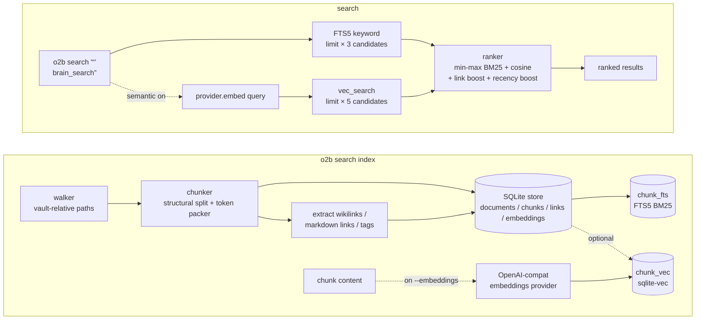

Key behaviours, all driven from `Brain/_brain.yaml`-free `search_*` /
`embedding_*` config keys:

- **Chunker.** Two passes: a structural split (headings, fenced code,
  lists, tables, frontmatter), then a token-budget packer with
  overlap. YAML frontmatter becomes synthetic `chunk_index: 0` so
  `tags:` and other front-matter fields are searchable through FTS5
  alongside the body.
- **Store boundary.** `src/core/search/store.ts` is the single SQL
  home; every other module talks to it through a typed surface. WAL
  mode for concurrent reads, `proper-lockfile` on the index path for
  writer exclusivity (three attempts, 1 s backoff, then
  `INDEX_LOCKED`).
- **Ranking.** `final_score = clamp01(keyword_weight·norm_BM25 +
  semantic_weight·cosine + link_boost + recency_boost)`. BM25 is
  min-max-normalised within the candidate set; cosine is
  `1 - L2² / 2` on unit-normalised vectors; link boost rewards
  candidates that other candidates reference via `[[wikilink]]` /
  markdown link (capped at 0.03) or share a tag with (capped at
  0.02); recency is a step function on `mtime`.
- **Semantic policy.** Implicit semantic (config default) warns and
  falls back to keyword-only when sqlite-vec is unavailable, the key
  is missing, the provider is down, or no embeddings exist yet.
  Explicit `--semantic` / `semantic: true` on infrastructure failure
  throws a typed `SearchError` so a misconfigured run cannot hide.
  The data-state case (zero embeddings) always warns and skips —
  running `o2b search index --embeddings` is the right answer there.
- **Atomic reindex.** `o2b search reindex` writes to
  `brain.sqlite.new`, renames to `brain.sqlite`, and keeps the
  previous file as `brain.sqlite.bak`. If the main file is missing on
  open and a `.bak` exists, it is auto-restored with a stderr notice.
- **Embedding model fingerprint.** Model + dimension are recorded in
  the index. Changing either drops the `embeddings` and `chunk_vec`
  tables on next open, logs one line, and preserves `chunks` and
  `chunk_fts`; the next `o2b search index --embeddings` repopulates
  vectors.

The MCP `brain_search` tool returns at most 50 results with each
chunk's `content` truncated to 600 characters; diagnostic score
components (`keywordScore`, `semanticScore`, `linkBoost`,
`recencyBoost`) are intentionally absent from the MCP shape — they
live in the CLI's `--verbose` output only, to keep the agent context
small. Index-management verbs (`index`, `reindex`, `check`) are
CLI-only.

Full design and migration notes:
[`docs/plans/2026-05-16-brain-search-design.md`](plans/2026-05-16-brain-search-design.md)
and the matching implementation plan
[`docs/plans/2026-05-16-brain-search-impl.md`](plans/2026-05-16-brain-search-impl.md).

## Safety properties

These are invariants of the system, not configuration to enable.

- **Filesystem-first.** Every Brain artifact is a Markdown file with
  YAML frontmatter. `cp -r Brain/` is a complete backup; `tar -czf`
  is a portable bundle.
- **Deterministic.** The dream pass is a pure function of (signals,
  preferences, retired, log, configuration, current time). Given
  identical inputs and a fixed `--now`, two runs produce byte-identical
  output.
- **Idempotent.** Re-running dream without new input or expired
  timestamps is a no-op. Safe to schedule at any frequency.
- **Atomic per-file writes.** Every mutation goes through
  write-temp + rename; an interrupted run never leaves partial files.
- **Audit-traceable.** Every state change emits a typed event in
  `Brain/log/<day>.md` plus a structured `<day>.jsonl` sidecar
  (machine readers prefer the JSONL and fall back to parsing the
  markdown for historical days). The log is append-only; the dream
  log entry for a run records exactly which preferences moved and why.
- **Reversible.** Pre-run snapshots plus
  `o2b brain rollback <run-id>` let you undo any single dream pass.
- **Path-safe.** Every writer routes through a vault-boundary check;
  `Brain/` operations cannot escape the configured vault root.
- **No LLM inside the algorithm.** Semantic merging of similar but
  differently-slugged topics is left to external agents who can call
  the CLI / MCP surface directly — the dream pass itself only does
  counting and atomic file moves.

## Sample lifecycle of one preference

A worked example spanning a hundred days of vault activity:

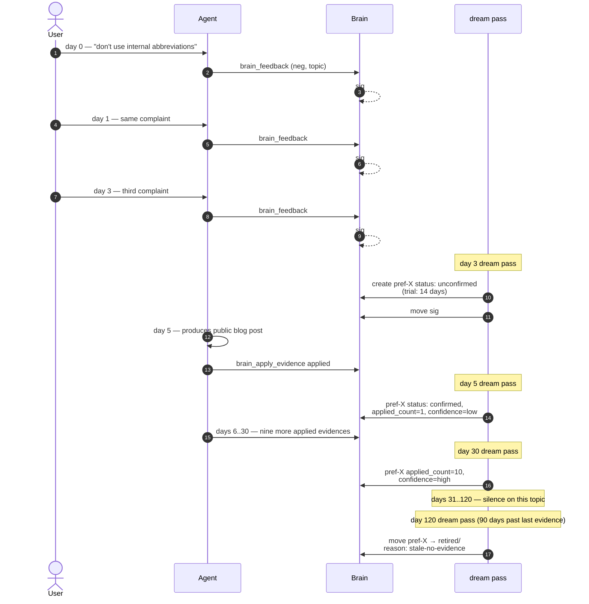

At day 120 the rule has retired itself. The retired note keeps the
full origin (the three signals, the confirmation timestamp, the
ten evidence applications) so its history is auditable forever; only
the active-rule attention budget is freed.

## How a new vault gets bootstrapped

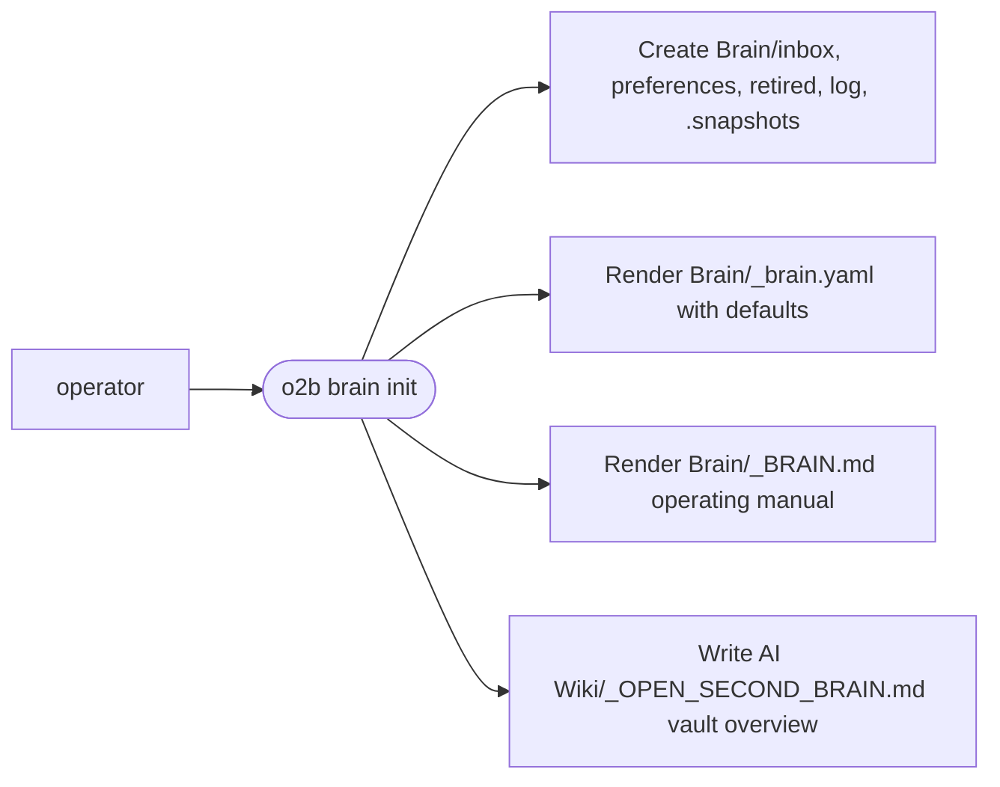

`Brain/_brain.yaml` defaults are sensible for most uses; tune them in
place when real usage reveals different timing. `Brain/_BRAIN.md` is
the per-vault contract for agents — agents read it at the top of any
session that interacts with this vault, and `o2b brain init --force`
re-renders it from the current template.

## Where to go next

- **`docs/architecture.md`** — layered system architecture beyond
  Brain (vault model, runtime adapters, configuration model).
- **`docs/plans/2026-05-15-brain-observing-memory.md`** — the Brain
  design document, including the full file-format specs and test
  strategy.
- **`docs/plans/2026-05-15-brain-roadmap.md`** — trigger-based roadmap
  of future capabilities (`BRAIN-FUT-NNN` entries).
- **`docs/plans/2026-05-16-brain-search-design.md`** and
  **`docs/plans/2026-05-16-brain-search-impl.md`** — design and
  implementation plan for the v0.10.0 full-text search layer.
- **`docs/mcp.md`** — protocol, schemas, lifecycle, and resource
  surface of the MCP server.
- **`Brain/_BRAIN.md`** (in any initialised vault) — the operating
  manual for agents working with that specific vault.
