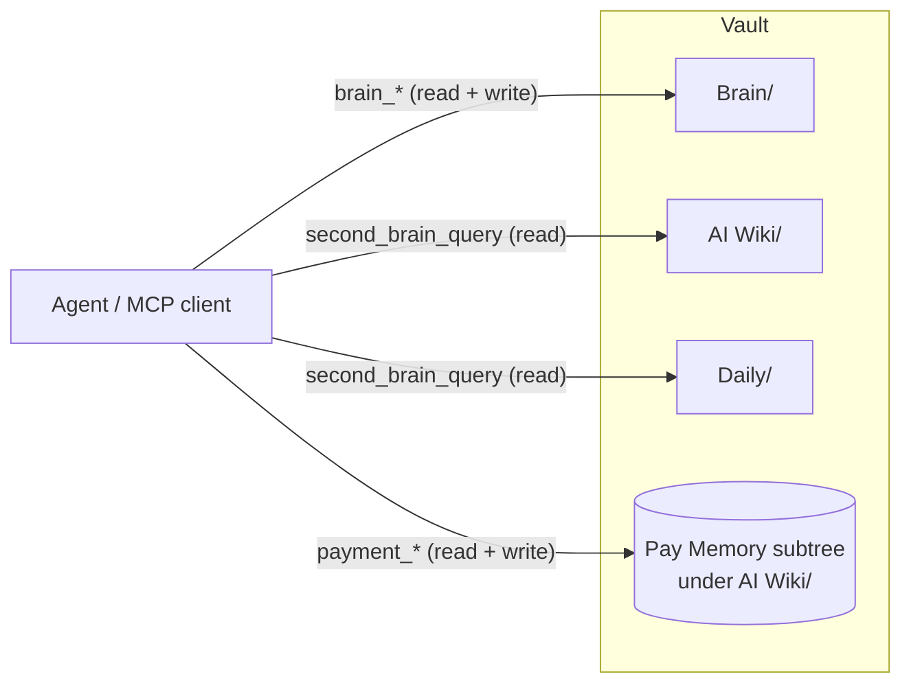
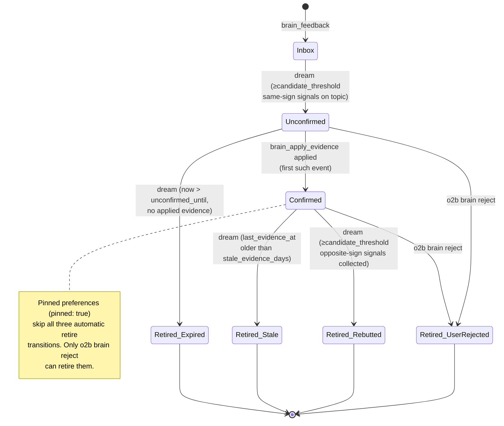
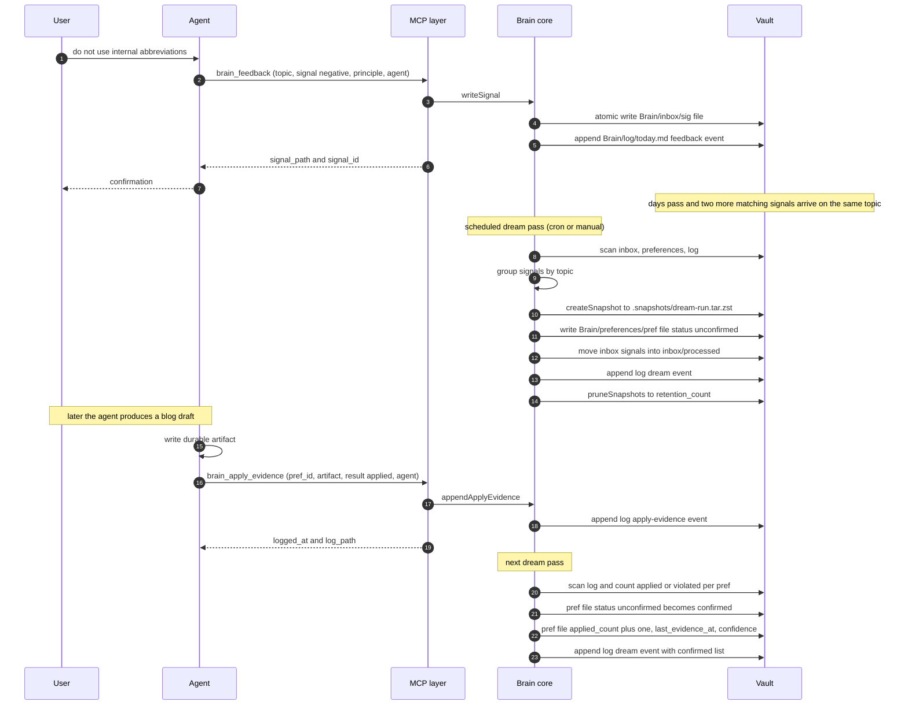
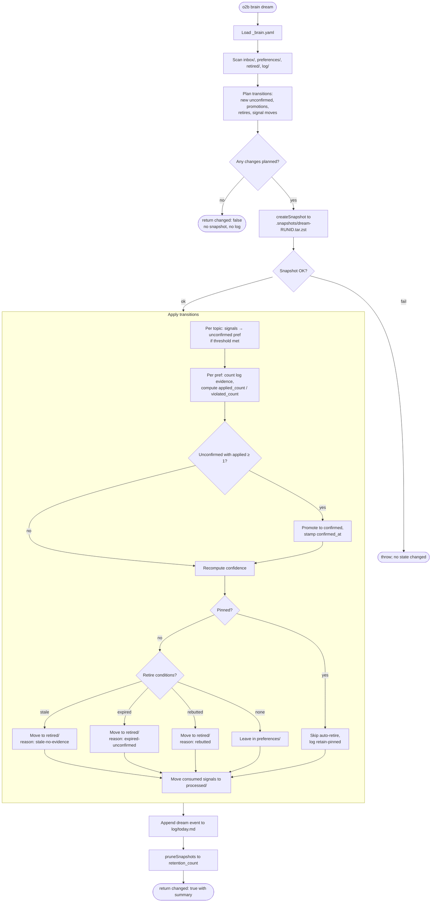
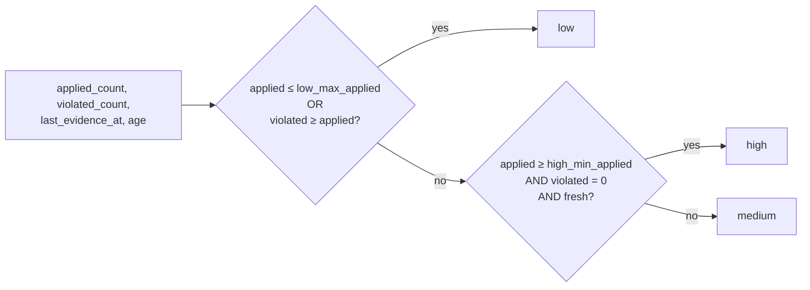
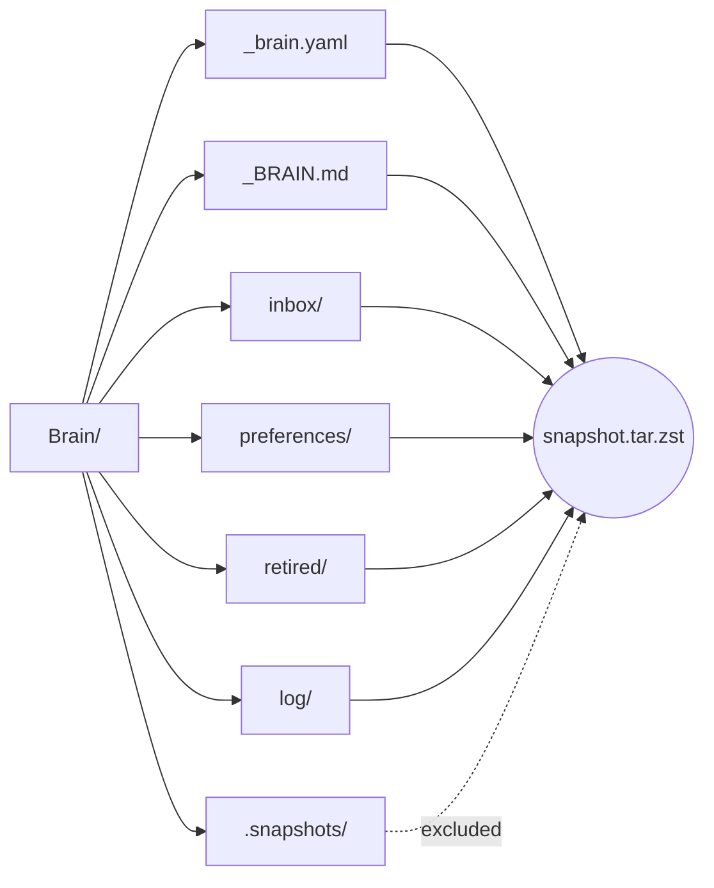
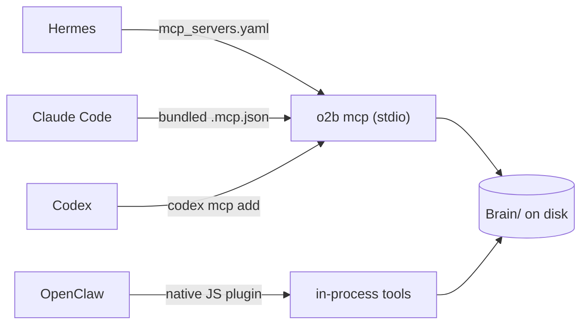
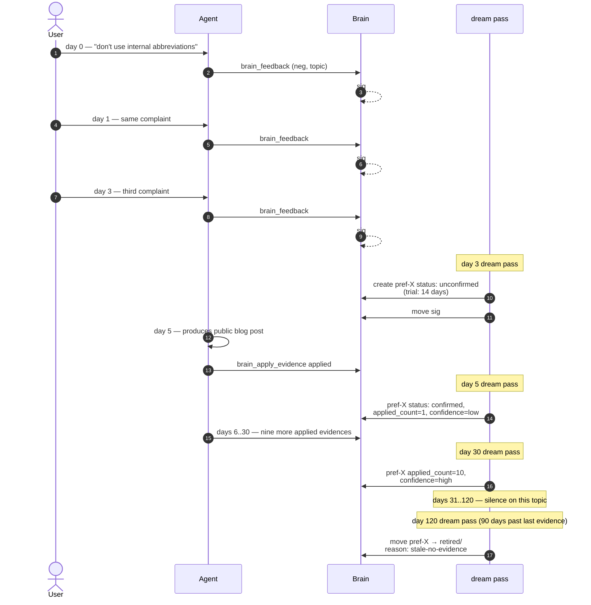

# How Open Second Brain Works

A working guide for engineers and agents to the mechanics of the
observing memory layer. Read this when you want to understand what the
system does, not what to configure.

## Mental model

Open Second Brain accumulates **preferences** and learns from real
usage. Three responsibilities:

- **Capture.** Agents and humans drop taste signals into `Brain/inbox/`.
- **Accretion.** A deterministic `dream` pass turns repeat signals into
  rules.
- **Application.** Agents record whether they applied or violated each
  rule when producing durable artifacts.

The LLM lives outside the system: agents use it to detect signals in
conversation and to apply rules during work. The system uses counters,
thresholds, and atomic file operations — no LLM inside the algorithm,
no surprise, no hallucinated memory.

## Vault layout

The vault holds three top-level agent-facing directories. Brain owns
its own.

```text
<vault>/
├── Brain/                          # observing memory (agent-writable)
│   ├── _brain.yaml                 # schema, thresholds, retention
│   ├── _BRAIN.md                   # operating manual for agents
│   ├── inbox/                      # raw taste signals
│   │   ├── sig-<date>-<slug>.md
│   │   └── processed/             # signals already folded into rules
│   ├── preferences/                # active rules
│   │   └── pref-<slug>.md          # status: unconfirmed | confirmed
│   ├── retired/                    # archived rules
│   │   └── ret-<slug>.md           # retired_reason: stale | expired | rebutted | user-rejected
│   ├── log/                        # daily event log
│   │   └── YYYY-MM-DD.md           # append-only, typed events
│   └── .snapshots/                 # pre-dream snapshots
│       └── dream-<run-id>.tar.zst
│
├── AI Wiki/                        # curated knowledge surface
│   ├── identity/                   # user.md, agents.md
│   ├── index.md / hot.md
│   ├── payments/ / assets/ / drafts/ / reports/ / policies/   ← Pay Memory subtree
│   └── system/                     # config snapshots, etc.
│
└── Daily/                          # chronological event log + human narrative
    └── YYYY.MM.DD.md
```



`Brain/` is the only area where the agent records its observing
memory. `AI Wiki/` and `Daily/` are read surfaces for the agent (the
Pay Memory subtree under `AI Wiki/` is the exception: agents write
there through the `payment_*` tools).

## A preference's lifecycle

A preference moves between four states from first signal to retirement:



`Inbox` is not really a state of the preference — it's the staging
area for the signals that will eventually create one. The first real
state is `Unconfirmed`: the rule exists but has not yet been applied
in real work.

## End-to-end signal → rule flow

A typical sequence from a user remark to a confirmed preference:



Two important properties of this flow:

- The `dream` pass is the **only** writer of state transitions
  (unconfirmed → confirmed, anything → retired). Signals and
  apply-evidence events are append-only side inputs.
- Every state change is durable on disk before `dream` returns. There
  is no in-memory buffer that could be lost on crash.

## The dream pass in detail

A single dream invocation is a deterministic pipeline:



Key rules baked into the pipeline:

- **Threshold by dominant sign.** New unconfirmed preferences are
  created only when `candidate_threshold` (default 3) **same-sign**
  signals on one topic appear within `contradiction_window_days`.
  Mixed signals cancel and the rule does not form.
- **Pre-run snapshot before any mutation.** If snapshot fails, the run
  aborts without writing anything; safety net cannot be bypassed.
- **Idempotency.** A second dream run on unchanged inputs is a no-op:
  no snapshot, no log entry, no file modifications.
- **Corrupted YAML is tolerated.** A single unparseable signal or
  preference is logged as a `skip-corrupted-frontmatter` event; the
  rest of the run proceeds.

## Confidence formula

Confidence is computed for every active preference on every dream
pass:



Defaults from `_brain.yaml`:

- `low_max_applied: 2` — rules with two or fewer applications stay
  `low` until they prove themselves.
- `high_min_applied: 10` — high confidence requires ten clean applications.
- `high_freshness_factor: 0.8` — "fresh" means
  `now - last_evidence_at < stale_evidence_days * 0.8`.
- `stale_evidence_days: 90` — the boundary for fresh / stale.

All four are tunable per vault in `Brain/_brain.yaml`.

## CLI / MCP surface

The same operations are reachable through two channels. Read columns
are mirrored in MCP; destructive operations are CLI-only by design.

| Operation                | CLI verb                   | MCP tool              | Side effect            |
|--------------------------|----------------------------|-----------------------|------------------------|
| Bootstrap layer          | `o2b brain init`           | —                     | creates `Brain/` skeleton |
| Record taste signal      | `o2b brain feedback`       | `brain_feedback`      | writes signal + log event |
| Consolidation pass       | `o2b brain dream`          | `brain_dream`         | mutates preferences/retired, atomic snapshot |
| Record application       | `o2b brain apply-evidence` | `brain_apply_evidence`| appends log event      |
| Render summary           | `o2b brain digest`         | `brain_digest`        | read-only              |
| Inspect state            | `o2b brain query`          | `brain_query`         | read-only              |
| Validate invariants      | `o2b brain doctor`         | `brain_doctor`        | read-only              |
| Retire manually          | `o2b brain reject`         | — (CLI-only)          | moves pref → retired/  |
| Toggle pin               | `o2b brain pin / unpin`    | — (CLI-only)          | flips `pinned` field   |
| Restore snapshot         | `o2b brain rollback`       | — (CLI-only)          | overwrites Brain/ from snapshot |

Operations that change the **protected set** (`pin`, `unpin`,
`reject`, `rollback`) are kept off the MCP surface so an autonomous
agent cannot quietly alter what is shielded from automatic retire or
roll back state.

## Snapshots and rollback

A snapshot is taken before any state-changing dream run:


A snapshot captures every file under `Brain/` **except** `.snapshots/`
itself — otherwise rollback would erase any snapshots taken after
this one. Retention defaults to ten newest archives.



## Integration with agent runtimes

The same MCP tools are advertised to every runtime; only the wiring
differs:



- **Hermes** loads the MCP server via `mcp_servers:` in
  `~/.hermes/config.yaml`. The agent surface also needs the
  `brain-memory` skill enabled in the active profile (via
  `hermes-skills-sync enable <profile> brain-memory`) so the LLM
  recognises preference triggers in conversation.
- **Claude Code** picks up the bundled `.mcp.json` and the
  plugin-shipped `brain-memory/SKILL.md` automatically.
- **Codex** registers the MCP server with `codex mcp add`; the same
  skill bundle is loaded automatically.
- **OpenClaw** runs tools natively in the plugin's Node.js process
  (no subprocess, by security-scanner requirement).

## Safety properties

These are invariants of the system, not configuration to enable.

- **Filesystem-first.** Every Brain artifact is a Markdown file with
  YAML frontmatter. `cp -r Brain/` is a complete backup; `tar -czf`
  is a portable bundle.
- **Deterministic.** The dream pass is a pure function of (signals,
  preferences, retired, log, configuration, current time). Given
  identical inputs and a fixed `--now`, two runs produce byte-identical
  output.
- **Idempotent.** Re-running dream without new input or expired
  timestamps is a no-op. Safe to schedule at any frequency.
- **Atomic per-file writes.** Every mutation goes through
  write-temp + rename; an interrupted run never leaves partial files.
- **Audit-traceable.** Every state change emits a typed event in
  `Brain/log/<day>.md`. The log is append-only; the dream log entry
  for a run records exactly which preferences moved and why.
- **Reversible.** Pre-run snapshots plus
  `o2b brain rollback <run-id>` let you undo any single dream pass.
- **Path-safe.** Every writer routes through a vault-boundary check;
  `Brain/` operations cannot escape the configured vault root.
- **No LLM inside the algorithm.** Semantic merging of similar but
  differently-slugged topics is left to external agents who can call
  the CLI / MCP surface directly — the dream pass itself only does
  counting and atomic file moves.

## Sample lifecycle of one preference

A worked example spanning a hundred days of vault activity:



At day 120 the rule has retired itself. The retired note keeps the
full origin (the three signals, the confirmation timestamp, the
ten evidence applications) so its history is auditable forever; only
the active-rule attention budget is freed.

## How a new vault gets bootstrapped


`Brain/_brain.yaml` defaults are sensible for most uses; tune them in
place when real usage reveals different timing. `Brain/_BRAIN.md` is
the per-vault contract for agents — agents read it at the top of any
session that interacts with this vault, and `o2b brain init --force`
re-renders it from the current template.

## Where to go next

- **`docs/architecture.md`** — layered system architecture beyond
  Brain (vault model, runtime adapters, configuration model).
- **`docs/plans/2026-05-15-brain-observing-memory.md`** — the design
  document, including the full file-format specs and test strategy.
- **`docs/plans/2026-05-15-brain-roadmap.md`** — trigger-based roadmap
  of future capabilities (`BRAIN-FUT-NNN` entries).
- **`Brain/_BRAIN.md`** (in any initialised vault) — the operating
  manual for agents working with that specific vault.
