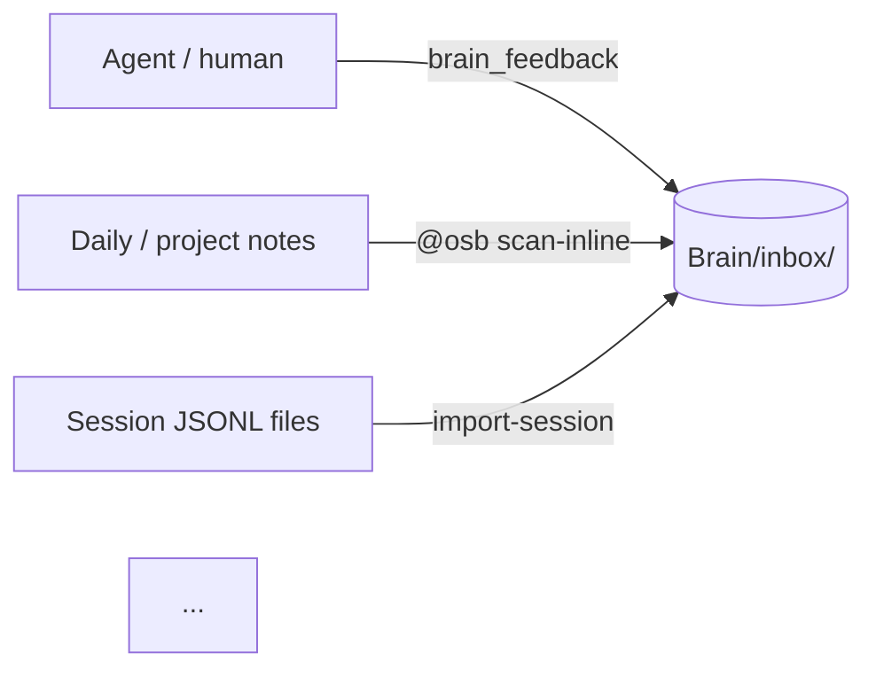

# Brain Implementation Plan

> **For agentic workers:** Use `superpowers:executing-plans` to walk this plan task-by-task. Steps use checkbox (`- [ ]`) syntax for tracking.

**Goal:** Ship three Tier-A items in one PR — inline `@osb` markers (§9), session-import (§16), `_field` prefix convention (§24). Target version: v0.10.2.

**Architecture:** Three independent slices that compose under one PR.
- §9 lives in `src/core/brain/inline*.ts` + `src/cli/brain.ts` (new verb).
- §16 lives in `src/core/brain/sessions/` + `src/cli/brain.ts` (new verb).
- §24 modifies `preference.ts` (parser + writer), adds `migrate-frontmatter.ts` + `src/cli/brain.ts` (new verb).
- A shared marker parser (`inline.ts`) services both §9 and §16. A shared `computeDedupHash` services both new capture paths.

**Tech Stack:** TypeScript on Bun. No new external dependencies. Reuses `proper-lockfile`, `fs-atomic.ts`, `snapshot.ts`, `writeSignal`, `writeFrontmatterAtomic` from existing code.

**Source of truth for behaviour:** [`docs/plans/2026-05-16-brain-capture-and-fields-design.md`](./2026-05-16-brain-capture-and-fields-design.md). Every task implements a slice of that spec — on conflict, the spec wins and this plan is updated.

---

## Plan-wide conventions

These apply to every task; do not re-state per step.

- **Imports.** Production code uses `node:`-prefixed builtins (`node:fs`, `node:crypto`). Tests use `import { test, expect, describe, beforeEach, afterEach } from "bun:test"`. Always `.ts` extension in imports.
- **Result shape.** Public-API return values are `Object.freeze`-d at the producing call site.
- **Errors.** Each new module defines its own typed error class (`InlineMarkerError`, `SessionImportError`, `MigrationError`). Non-typed exceptions bubble up unchanged.
- **No git from this plan.** Each task ends with **Pause for review (no commit)**. The user does all git work themselves.
- **No bait fallbacks.** Adapter autodetect failure → exit 2 with explicit message, never a silent wrong-adapter choice. Marker-with-unknown-kind → not a marker, never a heuristic guess.
- **Atomic writes** through `src/core/fs-atomic.ts:atomicWriteFileSync`. In-place rewrite of user files (§9) holds `proper-lockfile.lock(path, {retries: 3, factor: 2})` around read + write.
- **Verification.** Every task ends with `bun test tests/path/to/file.test.ts` and an expected pass count. End of each Phase: full `bun test` + `bun run typecheck` green.

## File map

Create:

```
src/core/brain/inline.ts                       — @osb marker parser (inline + fenced block); pure
src/core/brain/inline-rewrite.ts               — atomic in-place "@osb✓" annotation
src/core/brain/inline-scan.ts                  — vault walker; orchestrates parse + rewrite + writeSignal
src/core/brain/sessions/types.ts               — SessionAdapter, SessionTurn, SessionToolCall, SessionImportError
src/core/brain/sessions/registry.ts            — adapter registry + detectAdapter()
src/core/brain/sessions/claude.ts              — Claude Code .jsonl adapter
src/core/brain/sessions/codex.ts               — Codex CLI .jsonl adapter
src/core/brain/sessions/hermes.ts              — Hermes .jsonl adapter
src/core/brain/sessions/import.ts              — orchestrator; iterates adapter, extracts, writes signals
src/core/brain/sessions/validate-feedback.ts   — pure validator (re-used by MCP and import)
src/core/brain/migrate-frontmatter.ts          — opt-in legacy → _-prefixed rewriter
src/core/brain/dedup-hash.ts                   — computeDedupHash(input) → string
tests/core/brain.inline.test.ts
tests/core/brain.inline-rewrite.test.ts
tests/core/brain.inline-scan.test.ts
tests/core/brain.dedup-hash.test.ts
tests/core/brain.sessions.types.test.ts
tests/core/brain.sessions.registry.test.ts
tests/core/brain.sessions.claude.test.ts
tests/core/brain.sessions.codex.test.ts
tests/core/brain.sessions.hermes.test.ts
tests/core/brain.sessions.validate-feedback.test.ts
tests/core/brain.sessions.import.test.ts
tests/core/brain.migrate-frontmatter.test.ts
tests/fixtures/sessions/claude-minimal.jsonl
tests/fixtures/sessions/codex-minimal.jsonl
tests/fixtures/sessions/hermes-minimal.jsonl
tests/e2e/brain-capture-and-fields.test.ts
```

Modify:

```
src/core/brain/types.ts             — BRAIN_SIGNAL_SOURCE_TYPE enum, BrainSignal fields, 3 new log-event kinds
src/core/brain/signal.ts            — writeSignal accepts source_type/dedup_hash/session_ref; tag composer extension; parser reads them back
src/core/brain/preference.ts        — parser accepts both shapes; writer emits _-prefixed only; conflict throws
src/core/brain/doctor.ts            — checks for frontmatter-double-shape warning
src/core/brain/log.ts               — helpers for the 3 new event kinds (or via existing appendLogEvent)
src/core/brain/policy.ts            — _brain.yaml schema accepts optional scan_inline.exclude
src/cli/brain.ts                    — 3 new verb handlers + VERB_HELP entries + dispatch
src/mcp/brain-tools.ts              — validateBrainFeedbackInput extracted to sessions/validate-feedback.ts; no new MCP tools
tests/core/brain.preference.test.ts — dual-shape parse + writer-emits-new tests
tests/core/brain.signal.test.ts     — new optional fields round-trip
tests/core/brain.doctor.test.ts     — frontmatter-double-shape warning case
tests/cli/brain.test.ts             — 3 new verb test sections
README.md                           — CLI table extension + capture-surfaces paragraph
docs/how-it-works.md                — capture-surfaces subsection + Mermaid extension
skills/brain-memory/SKILL.md        — @osb marker mention paragraph
CHANGELOG.md                        — ## [0.10.2] entry under Added / Changed
package.json                        — version 0.10.1 → 0.10.2 via `bun run sync-version`
pyproject.toml                      — version 0.10.1 → 0.10.2 via sync
```

---

## Phase 1 — §24 foundation (parser dual-shape, writer new-only)

Smallest, safest slice first. Existing tests must stay green throughout.

### Task 1: Dual-shape reader helper

**Files:**
- Create: nothing
- Modify: `src/core/brain/preference.ts` — add `readDerivedField` private helper
- Test: `tests/core/brain.preference.test.ts`

- [ ] **Step 1: Write failing test for dual-shape parser**

Add to `tests/core/brain.preference.test.ts`:

```ts
test("parsePreference reads legacy 'status:' shape", () => {
  const path = writeTempPref({ status: "confirmed", /* ... */ });
  const pref = parsePreference(path);
  expect(pref.status).toBe("confirmed");
});

test("parsePreference reads new '_status:' shape", () => {
  const path = writeTempPref({ _status: "confirmed", /* ... */ });
  const pref = parsePreference(path);
  expect(pref.status).toBe("confirmed");
});

test("parsePreference throws when both '_status' and 'status' present", () => {
  const path = writeTempPref({ status: "confirmed", _status: "confirmed" });
  expect(() => parsePreference(path)).toThrow(/both '_status' and legacy 'status' present/);
});
```

Cover every Group C field listed in spec §7.1 with the same three-case shape. Use a `describe.each` table to keep the test compact.

- [ ] **Step 2: Implement `readDerivedField` helper in `preference.ts`**

```ts
function readDerivedField(meta: Record<string, unknown>, name: string): unknown {
  const legacy = name in meta && meta[name] !== undefined && meta[name] !== null;
  const modern = `_${name}` in meta && meta[`_${name}`] !== undefined && meta[`_${name}`] !== null;
  if (legacy && modern) {
    throw new Error(
      `preference field collision: both '_${name}' and legacy '${name}' present; ` +
      `pick one (run \`o2b brain migrate-frontmatter --apply\` or hand-edit)`,
    );
  }
  return modern ? meta[`_${name}`] : meta[name];
}
```

Route `status`, `confirmed_at`, `last_evidence_at`, `applied_count`, `violated_count`, `confidence`, `evidenced_by`, `contradicted_by` (when applicable) through this helper. Identity fields (`kind`, `id`, `created_at`, `unconfirmed_until`, `topic`, `principle`, `scope`, `agent`, `aliases`, `tags`, `supersedes`, `pinned`) stay on the existing `requireField` / `requireString` path.

- [ ] **Step 3: `parseRetired` gets the same treatment**

Same set of Group C fields. Add the same describe.each block for retired fixtures.

- [ ] **Step 4: Verify**

Run: `bun test tests/core/brain.preference.test.ts`
Expected: all new tests pass; existing tests stay green.

**Pause for review (no commit).**

---

### Task 2: Writer emits `_`-prefixed Group C fields

**Files:**
- Modify: `src/core/brain/preference.ts` — `preferenceFrontmatter`, `moveToRetired`'s frontmatter rebuild
- Test: `tests/core/brain.preference.test.ts`

- [ ] **Step 1: Failing test for writer output shape**

```ts
test("writePreference emits '_status' not 'status'", () => {
  writePreference(vault, { /* ...minimal valid input... */, status: "confirmed", ... });
  const raw = readFileSync(prefPath, "utf8");
  expect(raw).toMatch(/^_status: confirmed$/m);
  expect(raw).not.toMatch(/^status: /m);
});
```

Mirror for each Group C field (`_applied_count`, `_violated_count`, `_confidence`, `_confirmed_at`, `_last_evidence_at`, `_evidenced_by`).

- [ ] **Step 2: Implement**

In `preferenceFrontmatter`:

```ts
const metadata: FrontmatterMap = {
  kind: "brain-preference",
  id,
  created_at: input.created_at,
  _confirmed_at: input.confirmed_at ?? "null",
  unconfirmed_until: input.unconfirmed_until,
  tags: [...tags],
  topic: input.topic.trim(),
  _status: input.status,
  principle: input.principle.trim(),
  _evidenced_by: [...input.evidenced_by],
  _applied_count: applied,
  _violated_count: violated,
  _last_evidence_at: input.last_evidence_at ?? "null",
  _confidence: confidence,
  pinned,
};
```

Update `moveToRetired`'s frontmatter rebuild loop to write Group C with the prefix. Skip the legacy keys when copying meta into `newMeta`.

- [ ] **Step 3: Verify whole `brain` test suite**

Run: `bun test tests/core/brain.preference.test.ts tests/core/brain.dream.test.ts tests/core/brain.digest.test.ts tests/core/brain.query.test.ts`

Expected: green. Dream / digest / query consume the parsed shape, which Task 1 normalised; on-disk write shape change should be invisible to them.

**Pause for review (no commit).**

---

### Task 3: Doctor `frontmatter-double-shape` warning

**Files:**
- Modify: `src/core/brain/doctor.ts`
- Test: `tests/core/brain.doctor.test.ts`

- [ ] **Step 1: Failing test**

```ts
test("doctor flags frontmatter-double-shape on collision file", () => {
  const path = writeTempPref({ status: "confirmed", _status: "confirmed", /*…*/ });
  const result = runDoctor(vault);
  expect(result.warnings.map(w => w.code)).toContain("frontmatter-double-shape");
});
```

- [ ] **Step 2: Implement check**

Since `parsePreference` already throws on the collision, capture that throw in `checkPreferences` (and `checkRetired`) and convert to a `frontmatter-double-shape` warning (not a `preference-invalid` error). Pattern-match the error message string against `/both '_.*' and legacy '.*' present/` — narrow enough to not catch unrelated throws.

- [ ] **Step 3: Verify**

Run: `bun test tests/core/brain.doctor.test.ts`
Expected: new case passes; existing doctor tests green.

**Pause for review (no commit).**

---

## Phase 2 — §24 migration tool

### Task 4: `computeDedupHash` (shared building block, scheduled here for phase ordering)

**Files:**
- Create: `src/core/brain/dedup-hash.ts`
- Test: `tests/core/brain.dedup-hash.test.ts`

- [ ] **Step 1: Failing test**

```ts
test("computeDedupHash is stable across NFC variants", () => {
  const a = computeDedupHash({ topic: "x", signal: "negative", principle: "naïve" });
  const b = computeDedupHash({ topic: "x", signal: "negative", principle: "naïve" });
  //                                                  ^ NFD form of é
  expect(a).toBe(b);
});

test("computeDedupHash collapses internal whitespace in principle", () => {
  const a = computeDedupHash({ topic: "x", signal: "negative", principle: "a   b   c" });
  const b = computeDedupHash({ topic: "x", signal: "negative", principle: "a b c" });
  expect(a).toBe(b);
});

test("computeDedupHash treats undefined scope as empty scope", () => {
  const a = computeDedupHash({ topic: "x", signal: "negative", principle: "p" });
  const b = computeDedupHash({ topic: "x", signal: "negative", principle: "p", scope: "" });
  expect(a).toBe(b);
});

test("computeDedupHash differs when topic differs", () => {
  const a = computeDedupHash({ topic: "x", signal: "negative", principle: "p" });
  const b = computeDedupHash({ topic: "y", signal: "negative", principle: "p" });
  expect(a).not.toBe(b);
});
```

- [ ] **Step 2: Implement**

```ts
import { createHash } from "node:crypto";

export interface DedupHashInput {
  readonly topic: string;
  readonly signal: 'positive' | 'negative';
  readonly principle: string;
  readonly scope?: string;
}

export function computeDedupHash(input: DedupHashInput): string {
  const parts = [
    input.topic.trim(),
    input.signal,
    input.principle.normalize("NFC").trim().replace(/\s+/g, " "),
    (input.scope ?? "").trim(),
  ];
  return createHash("sha256").update(parts.join("\u0000")).digest("hex");
}
```

- [ ] **Step 3: Verify**

Run: `bun test tests/core/brain.dedup-hash.test.ts`
Expected: 4 pass.

**Pause for review (no commit).**

---

### Task 5: `migrate-frontmatter` core function

**Files:**
- Create: `src/core/brain/migrate-frontmatter.ts`
- Test: `tests/core/brain.migrate-frontmatter.test.ts`

- [ ] **Step 1: Define `MigrationError`, `MigrationPlan`, `MigrationResult`**

```ts
export class MigrationError extends Error {
  constructor(public readonly code: 'COLLISION' | 'PARSE' | 'IO', message: string) {
    super(message);
    this.name = 'MigrationError';
  }
}

export interface MigrationPlan {
  readonly files_scanned: number;
  readonly files_to_migrate: ReadonlyArray<string>;
  readonly files_already_new: ReadonlyArray<string>;
  readonly collisions: ReadonlyArray<{ path: string; field: string }>;
}

export interface MigrationResult {
  readonly run_id: string;
  readonly snapshot_path: string | null;  // null for dry-run
  readonly plan: MigrationPlan;
  readonly files_migrated: ReadonlyArray<string>;
}
```

- [ ] **Step 2: Failing test for `planMigration` (pure)**

```ts
test("planMigration counts legacy / new / collision files", () => {
  // Set up tmp vault with 3 prefs: legacy, new, collision
  const plan = planMigration(vault);
  expect(plan.files_scanned).toBe(3);
  expect(plan.files_to_migrate.length).toBe(1);
  expect(plan.files_already_new.length).toBe(1);
  expect(plan.collisions.length).toBe(1);
});
```

- [ ] **Step 3: Implement `planMigration`**

Walk `Brain/preferences/` and `Brain/retired/`. For each file, parse frontmatter with the simple parser. Detect for each Group C field:
- Has `_name` only → already new.
- Has `name` only → to-migrate.
- Has both → collision (record path + field).
- Has neither → skip (the field is optional).

- [ ] **Step 4: Failing test for `applyMigration`**

```ts
test("applyMigration rewrites legacy keys to _-prefixed", async () => {
  // Set up tmp vault with a legacy pref file
  const result = await applyMigration(vault, { snapshot: true });
  expect(result.files_migrated.length).toBe(1);
  expect(readFileSync(prefPath, "utf8")).toMatch(/^_status: /m);
  expect(readFileSync(prefPath, "utf8")).not.toMatch(/^status: /m);
});

test("applyMigration aborts on collision file", async () => {
  // ... two-shape file present
  await expect(applyMigration(vault, { snapshot: true })).rejects.toThrow(MigrationError);
});

test("applyMigration takes a snapshot before rewriting", async () => {
  // ... legacy pref present
  const result = await applyMigration(vault, { snapshot: true });
  expect(result.snapshot_path).toBeTruthy();
  expect(existsSync(result.snapshot_path!)).toBe(true);
});
```

- [ ] **Step 5: Implement `applyMigration`**

```ts
export async function applyMigration(
  vault: string,
  opts: { snapshot: boolean; now?: Date },
): Promise<MigrationResult>
```

Algorithm:
1. `planMigration(vault)`. If `plan.collisions.length > 0` → throw `MigrationError('COLLISION', ...)`.
2. Generate `run_id = 'migrate-' + iso-no-colons(now)`.
3. If `opts.snapshot`, call existing `createSnapshot(vault, run_id)` from `snapshot.ts`.
4. For each file in `plan.files_to_migrate`:
   - Re-parse frontmatter.
   - Move legacy keys to `_`-prefixed keys (build a new `FrontmatterMap`).
   - `writeFrontmatterAtomic(path, newMeta, body, { overwrite: true })`.
5. Return `MigrationResult`.

- [ ] **Step 6: Verify**

Run: `bun test tests/core/brain.migrate-frontmatter.test.ts`
Expected: 5 tests pass.

**Pause for review (no commit).**

---

### Task 6: CLI `o2b brain migrate-frontmatter`

**Files:**
- Modify: `src/cli/brain.ts` — `cmdBrainMigrateFrontmatter`, dispatch, help
- Test: extend `tests/cli/brain.test.ts`

- [ ] **Step 1: Failing CLI tests**

```ts
describe("o2b brain migrate-frontmatter", () => {
  test("--dry-run by default; no files modified", async () => {
    // ... set up vault with one legacy pref
    const result = await runCli(["brain", "migrate-frontmatter", "--vault", vault]);
    expect(result.exitCode).toBe(0);
    expect(readFileSync(prefPath, "utf8")).toMatch(/^status: /m);  // unchanged
  });

  test("--apply --yes rewrites files and takes a snapshot", async () => {
    const result = await runCli(["brain", "migrate-frontmatter", "--vault", vault, "--apply", "--yes"]);
    expect(result.exitCode).toBe(0);
    expect(readFileSync(prefPath, "utf8")).toMatch(/^_status: /m);
    expect(listSnapshots(vault).length).toBeGreaterThan(0);
  });

  test("--apply without --yes fails in non-TTY mode", async () => {
    const result = await runCli(["brain", "migrate-frontmatter", "--vault", vault, "--apply"]);
    expect(result.exitCode).toBe(1);
    expect(result.stderr).toMatch(/--yes/);
  });

  test("--json prints structured report", async () => {
    const result = await runCli(["brain", "migrate-frontmatter", "--vault", vault, "--json"]);
    const parsed = JSON.parse(result.stdout);
    expect(parsed.ok).toBe(true);
    expect(parsed.files_scanned).toBeGreaterThanOrEqual(0);
  });
});
```

- [ ] **Step 2: Implement handler in `brain.ts`**

Follow the pattern of existing CLI handlers (parse flags, resolve vault, delegate to core, emit json/text). Append `migrate-frontmatter` log event via `appendLogEvent` after a successful `--apply`.

- [ ] **Step 3: Register in dispatch + VERB_HELP**

Add case `"migrate-frontmatter"` to the switch in `handleBrainSubcommand`, entry in `VERB_HELP`, line in `BRAIN_HELP`.

- [ ] **Step 4: Verify**

Run: `bun test tests/cli/brain.test.ts`
Expected: 4 new tests pass; existing brain CLI tests green.

**Pause for review (no commit). End of Phase 2.** Full repo verification: `bun test && bun run typecheck`.

---

## Phase 3 — BrainSignal extension (`source_type`, `dedup_hash`, `session_ref`)

### Task 7: Types — `BRAIN_SIGNAL_SOURCE_TYPE`, BrainSignal optional fields, new log-event kinds

**Files:**
- Modify: `src/core/brain/types.ts`
- Test: `tests/core/brain.types.test.ts`

- [ ] **Step 1: Failing test (type-level + enum membership)**

```ts
test("BRAIN_SIGNAL_SOURCE_TYPE has live / inline / session", () => {
  expect(Object.values(BRAIN_SIGNAL_SOURCE_TYPE)).toEqual(["live", "inline", "session"]);
});

test("BRAIN_LOG_EVENT_KIND has scanInline / importSession / migrateFrontmatter", () => {
  expect(BRAIN_LOG_EVENT_KIND.scanInline).toBe("scan-inline");
  expect(BRAIN_LOG_EVENT_KIND.importSession).toBe("import-session");
  expect(BRAIN_LOG_EVENT_KIND.migrateFrontmatter).toBe("migrate-frontmatter");
});
```

- [ ] **Step 2: Add the const + type**

```ts
export const BRAIN_SIGNAL_SOURCE_TYPE = {
  live: "live",
  inline: "inline",
  session: "session",
} as const;
export type BrainSignalSourceType = typeof BRAIN_SIGNAL_SOURCE_TYPE[keyof typeof BRAIN_SIGNAL_SOURCE_TYPE];

export interface BrainSignal {
  // ... existing ...
  readonly source_type?: BrainSignalSourceType;
  readonly dedup_hash?: string;
  readonly session_ref?: string;
}

export const BRAIN_LOG_EVENT_KIND = {
  // ... existing ...
  scanInline: "scan-inline",
  importSession: "import-session",
  migrateFrontmatter: "migrate-frontmatter",
} as const;
```

- [ ] **Step 3: Verify**

Run: `bun test tests/core/brain.types.test.ts`
Expected: 2 new tests pass; existing green.

**Pause for review (no commit).**

---

### Task 8: `writeSignal` accepts new fields + tag extension

**Files:**
- Modify: `src/core/brain/signal.ts`
- Test: `tests/core/brain.signal.test.ts`

- [ ] **Step 1: Failing tests**

```ts
test("writeSignal records source_type / dedup_hash / session_ref when provided", () => {
  const r = writeSignal(vault, { /* ... base inputs ... */, source_type: "inline", dedup_hash: "abc", });
  const raw = readFileSync(r.path, "utf8");
  expect(raw).toMatch(/^source_type: inline$/m);
  expect(raw).toMatch(/^dedup_hash: abc$/m);
});

test("writeSignal adds brain/source/<type> tag when non-live", () => {
  const r = writeSignal(vault, { /* ... */, source_type: "session" });
  const raw = readFileSync(r.path, "utf8");
  expect(raw).toMatch(/brain\/source\/session/);
});

test("writeSignal omits source-type tag when live (default)", () => {
  const r = writeSignal(vault, { /* ... no source_type */ });
  const raw = readFileSync(r.path, "utf8");
  expect(raw).not.toMatch(/brain\/source\//);
});

test("parseSignal round-trips new optional fields", () => {
  const r = writeSignal(vault, { /* ... */, source_type: "inline", dedup_hash: "h", session_ref: "ref#1" });
  const parsed = parseSignal(r.path);
  expect(parsed.source_type).toBe("inline");
  expect(parsed.dedup_hash).toBe("h");
  expect(parsed.session_ref).toBe("ref#1");
});
```

- [ ] **Step 2: Implement**

Extend `WriteSignalInput` with optional `source_type`, `dedup_hash`, `session_ref`. In `composeSignalTags`, add the `brain/source/<type>` push when `source_type !== 'live'`. In the frontmatter map, add the three fields when present. In `parseSignal`, read them as optional scalar strings.

- [ ] **Step 3: Verify**

Run: `bun test tests/core/brain.signal.test.ts`
Expected: 4 new pass.

**Pause for review (no commit).**

---

### Task 9: Extract `validateBrainFeedbackInput` from MCP layer

**Files:**
- Create: `src/core/brain/sessions/validate-feedback.ts`
- Modify: `src/mcp/brain-tools.ts` (re-use the helper)
- Test: `tests/core/brain.sessions.validate-feedback.test.ts`

- [ ] **Step 1: Failing test**

```ts
test("validateBrainFeedbackInput accepts a valid payload", () => {
  const out = validateBrainFeedbackInput({ topic: "t", signal: "positive", principle: "p" });
  expect(out.ok).toBe(true);
});

test("validateBrainFeedbackInput rejects missing principle", () => {
  const out = validateBrainFeedbackInput({ topic: "t", signal: "positive" });
  expect(out.ok).toBe(false);
  expect(out.reason).toMatch(/principle/);
});

test("validateBrainFeedbackInput rejects invalid signal enum", () => {
  const out = validateBrainFeedbackInput({ topic: "t", signal: "maybe", principle: "p" });
  expect(out.ok).toBe(false);
});
```

- [ ] **Step 2: Implement pure validator**

```ts
export type ValidatedFeedback = { topic: string; signal: 'positive'|'negative'; principle: string; scope?: string; agent?: string; raw?: string };
export type ValidationResult = { ok: true; value: ValidatedFeedback } | { ok: false; reason: string };

export function validateBrainFeedbackInput(input: unknown): ValidationResult { /* ... */ }
```

Mirror the checks `toolBrainFeedback` runs in `src/mcp/brain-tools.ts` (topic non-empty string, signal in enum, principle non-empty, scope optional string, etc.) but as a pure function returning a tagged union.

- [ ] **Step 3: Refactor MCP layer to call the helper**

`toolBrainFeedback` in `src/mcp/brain-tools.ts` switches from local string coercions to `validateBrainFeedbackInput`. Public behaviour identical; verify with existing MCP tests.

- [ ] **Step 4: Verify**

Run: `bun test tests/core/brain.sessions.validate-feedback.test.ts tests/mcp/`
Expected: 3 new pass + MCP tests green.

**Pause for review (no commit). End of Phase 3.**

---

## Phase 4 — §9 marker parser

### Task 10: Inline-form parser

**Files:**
- Create: `src/core/brain/inline.ts` (initial: inline form only)
- Test: `tests/core/brain.inline.test.ts`

- [ ] **Step 1: Define the parsed shape**

```ts
export interface ParsedMarker {
  readonly kind: 'feedback';                 // forward-compat enum (only 'feedback' for now)
  readonly signal: 'positive' | 'negative';
  readonly topic: string;
  readonly principle: string;
  readonly scope?: string;
  readonly agent?: string;
  readonly note?: string;
  readonly source?: ReadonlyArray<string>;
  readonly originLine: number;               // 1-based; identifies the marker in file
  readonly originText: string;               // verbatim marker text (for rewrite)
}

export class InlineMarkerError extends Error {
  constructor(public readonly code: 'PARSE'|'UNKNOWN_KIND'|'BAD_ENUM', message: string) {
    super(message); this.name = 'InlineMarkerError';
  }
}
```

- [ ] **Step 2: Failing tests for inline form**

```ts
test("parseInlineMarker handles positional + key=value", () => {
  const m = parseInlineMarker(`@osb feedback negative topic=mocking principle="don't mock DB"`, 1);
  expect(m?.kind).toBe("feedback");
  expect(m?.signal).toBe("negative");
  expect(m?.topic).toBe("mocking");
  expect(m?.principle).toBe("don't mock DB");
});

test("parseInlineMarker handles quoted strings with spaces and escapes", () => {
  const m = parseInlineMarker(`@osb feedback positive topic=t principle="line with \\"quotes\\""`, 1);
  expect(m?.principle).toBe(`line with "quotes"`);
});

test("parseInlineMarker returns null for unknown kind", () => {
  const m = parseInlineMarker(`@osb foo bar topic=t`, 1);
  expect(m).toBeNull();
});

test("parseInlineMarker returns null for non-marker prose", () => {
  expect(parseInlineMarker(`This is @osb in the middle of text`, 1)).toBeNull();
});

test("parseInlineMarker requires topic, signal, principle", () => {
  expect(parseInlineMarker(`@osb feedback positive`, 1)).toBeNull();
});
```

- [ ] **Step 3: Implement tokenizer**

Hand-written state-machine: skip leading whitespace, consume `@osb`, kind token, signal token, then loop over `key=value` pairs. Value may be unquoted (no whitespace) or `"..."` with `\"` and `\\` escapes. Reject markers that don't start at column 0 of the trimmed line (avoids matching `@osb` mentions inside prose).

Required-field check at end: bail with `null` (not error) when missing required — keeps the walker silent on near-misses. `--strict` mode in CLI surfaces them separately via a second pass.

- [ ] **Step 4: Verify**

Run: `bun test tests/core/brain.inline.test.ts`
Expected: 5 pass.

**Pause for review (no commit).**

---

### Task 11: Fenced-block parser (`osb` info-string)

**Files:**
- Modify: `src/core/brain/inline.ts`
- Test: `tests/core/brain.inline.test.ts`

- [ ] **Step 1: Failing tests**

```ts
test("parseBlockMarker handles multi-line block", () => {
  const block = ["kind: feedback", "signal: negative", "topic: t", "principle: long principle text"].join("\n");
  const m = parseBlockMarker(block, 5);
  expect(m?.kind).toBe("feedback");
  expect(m?.principle).toBe("long principle text");
});

test("parseBlockMarker handles YAML pipe (multi-line scalar) for note", () => {
  const block = [
    "kind: feedback", "signal: negative", "topic: t", "principle: p",
    "note: |", "  multi-line", "  context"
  ].join("\n");
  const m = parseBlockMarker(block, 1);
  expect(m?.note).toBe("multi-line\ncontext");
});

test("parseBlockMarker rejects block with unknown kind", () => {
  const block = ["kind: lol", "signal: negative", "topic: t", "principle: p"].join("\n");
  expect(parseBlockMarker(block, 1)).toBeNull();
});
```

- [ ] **Step 2: Implement**

Reuse `parseFrontmatter`-style simple YAML reader from `src/core/vault.ts` for the block body (string keys, string/array scalar values, pipe `|` multi-line). Validate required fields + enums.

- [ ] **Step 3: Verify**

Run: `bun test tests/core/brain.inline.test.ts`
Expected: 3 new pass.

**Pause for review (no commit).**

---

### Task 12: File-level marker discovery (line-by-line + fence tracking)

**Files:**
- Modify: `src/core/brain/inline.ts` — exported `discoverMarkers(content)`
- Test: `tests/core/brain.inline.test.ts`

- [ ] **Step 1: Failing tests**

```ts
test("discoverMarkers finds inline markers", () => {
  const text = "before\n@osb feedback negative topic=t principle=p\nafter";
  const markers = discoverMarkers(text);
  expect(markers.length).toBe(1);
  expect(markers[0].kind).toBe("feedback");
  expect(markers[0].originLine).toBe(2);
});

test("discoverMarkers finds fenced osb blocks", () => {
  const text = "before\n```osb\nkind: feedback\nsignal: positive\ntopic: t\nprinciple: p\n```\nafter";
  const markers = discoverMarkers(text);
  expect(markers.length).toBe(1);
});

test("discoverMarkers ignores markers inside non-osb fences", () => {
  const text = "```python\n@osb feedback negative topic=t principle=p\n```";
  expect(discoverMarkers(text).length).toBe(0);
});

test("discoverMarkers skips already-checked markers", () => {
  const text = "@osb✓ [[sig-foo]] feedback negative topic=t principle=p";
  expect(discoverMarkers(text).length).toBe(0);
});
```

- [ ] **Step 2: Implement**

Single-pass line walker tracks fence-open / fence-close state. Inside a fence: if info-string === "osb", collect lines until close, then parseBlockMarker. Outside: try parseInlineMarker per line. Skip lines starting with `@osb✓` or fences whose info-string is `osb-checked` (already-processed sentinels).

- [ ] **Step 3: Verify**

Run: `bun test tests/core/brain.inline.test.ts`
Expected: 4 new pass.

**Pause for review (no commit). End of Phase 4.**

---

## Phase 5 — §9 walker + rewrite + CLI

### Task 13: In-place rewrite of source files

**Files:**
- Create: `src/core/brain/inline-rewrite.ts`
- Test: `tests/core/brain.inline-rewrite.test.ts`

- [ ] **Step 1: Failing tests**

```ts
test("rewriteInline replaces inline marker with @osb✓ + signal id", async () => {
  const path = writeTmpFile("@osb feedback negative topic=t principle=p\n");
  await rewriteMarkers(path, [{ originLine: 1, originText: "...", signalId: "sig-2026-05-16-t" }], { kind: "inline" });
  const after = readFileSync(path, "utf8");
  expect(after).toMatch(/^@osb✓ \[\[sig-2026-05-16-t\]\] feedback negative topic=t/m);
});

test("rewriteBlock flips info-string to osb-checked and inserts HTML comment", async () => {
  const path = writeTmpFile("```osb\nkind: feedback\nsignal: positive\ntopic: t\nprinciple: p\n```\n");
  await rewriteMarkers(path, [{ originLine: 1, originText: "...", signalId: "sig-2026-05-16-t" }], { kind: "block" });
  const after = readFileSync(path, "utf8");
  expect(after).toMatch(/^```osb-checked$/m);
  expect(after).toMatch(/^<!-- @osb✓ \[\[sig-2026-05-16-t\]\] -->$/m);
});

test("rewriteMarkers is idempotent (second run is a no-op)", async () => {
  // ... rewrite once, capture sha, rewrite again, expect same sha
});

test("rewriteMarkers acquires file lock", async () => {
  // ... use proper-lockfile to lock the file; second concurrent rewrite waits
});
```

- [ ] **Step 2: Implement**

```ts
export interface RewriteOp {
  readonly originLine: number;
  readonly originText: string;
  readonly signalId: string;
  readonly kind: 'inline' | 'block';
}

export async function rewriteMarkers(path: string, ops: ReadonlyArray<RewriteOp>): Promise<void>
```

Inside:
1. `proper-lockfile.lock(path, { retries: 3, factor: 2 })`.
2. Read full file, split into lines.
3. Sort ops descending by `originLine` (so later edits don't shift earlier indices — but since we rewrite to same line count, doesn't matter; still sort for safety).
4. For inline kind: replace prefix `@osb ` with `@osb✓ [[sig-id]] ` on `originLine`.
5. For block kind: find the opening fence line (== `originLine` minus offset to the line we got), flip `osb` → `osb-checked`, insert `<!-- @osb✓ [[sig-id]] -->` as first body line.
6. Write to `<path>.tmp-<pid>`, `fsync`, `rename` over original.
7. Release lock.

- [ ] **Step 3: Verify**

Run: `bun test tests/core/brain.inline-rewrite.test.ts`
Expected: 4 pass.

**Pause for review (no commit).**

---

### Task 14: Vault walker + dedup index

**Files:**
- Create: `src/core/brain/inline-scan.ts`
- Test: `tests/core/brain.inline-scan.test.ts`

- [ ] **Step 1: Failing tests**

```ts
test("scanInline finds markers in Daily/ but skips Brain/", async () => {
  // ... setup
  const result = await scanInline(vault, { dryRun: true });
  expect(result.scanned).toBeGreaterThan(0);
  expect(result.found).toBe(1);
});

test("scanInline respects _brain.yaml scan_inline.exclude", async () => {
  // ... add exclude: ['Projects/private']
  expect(result.found).toBe(0);  // marker only in excluded path
});

test("scanInline dedups against existing inbox via dedup_hash", async () => {
  // ... existing sig with same dedup_hash present
  const result = await scanInline(vault);
  expect(result.created).toBe(0);
  expect(result.deduped).toBe(1);
});

test("scanInline rewrites source file when signal is created", async () => {
  // ... daily note with marker
  const result = await scanInline(vault);
  expect(readFileSync(dailyPath, "utf8")).toMatch(/@osb✓ \[\[sig-/);
});

test("scanInline --strict + malformed marker → result.malformed > 0", async () => {
  // ... daily note with `@osb feedback` (missing principle) → flagged in strict only
});

test("scanInline skips files larger than 1 MiB", async () => {
  // ... 2-MB markdown file with a marker → not scanned; warning recorded
});
```

- [ ] **Step 2: Implement**

```ts
export interface ScanInlineOptions {
  readonly dryRun?: boolean;
  readonly strict?: boolean;
  readonly paths?: ReadonlyArray<string>;       // narrow to vault-relative subdirs
}

export interface ScanInlineResult {
  readonly scanned: number;
  readonly found: number;
  readonly created: number;
  readonly deduped: number;
  readonly malformed: number;
  readonly errors: ReadonlyArray<{ path: string; message: string }>;
  readonly filesWithMarkers: ReadonlyArray<{ path: string; markers: number }>;
}

export async function scanInline(vault: string, opts: ScanInlineOptions = {}): Promise<ScanInlineResult>
```

Algorithm:
1. Build the ignore set: default + `scan_inline.exclude` from `_brain.yaml` + always `Brain/`.
2. Walk vault for `*.md` files (reuse `walker.ts` pattern from `src/core/search/` if cleanly extractable; otherwise write a small walker inline — both are fine, do not over-share).
3. Build the in-memory dedup index by scanning `Brain/inbox/` + `Brain/inbox/processed/`: parse each signal frontmatter, collect `dedup_hash` → `id` map.
4. For each markdown file:
   - Stat → skip if size > 1 MiB.
   - Read content.
   - `discoverMarkers(content)` → list of `ParsedMarker`.
   - For each marker:
     - Compute `dedup_hash`.
     - Look up in dedup index. If present:
       - If file content already shows `@osb✓` at that line → no-op (counts as deduped).
       - Else → rewrite source file (annotate with existing signal id), counts as deduped.
     - Else:
       - In `dryRun` mode: don't write; just count.
       - Else: `writeSignal(...)` with source_type=inline, dedup_hash, source=[`[[<rel-path>]]`], then `rewriteMarkers(...)`.

- [ ] **Step 3: Verify**

Run: `bun test tests/core/brain.inline-scan.test.ts`
Expected: 6 pass.

**Pause for review (no commit).**

---

### Task 15: `_brain.yaml` schema accepts `scan_inline.exclude`

**Files:**
- Modify: `src/core/brain/policy.ts`
- Test: `tests/core/brain.policy.test.ts`

- [ ] **Step 1: Failing test**

```ts
test("loadBrainConfig accepts scan_inline.exclude array", () => {
  writeYaml(`schema_version: 1\nscan_inline:\n  exclude: ["AI Wiki"]\n`);
  const cfg = loadBrainConfig(vault);
  expect(cfg.scan_inline?.exclude).toEqual(["AI Wiki"]);
});

test("loadBrainConfig defaults scan_inline.exclude to []", () => {
  // ... no scan_inline key
  const cfg = loadBrainConfig(vault);
  expect(cfg.scan_inline?.exclude ?? []).toEqual([]);
});

test("loadBrainConfig rejects non-array scan_inline.exclude", () => {
  writeYaml(`schema_version: 1\nscan_inline:\n  exclude: "not an array"\n`);
  expect(() => loadBrainConfig(vault)).toThrow();
});
```

- [ ] **Step 2: Implement**

Extend the `BrainConfig` interface in `types.ts` with `scan_inline?: { exclude: ReadonlyArray<string> }`. Add validation in `policy.ts`.

- [ ] **Step 3: Verify**

Run: `bun test tests/core/brain.policy.test.ts`
Expected: 3 new pass.

**Pause for review (no commit).**

---

### Task 16: CLI `o2b brain scan-inline`

**Files:**
- Modify: `src/cli/brain.ts`
- Test: extend `tests/cli/brain.test.ts`

- [ ] **Step 1: Failing CLI tests**

```ts
describe("o2b brain scan-inline", () => {
  test("--dry-run prints plan, writes nothing", async () => { /* ... */ });
  test("default run creates signal + rewrites file", async () => { /* ... */ });
  test("--json structured output", async () => { /* ... */ });
  test("--strict exits 2 on malformed", async () => { /* ... */ });
  test("--path narrows scope", async () => { /* ... */ });
});
```

- [ ] **Step 2: Implement `cmdBrainScanInline`**

Same handler pattern as other CLI verbs. After successful run, append a `scan-inline` log event.

- [ ] **Step 3: Register dispatch + VERB_HELP + BRAIN_HELP**

- [ ] **Step 4: Verify**

Run: `bun test tests/cli/brain.test.ts`
Expected: 5 new pass.

**Pause for review (no commit). End of Phase 5.** Full repo: `bun test && bun run typecheck`.

---

## Phase 6 — §16 adapter framework

### Task 17: SessionAdapter types

**Files:**
- Create: `src/core/brain/sessions/types.ts`
- Test: `tests/core/brain.sessions.types.test.ts`

- [ ] **Step 1: Failing test (compilation + shape)**

```ts
test("SessionAdapter interface compiles and types match", () => {
  const stub: SessionAdapter = {
    id: "claude",
    detect: () => false,
    iterate: async function* () { /* empty */ }
  };
  expect(stub.id).toBe("claude");
});

test("SessionImportError carries code", () => {
  const e = new SessionImportError("DETECT_FAIL", "no adapter");
  expect(e.code).toBe("DETECT_FAIL");
  expect(e.name).toBe("SessionImportError");
});
```

- [ ] **Step 2: Implement types as in spec §6.2**

- [ ] **Step 3: Verify**

Run: `bun test tests/core/brain.sessions.types.test.ts`
Expected: 2 pass.

**Pause for review (no commit).**

---

### Task 18: Claude adapter + fixture

**Files:**
- Create: `tests/fixtures/sessions/claude-minimal.jsonl`
- Create: `src/core/brain/sessions/claude.ts`
- Test: `tests/core/brain.sessions.claude.test.ts`

- [ ] **Step 1: Hand-craft anonymised fixture**

5-10 lines representing one session: `type:"queue-operation"` lead, `type:"user"` with message containing `@osb feedback ...` marker, `type:"assistant"` with `tool_use` block calling `brain_feedback`, a few content/text-only turns.

- [ ] **Step 2: Failing tests**

```ts
test("claude adapter detects own format", () => {
  const first = readFirstLine("tests/fixtures/sessions/claude-minimal.jsonl");
  expect(claudeAdapter.detect(first)).toBe(true);
});

test("claude adapter rejects codex first line", () => {
  expect(claudeAdapter.detect(`{"type":"session_meta","originator":"codex_exec"}`)).toBe(false);
});

test("claude adapter iterates user / assistant turns", async () => {
  const turns: SessionTurn[] = [];
  for await (const t of claudeAdapter.iterate("tests/fixtures/sessions/claude-minimal.jsonl")) {
    turns.push(t);
  }
  expect(turns.filter(t => t.role === "user").length).toBeGreaterThan(0);
  expect(turns.filter(t => t.role === "assistant").length).toBeGreaterThan(0);
});

test("claude adapter normalises tool_use blocks", async () => {
  const turns: SessionTurn[] = [];
  for await (const t of claudeAdapter.iterate("tests/fixtures/sessions/claude-minimal.jsonl")) {
    turns.push(t);
  }
  const withTool = turns.find(t => (t.toolCalls?.length ?? 0) > 0);
  expect(withTool?.toolCalls?.[0]?.name).toBe("brain_feedback");
});
```

- [ ] **Step 3: Implement claude adapter**

`detect`: parse first line as JSON; pass if `type === 'queue-operation'` OR has `parentUuid` + `sessionId` + `entrypoint`.

`iterate`: read line-by-line (use Bun's `Bun.file(path).text()` then `.split("\n")` for simplicity at this size; switch to streaming if fixtures grow). For each JSON object:
- Skip `type === "queue-operation"`.
- Map `type` to role; `message.content` to `text`. Array-of-blocks: concatenate text-type blocks, extract `tool_use` blocks into `toolCalls`.

- [ ] **Step 4: Verify**

Run: `bun test tests/core/brain.sessions.claude.test.ts`
Expected: 4 pass.

**Pause for review (no commit).**

---

### Task 19: Codex adapter + fixture

Same structure as Task 18, schema is Codex JSONL (`type:"session_meta"`, `type:"response_item"`, etc.).

Tests cover detect-own, reject-claude-and-hermes, iterate, tool_use normalisation.

**Pause for review (no commit).**

---

### Task 20: Hermes adapter + fixture

Same structure as Task 18 for Hermes JSONL (`role:"session_meta"` with `tools` array, `role:"user"`, `role:"assistant"`).

Agent name inference: read `profile` or similar from `session_meta`, surface as `hermes-<profile>`. Fallback `hermes` when no profile present.

**Pause for review (no commit).**

---

### Task 21: Registry + autodetect

**Files:**
- Create: `src/core/brain/sessions/registry.ts`
- Test: `tests/core/brain.sessions.registry.test.ts`

- [ ] **Step 1: Failing test**

```ts
test("detectAdapter returns the right adapter for each format", () => {
  expect(detectAdapter(`{"type":"queue-operation"...}`)?.id).toBe("claude");
  expect(detectAdapter(`{"type":"session_meta","originator":"codex_exec"...}`)?.id).toBe("codex");
  expect(detectAdapter(`{"role":"session_meta","tools":[...]}`)?.id).toBe("hermes");
});

test("detectAdapter returns null for unknown format", () => {
  expect(detectAdapter(`{"foo":"bar"}`)).toBeNull();
});

test("getAdapter returns adapter by id", () => {
  expect(getAdapter("claude").id).toBe("claude");
});
```

- [ ] **Step 2: Implement**

```ts
export const SESSION_ADAPTERS: ReadonlyArray<SessionAdapter> = [claudeAdapter, codexAdapter, hermesAdapter];
export function detectAdapter(firstLine: string): SessionAdapter | null;
export function getAdapter(id: SessionAdapter['id']): SessionAdapter;
```

- [ ] **Step 3: Verify**

Run: `bun test tests/core/brain.sessions.registry.test.ts`
Expected: 3 pass.

**Pause for review (no commit). End of Phase 6.**

---

## Phase 7 — §16 orchestrator + CLI

### Task 22: Orchestrator (extract → dedup → writeSignal)

**Files:**
- Create: `src/core/brain/sessions/import.ts`
- Test: `tests/core/brain.sessions.import.test.ts`

- [ ] **Step 1: Failing tests**

```ts
test("importSession creates signals from @osb markers in user messages", async () => {
  const result = await importSession(vault, "tests/fixtures/sessions/claude-minimal.jsonl");
  expect(result.signals_created).toBeGreaterThan(0);
});

test("importSession replays brain_feedback tool_use calls", async () => {
  const result = await importSession(vault, "tests/fixtures/sessions/claude-minimal.jsonl");
  expect(result.tool_replays).toBeGreaterThan(0);
});

test("importSession dedups marker + replay of same payload to one signal", async () => {
  // ... fixture has both a marker and a tool_use with identical normalised payload
  const result = await importSession(vault, fixturePath);
  // The marker and the tool_use replay produce the same dedup_hash → only one signal
  expect(result.signals_created).toBe(1);
});

test("importSession is idempotent (second run creates 0 signals)", async () => {
  await importSession(vault, fixturePath);
  const second = await importSession(vault, fixturePath);
  expect(second.signals_created).toBe(0);
});

test("importSession walks a directory", async () => {
  // ... directory with 3 jsonl files
  const result = await importSessionPath(vault, dirPath);
  expect(result.files.length).toBe(3);
});

test("importSession exit 2 when autodetect fails and --format absent", async () => {
  // ... file with junk first line
  await expect(importSession(vault, junkPath)).rejects.toThrow(SessionImportError);
});
```

- [ ] **Step 2: Implement**

```ts
export interface ImportSessionOptions {
  readonly format?: 'auto' | SessionAdapter['id'];
  readonly since?: Date;
  readonly dryRun?: boolean;
}

export interface ImportSessionResult {
  readonly file: string;
  readonly format: SessionAdapter['id'];
  readonly turns_scanned: number;
  readonly signals_created: number;
  readonly signals_deduped: number;
  readonly tool_replays: number;
  readonly malformed: number;
}

export async function importSession(vault: string, path: string, opts: ImportSessionOptions = {}): Promise<ImportSessionResult>
export async function importSessionPath(vault: string, path: string, opts: ImportSessionOptions = {}): Promise<{ files: ReadonlyArray<ImportSessionResult> }>
```

Algorithm:
1. Detect adapter (read first line, run registry) unless `opts.format` given.
2. Build the in-memory dedup index from `Brain/inbox/` + `processed/` (both `dedup_hash` and `session_ref` keys).
3. For each turn from `adapter.iterate(path)`:
   - If `opts.since` set and turn.timestamp < since → skip.
   - Path A: `discoverMarkers(turn.text ?? "")` → for each, build payload, dedup-check, writeSignal with source_type=session, source=[`[[<path>:<turnId>]]`], session_ref=`<path>#<turnId>`, dedup_hash.
   - Path B: for each `toolCalls[].name === 'brain_feedback'`, validate via `validateBrainFeedbackInput`, dedup-check by `dedup_hash`, writeSignal with same params.
4. Return result; emit log event.

- [ ] **Step 3: Verify**

Run: `bun test tests/core/brain.sessions.import.test.ts`
Expected: 6 pass.

**Pause for review (no commit).**

---

### Task 23: CLI `o2b brain import-session`

**Files:**
- Modify: `src/cli/brain.ts`
- Test: extend `tests/cli/brain.test.ts`

- [ ] **Step 1: Failing CLI tests**

```ts
describe("o2b brain import-session", () => {
  test("imports a single file", async () => { /* ... */ });
  test("walks a directory", async () => { /* ... */ });
  test("--format override", async () => { /* ... */ });
  test("--since filters turns", async () => { /* ... */ });
  test("--dry-run writes nothing", async () => { /* ... */ });
  test("--json structured output", async () => { /* ... */ });
  test("exit 2 on autodetect failure", async () => { /* ... */ });
});
```

- [ ] **Step 2: Implement `cmdBrainImportSession`**

Standard handler. Append `import-session` log event per file processed.

- [ ] **Step 3: Register dispatch + VERB_HELP + BRAIN_HELP**

- [ ] **Step 4: Verify**

Run: `bun test tests/cli/brain.test.ts`
Expected: 7 new pass.

**Pause for review (no commit). End of Phase 7.** Full repo: `bun test && bun run typecheck`.

---

## Phase 8 — Cross-feature E2E

### Task 24: End-to-end scenario

**Files:**
- Create: `tests/e2e/brain-capture-and-fields.test.ts`

- [ ] **Step 1: Write the scenario**

```ts
test("capture+migrate end-to-end", async () => {
  const vault = await createTempVault();
  await runCli(["init", "--vault", vault, "--name", "test"]);
  await runCli(["brain", "init", "--vault", vault]);

  // 1. Create Daily note with a marker
  writeFileSync(join(vault, "Daily", "2026-05-16.md"),
    "Some note.\n@osb feedback negative topic=mocking principle=\"don't mock DB\" scope=testing\n");

  // 2. scan-inline
  const scan = await runCli(["brain", "scan-inline", "--vault", vault, "--json"]);
  expect(JSON.parse(scan.stdout).created).toBe(1);
  expect(readFileSync(join(vault, "Daily", "2026-05-16.md"), "utf8")).toMatch(/@osb✓ \[\[sig-/);

  // 3. dream → promote
  // ... arrange: pass enough thresholds via force-confirmed or repeated signals
  // (e2e uses --force-confirmed via feedback or hand-writes a pref)

  // 4. migrate-frontmatter --apply
  const migrate = await runCli(["brain", "migrate-frontmatter", "--vault", vault, "--apply", "--yes", "--json"]);
  expect(migrate.exitCode).toBe(0);

  // 5. Pref file uses _-prefixed shape
  const prefPath = join(vault, "Brain", "preferences", "pref-mocking.md");
  expect(readFileSync(prefPath, "utf8")).toMatch(/^_status: /m);

  // 6. Rollback restores legacy shape (sanity check on the snapshot/rollback path)
  // ... extract run_id, runCli(["brain", "rollback", run_id, "--vault", vault, "--yes"])
});
```

- [ ] **Step 2: Verify**

Run: `bun test tests/e2e/brain-capture-and-fields.test.ts`
Expected: 1 scenario passes.

**Pause for review (no commit). End of Phase 8.**

---

## Phase 9 — Documentation + version bump

### Task 25: README updates

**Files:**
- Modify: `README.md`

- [ ] **Step 1: Extend the CLI Brain block with 3 new lines**

```
o2b brain scan-inline         Capture @osb markers from vault files
o2b brain import-session      Replay signals from Claude/Codex/Hermes session jsonl
o2b brain migrate-frontmatter Rewrite legacy `status:` keys to `_status:` (opt-in)
```

- [ ] **Step 2: Add a "Capture surfaces" paragraph under Brain section**

Short paragraph: three paths to get a signal into `Brain/inbox/` — live `brain_feedback`, inline `@osb` markers via `scan-inline`, session import via `import-session`.

**Pause for review (no commit).**

---

### Task 26: `docs/how-it-works.md` extension

**Files:**
- Modify: `docs/how-it-works.md`

- [ ] **Step 1: Add "Capture surfaces" subsection**

Reference the spec for full detail. Add a one-line addition to the Mermaid flowchart:



**Pause for review (no commit).**

---

### Task 27: `skills/brain-memory/SKILL.md` update

**Files:**
- Modify: `skills/brain-memory/SKILL.md`

- [ ] **Step 1: Add the fallback paragraph**

One paragraph after the existing `brain_feedback` guidance: when the agent is not available at the moment the rule is formed, the user can write `@osb feedback ...` into any vault note; `o2b brain scan-inline` later picks it up. Frame as fallback path, not default.

**Pause for review (no commit).**

---

### Task 28: CHANGELOG + version bump

**Files:**
- Modify: `package.json` (version 0.10.1 → 0.10.2)
- Modify: `CHANGELOG.md` (new `## [0.10.2]` block)
- Modify: `pyproject.toml` (via `bun run sync-version`)

- [ ] **Step 1: Bump package.json version**

Manually edit `version: "0.10.2"` in `package.json`. Run `bun run sync-version` to mirror to `pyproject.toml`.

- [ ] **Step 2: Add CHANGELOG entry**

Append a new block directly under the changelog header, before `## [0.10.1]`:

```markdown
## [0.10.2] - <release-date>

Implements Tier-A items §9 (inline @osb markers), §16 (session-import),
and §24 (`_field` prefix convention) from
`Projects/OpenSecondBrain/Features/_summary`. Two new capture surfaces
complement the live `brain_feedback` path; preference frontmatter
gains a `_`-prefix convention for derived fields.

### Added
- ...
### Changed
- ...
```

Fill in concrete bullets per implementation. No `[Unreleased]` section.

- [ ] **Step 3: Verify**

Run: `bun run sync-version --check && bun test && bun run typecheck`
Expected: all green; versions aligned.

**Pause for review (no commit). End of Phase 9.**

---

## Final verification

- [ ] `bun test` — full suite green.
- [ ] `bun run typecheck` — green.
- [ ] `o2b brain scan-inline --help`, `o2b brain import-session --help`, `o2b brain migrate-frontmatter --help` — render correctly.
- [ ] `o2b brain doctor` — reports `frontmatter-double-shape` warning shape on a hand-crafted collision file.
- [ ] CHANGELOG `## [0.10.2]` entry filled.
- [ ] Spec doc cross-referenced from CHANGELOG and README capture-surfaces paragraph.

PR is ready for user review. No git operations performed by the agent; the user runs `git status`, `git add`, `git commit`, `git push`, and `gh pr create` themselves.

---

## References

- Design doc: `docs/plans/2026-05-16-brain-capture-and-fields-design.md`.
- Source feature briefs: `Projects/OpenSecondBrain/Features/{rowboat,llm-wiki-compiler,tolaria}.md`.
- Prior plan structure: `docs/plans/2026-05-16-brain-search-impl.md`.
- Prior plan-wide convention: `docs/plans/2026-05-15-brain-observing-memory.md`.
